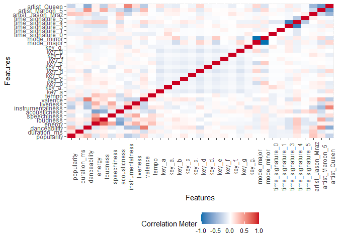
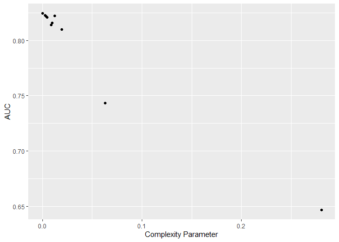
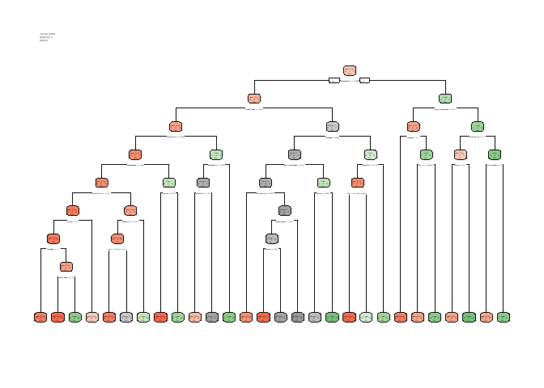
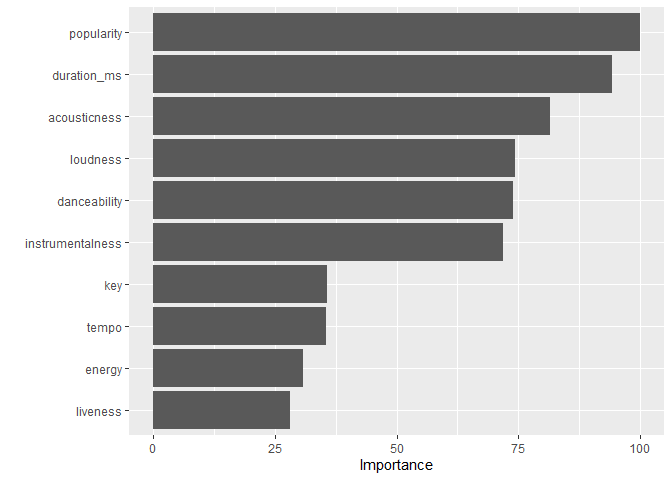
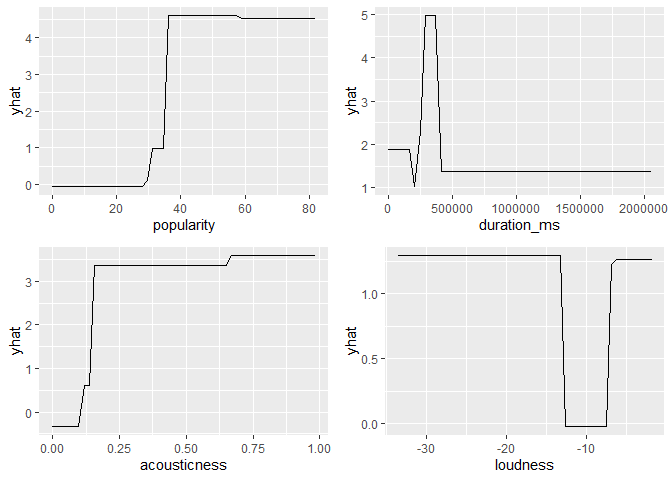

Decision Trees
================
Moh. Rosidi
7/22/2020

# Dataset Spotify

Pada artikel ini, kita akan membuat model prediktif pada dataset
`Spotify`. `Spotify` Merupakan dataset yang berisikan daftar lagu dan
fitur audio dari band/penyanyi ternama dunia, antara lain: Queens,
Maroon 5, dan Jason Mraz.

Kolom-kolom pada dataset tersebut, antara lain:

  - `id` : nomor seri lagu
  - `name` : judul lagu
  - `popularity` : tingkat popularitas lagu
  - `album.id` : nomor seri album
  - `album.name` : nama album
  - `album.total_tracks` : total lagu dalam album
  - `track_number` : nomor lagu dalam album
  - `duration_ms` : durasi lagu dalam satuan ms
  - `danceability` : elemen musik termasuk tempo, stabilitas ritme,
    kekuatan beat, dan keteraturan keseluruhan. Nilai 0,0 paling tidak
    bisa digunakan untuk menari dan 1,0 paling bisa digunakan untuk
    menari.
  - `energy` : Energi adalah ukuran dari 0,0 hingga 1,0 dan mewakili
    ukuran persepsi intensitas dan aktivitas. Biasanya, trek yang
    energik terasa cepat, keras, dan berisik. Sebagai contoh, death
    metal memiliki energi tinggi, sedangkan prelude Bach mendapat skor
    rendah pada skala. Fitur perseptual yang berkontribusi pada atribut
    ini meliputi rentang dinamis, persepsi kenyaringan, warna nada,
    onset rate, dan entropi umum.
  - `key` : Kunci dari trek adalah. Integer memetakan ke pitch
    menggunakan notasi Pitch Class standar. Misalnya. 0 = C, 1 = C♯ / D
    ♭, 2 = D, dan seterusnya.
  - `loudness` : Keseluruhan kenyaringan trek dalam desibel (dB). Nilai
    kenyaringan rata-rata di seluruh trek dan berguna untuk
    membandingkan kenyaringan relatif trek. Kenyaringan adalah kualitas
    suara yang merupakan korelasi psikologis utama dari kekuatan fisik
    (amplitudo). Nilai kisaran khas antara -60 dan 0 db.
  - `mode` : Mode menunjukkan modalitas (besar atau kecil) dari suatu
    trek, jenis skala dari mana konten melodinya diturunkan. Mayor
    diwakili oleh 1 dan minor adalah 0.
  - `speechiness` : Speechiness mendeteksi keberadaan kata-kata yang
    diucapkan di trek. Semakin eksklusif pidato-seperti rekaman (mis.
    Acara bincang-bincang, buku audio, puisi), semakin dekat dengan 1.0
    nilai atribut. Nilai di atas 0,66 menggambarkan trek yang mungkin
    seluruhnya terbuat dari kata-kata yang diucapkan. Nilai antara 0,33
    dan 0,66 menggambarkan trek yang mungkin berisi musik dan ucapan,
    baik dalam bagian atau lapisan, termasuk kasus-kasus seperti musik
    rap. Nilai di bawah 0,33 kemungkinan besar mewakili musik dan trek
    non-ucapan lainnya.
  - `acousticness` : Ukuran kepercayaan dari 0,0 hingga 1,0 dari apakah
    trek akustik. 1.0 mewakili kepercayaan tinggi trek adalah akustik.
  - `instrumentalness` : Memprediksi apakah suatu lagu tidak mengandung
    vokal. Suara “Ooh” dan “aah” diperlakukan sebagai instrumen dalam
    konteks ini. Rap atau trek kata yang diucapkan jelas “vokal”.
    Semakin dekat nilai instrumentalness ke 1.0, semakin besar
    kemungkinan trek tidak mengandung konten vokal. Nilai di atas 0,5
    dimaksudkan untuk mewakili trek instrumental, tetapi kepercayaan
    diri lebih tinggi ketika nilai mendekati 1.0.
  - `liveness` : Mendeteksi keberadaan audiens dalam rekaman. Nilai
    liveness yang lebih tinggi mewakili probabilitas yang meningkat
    bahwa trek dilakukan secara langsung. Nilai di atas 0,8 memberikan
    kemungkinan kuat bahwa trek live.
  - `valence` : Ukuran 0,0 hingga 1,0 yang menggambarkan kepositifan
    musik yang disampaikan oleh sebuah trek. Lagu dengan valensi tinggi
    terdengar lebih positif (mis. Bahagia, ceria, gembira), sedangkan
    trek dengan valensi rendah terdengar lebih negatif (mis. Sedih,
    tertekan, marah).
  - `tempo` : Perkiraan tempo trek secara keseluruhan dalam beat per
    menit (BPM). Dalam terminologi musik, tempo adalah kecepatan atau
    kecepatan dari bagian yang diberikan dan diturunkan langsung dari
    durasi beat rata-rata.
  - `time_signature` : An estimated overall time signature of a track.
    The time signature (meter) is a notational convention to specify how
    many beats are in each bar (or measure).

# Persiapan

## Library

Terdapat beberapa paket yang digunakan dalam pembuatan model prediktif
menggunakan *decision trees*. Paket-paket ditampilkan sebagai berikut:

``` r
# library pembantu
library(rsample)
library(recipes)
library(DataExplorer)
library(skimr)
library(DMwR)
library(MLmetrics)
library(tidyverse)

# library model
library(caret) 
library(rpart)

# paket penjelasan model
library(rpart.plot)  
library(vip)
library(pdp)
```

**Paket Pembantu**

1.  `tidyverse` : kumpulan paket dalam bidang data science
2.  `rsample` : membantu proses *data splitting*
3.  `recipes`: membantu proses data pra-pemrosesan
4.  `DataExplorer` : EDA
5.  `skimr` : membuat ringkasan data
6.  `DMwR` : paket untuk melakukan sampling “smote”

**Paket untuk Membangun Model**

1.  `caret` : berisikan sejumlah fungsi yang dapat merampingkan proses
    pembuatan model regresi dan klasifikasi
2.  `rpart` : membentuk model *decision trees*

**Paket Interpretasi Model**

1.  `rpart.plot` : visualisasi *decision trees*
2.  `vip` : visualisasi *variable importance*
3.  `pdp` : visualisasi plot ketergantungan parsial

## Import Dataset

Import dataset dilakukan dengan menggunakan fungsi `readr()`. Fungsi ini
digunakan untuk membaca file dengan ekstensi `.csv`.

``` r
spotify <- read_csv("data/spotify.csv")

# data cleaning
key_labs = c('c', 'c#', 'd', 'd#', 'e', 'f', 
             'f#', 'g', 'g#', 'a', 'a#', 'b')
mode_labs = c('minor', 'major')

spotify <- spotify %>%
  select(popularity, duration_ms:artist) %>%
  mutate(time_signature = factor(time_signature),
         key = factor(key, labels = key_labs),
         mode = factor(mode, labels = mode_labs),
         artist = factor(artist, labels = c("Jason_Mraz", "Maroon_5", "Queen" )))
```

# Data Splitting

Proses *data splitting* dilakukan setelah data di import ke dalam
sistem. Hal ini dilakukan untuk memastikan tidak adanya kebocoran data
yang mempengaruhi proses pembuatan model. Data dipisah menjadi dua buah
set, yaitu: *training* dan *test*. Data *training* adalah data yang akan
kita gunakan untuk membentuk model. Seluruh proses sebelum uji model
akan menggunakan data *training*. Proses tersebut, antara lain: EDA,
*feature engineering*, dan validasi silang. Data *test* hanya digunakan
saat kita akan menguji performa model dengan data baru yang belum pernah
dilihat sebelumnya.

Terdapat dua buah jenis sampling pada tahapan *data splitting*, yaitu:

1.  *random sampling* : sampling acak tanpa mempertimbangkan adanya
    strata dalam data
2.  *startified random sampling* : sampling dengan memperhatikan strata
    dalam sebuah variabel.

Dalam proses pembentukan model kali ini, kita akan menggunakan metode
kedua dengan tujuan untuk memperoleh distribusi yang seragam dari
variabel target (`artist`).

``` r
set.seed(123)

split  <- initial_split(spotify, prop = 0.8, strata = "artist")
data_train  <- training(split)
data_test   <- testing(split)
```

Untuk mengecek distribusi dari kedua set data, kita dapat
mevisualisasikan distribusi dari variabel target pada kedua set
tersebut.

``` r
# training set
ggplot(data_train, aes(x = artist)) + 
  geom_bar() 
```

<!-- -->

``` r
# test set
ggplot(data_test, aes(x = artist)) + 
  geom_bar() 
```

<!-- -->

# Analisis Data Eksploratif

Analsiis data eksploratif (EDA) ditujukan untuk mengenali data sebelum
kita menentukan algoritma yang cocok digunakan untuk menganalisa data
lebih lanjut. EDA merupakan sebuah proses iteratif yang secara garis
besar menjawab beberapa pertanyaan umum, seperti:

1.  Bagaimana distribusi data pada masing-masing variabel?
2.  Apakah terdapat asosiasi atau hubungan antar variabel dalam data?

## Ringkasan Data

Terdapat dua buah fungsi yang digunakan dalam membuat ringkasan data,
antara lain:

1.  `glimpse()`: varian dari `str()` untuk mengecek struktur data.
    Fungsi ini menampilkan transpose dari tabel data dengan menambahkan
    informasi, seperti: jenis data dan dimensi tabel.
2.  `skim()` : fungsi dari paket `skimr` untuk membuat ringkasan data
    yang lebih detail dibanding `glimpse()`, seperti: statistika
    deskriptif masing-masing kolom, dan informasi *missing value* dari
    masing-masing kolom.
3.  `plot_missing()` : fungsi untuk memvisualisasikan persentase
    *missing value* pada masing-masing variabel atau kolom data

<!-- end list -->

``` r
glimpse(data_train)
```

    ## Rows: 982
    ## Columns: 15
    ## $ popularity       <dbl> 54, 74, 64, 54, 55, 53, 54, 68, 53, 53, 55, 70, 68...
    ## $ duration_ms      <dbl> 239751, 199849, 190642, 196120, 193603, 183427, 21...
    ## $ danceability     <dbl> 0.526, 0.799, 0.655, 0.759, 0.934, 0.812, 0.604, 0...
    ## $ energy           <dbl> 0.608, 0.597, 0.603, 0.604, 0.564, 0.670, 0.405, 0...
    ## $ key              <fct> a#, f, g#, g#, b, f, a#, c, c, c#, c, g, a, g#, e,...
    ## $ loudness         <dbl> -5.776, -5.131, -5.014, -6.663, -4.806, -4.008, -8...
    ## $ mode             <fct> minor, minor, major, minor, major, major, major, m...
    ## $ speechiness      <dbl> 0.1690, 0.0611, 0.0555, 0.0510, 0.0638, 0.0901, 0....
    ## $ acousticness     <dbl> 0.1270, 0.0788, 0.0959, 0.1410, 0.4610, 0.1720, 0....
    ## $ instrumentalness <dbl> 0.00e+00, 5.66e-06, 0.00e+00, 0.00e+00, 1.84e-05, ...
    ## $ liveness         <dbl> 0.1130, 0.1000, 0.1070, 0.1490, 0.1010, 0.2530, 0....
    ## $ valence          <dbl> 0.3720, 0.4190, 0.4520, 0.4180, 0.5430, 0.6540, 0....
    ## $ tempo            <dbl> 93.311, 110.001, 126.088, 121.096, 115.092, 125.08...
    ## $ time_signature   <fct> 4, 4, 4, 4, 4, 4, 4, 4, 4, 4, 4, 4, 4, 4, 4, 4, 4,...
    ## $ artist           <fct> Maroon_5, Maroon_5, Maroon_5, Maroon_5, Maroon_5, ...

``` r
skim(data_train)
```

|                                                  |             |
| :----------------------------------------------- | :---------- |
| Name                                             | data\_train |
| Number of rows                                   | 982         |
| Number of columns                                | 15          |
| \_\_\_\_\_\_\_\_\_\_\_\_\_\_\_\_\_\_\_\_\_\_\_   |             |
| Column type frequency:                           |             |
| factor                                           | 4           |
| numeric                                          | 11          |
| \_\_\_\_\_\_\_\_\_\_\_\_\_\_\_\_\_\_\_\_\_\_\_\_ |             |
| Group variables                                  | None        |

Data summary

**Variable type: factor**

| skim\_variable  | n\_missing | complete\_rate | ordered | n\_unique | top\_counts                    |
| :-------------- | ---------: | -------------: | :------ | --------: | :----------------------------- |
| key             |          0 |              1 | FALSE   |        12 | d: 169, g: 132, a: 127, e: 119 |
| mode            |          0 |              1 | FALSE   |         2 | maj: 678, min: 304             |
| time\_signature |          0 |              1 | FALSE   |         5 | 4: 866, 3: 93, 5: 17, 0: 3     |
| artist          |          0 |              1 | FALSE   |         3 | Que: 575, Mar: 265, Jas: 142   |

**Variable type: numeric**

| skim\_variable   | n\_missing | complete\_rate |      mean |        sd |      p0 |       p25 |       p50 |       p75 |       p100 | hist  |
| :--------------- | ---------: | -------------: | --------: | --------: | ------: | --------: | --------: | --------: | ---------: | :---- |
| popularity       |          0 |              1 |     29.94 |     13.81 |    0.00 |     20.25 |     27.00 |     36.00 |      82.00 | ▂▇▃▁▁ |
| duration\_ms     |          0 |              1 | 234370.96 | 119727.20 | 4066.00 | 185690.00 | 223633.00 | 270816.50 | 2054800.00 | ▇▁▁▁▁ |
| danceability     |          0 |              1 |      0.50 |      0.19 |    0.00 |      0.34 |      0.50 |      0.65 |       0.95 | ▁▇▇▇▂ |
| energy           |          0 |              1 |      0.65 |      0.24 |    0.01 |      0.48 |      0.70 |      0.84 |       1.00 | ▁▃▅▇▇ |
| loudness         |          0 |              1 |    \-8.63 |      4.26 | \-33.59 |   \-10.81 |    \-7.68 |    \-5.60 |     \-1.87 | ▁▁▁▆▇ |
| speechiness      |          0 |              1 |      0.10 |      0.15 |    0.00 |      0.04 |      0.05 |      0.09 |       0.96 | ▇▁▁▁▁ |
| acousticness     |          0 |              1 |      0.27 |      0.28 |    0.00 |      0.03 |      0.15 |      0.43 |       0.98 | ▇▂▁▂▁ |
| instrumentalness |          0 |              1 |      0.05 |      0.18 |    0.00 |      0.00 |      0.00 |      0.00 |       1.00 | ▇▁▁▁▁ |
| liveness         |          0 |              1 |      0.34 |      0.30 |    0.00 |      0.11 |      0.20 |      0.45 |       1.00 | ▇▃▁▁▂ |
| valence          |          0 |              1 |      0.44 |      0.24 |    0.00 |      0.26 |      0.42 |      0.62 |       0.97 | ▅▇▇▆▃ |
| tempo            |          0 |              1 |    117.65 |     30.19 |    0.00 |     95.00 |    116.05 |    139.96 |     207.55 | ▁▂▇▆▁ |

``` r
plot_missing(data_train)
```

<!-- -->

Berdasarkan ringkasan data yang dihasilkan, diketahui dimensi data
sebesar 982 baris dan 15 kolom. Dengan rincian masing-masing kolom,
yaitu: 4 kolom dengan jenis data factor dan 11 kolom dengan jenis data
numeric. Informasi lain yang diketahui adalah seluruh kolom dalam data
tidak memiliki *missing value*.

## Variasi

Variasi dari tiap variabel dapat divisualisasikan dengan menggunakan
histogram (numerik) dan baplot (kategorikal).

``` r
plot_histogram(data_train, ncol = 2L, nrow = 2L)
```

<!-- --><!-- --><!-- -->

``` r
plot_bar(data_train, ncol = 2L, nrow = 2L)
```

<!-- -->

Berdasarkan hasil visualisasi diperoleh bahwa sebagian besar variabel
numerik memiliki distribusi yang tidak simetris. Sedangkan pada variabel
kategorikal diketahui bahwa seluruh variabel memiliki variasi yang tidak
mendekati nol atau nol. Untuk mengetahui variabel dengan variasi
mendekati nol atau nol, dapat menggunakan sintaks berikut:

``` r
nzvar <- nearZeroVar(data_train, saveMetrics = TRUE) %>% 
  rownames_to_column() %>% 
  filter(nzv)
nzvar
```

    ## [1] rowname       freqRatio     percentUnique zeroVar       nzv          
    ## <0 rows> (or 0-length row.names)

## Kovarian

Kovarian dapat dicek melalui visualisasi *heatmap* koefisien korelasi.

``` r
plot_correlation(data_train, 
                 cor_args = list(method = "spearman"))
```

<!-- -->

# Target and Feature Engineering

*Data preprocessing* dan *engineering* mengacu pada proses penambahan,
penghapusan, atau transformasi data. Waktu yang diperlukan untuk
memikirkan identifikasi kebutuhan *data engineering* dapat berlangsung
cukup lama dan proprsinya akan menjadi yang terbesar dibandingkan
analisa lainnya. Hal ini disebabkan karena kita perlu untuk memahami
data apa yang akan kita oleh atau diinputkan ke dalam model.

Untuk menyederhanakan proses *feature engineerinh*, kita harus
memikirkannya sebagai sebuah *blueprint* dibanding melakukan tiap
tugasnya secara satu persatu. Hal ini membantu kita dalam dua hal:

1.  Berpikir secara berurutan
2.  Mengaplikasikannya secara tepat selama proses *resampling*

## Urutan Langkah-Langkah Feature Engineering

Memikirkan *feature engineering* sebagai sebuah *blueprint* memaksa kita
untuk memikirkan urutan langkah-langkah *preprocessing* data. Meskipun
setiap masalah mengharuskan kita untuk memikirkan efek *preprocessing*
berurutan, ada beberapa saran umum yang harus kita pertimbangkan:

  - Jika menggunakan log atau transformasi Box-Cox, jangan memusatkan
    data terlebih dahulu atau melakukan operasi apa pun yang dapat
    membuat data menjadi tidak positif. Atau, gunakan transformasi
    Yeo-Johnson sehingga kita tidak perlu khawatir tentang hal ini.
  - *One-hot* atau *dummy encoding* biasanya menghasilkan data jarang
    (*sparse*) yang dapat digunakan oleh banyak algoritma secara
    efisien. Jika kita menstandarisasikan data tersebut, kita akan
    membuat data menjadi padat (*dense*) dan kita kehilangan efisiensi
    komputasi. Akibatnya, sering kali lebih disukai untuk standardisasi
    fitur numerik kita dan kemudian *one-hot/dummy endode*.
  - Jika kila mengelompokkan kategori (*lumping*) yang jarang terjadi
    secara bersamaan, lakukan sebelum *one-hot/dummy endode*.
  - Meskipun kita dapat melakukan prosedur pengurangan dimensi pada
    fitur-fitur kategorikal, adalah umum untuk melakukannya terutama
    pada fitur numerik ketika melakukannya untuk tujuan rekayasa fitur.

Sementara kebutuhan proyek kita mungkin beragam, berikut ini adalah
urutan langkah-langkah potensial yang disarankan untuk sebagian besar
masalah:

1.  Filter fitur dengan varians nol (*zero varians*) atau hampir nol
    (*near zero varians*).
2.  Lakukan imputasi jika diperlukan.
3.  Normalisasi untuk menyelesaikan *skewness* fitur numerik.
4.  Standardisasi fitur numerik (*centering* dan *scaling*).
5.  Lakukan reduksi dimensi (mis., PCA) pada fitur numerik.
6.  *one-hot/dummy endode* pada fitur kategorikal.

## Meletakkan Seluruh Proses Secara Bersamaan

Untuk mengilustrasikan bagaimana proses ini bekerja bersama menggunakan
R, mari kita lakukan penilaian ulang sederhana pada set data `ames` yang
kita gunakan dan lihat apakah beberapa *feature engineering* sederhana
meningkatkan kemampuan prediksi model kita. Tapi pertama-tama, kita
berkenalan dengat paket `recipe`.

Paket `recipe` ini memungkinkan kita untuk mengembangkan *bluprint
feature engineering* secara berurutan. Gagasan di balik `recipe` mirip
dengan `caret :: preProcess()` di mana kita ingin membuat *blueprint
preprocessing* tetapi menerapkannya nanti dan dalam setiap resample.

Ada tiga langkah utama dalam membuat dan menerapkan rekayasa fitur
dengan `recipe`:

1.  `recipe()`: tempat kita menentukan langkah-langkah rekayasa fitur
    untuk membuat *blueprint*.
2.  `prep()`: memperkirakan parameter *feature engineering* berdasarkan
    data *training*.
3.  `bake()`: terapkan *blueprint* untuk data baru.

<!-- end list -->

``` r
blueprint <- recipe(artist ~ ., data = data_train) %>%
  step_nzv(all_nominal())  %>%
  
  # 2. imputation to missing value
  # step_medianimpute("<Num_Var_name>") %>% # median imputation
  # step_meanimpute("<Num_var_name>") %>% # mean imputation
  # step_modeimpute("<Cat_var_name>") %>% # mode imputation
  # step_bagimpute("<Var_name>") %>% # random forest imputation
  # step_knnimpute("<Var_name>") %>% # knn imputation
  
  # Label encoding for categorical variable with many classes 
  # step_integer("<Cat_var_name>") %>%
  
  # 3. normalize to resolve numeric feature skewness
  step_center(all_numeric(), -all_outcomes()) %>%
  
  # 4. standardize (center and scale) numeric feature
  step_scale(all_numeric(), -all_outcomes()) 
```

Selanjutnya, *blueprint* yang telah dibuat dilakukan *training* pada
data *training*. Perlu diperhatikan, kita tidak melakukan proses
*training* pada data *test* untuk mencegah *data leakage*.

``` r
prepare <- prep(blueprint, training = data_train)
prepare
```

    ## Data Recipe
    ## 
    ## Inputs:
    ## 
    ##       role #variables
    ##    outcome          1
    ##  predictor         14
    ## 
    ## Training data contained 982 data points and no missing data.
    ## 
    ## Operations:
    ## 
    ## Sparse, unbalanced variable filter removed no terms [trained]
    ## Centering for popularity, duration_ms, danceability, ... [trained]
    ## Scaling for popularity, duration_ms, danceability, ... [trained]

Langkah terakhir adalah mengaplikasikan *blueprint* pada data *training*
dan *test* menggunakan fungsi `bake()`.

``` r
baked_train <- bake(prepare, new_data = data_train)
baked_test <- bake(prepare, new_data = data_test)
baked_train
```

    ## # A tibble: 982 x 15
    ##    popularity duration_ms danceability  energy key   loudness mode  speechiness
    ##         <dbl>       <dbl>        <dbl>   <dbl> <fct>    <dbl> <fct>       <dbl>
    ##  1       1.74      0.0449        0.161 -0.173  a#      0.669  minor      0.471 
    ##  2       3.19     -0.288         1.61  -0.220  f       0.821  minor     -0.234 
    ##  3       2.47     -0.365         0.844 -0.194  g#      0.848  major     -0.270 
    ##  4       1.74     -0.319         1.39  -0.190  g#      0.461  minor     -0.300 
    ##  5       1.82     -0.341         2.32  -0.360  b       0.897  major     -0.216 
    ##  6       1.67     -0.426         1.68   0.0904 f       1.08   major     -0.0444
    ##  7       1.74     -0.200         0.574 -1.03   a#      0.0820 major     -0.243 
    ##  8       2.76     -0.160         0.611 -0.793  c       0.369  major     -0.211 
    ##  9       1.67      3.80          1.34   0.698  c       0.455  minor     -0.173 
    ## 10       1.67     -0.0152        1.51  -0.0880 c#      0.772  major     -0.196 
    ## # ... with 972 more rows, and 7 more variables: acousticness <dbl>,
    ## #   instrumentalness <dbl>, liveness <dbl>, valence <dbl>, tempo <dbl>,
    ## #   time_signature <fct>, artist <fct>

# Decision Tree Model

*Tree-based models* adalah kelas algoritma nonparametrik yang bekerja
dengan mempartisi ruang fitur ke sejumlah daerah yang lebih kecil (tidak
tumpang tindih) dengan nilai respons yang sama menggunakan seperangkat
*aturan pemisahan*. Prediksi diperoleh dengan memasang model yang lebih
sederhana (misal: Konstanta seperti nilai respons rata-rata) di setiap
wilayah. Metode membagi dan menaklukkan seperti itu dapat menghasilkan
aturan sederhana yang mudah ditafsirkan dan divisualisasikan dengan
diagram pohon.

Ada banyak metode yang dapat digunakan membangun pohon regresi, tetapi
salah satu yang tertua dikenal sebagai pendekatan pohon klasifikasi dan
regresi (CART) yang dikembangkan oleh [Breiman et
al. (1984)](https://www.amazon.com/Classification-Regression-Wadsworth-Statistics-Probability/dp/0412048418).
Tutorial ini berfokus pada bagian regresi CART. Pohon regresi dasar
mempartisi data yang ditetapkan ke dalam subkelompok yang lebih kecil
dan kemudian melakukan fitting konstanta sederhana untuk setiap
pengamatan dalam subkelompok. Partisi dicapai dengan partisi biner
berturut-turut (alias partisi rekursif) berdasarkan pada berbagai
prediktor. Konstanta untuk memprediksi didasarkan pada nilai respons
rata-rata untuk semua pengamatan yang termasuk dalam subkelompok
tersebut.

Sebagai contoh, misalkan kita ingin memprediksi mil per galon mobil
rata-rata berdasarkan ukuran silinder (`cyl`) dan tenaga kuda (`hp`).
Semua pengamatan melalui pohon ini, dinilai pada simpul tertentu, dan
lanjutkan ke kiri jika jawabannya “ya” atau lanjutkan ke kanan jika
jawabannya “tidak”. Jadi, pertama, semua pengamatan yang memiliki 6 atau
8 silinder pergi ke cabang kiri, semua pengamatan lainnya dilanjutkan ke
cabang kanan. Selanjutnya, cabang kiri selanjutnya dipartisi oleh tenaga
kuda. Pengamatan 6 atau 8 silinder dengan tenaga kuda yang sama atau
lebih besar dari 192 dilanjutkan ke cabang kiri; mereka yang kurang dari
192 hp melanjutkan ke kanan. Cabang-cabang ini mengarah ke *terminal
node* atau *leaf nodes* yang berisi nilai respons prediksi kita. Pada
dasarnya, semua pengamatan (mobil dalam contoh ini) yang tidak memiliki
6 atau 8 silinder (cabang paling kanan) rata-rata 27 mpg. Semua
pengamatan yang memiliki 6 atau 8 silinder dan memiliki lebih dari 192
hp (cabang paling kiri) rata-rata 13 mpg.


Contoh sederhana tersebut dapat kita generalisasikan. Variabel respon
kontinu \(Y\) dan dua buah variabel input \(X_1\) dan \(X_2\). Partisi
rekursif menghasilkan tiga buah area (*nodes*), yaitu: \(R_1\), \(R_2\),
dan \(R_3\) dimana model memprediksi \(Y\) dengan sebuah konstanta
\(c_m\) pada area \(R_m\):

\[
\hat{f}\left(X\right) = \sum_{m=1}^{3} c_{m} I\left(X_1,X_2\right) \in R_m
\]

## Menentukan Split pada Decision Tree

Pertama, penting untuk mewujudkan partisi variabel yang dilakukan secara
*top-down*. Ini hanya berarti bahwa partisi yang dilakukan sebelumnya
pada pohon yang terbentuk tidak akan berubah oleh partisi selanjutnya.
Tetapi bagaimana partisi ini dibuat? Model dimulai dengan seluruh
data,\(S\), dan mencari setiap nilai berbeda dari setiap variabel input
untuk menemukan prediktor dan nilai *split* yang membagi data menjadi
dua area (\(R_1\) dan \(R_2\)) sedemikian rupa sehingga jumlah kesalahan
kuadrat keseluruhan diminimalkan:

\[
minimize \left{SSE = \sum_{i \in R_1}^{ } \left(y_i-c_1\right)^2 +  \sum_{i \in R_2}^{ } \left(y_i-c_2\right)^2\right}
\]

Setelah menemukan *split* terbaik, kita mempartisi data menjadi dua area
yang dihasilkan dan mengulangi proses *split* pada masing-masing dua
area Proses ini berlanjut sampai kriteria penghentian tercapai. Pohon
yang dihasilkan biasanya sangat dalam, kompleks yang dapat menghasilkan
prediksi yang baik pada data *training*, tetapi kemungkinan besar model
yang dibuat *overfiting* dan akan menghasilkan hasil prediksi yang buruk
pada data *test*.

## Cost complexity criterion

Seringkali ada keseimbangan yang harus dicapai dalam kedalaman dan
kompleksitas pohon untuk mengoptimalkan kinerja prediksi pada beberapa
data yang tidak terlihat. Untuk menemukan keseimbangan ini, kita
biasanya menumbuhkan pohon yang sangat besar seperti yang didefinisikan
pada bagian sebelumnya dan kemudian memangkasnya kembali untuk menemukan
sub-pohon yang optimal. Kita menemukan sub-pohon optimal dengan
menggunakan parameter kompleksitas biaya (\(\alpha\)) yang memberikan
penalti pada fungsi objektif pada persamaan penentuan *split* untuk
setiap *terminal nodes* pada tiap pohon (\(T\)).

\[
minimize\left{SSE+\alpha\left|T\right|\right}
\]

Untuk nilai \(alpha\) yang diberikan, kita dapat menemukan pohon
pemangkasan terkecil yang memiliki kesalahan penalti terendah. Jika kita
terbiasa dengan regresi dengan penalti, kita akan menyadari hubungan
dekat dengan penalti norma lasso \(L_1\). Seperti dengan metode
regularisasi ini, penalti yang lebih kecil cenderung menghasilkan model
yang lebih kompleks dan menghasilkan pohon yang lebih besar. Sedangkan
penalti yang lebih besar menghasilkan pohon yang jauh lebih kecil.
Akibatnya, ketika pohon tumbuh lebih besar, pengurangan SSE harus lebih
besar daripada penalti kompleksitas biaya. Biasanya, kita mengevaluasi
beberapa model melintasi spektrum \(\alpha\) dan menggunakan teknik
validasi silang untuk mengidentifikasi \(\alpha\) optimal dan sub-pohon
optimal.

## Kelebihan dan Kekurangan

Terdapat sejumlah kelebihan penggunaan *decision trees*, antara lain:

  - Mudah ditafsirkan.
  - Dapat membuat prediksi cepat (tidak ada perhitungan rumit, hanya
    mencari konstanta di pohon).
  - Sangat mudah untuk memahami variabel apa yang penting dalam membuat
    prediksi. Node internal (splits) adalah variabel-variabel yang
    sebagian besar mereduksi SSE.
  - Jika ada beberapa data yang hilang, kita mungkin tidak bisa pergi
    jauh-jauh ke bawah pohon menuju daun, tetapi kita masih bisa membuat
    prediksi dengan merata-rata semua daun di sub-pohon yang kita
    jangkau.
  - Model ini memberikan respons “bergerigi” non-linier, sehingga dapat
    bekerja saat permukaan regresi yang sebenarnya tidak mulus. Jika
    halus, permukaan konstan-piecewise dapat memperkirakannya secara
    dekat (dengan cukup daun).
  - Ada algoritma yang cepat dan andal untuk mempelajari pohon-pohon
    ini.

Selain kelebihan, terdapat kekurangan dalam penggunaan *decision trees*,
antara lain:

  - Pohon regresi tunggal memiliki varian yang tinggi, menghasilkan
    prediksi yang tidak stabil (subsampel alternatif dari data
    *training* dapat secara signifikan mengubah node terminal).
  - Karena varians tinggi pohon regresi tunggal memiliki akurasi
    prediksi yang buruk.

## Validasi Silang dan Parameter Tuning

Langkah pertama yang perlu dilakukan dalam melakukan kegiatan validasi
silang adalah menentukan spesifikasi parameter validasi silang. Fungsi
`trainControl()` merupakan fungsi yang dapat kita gunakan untu menetukan
metode validasi silang yang dilakukan dan spesifikasi terkait metode
validasi silang yang dugunakan.

Pada sintaks berikut dispesifikasikan `method` yang digunakan adalah
`"cv"` dengan jumlah partisi sebanyak 10 buah. Parameter lain yang ikut
ditambahkan dalam fungsi `trainControl()` adalah `search` yang
menspesifikasikan metode *parameter tuning* yang dispesifikasikan dengan
nilai `"random"`.

``` r
# spesifikasi metode validasi silang
cv <- trainControl(
  # possible value: "boot", "boot632", "optimism_boot", "boot_all", "cv", 
  #                 "repeatedcv", "LOOCV", "LGOCV"
  method = "cv", 
  number = 10, 
  # repeats = 5,
  classProbs = TRUE, 
  search = "random",
  sampling = "smote",
  summaryFunction = multiClassSummary,
  savePredictions = TRUE,
  allowParallel = TRUE
)
```

Selanjutnya, hasil pengaturan parameter training diinputkan ke dalam
fungsi `train()`. Dalam fungsi ini dispesifikasikan sejumlah argumen
seperti: formula yang digunakan, data training yang akan digunakan,
`method` atau `engine` yang akan digunakan untuk membentuk model. Proses
*parameter tuning* diatur melalui argumen `tuneLength` yang merupakan
kombinasi antar parameter yang akan di-*tuning* secara acak. Dalam hal
ini dipsesifkasikan nilai `tuneLength` sebesar 20 yang menunjukkan 20
kombinasi *parameter-tuning* yang digunakan.

``` r
system.time(
model_fit_cv <- train(
  blueprint,
  data = data_train,
  method = "rpart",
  trControl = cv,
  tuneLength = 20,
  metric = "AUC"
  )
)
```

    ##    user  system elapsed 
    ##   19.34    0.12   26.09

``` r
model_fit_cv
```

    ## CART 
    ## 
    ## 982 samples
    ##  14 predictor
    ##   3 classes: 'Jason_Mraz', 'Maroon_5', 'Queen' 
    ## 
    ## Recipe steps: nzv, center, scale 
    ## Resampling: Cross-Validated (10 fold) 
    ## Summary of sample sizes: 884, 883, 884, 884, 882, 884, ... 
    ## Addtional sampling using SMOTE
    ## 
    ## Resampling results across tuning parameters:
    ## 
    ##   cp           logLoss    AUC        prAUC       Accuracy   Kappa    
    ##   0.000000000  2.5166883  0.8243107  0.53676902  0.6975346  0.4990943
    ##   0.002457002  2.1595490  0.8225172  0.52737875  0.7159021  0.5262799
    ##   0.003685504  2.0688738  0.8215409  0.53441069  0.7128510  0.5211492
    ##   0.004914005  1.7771444  0.8209020  0.54087791  0.7148299  0.5215009
    ##   0.008599509  1.4602894  0.8139481  0.50577386  0.7107269  0.5139235
    ##   0.009828010  1.3963563  0.8158808  0.48004628  0.7025636  0.5040687
    ##   0.012285012  1.2435449  0.8222083  0.48933865  0.7086658  0.5162892
    ##   0.019656020  1.0078923  0.8096960  0.42358026  0.6852270  0.4823838
    ##   0.063063063  0.9319587  0.7431252  0.22637956  0.5923873  0.3773368
    ##   0.280098280  1.0390097  0.6469959  0.09775643  0.3926319  0.1647450
    ##   Mean_F1    Mean_Sensitivity  Mean_Specificity  Mean_Pos_Pred_Value
    ##   0.6468185  0.6804925         0.8464446         0.6566151          
    ##   0.6644143  0.6977312         0.8561310         0.6729361          
    ##   0.6610283  0.6941806         0.8540723         0.6699568          
    ##   0.6602975  0.6903130         0.8537971         0.6719011          
    ##   0.6532570  0.6837600         0.8521661         0.6696158          
    ##   0.6479062  0.6795539         0.8490373         0.6673367          
    ##   0.6581953  0.6910346         0.8536042         0.6709698          
    ##   0.6304822  0.6639836         0.8451730         0.6649376          
    ##   0.5517847  0.6045839         0.8121346         0.6259218          
    ##         NaN  0.4381952         0.7466387               NaN          
    ##   Mean_Neg_Pred_Value  Mean_Precision  Mean_Recall  Mean_Detection_Rate
    ##   0.8325512            0.6566151       0.6804925    0.2325115          
    ##   0.8417438            0.6729361       0.6977312    0.2386340          
    ##   0.8401504            0.6699568       0.6941806    0.2376170          
    ##   0.8411376            0.6719011       0.6903130    0.2382766          
    ##   0.8391980            0.6696158       0.6837600    0.2369090          
    ##   0.8356529            0.6673367       0.6795539    0.2341879          
    ##   0.8383240            0.6709698       0.6910346    0.2362219          
    ##   0.8292541            0.6649376       0.6639836    0.2284090          
    ##   0.7956332            0.6259218       0.6045839    0.1974624          
    ##   0.7564319                  NaN       0.4381952    0.1308773          
    ##   Mean_Balanced_Accuracy
    ##   0.7634685             
    ##   0.7769311             
    ##   0.7741265             
    ##   0.7720550             
    ##   0.7679630             
    ##   0.7642956             
    ##   0.7723194             
    ##   0.7545783             
    ##   0.7083593             
    ##   0.5924170             
    ## 
    ## AUC was used to select the optimal model using the largest value.
    ## The final value used for the model was cp = 0.

Proses *training* berlangsung selama 4,351 detik dengan 8 buah model
yang terbentuk. Model terbaik dipilih berdasarkan nilai **AUC**
terbesar. Berdasarkan kriteria tersebut model yang terpilih adalalah
model yang memiliki nilai `cp` sebesar 0 (cp : parameter kompleksitas
atau penalti). Nilai **AUC** rata-rata model terbaik adalah sebagai
berikut:

``` r
dt_roc <- model_fit_cv$results %>%
  arrange(-AUC) %>%
  slice(1) %>%
  select(AUC) %>% pull()
dt_roc
```

    ## [1] 0.8243107

Berdasarkan hasil yang diperoleh, luas area dibawah kurva **ROC**
sebesar 0.8243107 Berdasarkan hasil tersebut, model klasifikasi yang
terbentuk lebih baik dibanding menebak secara acak.

Visualisasi hubungan antara parameter kompleksitas dan **ROC**
ditampilkan pada gambar berikut:

``` r
# visualisasi
ggplot(model_fit_cv)
```

<!-- -->

## Model Akhir

Model terbaik dari hasil proses validasi silang selanjutnya diekstrak.
Hal ini berguna untuk mengurangi ukuran model yang tersimpan. Secara
default fungsi `train()` akan mengembalikan model dengan performa
terbaik. Namun, terdapat sejumlah komponen lain dalam objek yang
terbentuk, seperti: hasil prediksi, ringkasan training, dll. yang
membuat ukuran objek menjadi besar. Untuk menguranginya, kita perlu
mengambil objek model final dari objek hasil validasi silang.

``` r
model_fit <- model_fit_cv$finalModel
```

Visualisasi model final *decision tree*, dilakukan menggunakan fungsi
`rpart.plot()`.

``` r
# visualisasi
rpart.plot(model_fit)
```

<!-- -->

Model yang dihasilkan selanjutnya dapat kita uji lagi menggunakan data
baru. Berikut adalah perhitungan nilai **Akurasi** model pada data
*test*.

``` r
# prediksi Attrition churn_test
pred_test <- predict(model_fit, baked_test, type = "class")

## RMSE
cm <- confusionMatrix(pred_test, baked_test$artist)
cm
```

    ## Confusion Matrix and Statistics
    ## 
    ##             Reference
    ## Prediction   Jason_Mraz Maroon_5 Queen
    ##   Jason_Mraz         28       23    68
    ##   Maroon_5            2       35     6
    ##   Queen               5        7    69
    ## 
    ## Overall Statistics
    ##                                          
    ##                Accuracy : 0.5432         
    ##                  95% CI : (0.4783, 0.607)
    ##     No Information Rate : 0.5885         
    ##     P-Value [Acc > NIR] : 0.9325         
    ##                                          
    ##                   Kappa : 0.3341         
    ##                                          
    ##  Mcnemar's Test P-Value : 1.525e-15      
    ## 
    ## Statistics by Class:
    ## 
    ##                      Class: Jason_Mraz Class: Maroon_5 Class: Queen
    ## Sensitivity                     0.8000          0.5385       0.4825
    ## Specificity                     0.5625          0.9551       0.8800
    ## Pos Pred Value                  0.2353          0.8140       0.8519
    ## Neg Pred Value                  0.9435          0.8500       0.5432
    ## Prevalence                      0.1440          0.2675       0.5885
    ## Detection Rate                  0.1152          0.1440       0.2840
    ## Detection Prevalence            0.4897          0.1770       0.3333
    ## Balanced Accuracy               0.6813          0.7468       0.6813

Berdasarkan hasil evaluasi diperoleh nilai akurasi sebesar 0.5432099

## Interpretasi Fitur

Untuk mengetahui variabel yang paling berpengaruh secara global terhadap
hasil prediksi model *decision tree*, kita dapat menggunakan plot
*variable importance*.

``` r
vi <- vip(model_fit_cv, num_features = 10)
vi
```

<!-- -->

Berdasarkan terdapat 4 buah variabel yang berpengaruh besar terhadap
prediksi yang dihasilkan oleh model, antara lain: popularity,
duration\_ms, acousticness, loudness. Untuk melihat efek dari
masing-masing variabel terhadap variabel respon, kita dapat menggunakan
*partial dependence plot*.

``` r
p1 <- pdp::partial(model_fit_cv, pred.var = vi$data %>% select(Variable) %>% pull() %>%.[1]) %>% 
  autoplot() 

p2 <- pdp::partial(model_fit_cv, pred.var = vi$data %>% select(Variable) %>% pull() %>%.[2]) %>% 
  autoplot()

p3 <- pdp::partial(model_fit_cv, pred.var = vi$data %>% select(Variable) %>% pull() %>%.[3]) %>% 
  autoplot()
  

p4 <- pdp::partial(model_fit_cv, pred.var = vi$data %>% select(Variable) %>% pull() %>%.[4]) %>% 
  autoplot()

grid.arrange(p1, p2, p3, p4, nrow = 2)
```

<!-- -->
