Data Spliting dan Feature Engineering
================
Moh. Rosidi
7/23/2020

# Dataset Ames

Sebuah dataset terkait data properti yang ada di Ames IA. Dataset ini
memiliki 82 variabel dan 2930 baris. Untuk informasi lebih lanjut
terkait dataset ini, kunjungin tautan berikut:

  - <https://ww2.amstat.org/publications/jse/v19n3/decock/DataDocumentation.txt>
  - <http://ww2.amstat.org/publications/jse/v19n3/decock.pdf>

# Persiapan

## Library

Terdapat sejumlah paket yang digunakan dalam tutorial kali ini. Paket-paket yang akan digunakan, ditampilkan sebagai
berikut:

``` r
library(rsample)
library(tidyverse)
```

    ## ── Attaching packages ─────────────────────────────────────────────────────────── tidyverse 1.3.0 ──

    ## ✓ ggplot2 3.3.2     ✓ purrr   0.3.4
    ## ✓ tibble  3.0.3     ✓ dplyr   1.0.0
    ## ✓ tidyr   1.1.0     ✓ stringr 1.4.0
    ## ✓ readr   1.3.1     ✓ forcats 0.5.0

    ## ── Conflicts ────────────────────────────────────────────────────────────── tidyverse_conflicts() ──
    ## x dplyr::filter() masks stats::filter()
    ## x dplyr::lag()    masks stats::lag()

``` r
library(recipes)
```

    ## 
    ## Attaching package: 'recipes'

    ## The following object is masked from 'package:stringr':
    ## 
    ##     fixed

    ## The following object is masked from 'package:stats':
    ## 
    ##     step

``` r
library(caret)
```

    ## Loading required package: lattice

    ## 
    ## Attaching package: 'caret'

    ## The following object is masked from 'package:purrr':
    ## 
    ##     lift

``` r
library(AmesHousing)
library(janitor)
```

    ## 
    ## Attaching package: 'janitor'

    ## The following objects are masked from 'package:stats':
    ## 
    ##     chisq.test, fisher.test

``` r
library(DataExplorer)
library(skimr)
```

1.  `rsample` : membantu proses *data splitting*
2.  `tidyverse` : kumpulan paket dalam bidang data science
3.  `recipes`: membantu proses data *preprocessing*
4.  `caret` : berisikan sejumlah fungsi yang dapat merampingkan proses
    pembuatan model regresi dan klasifikasi
5.  `AmesHousing` : berisikan dataset Ames
6.  `janitor` : memperbaiki format kolom
7.  `DataExplorer` : membantu EDA
8.  `skimr` : membuat ringkasan data

## Import Dataset

Import dataset dilakukan dengan menggunakan fungsi `data()`. Fungsi ini
digunakan untuk mengambil data yang ada dalam sebuah paket.

``` r
data("ames_raw")
```

Untuk melihat struktur datanya, jalankan sintaks berikut:

``` r
glimpse(ames_raw)
```

    ## Rows: 2,930
    ## Columns: 82
    ## $ Order             <int> 1, 2, 3, 4, 5, 6, 7, 8, 9, 10, 11, 12, 13, 14, 15, …
    ## $ PID               <chr> "0526301100", "0526350040", "0526351010", "05263530…
    ## $ `MS SubClass`     <chr> "020", "020", "020", "020", "060", "060", "120", "1…
    ## $ `MS Zoning`       <chr> "RL", "RH", "RL", "RL", "RL", "RL", "RL", "RL", "RL…
    ## $ `Lot Frontage`    <int> 141, 80, 81, 93, 74, 78, 41, 43, 39, 60, 75, NA, 63…
    ## $ `Lot Area`        <int> 31770, 11622, 14267, 11160, 13830, 9978, 4920, 5005…
    ## $ Street            <chr> "Pave", "Pave", "Pave", "Pave", "Pave", "Pave", "Pa…
    ## $ Alley             <chr> NA, NA, NA, NA, NA, NA, NA, NA, NA, NA, NA, NA, NA,…
    ## $ `Lot Shape`       <chr> "IR1", "Reg", "IR1", "Reg", "IR1", "IR1", "Reg", "I…
    ## $ `Land Contour`    <chr> "Lvl", "Lvl", "Lvl", "Lvl", "Lvl", "Lvl", "Lvl", "H…
    ## $ Utilities         <chr> "AllPub", "AllPub", "AllPub", "AllPub", "AllPub", "…
    ## $ `Lot Config`      <chr> "Corner", "Inside", "Corner", "Corner", "Inside", "…
    ## $ `Land Slope`      <chr> "Gtl", "Gtl", "Gtl", "Gtl", "Gtl", "Gtl", "Gtl", "G…
    ## $ Neighborhood      <chr> "NAmes", "NAmes", "NAmes", "NAmes", "Gilbert", "Gil…
    ## $ `Condition 1`     <chr> "Norm", "Feedr", "Norm", "Norm", "Norm", "Norm", "N…
    ## $ `Condition 2`     <chr> "Norm", "Norm", "Norm", "Norm", "Norm", "Norm", "No…
    ## $ `Bldg Type`       <chr> "1Fam", "1Fam", "1Fam", "1Fam", "1Fam", "1Fam", "Tw…
    ## $ `House Style`     <chr> "1Story", "1Story", "1Story", "1Story", "2Story", "…
    ## $ `Overall Qual`    <int> 6, 5, 6, 7, 5, 6, 8, 8, 8, 7, 6, 6, 6, 7, 8, 8, 8, …
    ## $ `Overall Cond`    <int> 5, 6, 6, 5, 5, 6, 5, 5, 5, 5, 5, 7, 5, 5, 5, 5, 7, …
    ## $ `Year Built`      <int> 1960, 1961, 1958, 1968, 1997, 1998, 2001, 1992, 199…
    ## $ `Year Remod/Add`  <int> 1960, 1961, 1958, 1968, 1998, 1998, 2001, 1992, 199…
    ## $ `Roof Style`      <chr> "Hip", "Gable", "Hip", "Hip", "Gable", "Gable", "Ga…
    ## $ `Roof Matl`       <chr> "CompShg", "CompShg", "CompShg", "CompShg", "CompSh…
    ## $ `Exterior 1st`    <chr> "BrkFace", "VinylSd", "Wd Sdng", "BrkFace", "VinylS…
    ## $ `Exterior 2nd`    <chr> "Plywood", "VinylSd", "Wd Sdng", "BrkFace", "VinylS…
    ## $ `Mas Vnr Type`    <chr> "Stone", "None", "BrkFace", "None", "None", "BrkFac…
    ## $ `Mas Vnr Area`    <int> 112, 0, 108, 0, 0, 20, 0, 0, 0, 0, 0, 0, 0, 0, 0, 6…
    ## $ `Exter Qual`      <chr> "TA", "TA", "TA", "Gd", "TA", "TA", "Gd", "Gd", "Gd…
    ## $ `Exter Cond`      <chr> "TA", "TA", "TA", "TA", "TA", "TA", "TA", "TA", "TA…
    ## $ Foundation        <chr> "CBlock", "CBlock", "CBlock", "CBlock", "PConc", "P…
    ## $ `Bsmt Qual`       <chr> "TA", "TA", "TA", "TA", "Gd", "TA", "Gd", "Gd", "Gd…
    ## $ `Bsmt Cond`       <chr> "Gd", "TA", "TA", "TA", "TA", "TA", "TA", "TA", "TA…
    ## $ `Bsmt Exposure`   <chr> "Gd", "No", "No", "No", "No", "No", "Mn", "No", "No…
    ## $ `BsmtFin Type 1`  <chr> "BLQ", "Rec", "ALQ", "ALQ", "GLQ", "GLQ", "GLQ", "A…
    ## $ `BsmtFin SF 1`    <int> 639, 468, 923, 1065, 791, 602, 616, 263, 1180, 0, 0…
    ## $ `BsmtFin Type 2`  <chr> "Unf", "LwQ", "Unf", "Unf", "Unf", "Unf", "Unf", "U…
    ## $ `BsmtFin SF 2`    <int> 0, 144, 0, 0, 0, 0, 0, 0, 0, 0, 0, 0, 0, 0, 1120, 0…
    ## $ `Bsmt Unf SF`     <int> 441, 270, 406, 1045, 137, 324, 722, 1017, 415, 994,…
    ## $ `Total Bsmt SF`   <int> 1080, 882, 1329, 2110, 928, 926, 1338, 1280, 1595, …
    ## $ Heating           <chr> "GasA", "GasA", "GasA", "GasA", "GasA", "GasA", "Ga…
    ## $ `Heating QC`      <chr> "Fa", "TA", "TA", "Ex", "Gd", "Ex", "Ex", "Ex", "Ex…
    ## $ `Central Air`     <chr> "Y", "Y", "Y", "Y", "Y", "Y", "Y", "Y", "Y", "Y", "…
    ## $ Electrical        <chr> "SBrkr", "SBrkr", "SBrkr", "SBrkr", "SBrkr", "SBrkr…
    ## $ `1st Flr SF`      <int> 1656, 896, 1329, 2110, 928, 926, 1338, 1280, 1616, …
    ## $ `2nd Flr SF`      <int> 0, 0, 0, 0, 701, 678, 0, 0, 0, 776, 892, 0, 676, 0,…
    ## $ `Low Qual Fin SF` <int> 0, 0, 0, 0, 0, 0, 0, 0, 0, 0, 0, 0, 0, 0, 0, 0, 0, …
    ## $ `Gr Liv Area`     <int> 1656, 896, 1329, 2110, 1629, 1604, 1338, 1280, 1616…
    ## $ `Bsmt Full Bath`  <int> 1, 0, 0, 1, 0, 0, 1, 0, 1, 0, 0, 1, 0, 1, 1, 1, 0, …
    ## $ `Bsmt Half Bath`  <int> 0, 0, 0, 0, 0, 0, 0, 0, 0, 0, 0, 0, 0, 0, 0, 0, 0, …
    ## $ `Full Bath`       <int> 1, 1, 1, 2, 2, 2, 2, 2, 2, 2, 2, 2, 2, 1, 1, 3, 2, …
    ## $ `Half Bath`       <int> 0, 0, 1, 1, 1, 1, 0, 0, 0, 1, 1, 0, 1, 1, 1, 1, 0, …
    ## $ `Bedroom AbvGr`   <int> 3, 2, 3, 3, 3, 3, 2, 2, 2, 3, 3, 3, 3, 2, 1, 4, 4, …
    ## $ `Kitchen AbvGr`   <int> 1, 1, 1, 1, 1, 1, 1, 1, 1, 1, 1, 1, 1, 1, 1, 1, 1, …
    ## $ `Kitchen Qual`    <chr> "TA", "TA", "Gd", "Ex", "TA", "Gd", "Gd", "Gd", "Gd…
    ## $ `TotRms AbvGrd`   <int> 7, 5, 6, 8, 6, 7, 6, 5, 5, 7, 7, 6, 7, 5, 4, 12, 8,…
    ## $ Functional        <chr> "Typ", "Typ", "Typ", "Typ", "Typ", "Typ", "Typ", "T…
    ## $ Fireplaces        <int> 2, 0, 0, 2, 1, 1, 0, 0, 1, 1, 1, 0, 1, 1, 0, 1, 0, …
    ## $ `Fireplace Qu`    <chr> "Gd", NA, NA, "TA", "TA", "Gd", NA, NA, "TA", "TA",…
    ## $ `Garage Type`     <chr> "Attchd", "Attchd", "Attchd", "Attchd", "Attchd", "…
    ## $ `Garage Yr Blt`   <int> 1960, 1961, 1958, 1968, 1997, 1998, 2001, 1992, 199…
    ## $ `Garage Finish`   <chr> "Fin", "Unf", "Unf", "Fin", "Fin", "Fin", "Fin", "R…
    ## $ `Garage Cars`     <int> 2, 1, 1, 2, 2, 2, 2, 2, 2, 2, 2, 2, 2, 2, 2, 3, 2, …
    ## $ `Garage Area`     <int> 528, 730, 312, 522, 482, 470, 582, 506, 608, 442, 4…
    ## $ `Garage Qual`     <chr> "TA", "TA", "TA", "TA", "TA", "TA", "TA", "TA", "TA…
    ## $ `Garage Cond`     <chr> "TA", "TA", "TA", "TA", "TA", "TA", "TA", "TA", "TA…
    ## $ `Paved Drive`     <chr> "P", "Y", "Y", "Y", "Y", "Y", "Y", "Y", "Y", "Y", "…
    ## $ `Wood Deck SF`    <int> 210, 140, 393, 0, 212, 360, 0, 0, 237, 140, 157, 48…
    ## $ `Open Porch SF`   <int> 62, 0, 36, 0, 34, 36, 0, 82, 152, 60, 84, 21, 75, 0…
    ## $ `Enclosed Porch`  <int> 0, 0, 0, 0, 0, 0, 170, 0, 0, 0, 0, 0, 0, 0, 0, 0, 0…
    ## $ `3Ssn Porch`      <int> 0, 0, 0, 0, 0, 0, 0, 0, 0, 0, 0, 0, 0, 0, 0, 0, 0, …
    ## $ `Screen Porch`    <int> 0, 120, 0, 0, 0, 0, 0, 144, 0, 0, 0, 0, 0, 0, 140, …
    ## $ `Pool Area`       <int> 0, 0, 0, 0, 0, 0, 0, 0, 0, 0, 0, 0, 0, 0, 0, 0, 0, …
    ## $ `Pool QC`         <chr> NA, NA, NA, NA, NA, NA, NA, NA, NA, NA, NA, NA, NA,…
    ## $ Fence             <chr> NA, "MnPrv", NA, NA, "MnPrv", NA, NA, NA, NA, NA, N…
    ## $ `Misc Feature`    <chr> NA, NA, "Gar2", NA, NA, NA, NA, NA, NA, NA, NA, "Sh…
    ## $ `Misc Val`        <int> 0, 0, 12500, 0, 0, 0, 0, 0, 0, 0, 0, 500, 0, 0, 0, …
    ## $ `Mo Sold`         <int> 5, 6, 6, 4, 3, 6, 4, 1, 3, 6, 4, 3, 5, 2, 6, 6, 6, …
    ## $ `Yr Sold`         <int> 2010, 2010, 2010, 2010, 2010, 2010, 2010, 2010, 201…
    ## $ `Sale Type`       <chr> "WD ", "WD ", "WD ", "WD ", "WD ", "WD ", "WD ", "W…
    ## $ `Sale Condition`  <chr> "Normal", "Normal", "Normal", "Normal", "Normal", "…
    ## $ SalePrice         <int> 215000, 105000, 172000, 244000, 189900, 195500, 213…

Berdasarkan output yang dihasilkan, nama kolom pada dataset tersebut
perlu dilakukan *cleaning* agar tidak mengandung koma.

``` r
ames <- ames_raw %>%
  janitor::clean_names() %>%
  mutate(across(where(is.character), as.factor))
```

Untuk mengecek hasilnya jalankan kembali fungsi `glimpse()`.

``` r
glimpse(ames)
```

    ## Rows: 2,930
    ## Columns: 82
    ## $ order           <int> 1, 2, 3, 4, 5, 6, 7, 8, 9, 10, 11, 12, 13, 14, 15, 16…
    ## $ pid             <fct> 0526301100, 0526350040, 0526351010, 0526353030, 05271…
    ## $ ms_sub_class    <fct> 020, 020, 020, 020, 060, 060, 120, 120, 120, 060, 060…
    ## $ ms_zoning       <fct> RL, RH, RL, RL, RL, RL, RL, RL, RL, RL, RL, RL, RL, R…
    ## $ lot_frontage    <int> 141, 80, 81, 93, 74, 78, 41, 43, 39, 60, 75, NA, 63, …
    ## $ lot_area        <int> 31770, 11622, 14267, 11160, 13830, 9978, 4920, 5005, …
    ## $ street          <fct> Pave, Pave, Pave, Pave, Pave, Pave, Pave, Pave, Pave,…
    ## $ alley           <fct> NA, NA, NA, NA, NA, NA, NA, NA, NA, NA, NA, NA, NA, N…
    ## $ lot_shape       <fct> IR1, Reg, IR1, Reg, IR1, IR1, Reg, IR1, IR1, Reg, IR1…
    ## $ land_contour    <fct> Lvl, Lvl, Lvl, Lvl, Lvl, Lvl, Lvl, HLS, Lvl, Lvl, Lvl…
    ## $ utilities       <fct> AllPub, AllPub, AllPub, AllPub, AllPub, AllPub, AllPu…
    ## $ lot_config      <fct> Corner, Inside, Corner, Corner, Inside, Inside, Insid…
    ## $ land_slope      <fct> Gtl, Gtl, Gtl, Gtl, Gtl, Gtl, Gtl, Gtl, Gtl, Gtl, Gtl…
    ## $ neighborhood    <fct> NAmes, NAmes, NAmes, NAmes, Gilbert, Gilbert, StoneBr…
    ## $ condition_1     <fct> Norm, Feedr, Norm, Norm, Norm, Norm, Norm, Norm, Norm…
    ## $ condition_2     <fct> Norm, Norm, Norm, Norm, Norm, Norm, Norm, Norm, Norm,…
    ## $ bldg_type       <fct> 1Fam, 1Fam, 1Fam, 1Fam, 1Fam, 1Fam, TwnhsE, TwnhsE, T…
    ## $ house_style     <fct> 1Story, 1Story, 1Story, 1Story, 2Story, 2Story, 1Stor…
    ## $ overall_qual    <int> 6, 5, 6, 7, 5, 6, 8, 8, 8, 7, 6, 6, 6, 7, 8, 8, 8, 9,…
    ## $ overall_cond    <int> 5, 6, 6, 5, 5, 6, 5, 5, 5, 5, 5, 7, 5, 5, 5, 5, 7, 2,…
    ## $ year_built      <int> 1960, 1961, 1958, 1968, 1997, 1998, 2001, 1992, 1995,…
    ## $ year_remod_add  <int> 1960, 1961, 1958, 1968, 1998, 1998, 2001, 1992, 1996,…
    ## $ roof_style      <fct> Hip, Gable, Hip, Hip, Gable, Gable, Gable, Gable, Gab…
    ## $ roof_matl       <fct> CompShg, CompShg, CompShg, CompShg, CompShg, CompShg,…
    ## $ exterior_1st    <fct> BrkFace, VinylSd, Wd Sdng, BrkFace, VinylSd, VinylSd,…
    ## $ exterior_2nd    <fct> Plywood, VinylSd, Wd Sdng, BrkFace, VinylSd, VinylSd,…
    ## $ mas_vnr_type    <fct> Stone, None, BrkFace, None, None, BrkFace, None, None…
    ## $ mas_vnr_area    <int> 112, 0, 108, 0, 0, 20, 0, 0, 0, 0, 0, 0, 0, 0, 0, 603…
    ## $ exter_qual      <fct> TA, TA, TA, Gd, TA, TA, Gd, Gd, Gd, TA, TA, TA, TA, T…
    ## $ exter_cond      <fct> TA, TA, TA, TA, TA, TA, TA, TA, TA, TA, TA, Gd, TA, T…
    ## $ foundation      <fct> CBlock, CBlock, CBlock, CBlock, PConc, PConc, PConc, …
    ## $ bsmt_qual       <fct> TA, TA, TA, TA, Gd, TA, Gd, Gd, Gd, TA, Gd, Gd, Gd, G…
    ## $ bsmt_cond       <fct> Gd, TA, TA, TA, TA, TA, TA, TA, TA, TA, TA, TA, TA, T…
    ## $ bsmt_exposure   <fct> Gd, No, No, No, No, No, Mn, No, No, No, No, No, No, G…
    ## $ bsmt_fin_type_1 <fct> BLQ, Rec, ALQ, ALQ, GLQ, GLQ, GLQ, ALQ, GLQ, Unf, Unf…
    ## $ bsmt_fin_sf_1   <int> 639, 468, 923, 1065, 791, 602, 616, 263, 1180, 0, 0, …
    ## $ bsmt_fin_type_2 <fct> Unf, LwQ, Unf, Unf, Unf, Unf, Unf, Unf, Unf, Unf, Unf…
    ## $ bsmt_fin_sf_2   <int> 0, 144, 0, 0, 0, 0, 0, 0, 0, 0, 0, 0, 0, 0, 1120, 0, …
    ## $ bsmt_unf_sf     <int> 441, 270, 406, 1045, 137, 324, 722, 1017, 415, 994, 7…
    ## $ total_bsmt_sf   <int> 1080, 882, 1329, 2110, 928, 926, 1338, 1280, 1595, 99…
    ## $ heating         <fct> GasA, GasA, GasA, GasA, GasA, GasA, GasA, GasA, GasA,…
    ## $ heating_qc      <fct> Fa, TA, TA, Ex, Gd, Ex, Ex, Ex, Ex, Gd, Gd, Ex, Gd, G…
    ## $ central_air     <fct> Y, Y, Y, Y, Y, Y, Y, Y, Y, Y, Y, Y, Y, Y, Y, Y, Y, Y,…
    ## $ electrical      <fct> SBrkr, SBrkr, SBrkr, SBrkr, SBrkr, SBrkr, SBrkr, SBrk…
    ## $ x1st_flr_sf     <int> 1656, 896, 1329, 2110, 928, 926, 1338, 1280, 1616, 10…
    ## $ x2nd_flr_sf     <int> 0, 0, 0, 0, 701, 678, 0, 0, 0, 776, 892, 0, 676, 0, 0…
    ## $ low_qual_fin_sf <int> 0, 0, 0, 0, 0, 0, 0, 0, 0, 0, 0, 0, 0, 0, 0, 0, 0, 0,…
    ## $ gr_liv_area     <int> 1656, 896, 1329, 2110, 1629, 1604, 1338, 1280, 1616, …
    ## $ bsmt_full_bath  <int> 1, 0, 0, 1, 0, 0, 1, 0, 1, 0, 0, 1, 0, 1, 1, 1, 0, 1,…
    ## $ bsmt_half_bath  <int> 0, 0, 0, 0, 0, 0, 0, 0, 0, 0, 0, 0, 0, 0, 0, 0, 0, 0,…
    ## $ full_bath       <int> 1, 1, 1, 2, 2, 2, 2, 2, 2, 2, 2, 2, 2, 1, 1, 3, 2, 1,…
    ## $ half_bath       <int> 0, 0, 1, 1, 1, 1, 0, 0, 0, 1, 1, 0, 1, 1, 1, 1, 0, 1,…
    ## $ bedroom_abv_gr  <int> 3, 2, 3, 3, 3, 3, 2, 2, 2, 3, 3, 3, 3, 2, 1, 4, 4, 1,…
    ## $ kitchen_abv_gr  <int> 1, 1, 1, 1, 1, 1, 1, 1, 1, 1, 1, 1, 1, 1, 1, 1, 1, 1,…
    ## $ kitchen_qual    <fct> TA, TA, Gd, Ex, TA, Gd, Gd, Gd, Gd, Gd, TA, TA, TA, G…
    ## $ tot_rms_abv_grd <int> 7, 5, 6, 8, 6, 7, 6, 5, 5, 7, 7, 6, 7, 5, 4, 12, 8, 8…
    ## $ functional      <fct> Typ, Typ, Typ, Typ, Typ, Typ, Typ, Typ, Typ, Typ, Typ…
    ## $ fireplaces      <int> 2, 0, 0, 2, 1, 1, 0, 0, 1, 1, 1, 0, 1, 1, 0, 1, 0, 1,…
    ## $ fireplace_qu    <fct> Gd, NA, NA, TA, TA, Gd, NA, NA, TA, TA, TA, NA, Gd, P…
    ## $ garage_type     <fct> Attchd, Attchd, Attchd, Attchd, Attchd, Attchd, Attch…
    ## $ garage_yr_blt   <int> 1960, 1961, 1958, 1968, 1997, 1998, 2001, 1992, 1995,…
    ## $ garage_finish   <fct> Fin, Unf, Unf, Fin, Fin, Fin, Fin, RFn, RFn, Fin, Fin…
    ## $ garage_cars     <int> 2, 1, 1, 2, 2, 2, 2, 2, 2, 2, 2, 2, 2, 2, 2, 3, 2, 3,…
    ## $ garage_area     <int> 528, 730, 312, 522, 482, 470, 582, 506, 608, 442, 440…
    ## $ garage_qual     <fct> TA, TA, TA, TA, TA, TA, TA, TA, TA, TA, TA, TA, TA, T…
    ## $ garage_cond     <fct> TA, TA, TA, TA, TA, TA, TA, TA, TA, TA, TA, TA, TA, T…
    ## $ paved_drive     <fct> P, Y, Y, Y, Y, Y, Y, Y, Y, Y, Y, Y, Y, Y, Y, Y, Y, Y,…
    ## $ wood_deck_sf    <int> 210, 140, 393, 0, 212, 360, 0, 0, 237, 140, 157, 483,…
    ## $ open_porch_sf   <int> 62, 0, 36, 0, 34, 36, 0, 82, 152, 60, 84, 21, 75, 0, …
    ## $ enclosed_porch  <int> 0, 0, 0, 0, 0, 0, 170, 0, 0, 0, 0, 0, 0, 0, 0, 0, 0, …
    ## $ x3ssn_porch     <int> 0, 0, 0, 0, 0, 0, 0, 0, 0, 0, 0, 0, 0, 0, 0, 0, 0, 0,…
    ## $ screen_porch    <int> 0, 120, 0, 0, 0, 0, 0, 144, 0, 0, 0, 0, 0, 0, 140, 21…
    ## $ pool_area       <int> 0, 0, 0, 0, 0, 0, 0, 0, 0, 0, 0, 0, 0, 0, 0, 0, 0, 0,…
    ## $ pool_qc         <fct> NA, NA, NA, NA, NA, NA, NA, NA, NA, NA, NA, NA, NA, N…
    ## $ fence           <fct> NA, MnPrv, NA, NA, MnPrv, NA, NA, NA, NA, NA, NA, GdP…
    ## $ misc_feature    <fct> NA, NA, Gar2, NA, NA, NA, NA, NA, NA, NA, NA, Shed, N…
    ## $ misc_val        <int> 0, 0, 12500, 0, 0, 0, 0, 0, 0, 0, 0, 500, 0, 0, 0, 0,…
    ## $ mo_sold         <int> 5, 6, 6, 4, 3, 6, 4, 1, 3, 6, 4, 3, 5, 2, 6, 6, 6, 6,…
    ## $ yr_sold         <int> 2010, 2010, 2010, 2010, 2010, 2010, 2010, 2010, 2010,…
    ## $ sale_type       <fct> WD , WD , WD , WD , WD , WD , WD , WD , WD , WD , WD …
    ## $ sale_condition  <fct> Normal, Normal, Normal, Normal, Normal, Normal, Norma…
    ## $ sale_price      <int> 215000, 105000, 172000, 244000, 189900, 195500, 21350…

# Data Splitting

Proses *data splitting* dilakukan setelah data di import ke dalam
sistem. Hal ini dilakukan untuk memastikan tidak adanya kebocoran data
yang mempengaruhi proses pembuatan model. Data dipisah menjadi dua buah
set, yaitu: *training* dan *test*. Data *training* adalah data yang akan
kita gunakan untuk membentuk model. Seluruh proses sebelum uji model
akan menggunakan data *training*. Proses tersebut, antara lain: EDA,
*feature engineering*, dan validasi silang. Data *test* hanya digunakan
saat kita akan menguji performa model dengan data baru yang belum pernah
dilihat sebelumnya.

Rekomendasi yang umum digunakan pada pemisahan data adalah 60% sampai
dengan 80% data *training* dan sisanya adalah data *test*. Proporsi
tersebut merupakan panduan umum dalam pemisahan data. Namun, beberapa
hal perlu dipertimbangkan dalam menentukan proporsi pemisahan yang
digunakan, antara lain:

  - Data *training* terlalu besar (misal: \> 80%) tidak memungkinkan
    kita untuk membuat pengujian performa model prediktif dengan cukup
    baik. Kita mungkin akan membuat model yang cukup baik untuk data
    *training* kita, namun tidak dapat mengeneralisasi pola dalam data
    dengan cukup baik (*overfitting*)
  - Data *test* terlalu besar (misal: \> 40%) tidak memungkinkan kita
    membuat pengujian yang baik terhadap parameter model
    (*underfitting*).

Terdapat dua buah jenis sampling pada tahapan *data splitting*, yaitu:

1.  *simple random sampling* : sampling acak tanpa mempertimbangkan
    adanya strata dalam data
2.  *stratified random sampling* : sampling dengan memperhatikan strata
    dalam sebuah variabel.

Berikut ditampilkan dua buah macam pemisahan data tersebut.

***Simple Random Sampling***

``` r
set.seed(123)

split1  <- initial_split(ames, prop = 0.7)
ames_train1  <- training(split1)
ames_test1   <- testing(split1)
```

***Stratified Random Sampling***

``` r
set.seed(123)

split2  <- initial_split(ames, prop = 0.7, strata = "sale_price")
ames_train2  <- training(split2)
ames_test2   <- testing(split2)
```

Untuk mengecek distribusi dari kedua set data, kita dapat
mevisualisasikan distribusi dari variabel target pada kedua set
tersebut.

``` r
# training set
ames_train1 %>%
  mutate(variant = "Simple") %>%
  bind_rows({
    ames_train2 %>%
      mutate(variant = "Stratified")
  }) %>%
  ggplot(aes(x = sale_price, color = variant)) + 
  geom_density() 
```

<!-- -->

``` r
# test set
ames_test1 %>%
  mutate(variant = "Simple") %>%
  bind_rows({
    ames_test2 %>%
      mutate(variant = "Stratified")
  }) %>%
  ggplot(aes(x = sale_price, color = variant)) + 
  geom_density() 
```

<!-- -->

# Analisis Data Eksploratif

Analsiis data eksploratif (EDA) ditujukan untuk mengenali data sebelum
kita menentukan algoritma yang cocok digunakan untuk menganalisa data
lebih lanjut. EDA merupakan sebuah proses iteratif yang secara garis
besar menjawab beberapa pertanyaan umum, seperti:

1.  Bagaimana distribusi data pada masing-masing variabel?
2.  Apakah terdapat asosiasi atau hubungan antar variabel dalam data?

## Ringkasan Data

Terdapat dua buah fungsi yang digunakan dalam membuat ringkasan data,
antara lain:

1.  `skim()` : fungsi dari paket `skimr` untuk membuat ringkasan data
    yang lebih detail dibanding `glimpse()`, seperti: statistika
    deskriptif masing-masing kolom, dan informasi *missing value* dari
    masing-masing kolom.
2.  `plot_missing()` : fungsi untuk memvisualisasikan persentase
    *missing value* pada masing-masing variabel atau kolom data

<!-- end list -->

``` r
skim(ames_train2)
```

|                                                  |              |
| :----------------------------------------------- | :----------- |
| Name                                             | ames\_train2 |
| Number of rows                                   | 2053         |
| Number of columns                                | 82           |
| \_\_\_\_\_\_\_\_\_\_\_\_\_\_\_\_\_\_\_\_\_\_\_   |              |
| Column type frequency:                           |              |
| factor                                           | 45           |
| numeric                                          | 37           |
| \_\_\_\_\_\_\_\_\_\_\_\_\_\_\_\_\_\_\_\_\_\_\_\_ |              |
| Group variables                                  | None         |

Data summary

**Variable type: factor**

| skim\_variable     | n\_missing | complete\_rate | ordered | n\_unique | top\_counts                            |
| :----------------- | ---------: | -------------: | :------ | --------: | :------------------------------------- |
| pid                |          0 |           1.00 | FALSE   |      2053 | 052: 1, 052: 1, 052: 1, 052: 1         |
| ms\_sub\_class     |          0 |           1.00 | FALSE   |        16 | 020: 753, 060: 395, 050: 211, 120: 145 |
| ms\_zoning         |          0 |           1.00 | FALSE   |         7 | RL: 1571, RM: 338, FV: 102, C (: 19    |
| street             |          0 |           1.00 | FALSE   |         2 | Pav: 2046, Grv: 7                      |
| alley              |       1909 |           0.07 | FALSE   |         2 | Grv: 93, Pav: 51                       |
| lot\_shape         |          0 |           1.00 | FALSE   |         4 | Reg: 1321, IR1: 666, IR2: 54, IR3: 12  |
| land\_contour      |          0 |           1.00 | FALSE   |         4 | Lvl: 1850, HLS: 83, Bnk: 75, Low: 45   |
| utilities          |          0 |           1.00 | FALSE   |         3 | All: 2050, NoS: 2, NoS: 1              |
| lot\_config        |          0 |           1.00 | FALSE   |         5 | Ins: 1494, Cor: 361, Cul: 127, FR2: 62 |
| land\_slope        |          0 |           1.00 | FALSE   |         3 | Gtl: 1958, Mod: 86, Sev: 9             |
| neighborhood       |          0 |           1.00 | FALSE   |        27 | NAm: 298, Col: 187, Old: 171, Edw: 146 |
| condition\_1       |          0 |           1.00 | FALSE   |         9 | Nor: 1768, Fee: 120, Art: 63, RRA: 35  |
| condition\_2       |          0 |           1.00 | FALSE   |         7 | Nor: 2031, Fee: 10, Pos: 4, Art: 3     |
| bldg\_type         |          0 |           1.00 | FALSE   |         5 | 1Fa: 1692, Twn: 178, Twn: 74, Dup: 66  |
| house\_style       |          0 |           1.00 | FALSE   |         8 | 1St: 1030, 2St: 614, 1.5: 233, SLv: 84 |
| roof\_style        |          0 |           1.00 | FALSE   |         6 | Gab: 1627, Hip: 387, Gam: 17, Fla: 14  |
| roof\_matl         |          0 |           1.00 | FALSE   |         5 | Com: 2024, Tar: 16, WdS: 7, WdS: 5     |
| exterior\_1st      |          0 |           1.00 | FALSE   |        14 | Vin: 718, Met: 321, Wd : 301, HdB: 295 |
| exterior\_2nd      |          0 |           1.00 | FALSE   |        16 | Vin: 710, Met: 321, Wd : 287, HdB: 267 |
| mas\_vnr\_type     |         17 |           0.99 | FALSE   |         4 | Non: 1214, Brk: 624, Sto: 179, Brk: 19 |
| exter\_qual        |          0 |           1.00 | FALSE   |         4 | TA: 1266, Gd: 684, Ex: 81, Fa: 22      |
| exter\_cond        |          0 |           1.00 | FALSE   |         5 | TA: 1792, Gd: 204, Fa: 43, Ex: 11      |
| foundation         |          0 |           1.00 | FALSE   |         6 | PCo: 916, CBl: 870, Brk: 226, Sla: 30  |
| bsmt\_qual         |         52 |           0.97 | FALSE   |         5 | TA: 899, Gd: 853, Ex: 184, Fa: 63      |
| bsmt\_cond         |         52 |           0.97 | FALSE   |         5 | TA: 1834, Gd: 92, Fa: 71, Ex: 2        |
| bsmt\_exposure     |         53 |           0.97 | FALSE   |         4 | No: 1348, Av: 284, Gd: 205, Mn: 163    |
| bsmt\_fin\_type\_1 |         52 |           0.97 | FALSE   |         6 | GLQ: 599, Unf: 588, ALQ: 313, Rec: 207 |
| bsmt\_fin\_type\_2 |         53 |           0.97 | FALSE   |         6 | Unf: 1742, Rec: 81, LwQ: 66, BLQ: 47   |
| heating            |          0 |           1.00 | FALSE   |         5 | Gas: 2021, Gas: 20, Gra: 7, Wal: 3     |
| heating\_qc        |          0 |           1.00 | FALSE   |         5 | Ex: 1052, TA: 593, Gd: 340, Fa: 66     |
| central\_air       |          0 |           1.00 | FALSE   |         2 | Y: 1916, N: 137                        |
| electrical         |          1 |           1.00 | FALSE   |         4 | SBr: 1873, Fus: 140, Fus: 32, Fus: 7   |
| kitchen\_qual      |          0 |           1.00 | FALSE   |         4 | TA: 1040, Gd: 821, Ex: 140, Fa: 52     |
| functional         |          0 |           1.00 | FALSE   |         7 | Typ: 1909, Min: 50, Min: 47, Mod: 25   |
| fireplace\_qu      |        983 |           0.52 | FALSE   |         5 | Gd: 529, TA: 421, Fa: 59, Ex: 32       |
| garage\_type       |        109 |           0.95 | FALSE   |         6 | Att: 1230, Det: 534, Bui: 124, Bas: 24 |
| garage\_finish     |        111 |           0.95 | FALSE   |         3 | Unf: 863, RFn: 567, Fin: 512           |
| garage\_qual       |        111 |           0.95 | FALSE   |         5 | TA: 1839, Fa: 81, Gd: 18, Po: 3        |
| garage\_cond       |        111 |           0.95 | FALSE   |         5 | TA: 1870, Fa: 48, Gd: 12, Po: 11       |
| paved\_drive       |          0 |           1.00 | FALSE   |         3 | Y: 1862, N: 140, P: 51                 |
| pool\_qc           |       2045 |           0.00 | FALSE   |         4 | Ex: 3, TA: 3, Fa: 1, Gd: 1             |
| fence              |       1646 |           0.20 | FALSE   |         4 | MnP: 243, GdP: 80, GdW: 75, MnW: 9     |
| misc\_feature      |       1982 |           0.03 | FALSE   |         3 | She: 65, Gar: 4, Oth: 2, Ele: 0        |
| sale\_type         |          0 |           1.00 | FALSE   |        10 | WD : 1775, New: 159, COD: 65, Con: 22  |
| sale\_condition    |          0 |           1.00 | FALSE   |         6 | Nor: 1692, Par: 164, Abn: 139, Fam: 36 |

**Variable type: numeric**

| skim\_variable     | n\_missing | complete\_rate |      mean |       sd |    p0 |       p25 |    p50 |    p75 |   p100 | hist  |
| :----------------- | ---------: | -------------: | --------: | -------: | ----: | --------: | -----: | -----: | -----: | :---- |
| order              |          0 |           1.00 |   1463.51 |   846.76 |     1 |    729.00 |   1459 |   2192 |   2930 | ▇▇▇▇▇ |
| lot\_frontage      |        353 |           0.83 |     68.83 |    23.58 |    21 |     57.00 |     68 |     80 |    313 | ▇▃▁▁▁ |
| lot\_area          |          0 |           1.00 |  10121.14 |  8120.98 |  1300 |   7313.00 |   9375 |  11512 | 215245 | ▇▁▁▁▁ |
| overall\_qual      |          0 |           1.00 |      6.09 |     1.42 |     1 |      5.00 |      6 |      7 |     10 | ▁▂▇▅▁ |
| overall\_cond      |          0 |           1.00 |      5.56 |     1.09 |     1 |      5.00 |      5 |      6 |      9 | ▁▁▇▅▁ |
| year\_built        |          0 |           1.00 |   1971.07 |    30.52 |  1872 |   1952.00 |   1973 |   2000 |   2010 | ▁▂▃▆▇ |
| year\_remod\_add   |          0 |           1.00 |   1984.42 |    20.79 |  1950 |   1966.00 |   1993 |   2004 |   2010 | ▅▂▂▃▇ |
| mas\_vnr\_area     |         17 |           0.99 |    103.44 |   179.57 |     0 |      0.00 |      0 |    166 |   1600 | ▇▁▁▁▁ |
| bsmt\_fin\_sf\_1   |          0 |           1.00 |    439.68 |   440.85 |     0 |      0.00 |    369 |    733 |   2288 | ▇▅▂▁▁ |
| bsmt\_fin\_sf\_2   |          0 |           1.00 |     52.20 |   172.62 |     0 |      0.00 |      0 |      0 |   1474 | ▇▁▁▁▁ |
| bsmt\_unf\_sf      |          0 |           1.00 |    558.79 |   437.52 |     0 |    219.00 |    467 |    797 |   2336 | ▇▅▂▁▁ |
| total\_bsmt\_sf    |          0 |           1.00 |   1050.67 |   425.77 |     0 |    784.00 |    992 |   1298 |   3206 | ▂▇▃▁▁ |
| x1st\_flr\_sf      |          0 |           1.00 |   1158.36 |   383.60 |   334 |    880.00 |   1083 |   1384 |   3820 | ▇▇▁▁▁ |
| x2nd\_flr\_sf      |          0 |           1.00 |    336.30 |   426.47 |     0 |      0.00 |      0 |    702 |   2065 | ▇▃▂▁▁ |
| low\_qual\_fin\_sf |          0 |           1.00 |      4.90 |    48.76 |     0 |      0.00 |      0 |      0 |   1064 | ▇▁▁▁▁ |
| gr\_liv\_area      |          0 |           1.00 |   1499.56 |   494.55 |   334 |   1136.00 |   1441 |   1743 |   4676 | ▅▇▂▁▁ |
| bsmt\_full\_bath   |          1 |           1.00 |      0.43 |     0.53 |     0 |      0.00 |      0 |      1 |      3 | ▇▆▁▁▁ |
| bsmt\_half\_bath   |          1 |           1.00 |      0.06 |     0.25 |     0 |      0.00 |      0 |      0 |      2 | ▇▁▁▁▁ |
| full\_bath         |          0 |           1.00 |      1.57 |     0.56 |     0 |      1.00 |      2 |      2 |      4 | ▁▇▇▁▁ |
| half\_bath         |          0 |           1.00 |      0.38 |     0.50 |     0 |      0.00 |      0 |      1 |      2 | ▇▁▅▁▁ |
| bedroom\_abv\_gr   |          0 |           1.00 |      2.84 |     0.83 |     0 |      2.00 |      3 |      3 |      8 | ▁▇▂▁▁ |
| kitchen\_abv\_gr   |          0 |           1.00 |      1.04 |     0.21 |     0 |      1.00 |      1 |      1 |      3 | ▁▇▁▁▁ |
| tot\_rms\_abv\_grd |          0 |           1.00 |      6.42 |     1.54 |     2 |      5.00 |      6 |      7 |     14 | ▁▇▆▁▁ |
| fireplaces         |          0 |           1.00 |      0.61 |     0.65 |     0 |      0.00 |      1 |      1 |      3 | ▇▇▁▁▁ |
| garage\_yr\_blt    |        111 |           0.95 |   1977.93 |    25.29 |  1895 |   1960.00 |   1979 |   2002 |   2010 | ▁▂▃▅▇ |
| garage\_cars       |          1 |           1.00 |      1.77 |     0.76 |     0 |      1.00 |      2 |      2 |      5 | ▅▇▂▁▁ |
| garage\_area       |          1 |           1.00 |    474.37 |   215.55 |     0 |    325.75 |    480 |    576 |   1390 | ▂▇▃▁▁ |
| wood\_deck\_sf     |          0 |           1.00 |     92.98 |   123.01 |     0 |      0.00 |      0 |    168 |    857 | ▇▂▁▁▁ |
| open\_porch\_sf    |          0 |           1.00 |     47.42 |    68.23 |     0 |      0.00 |     26 |     70 |    742 | ▇▁▁▁▁ |
| enclosed\_porch    |          0 |           1.00 |     24.02 |    65.83 |     0 |      0.00 |      0 |      0 |   1012 | ▇▁▁▁▁ |
| x3ssn\_porch       |          0 |           1.00 |      2.99 |    27.75 |     0 |      0.00 |      0 |      0 |    508 | ▇▁▁▁▁ |
| screen\_porch      |          0 |           1.00 |     15.36 |    54.61 |     0 |      0.00 |      0 |      0 |    576 | ▇▁▁▁▁ |
| pool\_area         |          0 |           1.00 |      1.90 |    31.33 |     0 |      0.00 |      0 |      0 |    648 | ▇▁▁▁▁ |
| misc\_val          |          0 |           1.00 |     44.77 |   509.47 |     0 |      0.00 |      0 |      0 |  15500 | ▇▁▁▁▁ |
| mo\_sold           |          0 |           1.00 |      6.20 |     2.71 |     1 |      4.00 |      6 |      8 |     12 | ▅▆▇▃▃ |
| yr\_sold           |          0 |           1.00 |   2007.79 |     1.31 |  2006 |   2007.00 |   2008 |   2009 |   2010 | ▇▇▇▇▃ |
| sale\_price        |          0 |           1.00 | 180996.28 | 80258.90 | 13100 | 129500.00 | 160000 | 213500 | 755000 | ▇▇▁▁▁ |

``` r
mv_vis <- plot_missing(ames_train2)
```

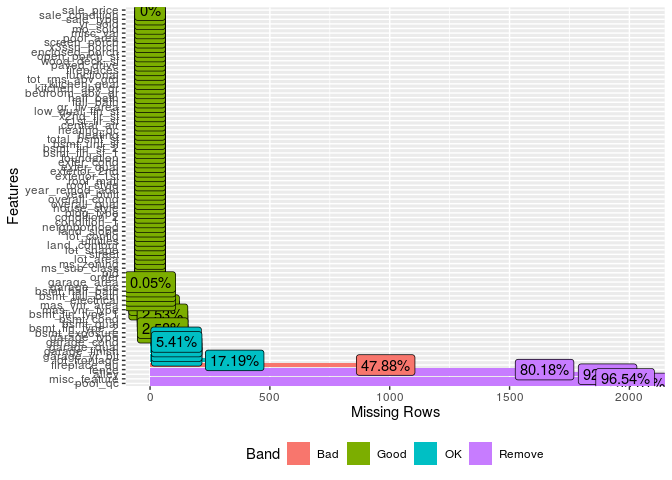<!-- -->

Pada dataset, terdapat 2053 baris dan 82 kolom. Pada data terdapat
*missing value* pada sejumlah kolom dengan *rate* yang berbeda-beda.
Terdapat beberapa pendekan yang dapat digunakan untuk menangani *missing
value*, antara lain:

1, **Membuang kolom atau baris data**. Membuang kolom data pada umumnya
dilakukan jika *missing value* pada kolom tersebut \> 50%-70%. Dalam hal
ini kolom dengan rekomendasi `remove` berdasarkan visualisasi data yang
dihasilkan. Membuang baris, dilakukan apabila.proprosi *missing value*
cukup kecil (misal \<10%) dan tidak mempengaruhi secara signifikan
jumlah training data yang digunakan. 2. **Imputasi**. Proses imputasi
merupakan proses mengisi *missing value* dengan sejumlah pendekatan.
Pendekatan yang digunakan, antara lain:

  - Nilai pusat (mis: mean, median, modus)
  - Hasil prediksi model (mis: knn, *tree-based model*)

Perlu diperhatikan, pendekatan nilai pusat menghiraukan adanya pola yang
terbentuk dalam data. Sebagai gambaran, perhatikan visualisasi di bawah
ini yang membandingkan hasil imputasi menggunakan model maupun
pendekatan nilai pusat.


Variabel dengan proporsi *missing value* \> 40%, antara lain:

``` r
var_miss <-
  mv_vis$data %>%
  filter(pct_missing > 0.4) %>%
  dplyr::select(feature) %>%
  pull()

var_miss
```

    ## [1] alley        fireplace_qu pool_qc      fence        misc_feature
    ## 82 Levels: pool_qc misc_feature alley fence fireplace_qu ... sale_price

## Varian

Untuk melihat varian masing-masing variabel, kita dapat mevisualisasikan
data menggunakan histogram dan barplot.

``` r
plot_histogram(ames_train2, ncol = 2L, nrow = 2L)
```

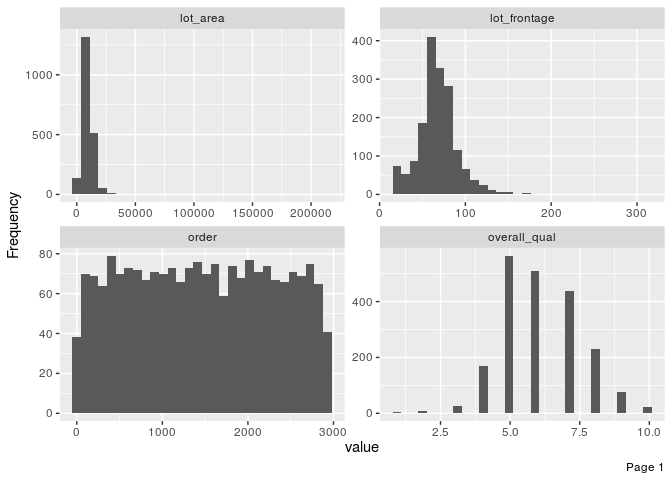<!-- -->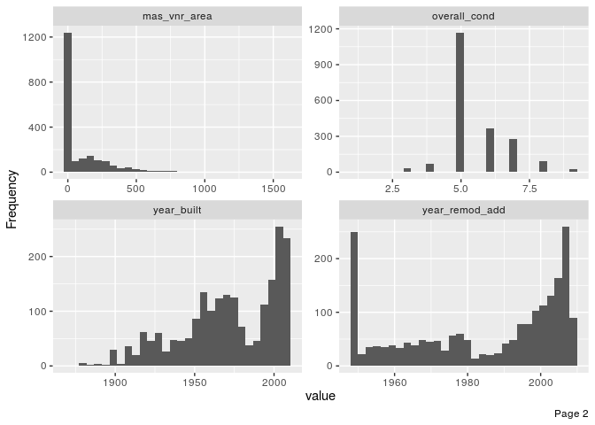<!-- -->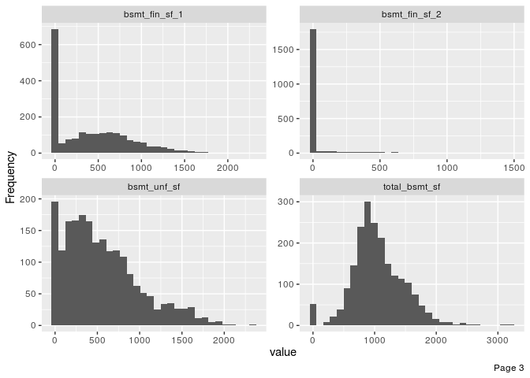<!-- -->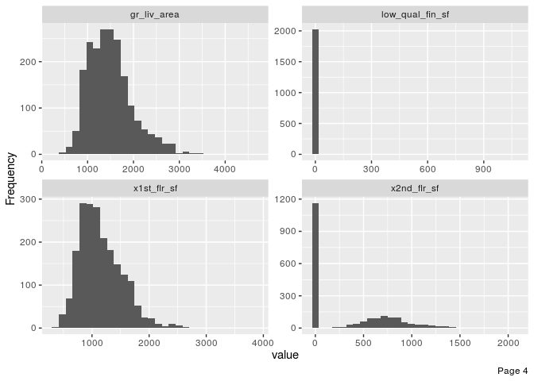<!-- -->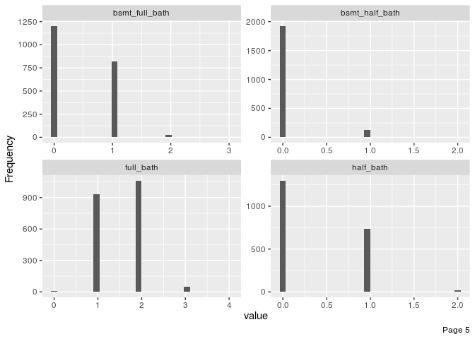<!-- -->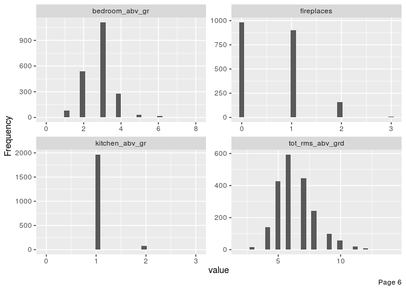<!-- -->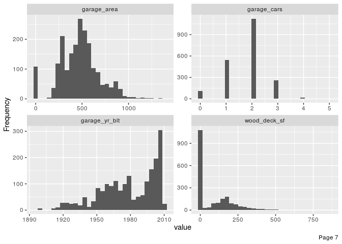<!-- -->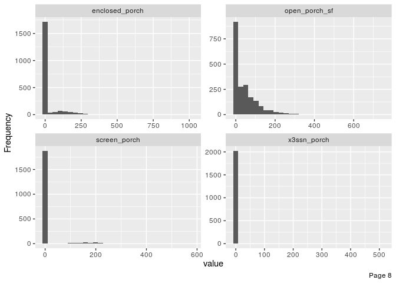<!-- -->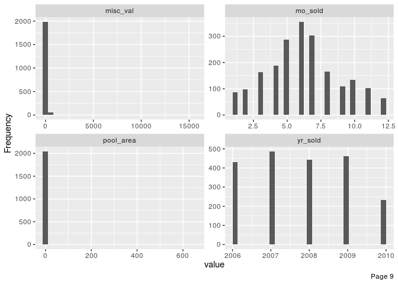<!-- -->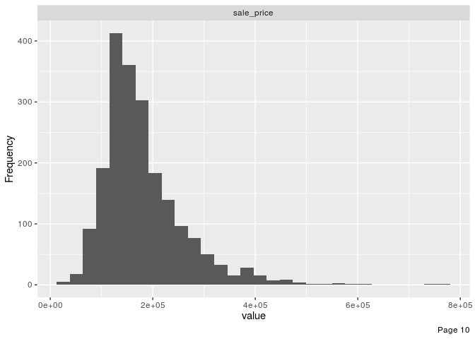<!-- -->

Berdasarkan hasil visualisasi histogram pada data numerik, sebagian
besar data tidak berdistribusi normal atau tidak simestris.

``` r
plot_bar(ames_train2, ncol=2L, nrow = 2L)
```

    ## 1 columns ignored with more than 50 categories.
    ## pid: 2053 categories

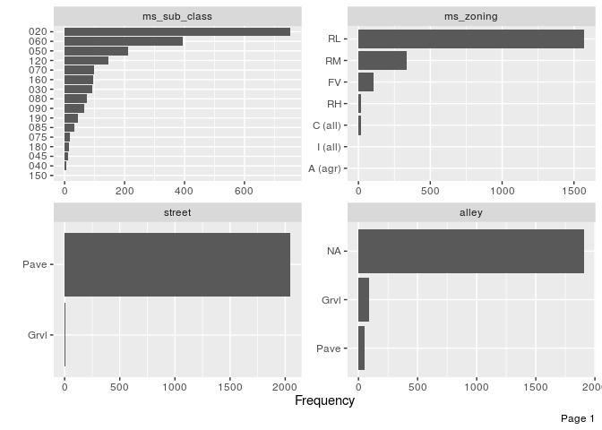<!-- -->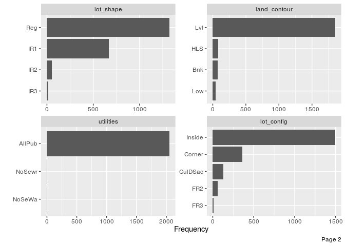<!-- -->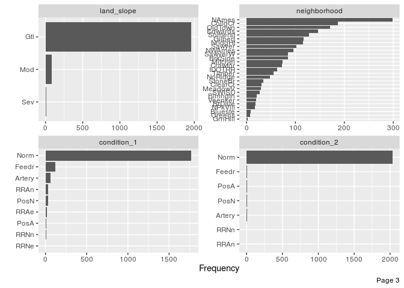<!-- -->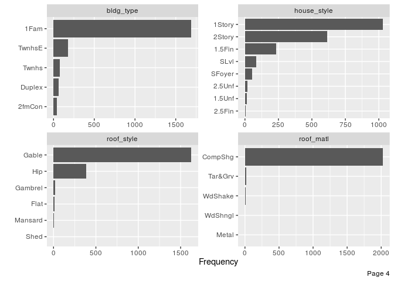<!-- --><!-- -->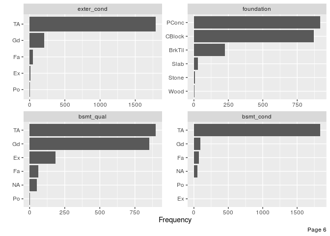<!-- -->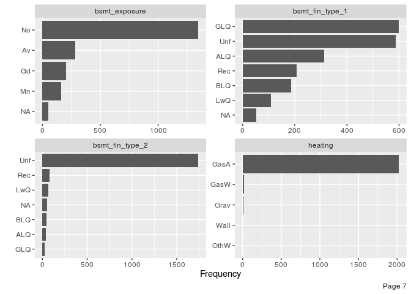<!-- -->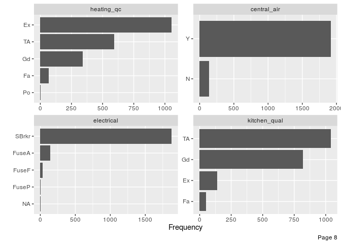<!-- -->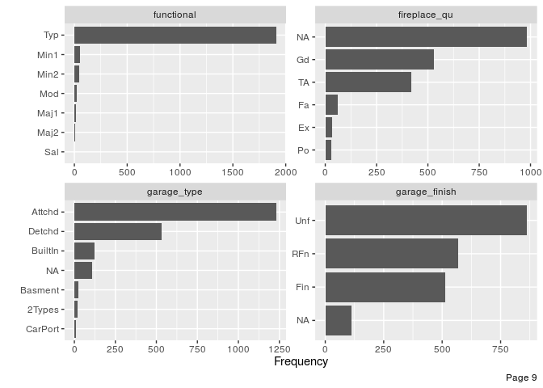<!-- -->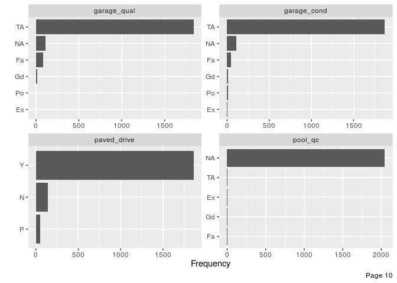<!-- -->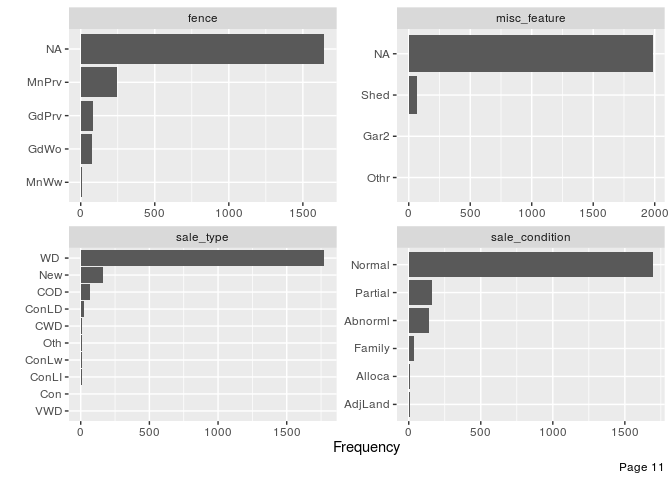<!-- -->

Sejumlah kolom pada variabel kategorikal memiliki varian yang mendekati
nol. Untuk mengetahui kolom dengan varian mendekati nol atau nol,
jalankan sintaks berikut:

``` r
caret::nearZeroVar(ames_train2, saveMetrics = TRUE) %>% 
  tibble::rownames_to_column() %>% 
  filter(nzv)
```

    ##            rowname  freqRatio percentUnique zeroVar  nzv
    ## 1           street  292.28571    0.09741841   FALSE TRUE
    ## 2     land_contour   22.28916    0.19483682   FALSE TRUE
    ## 3        utilities 1025.00000    0.14612762   FALSE TRUE
    ## 4       land_slope   22.76744    0.14612762   FALSE TRUE
    ## 5      condition_2  203.10000    0.34096444   FALSE TRUE
    ## 6        roof_matl  126.50000    0.24354603   FALSE TRUE
    ## 7        bsmt_cond   19.93478    0.24354603   FALSE TRUE
    ## 8  bsmt_fin_type_2   21.50617    0.29225524   FALSE TRUE
    ## 9          heating  101.05000    0.24354603   FALSE TRUE
    ## 10 low_qual_fin_sf 1013.00000    1.31514856   FALSE TRUE
    ## 11  kitchen_abv_gr   23.68675    0.19483682   FALSE TRUE
    ## 12      functional   38.18000    0.34096444   FALSE TRUE
    ## 13     garage_qual   22.70370    0.24354603   FALSE TRUE
    ## 14     garage_cond   38.95833    0.24354603   FALSE TRUE
    ## 15  enclosed_porch  100.94118    7.40379932   FALSE TRUE
    ## 16     x3ssn_porch  674.66667    1.16902094   FALSE TRUE
    ## 17    screen_porch  234.87500    4.52995616   FALSE TRUE
    ## 18       pool_area 2045.00000    0.43838285   FALSE TRUE
    ## 19        misc_val  165.33333    1.41256698   FALSE TRUE

Setidaknya terdapat 19 kolom dengan varian mendekati nolo atau nol.
Membuat variabel dengan varian mendekati nol akan menurunkan dimensi
data.

## Kovarian

Kovarian dapat divisualisasikan dengan menggunakan heatmap yang mengkode
nilai koefisien korelasi berdasarkan warna.

``` r
plot_correlation(ames_train2)
```

    ## 2 features with more than 20 categories ignored!
    ## pid: 2053 categories
    ## neighborhood: 27 categories

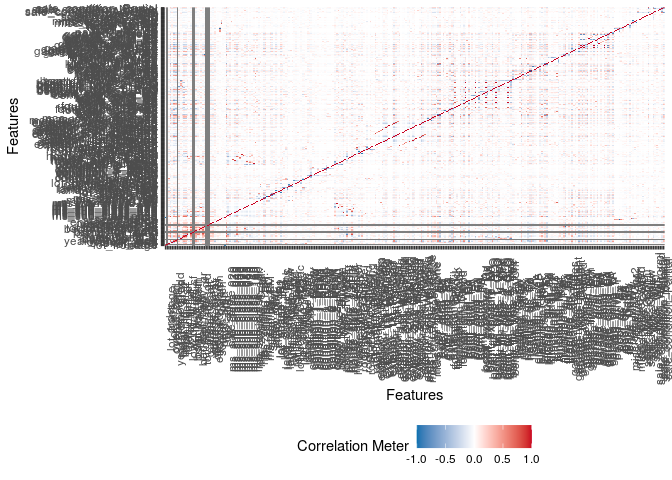<!-- -->

# Target and Feature Engineering

*Data preprocessing* dan *engineering* mengacu pada proses penambahan,
penghapusan, atau transformasi data. Waktu yang diperlukan untuk
memikirkan identifikasi kebutuhan *data engineering* dapat berlangsung
cukup lama dan proprsinya akan menjadi yang terbesar dibandingkan
analisa lainnya. Hal ini disebabkan karena kita perlu untuk memahami
data apa yang akan kita oleh atau diinputkan ke dalam model.

Untuk menyederhanakan proses *feature engineerinh*, kita harus
memikirkannya sebagai sebuah *blueprint* dibanding melakukan tiap
tugasnya secara satu persatu. Hal ini membantu kita dalam dua hal:

1.  Berpikir secara berurutan
2.  Mengaplikasikannya secara tepat selama proses *resampling*

## Urutan Langkah-Langkah Feature Engineering

Memikirkan *feature engineering* sebagai sebuah *blueprint* memaksa kita
untuk memikirkan urutan langkah-langkah *preprocessing* data. Meskipun
setiap masalah mengharuskan kita untuk memikirkan efek *preprocessing*
berurutan, ada beberapa saran umum yang harus kita pertimbangkan:

  - Jika menggunakan log atau transformasi Box-Cox, jangan memusatkan
    data terlebih dahulu atau melakukan operasi apa pun yang dapat
    membuat data menjadi tidak positif. Atau, gunakan transformasi
    Yeo-Johnson sehingga kita tidak perlu khawatir tentang hal ini.
  - *One-hot* atau *dummy encoding* biasanya menghasilkan data jarang
    (*sparse*) yang dapat digunakan oleh banyak algoritma secara
    efisien. Jika kita menstandarisasikan data tersebut, kita akan
    membuat data menjadi padat (*dense*) dan kita kehilangan efisiensi
    komputasi. Akibatnya, sering kali lebih disukai untuk standardisasi
    fitur numerik kita dan kemudian *one-hot/dummy endode*.
  - Jika kila mengelompokkan kategori (*lumping*) yang jarang terjadi
    secara bersamaan, lakukan sebelum *one-hot/dummy endode*.
  - Meskipun kita dapat melakukan prosedur pengurangan dimensi pada
    fitur-fitur kategorikal, adalah umum untuk melakukannya terutama
    pada fitur numerik ketika melakukannya untuk tujuan rekayasa fitur.

Sementara kebutuhan proyek kita mungkin beragam, berikut ini adalah
urutan langkah-langkah potensial yang disarankan untuk sebagian besar
masalah:

1.  Filter fitur dengan varians nol (*zero varians*) atau hampir nol
    (*near zero varians*).
2.  Lakukan imputasi jika diperlukan.
3.  Normalisasi untuk menyelesaikan *skewness* fitur numerik.
4.  Standardisasi fitur numerik (*centering* dan *scaling*).
5.  Lakukan reduksi dimensi (mis., PCA) pada fitur numerik.
6.  *one-hot/dummy endode* pada fitur kategorikal.

## Meletakkan Seluruh Proses Secara Bersamaan

Untuk mengilustrasikan bagaimana proses ini bekerja bersama menggunakan
R, mari kita lakukan penilaian ulang sederhana pada set data `ames` yang
kita gunakan dan lihat apakah beberapa *feature engineering* sederhana
meningkatkan kemampuan prediksi model kita. Tapi pertama-tama, kita
berkenalan dengat paket `recipe`.

Paket `recipe` ini memungkinkan kita untuk mengembangkan *blueprint
feature engineering* secara berurutan. Gagasan di balik `recipe` mirip
dengan `caret :: preProcess()` di mana kita ingin membuat *blueprint
preprocessing* tetapi menerapkannya nanti dan dalam setiap resample.

Ada tiga langkah utama dalam membuat dan menerapkan rekayasa fitur
dengan `recipe`:

1.  `recipe()`: tempat kita menentukan langkah-langkah rekayasa fitur
    untuk membuat *blueprint*.
2.  `prep()`: memperkirakan parameter *feature engineering* berdasarkan
    data *training*.
3.  `bake()`: terapkan *blueprint* untuk data baru.

Langkah pertama adalah di mana kita menentukan *blueprint*. Dengan
proses ini, Kita memberikan formula model yang ingin kita buat (variabel
target, fitur, dan data yang menjadi dasarnya) dengan fungsi `recipe()`
dan kemudian kita secara bertahap menambahkan langkah-langkah rekayasa
fitur dengan fungsi `step_xxx()`.

*Blueprint* yang akan dilakukan dalam proses *feature engineering*
berdasarkan hasil analisis data eksploratif, antara lain:

1.  Memfilter variabel kategorikal dengan varian mendekati nol
2.  Membuang variabel dengan *missing value* \> 40% dan ID
3.  Melakukan imputasi menggunakan knn pada variabel dengan *missing
    value*
4.  Melakukan *categorical encoding* pada variabel kategorikal dengan
    kelas \> 10
5.  Standardisasi data numerik
6.  Reduksi dimensi menggunakan pca
7.  *dummy encoding* pada data kategorikal

<!-- end list -->

``` r
blueprint <- recipe(sale_price ~., data = ames_train2) %>%
  # feature filtering
  step_nzv(all_nominal()) %>%
  # remove feature
  step_rm(var_miss, pid) %>%
  # imputation
  step_knnimpute(all_predictors(), neighbors = 6) %>%
  # label encoding
  step_integer(ms_sub_class, neighborhood, exterior_1st, exterior_2nd, sale_type) %>%
  # standardization
  step_center(all_numeric(), -all_outcomes()) %>%
  step_scale(all_numeric(), -all_outcomes()) %>%
  # feature extraction
  step_pca(all_numeric(), -all_outcomes(), threshold = .7) %>%
  # one hot/dummy encoding
  step_dummy(all_nominal())

blueprint
```

    ## Data Recipe
    ## 
    ## Inputs:
    ## 
    ##       role #variables
    ##    outcome          1
    ##  predictor         81
    ## 
    ## Operations:
    ## 
    ## Sparse, unbalanced variable filter on all_nominal()
    ## Delete terms var_miss, pid
    ## K-nearest neighbor imputation for all_predictors()
    ## Integer encoding for ms_sub_class, neighborhood, exterior_1st, ...
    ## Centering for all_numeric(), -all_outcomes()
    ## Scaling for all_numeric(), -all_outcomes()
    ## No PCA components were extracted.
    ## Dummy variables from all_nominal()

Selanjutnya, *blueprint* yang telah dibuat dilakukan *training* pada
data *training*. Perlu diperhatikan, kita tidak melakukan proses
*training* pada data *test* untuk mencegah *data leakage*.

``` r
prepare <- prep(blueprint, training = ames_train2)
```

    ## Note: Using an external vector in selections is ambiguous.
    ## ℹ Use `all_of(var_miss)` instead of `var_miss` to silence this message.
    ## ℹ See <https://tidyselect.r-lib.org/reference/faq-external-vector.html>.
    ## This message is displayed once per session.

``` r
prepare
```

    ## Data Recipe
    ## 
    ## Inputs:
    ## 
    ##       role #variables
    ##    outcome          1
    ##  predictor         81
    ## 
    ## Training data contained 2053 data points and 2053 incomplete rows. 
    ## 
    ## Operations:
    ## 
    ## Sparse, unbalanced variable filter removed street, land_contour, ... [trained]
    ## Variables removed alley, fireplace_qu, pool_qc, fence, misc_feature, pid [trained]
    ## K-nearest neighbor imputation for ms_sub_class, ms_zoning, ... [trained]
    ## Integer encoding for ms_sub_class, neighborhood, exterior_1st, ... [trained]
    ## Centering for order, ms_sub_class, lot_frontage, ... [trained]
    ## Scaling for order, ms_sub_class, lot_frontage, ... [trained]
    ## PCA extraction with order, ms_sub_class, lot_frontage, ... [trained]
    ## Dummy variables from ms_zoning, lot_shape, lot_config, condition_1, ... [trained]

Langkah terakhir adalah mengaplikasikan *blueprint* pada data *training*
dan *test* menggunakan fungsi `bake()`.

``` r
baked_train <- bake(prepare, new_data = ames_train2)
baked_test <- bake(prepare, new_data = ames_test2)
baked_train
```

    ## # A tibble: 2,053 x 108
    ##    sale_price   PC01   PC02     PC03   PC04  PC05    PC06   PC07   PC08     PC09
    ##         <int>  <dbl>  <dbl>    <dbl>  <dbl> <dbl>   <dbl>  <dbl>  <dbl>    <dbl>
    ##  1     215000 -1.16  -1.44  -3.79    -1.27  2.49   0.0381  0.782 -0.879  6.27e-1
    ##  2     105000  2.17  -1.62  -0.00148 -0.196 2.73   0.850   0.604 -0.931 -1.21e-1
    ##  3     172000  0.947 -0.954 -1.05    -0.707 3.75   2.18    2.37   2.56  -7.32e-1
    ##  4     195500 -1.36   0.640  1.88    -1.48  1.79   1.31    0.552  0.504  7.97e-5
    ##  5     213500 -0.635 -1.65   1.13    -1.96  1.14  -3.02   -1.26   1.38   1.11e+0
    ##  6     236500 -1.97  -2.74   0.685   -2.96  0.676 -2.15   -0.915  1.18   2.00e-1
    ##  7     189000 -1.50   1.46   2.54    -0.347 2.07   0.0136  0.558 -0.129  2.16e-2
    ##  8     175900 -0.605  1.62   1.52    -1.86  1.48  -1.24    1.56  -0.216  8.49e-1
    ##  9     180400 -0.550  1.43   2.69    -0.462 2.13   0.120   0.522 -0.652  3.14e-1
    ## 10     171500 -0.525 -2.37   0.189   -1.65  1.80  -0.830   0.847 -0.372  9.14e-1
    ## # … with 2,043 more rows, and 98 more variables: PC10 <dbl>, PC11 <dbl>,
    ## #   PC12 <dbl>, PC13 <dbl>, PC14 <dbl>, PC15 <dbl>, ms_zoning_C..all. <dbl>,
    ## #   ms_zoning_FV <dbl>, ms_zoning_I..all. <dbl>, ms_zoning_RH <dbl>,
    ## #   ms_zoning_RL <dbl>, ms_zoning_RM <dbl>, lot_shape_IR2 <dbl>,
    ## #   lot_shape_IR3 <dbl>, lot_shape_Reg <dbl>, lot_config_CulDSac <dbl>,
    ## #   lot_config_FR2 <dbl>, lot_config_FR3 <dbl>, lot_config_Inside <dbl>,
    ## #   condition_1_Feedr <dbl>, condition_1_Norm <dbl>, condition_1_PosA <dbl>,
    ## #   condition_1_PosN <dbl>, condition_1_RRAe <dbl>, condition_1_RRAn <dbl>,
    ## #   condition_1_RRNe <dbl>, condition_1_RRNn <dbl>, bldg_type_X2fmCon <dbl>,
    ## #   bldg_type_Duplex <dbl>, bldg_type_Twnhs <dbl>, bldg_type_TwnhsE <dbl>,
    ## #   house_style_X1.5Unf <dbl>, house_style_X1Story <dbl>,
    ## #   house_style_X2.5Fin <dbl>, house_style_X2.5Unf <dbl>,
    ## #   house_style_X2Story <dbl>, house_style_SFoyer <dbl>,
    ## #   house_style_SLvl <dbl>, roof_style_Gable <dbl>, roof_style_Gambrel <dbl>,
    ## #   roof_style_Hip <dbl>, roof_style_Mansard <dbl>, roof_style_Shed <dbl>,
    ## #   mas_vnr_type_BrkFace <dbl>, mas_vnr_type_CBlock <dbl>,
    ## #   mas_vnr_type_None <dbl>, mas_vnr_type_Stone <dbl>, exter_qual_Fa <dbl>,
    ## #   exter_qual_Gd <dbl>, exter_qual_TA <dbl>, exter_cond_Fa <dbl>,
    ## #   exter_cond_Gd <dbl>, exter_cond_Po <dbl>, exter_cond_TA <dbl>,
    ## #   foundation_CBlock <dbl>, foundation_PConc <dbl>, foundation_Slab <dbl>,
    ## #   foundation_Stone <dbl>, foundation_Wood <dbl>, bsmt_qual_Fa <dbl>,
    ## #   bsmt_qual_Gd <dbl>, bsmt_qual_Po <dbl>, bsmt_qual_TA <dbl>,
    ## #   bsmt_exposure_Gd <dbl>, bsmt_exposure_Mn <dbl>, bsmt_exposure_No <dbl>,
    ## #   bsmt_fin_type_1_BLQ <dbl>, bsmt_fin_type_1_GLQ <dbl>,
    ## #   bsmt_fin_type_1_LwQ <dbl>, bsmt_fin_type_1_Rec <dbl>,
    ## #   bsmt_fin_type_1_Unf <dbl>, heating_qc_Fa <dbl>, heating_qc_Gd <dbl>,
    ## #   heating_qc_Po <dbl>, heating_qc_TA <dbl>, central_air_Y <dbl>,
    ## #   electrical_FuseF <dbl>, electrical_FuseP <dbl>, electrical_Mix <dbl>,
    ## #   electrical_SBrkr <dbl>, kitchen_qual_Fa <dbl>, kitchen_qual_Gd <dbl>,
    ## #   kitchen_qual_Po <dbl>, kitchen_qual_TA <dbl>, garage_type_Attchd <dbl>,
    ## #   garage_type_Basment <dbl>, garage_type_BuiltIn <dbl>,
    ## #   garage_type_CarPort <dbl>, garage_type_Detchd <dbl>,
    ## #   garage_finish_RFn <dbl>, garage_finish_Unf <dbl>, paved_drive_P <dbl>,
    ## #   paved_drive_Y <dbl>, sale_condition_AdjLand <dbl>,
    ## #   sale_condition_Alloca <dbl>, sale_condition_Family <dbl>,
    ## #   sale_condition_Normal <dbl>, sale_condition_Partial <dbl>

``` r
skim(baked_train)
```

|                                                  |              |
| :----------------------------------------------- | :----------- |
| Name                                             | baked\_train |
| Number of rows                                   | 2053         |
| Number of columns                                | 108          |
| \_\_\_\_\_\_\_\_\_\_\_\_\_\_\_\_\_\_\_\_\_\_\_   |              |
| Column type frequency:                           |              |
| numeric                                          | 108          |
| \_\_\_\_\_\_\_\_\_\_\_\_\_\_\_\_\_\_\_\_\_\_\_\_ |              |
| Group variables                                  | None         |

Data summary

**Variable type: numeric**

| skim\_variable           | n\_missing | complete\_rate |      mean |       sd |       p0 |       p25 |       p50 |       p75 |      p100 | hist  |
| :----------------------- | ---------: | -------------: | --------: | -------: | -------: | --------: | --------: | --------: | --------: | :---- |
| sale\_price              |          0 |              1 | 180996.28 | 80258.90 | 13100.00 | 129500.00 |   1.6e+05 | 213500.00 | 755000.00 | ▇▇▁▁▁ |
| PC01                     |          0 |              1 |      0.00 |     2.69 |  \-11.91 |    \-1.70 |   1.6e-01 |      2.09 |      7.20 | ▁▁▆▇▂ |
| PC02                     |          0 |              1 |      0.00 |     1.82 |   \-5.23 |    \-1.38 | \-2.4e-01 |      1.39 |      9.38 | ▁▇▅▁▁ |
| PC03                     |          0 |              1 |      0.00 |     1.62 |  \-12.59 |    \-1.08 | \-4.0e-02 |      1.12 |      4.59 | ▁▁▁▇▃ |
| PC04                     |          0 |              1 |      0.00 |     1.48 |   \-3.94 |    \-1.01 | \-3.0e-02 |      0.99 |      4.50 | ▁▆▇▃▁ |
| PC05                     |          0 |              1 |      0.00 |     1.41 |   \-3.91 |    \-1.05 | \-6.0e-02 |      1.05 |      3.75 | ▁▆▇▆▂ |
| PC06                     |          0 |              1 |      0.00 |     1.36 |   \-5.07 |    \-0.90 |   1.0e-01 |      0.96 |      4.33 | ▁▂▇▆▁ |
| PC07                     |          0 |              1 |      0.00 |     1.18 |   \-6.13 |    \-0.58 |   1.2e-01 |      0.67 |      4.06 | ▁▁▆▇▁ |
| PC08                     |          0 |              1 |      0.00 |     1.11 |   \-4.84 |    \-0.56 | \-1.0e-02 |      0.55 |      6.03 | ▁▃▇▁▁ |
| PC09                     |          0 |              1 |      0.00 |     1.09 |   \-4.04 |    \-0.54 |   3.0e-02 |      0.50 |     13.16 | ▂▇▁▁▁ |
| PC10                     |          0 |              1 |      0.00 |     1.08 |   \-7.35 |    \-0.67 |   7.0e-02 |      0.69 |      7.36 | ▁▁▇▁▁ |
| PC11                     |          0 |              1 |      0.00 |     1.04 |  \-15.06 |    \-0.54 | \-3.0e-02 |      0.50 |      7.93 | ▁▁▁▇▁ |
| PC12                     |          0 |              1 |      0.00 |     1.04 |   \-6.10 |    \-0.28 |   1.3e-01 |      0.46 |      9.07 | ▁▅▇▁▁ |
| PC13                     |          0 |              1 |      0.00 |     1.02 |   \-8.77 |    \-0.52 |   6.0e-02 |      0.62 |      3.29 | ▁▁▁▇▂ |
| PC14                     |          0 |              1 |      0.00 |     1.00 |  \-10.97 |    \-0.41 |   6.0e-02 |      0.52 |      5.24 | ▁▁▁▇▁ |
| PC15                     |          0 |              1 |      0.00 |     0.99 |  \-10.40 |    \-0.42 |   1.3e-01 |      0.62 |      3.06 | ▁▁▁▇▅ |
| ms\_zoning\_C..all.      |          0 |              1 |      0.01 |     0.10 |     0.00 |      0.00 |   0.0e+00 |      0.00 |      1.00 | ▇▁▁▁▁ |
| ms\_zoning\_FV           |          0 |              1 |      0.05 |     0.22 |     0.00 |      0.00 |   0.0e+00 |      0.00 |      1.00 | ▇▁▁▁▁ |
| ms\_zoning\_I..all.      |          0 |              1 |      0.00 |     0.03 |     0.00 |      0.00 |   0.0e+00 |      0.00 |      1.00 | ▇▁▁▁▁ |
| ms\_zoning\_RH           |          0 |              1 |      0.01 |     0.10 |     0.00 |      0.00 |   0.0e+00 |      0.00 |      1.00 | ▇▁▁▁▁ |
| ms\_zoning\_RL           |          0 |              1 |      0.77 |     0.42 |     0.00 |      1.00 |   1.0e+00 |      1.00 |      1.00 | ▂▁▁▁▇ |
| ms\_zoning\_RM           |          0 |              1 |      0.16 |     0.37 |     0.00 |      0.00 |   0.0e+00 |      0.00 |      1.00 | ▇▁▁▁▂ |
| lot\_shape\_IR2          |          0 |              1 |      0.03 |     0.16 |     0.00 |      0.00 |   0.0e+00 |      0.00 |      1.00 | ▇▁▁▁▁ |
| lot\_shape\_IR3          |          0 |              1 |      0.01 |     0.08 |     0.00 |      0.00 |   0.0e+00 |      0.00 |      1.00 | ▇▁▁▁▁ |
| lot\_shape\_Reg          |          0 |              1 |      0.64 |     0.48 |     0.00 |      0.00 |   1.0e+00 |      1.00 |      1.00 | ▅▁▁▁▇ |
| lot\_config\_CulDSac     |          0 |              1 |      0.06 |     0.24 |     0.00 |      0.00 |   0.0e+00 |      0.00 |      1.00 | ▇▁▁▁▁ |
| lot\_config\_FR2         |          0 |              1 |      0.03 |     0.17 |     0.00 |      0.00 |   0.0e+00 |      0.00 |      1.00 | ▇▁▁▁▁ |
| lot\_config\_FR3         |          0 |              1 |      0.00 |     0.07 |     0.00 |      0.00 |   0.0e+00 |      0.00 |      1.00 | ▇▁▁▁▁ |
| lot\_config\_Inside      |          0 |              1 |      0.73 |     0.45 |     0.00 |      0.00 |   1.0e+00 |      1.00 |      1.00 | ▃▁▁▁▇ |
| condition\_1\_Feedr      |          0 |              1 |      0.06 |     0.23 |     0.00 |      0.00 |   0.0e+00 |      0.00 |      1.00 | ▇▁▁▁▁ |
| condition\_1\_Norm       |          0 |              1 |      0.86 |     0.35 |     0.00 |      1.00 |   1.0e+00 |      1.00 |      1.00 | ▁▁▁▁▇ |
| condition\_1\_PosA       |          0 |              1 |      0.01 |     0.07 |     0.00 |      0.00 |   0.0e+00 |      0.00 |      1.00 | ▇▁▁▁▁ |
| condition\_1\_PosN       |          0 |              1 |      0.02 |     0.12 |     0.00 |      0.00 |   0.0e+00 |      0.00 |      1.00 | ▇▁▁▁▁ |
| condition\_1\_RRAe       |          0 |              1 |      0.01 |     0.08 |     0.00 |      0.00 |   0.0e+00 |      0.00 |      1.00 | ▇▁▁▁▁ |
| condition\_1\_RRAn       |          0 |              1 |      0.02 |     0.13 |     0.00 |      0.00 |   0.0e+00 |      0.00 |      1.00 | ▇▁▁▁▁ |
| condition\_1\_RRNe       |          0 |              1 |      0.00 |     0.04 |     0.00 |      0.00 |   0.0e+00 |      0.00 |      1.00 | ▇▁▁▁▁ |
| condition\_1\_RRNn       |          0 |              1 |      0.00 |     0.06 |     0.00 |      0.00 |   0.0e+00 |      0.00 |      1.00 | ▇▁▁▁▁ |
| bldg\_type\_X2fmCon      |          0 |              1 |      0.02 |     0.14 |     0.00 |      0.00 |   0.0e+00 |      0.00 |      1.00 | ▇▁▁▁▁ |
| bldg\_type\_Duplex       |          0 |              1 |      0.03 |     0.18 |     0.00 |      0.00 |   0.0e+00 |      0.00 |      1.00 | ▇▁▁▁▁ |
| bldg\_type\_Twnhs        |          0 |              1 |      0.04 |     0.19 |     0.00 |      0.00 |   0.0e+00 |      0.00 |      1.00 | ▇▁▁▁▁ |
| bldg\_type\_TwnhsE       |          0 |              1 |      0.09 |     0.28 |     0.00 |      0.00 |   0.0e+00 |      0.00 |      1.00 | ▇▁▁▁▁ |
| house\_style\_X1.5Unf    |          0 |              1 |      0.01 |     0.08 |     0.00 |      0.00 |   0.0e+00 |      0.00 |      1.00 | ▇▁▁▁▁ |
| house\_style\_X1Story    |          0 |              1 |      0.50 |     0.50 |     0.00 |      0.00 |   1.0e+00 |      1.00 |      1.00 | ▇▁▁▁▇ |
| house\_style\_X2.5Fin    |          0 |              1 |      0.00 |     0.05 |     0.00 |      0.00 |   0.0e+00 |      0.00 |      1.00 | ▇▁▁▁▁ |
| house\_style\_X2.5Unf    |          0 |              1 |      0.01 |     0.10 |     0.00 |      0.00 |   0.0e+00 |      0.00 |      1.00 | ▇▁▁▁▁ |
| house\_style\_X2Story    |          0 |              1 |      0.30 |     0.46 |     0.00 |      0.00 |   0.0e+00 |      1.00 |      1.00 | ▇▁▁▁▃ |
| house\_style\_SFoyer     |          0 |              1 |      0.03 |     0.16 |     0.00 |      0.00 |   0.0e+00 |      0.00 |      1.00 | ▇▁▁▁▁ |
| house\_style\_SLvl       |          0 |              1 |      0.04 |     0.20 |     0.00 |      0.00 |   0.0e+00 |      0.00 |      1.00 | ▇▁▁▁▁ |
| roof\_style\_Gable       |          0 |              1 |      0.79 |     0.41 |     0.00 |      1.00 |   1.0e+00 |      1.00 |      1.00 | ▂▁▁▁▇ |
| roof\_style\_Gambrel     |          0 |              1 |      0.01 |     0.09 |     0.00 |      0.00 |   0.0e+00 |      0.00 |      1.00 | ▇▁▁▁▁ |
| roof\_style\_Hip         |          0 |              1 |      0.19 |     0.39 |     0.00 |      0.00 |   0.0e+00 |      0.00 |      1.00 | ▇▁▁▁▂ |
| roof\_style\_Mansard     |          0 |              1 |      0.00 |     0.06 |     0.00 |      0.00 |   0.0e+00 |      0.00 |      1.00 | ▇▁▁▁▁ |
| roof\_style\_Shed        |          0 |              1 |      0.00 |     0.02 |     0.00 |      0.00 |   0.0e+00 |      0.00 |      1.00 | ▇▁▁▁▁ |
| mas\_vnr\_type\_BrkFace  |          0 |              1 |      0.30 |     0.46 |     0.00 |      0.00 |   0.0e+00 |      1.00 |      1.00 | ▇▁▁▁▃ |
| mas\_vnr\_type\_CBlock   |          0 |              1 |      0.00 |     0.00 |     0.00 |      0.00 |   0.0e+00 |      0.00 |      0.00 | ▁▁▇▁▁ |
| mas\_vnr\_type\_None     |          0 |              1 |      0.60 |     0.49 |     0.00 |      0.00 |   1.0e+00 |      1.00 |      1.00 | ▆▁▁▁▇ |
| mas\_vnr\_type\_Stone    |          0 |              1 |      0.09 |     0.28 |     0.00 |      0.00 |   0.0e+00 |      0.00 |      1.00 | ▇▁▁▁▁ |
| exter\_qual\_Fa          |          0 |              1 |      0.01 |     0.10 |     0.00 |      0.00 |   0.0e+00 |      0.00 |      1.00 | ▇▁▁▁▁ |
| exter\_qual\_Gd          |          0 |              1 |      0.33 |     0.47 |     0.00 |      0.00 |   0.0e+00 |      1.00 |      1.00 | ▇▁▁▁▃ |
| exter\_qual\_TA          |          0 |              1 |      0.62 |     0.49 |     0.00 |      0.00 |   1.0e+00 |      1.00 |      1.00 | ▅▁▁▁▇ |
| exter\_cond\_Fa          |          0 |              1 |      0.02 |     0.14 |     0.00 |      0.00 |   0.0e+00 |      0.00 |      1.00 | ▇▁▁▁▁ |
| exter\_cond\_Gd          |          0 |              1 |      0.10 |     0.30 |     0.00 |      0.00 |   0.0e+00 |      0.00 |      1.00 | ▇▁▁▁▁ |
| exter\_cond\_Po          |          0 |              1 |      0.00 |     0.04 |     0.00 |      0.00 |   0.0e+00 |      0.00 |      1.00 | ▇▁▁▁▁ |
| exter\_cond\_TA          |          0 |              1 |      0.87 |     0.33 |     0.00 |      1.00 |   1.0e+00 |      1.00 |      1.00 | ▁▁▁▁▇ |
| foundation\_CBlock       |          0 |              1 |      0.42 |     0.49 |     0.00 |      0.00 |   0.0e+00 |      1.00 |      1.00 | ▇▁▁▁▆ |
| foundation\_PConc        |          0 |              1 |      0.45 |     0.50 |     0.00 |      0.00 |   0.0e+00 |      1.00 |      1.00 | ▇▁▁▁▆ |
| foundation\_Slab         |          0 |              1 |      0.01 |     0.12 |     0.00 |      0.00 |   0.0e+00 |      0.00 |      1.00 | ▇▁▁▁▁ |
| foundation\_Stone        |          0 |              1 |      0.00 |     0.06 |     0.00 |      0.00 |   0.0e+00 |      0.00 |      1.00 | ▇▁▁▁▁ |
| foundation\_Wood         |          0 |              1 |      0.00 |     0.04 |     0.00 |      0.00 |   0.0e+00 |      0.00 |      1.00 | ▇▁▁▁▁ |
| bsmt\_qual\_Fa           |          0 |              1 |      0.03 |     0.17 |     0.00 |      0.00 |   0.0e+00 |      0.00 |      1.00 | ▇▁▁▁▁ |
| bsmt\_qual\_Gd           |          0 |              1 |      0.42 |     0.49 |     0.00 |      0.00 |   0.0e+00 |      1.00 |      1.00 | ▇▁▁▁▆ |
| bsmt\_qual\_Po           |          0 |              1 |      0.00 |     0.03 |     0.00 |      0.00 |   0.0e+00 |      0.00 |      1.00 | ▇▁▁▁▁ |
| bsmt\_qual\_TA           |          0 |              1 |      0.46 |     0.50 |     0.00 |      0.00 |   0.0e+00 |      1.00 |      1.00 | ▇▁▁▁▇ |
| bsmt\_exposure\_Gd       |          0 |              1 |      0.10 |     0.30 |     0.00 |      0.00 |   0.0e+00 |      0.00 |      1.00 | ▇▁▁▁▁ |
| bsmt\_exposure\_Mn       |          0 |              1 |      0.08 |     0.27 |     0.00 |      0.00 |   0.0e+00 |      0.00 |      1.00 | ▇▁▁▁▁ |
| bsmt\_exposure\_No       |          0 |              1 |      0.68 |     0.47 |     0.00 |      0.00 |   1.0e+00 |      1.00 |      1.00 | ▃▁▁▁▇ |
| bsmt\_fin\_type\_1\_BLQ  |          0 |              1 |      0.09 |     0.29 |     0.00 |      0.00 |   0.0e+00 |      0.00 |      1.00 | ▇▁▁▁▁ |
| bsmt\_fin\_type\_1\_GLQ  |          0 |              1 |      0.29 |     0.46 |     0.00 |      0.00 |   0.0e+00 |      1.00 |      1.00 | ▇▁▁▁▃ |
| bsmt\_fin\_type\_1\_LwQ  |          0 |              1 |      0.06 |     0.23 |     0.00 |      0.00 |   0.0e+00 |      0.00 |      1.00 | ▇▁▁▁▁ |
| bsmt\_fin\_type\_1\_Rec  |          0 |              1 |      0.10 |     0.31 |     0.00 |      0.00 |   0.0e+00 |      0.00 |      1.00 | ▇▁▁▁▁ |
| bsmt\_fin\_type\_1\_Unf  |          0 |              1 |      0.30 |     0.46 |     0.00 |      0.00 |   0.0e+00 |      1.00 |      1.00 | ▇▁▁▁▃ |
| heating\_qc\_Fa          |          0 |              1 |      0.03 |     0.18 |     0.00 |      0.00 |   0.0e+00 |      0.00 |      1.00 | ▇▁▁▁▁ |
| heating\_qc\_Gd          |          0 |              1 |      0.17 |     0.37 |     0.00 |      0.00 |   0.0e+00 |      0.00 |      1.00 | ▇▁▁▁▂ |
| heating\_qc\_Po          |          0 |              1 |      0.00 |     0.03 |     0.00 |      0.00 |   0.0e+00 |      0.00 |      1.00 | ▇▁▁▁▁ |
| heating\_qc\_TA          |          0 |              1 |      0.29 |     0.45 |     0.00 |      0.00 |   0.0e+00 |      1.00 |      1.00 | ▇▁▁▁▃ |
| central\_air\_Y          |          0 |              1 |      0.93 |     0.25 |     0.00 |      1.00 |   1.0e+00 |      1.00 |      1.00 | ▁▁▁▁▇ |
| electrical\_FuseF        |          0 |              1 |      0.02 |     0.12 |     0.00 |      0.00 |   0.0e+00 |      0.00 |      1.00 | ▇▁▁▁▁ |
| electrical\_FuseP        |          0 |              1 |      0.00 |     0.06 |     0.00 |      0.00 |   0.0e+00 |      0.00 |      1.00 | ▇▁▁▁▁ |
| electrical\_Mix          |          0 |              1 |      0.00 |     0.00 |     0.00 |      0.00 |   0.0e+00 |      0.00 |      0.00 | ▁▁▇▁▁ |
| electrical\_SBrkr        |          0 |              1 |      0.91 |     0.28 |     0.00 |      1.00 |   1.0e+00 |      1.00 |      1.00 | ▁▁▁▁▇ |
| kitchen\_qual\_Fa        |          0 |              1 |      0.03 |     0.16 |     0.00 |      0.00 |   0.0e+00 |      0.00 |      1.00 | ▇▁▁▁▁ |
| kitchen\_qual\_Gd        |          0 |              1 |      0.40 |     0.49 |     0.00 |      0.00 |   0.0e+00 |      1.00 |      1.00 | ▇▁▁▁▅ |
| kitchen\_qual\_Po        |          0 |              1 |      0.00 |     0.00 |     0.00 |      0.00 |   0.0e+00 |      0.00 |      0.00 | ▁▁▇▁▁ |
| kitchen\_qual\_TA        |          0 |              1 |      0.51 |     0.50 |     0.00 |      0.00 |   1.0e+00 |      1.00 |      1.00 | ▇▁▁▁▇ |
| garage\_type\_Attchd     |          0 |              1 |      0.62 |     0.49 |     0.00 |      0.00 |   1.0e+00 |      1.00 |      1.00 | ▅▁▁▁▇ |
| garage\_type\_Basment    |          0 |              1 |      0.01 |     0.11 |     0.00 |      0.00 |   0.0e+00 |      0.00 |      1.00 | ▇▁▁▁▁ |
| garage\_type\_BuiltIn    |          0 |              1 |      0.06 |     0.24 |     0.00 |      0.00 |   0.0e+00 |      0.00 |      1.00 | ▇▁▁▁▁ |
| garage\_type\_CarPort    |          0 |              1 |      0.01 |     0.08 |     0.00 |      0.00 |   0.0e+00 |      0.00 |      1.00 | ▇▁▁▁▁ |
| garage\_type\_Detchd     |          0 |              1 |      0.29 |     0.45 |     0.00 |      0.00 |   0.0e+00 |      1.00 |      1.00 | ▇▁▁▁▃ |
| garage\_finish\_RFn      |          0 |              1 |      0.28 |     0.45 |     0.00 |      0.00 |   0.0e+00 |      1.00 |      1.00 | ▇▁▁▁▃ |
| garage\_finish\_Unf      |          0 |              1 |      0.47 |     0.50 |     0.00 |      0.00 |   0.0e+00 |      1.00 |      1.00 | ▇▁▁▁▇ |
| paved\_drive\_P          |          0 |              1 |      0.02 |     0.16 |     0.00 |      0.00 |   0.0e+00 |      0.00 |      1.00 | ▇▁▁▁▁ |
| paved\_drive\_Y          |          0 |              1 |      0.91 |     0.29 |     0.00 |      1.00 |   1.0e+00 |      1.00 |      1.00 | ▁▁▁▁▇ |
| sale\_condition\_AdjLand |          0 |              1 |      0.00 |     0.07 |     0.00 |      0.00 |   0.0e+00 |      0.00 |      1.00 | ▇▁▁▁▁ |
| sale\_condition\_Alloca  |          0 |              1 |      0.01 |     0.08 |     0.00 |      0.00 |   0.0e+00 |      0.00 |      1.00 | ▇▁▁▁▁ |
| sale\_condition\_Family  |          0 |              1 |      0.02 |     0.13 |     0.00 |      0.00 |   0.0e+00 |      0.00 |      1.00 | ▇▁▁▁▁ |
| sale\_condition\_Normal  |          0 |              1 |      0.82 |     0.38 |     0.00 |      1.00 |   1.0e+00 |      1.00 |      1.00 | ▂▁▁▁▇ |
| sale\_condition\_Partial |          0 |              1 |      0.08 |     0.27 |     0.00 |      0.00 |   0.0e+00 |      0.00 |      1.00 | ▇▁▁▁▁ |
