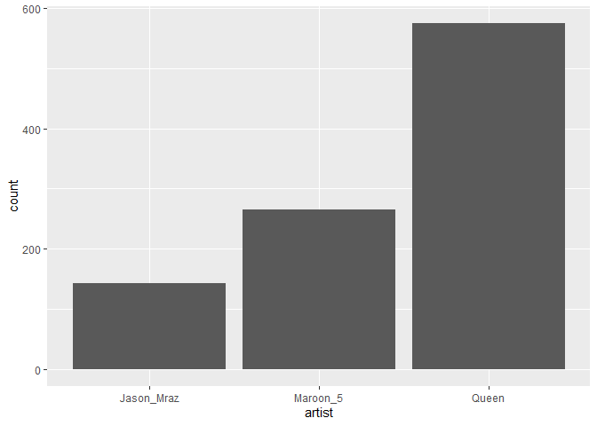
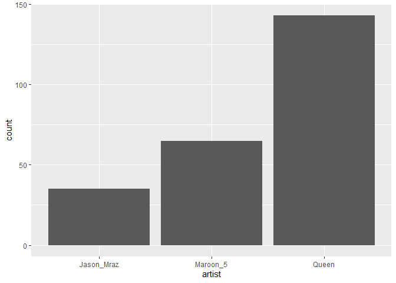
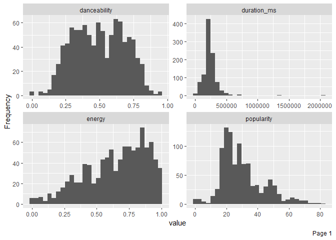
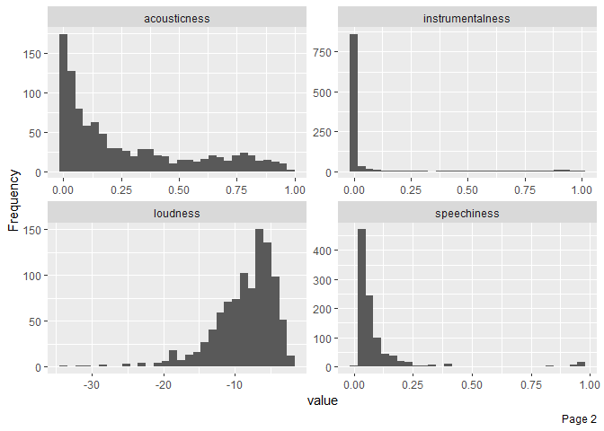
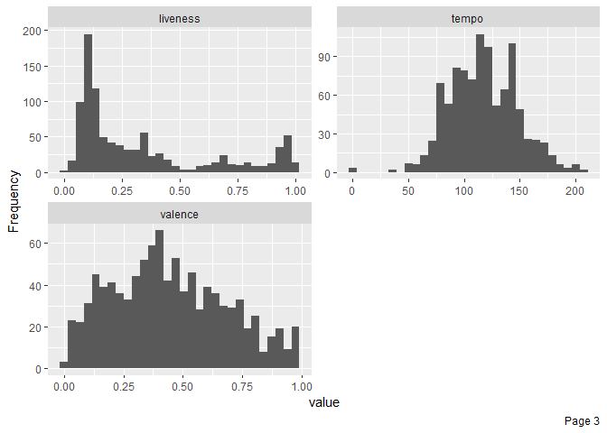
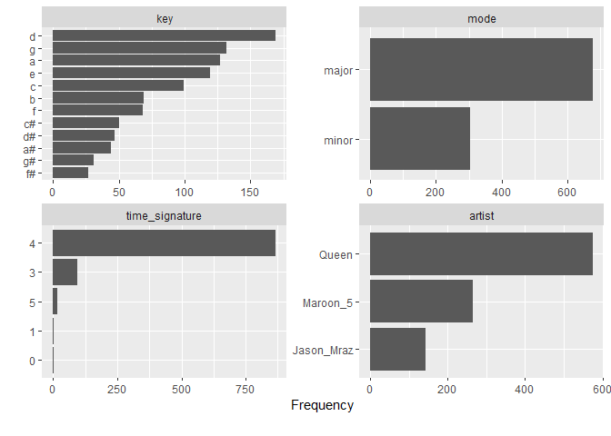
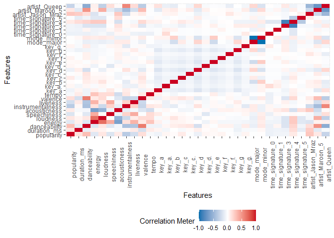
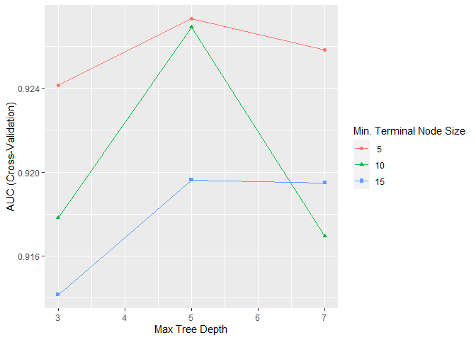
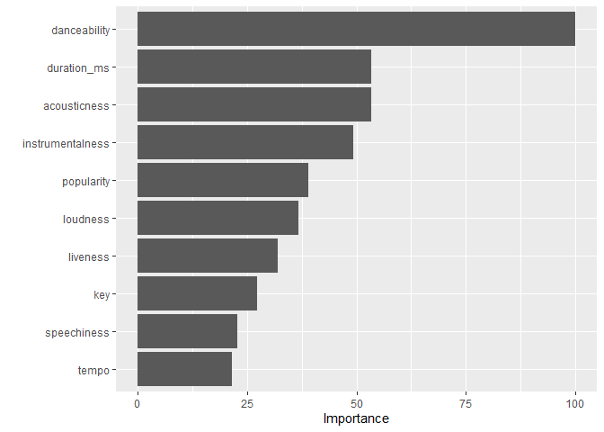

Gradient Boosting
================
Moh. Rosidi
7/22/2020

# Dataset Spotify

Pada artikel ini, kita akan membuat model prediktif pada dataset
`Spotify`. `Spotify` Merupakan dataset yang berisikan daftar lagu dan
fitur audio dari band/penyanyi ternama dunia, antara lain: Queens,
Maroon 5, dan Jason Mraz.

Kolom-kolom pada dataset tersebut, antara lain:

  - `id` : nomor seri lagu
  - `name` : judul lagu
  - `popularity` : tingkat popularitas lagu
  - `album.id` : nomor seri album
  - `album.name` : nama album
  - `album.total_tracks` : total lagu dalam album
  - `track_number` : nomor lagu dalam album
  - `duration_ms` : durasi lagu dalam satuan ms
  - `danceability` : elemen musik termasuk tempo, stabilitas ritme,
    kekuatan beat, dan keteraturan keseluruhan. Nilai 0,0 paling tidak
    bisa digunakan untuk menari dan 1,0 paling bisa digunakan untuk
    menari.
  - `energy` : Energi adalah ukuran dari 0,0 hingga 1,0 dan mewakili
    ukuran persepsi intensitas dan aktivitas. Biasanya, trek yang
    energik terasa cepat, keras, dan berisik. Sebagai contoh, death
    metal memiliki energi tinggi, sedangkan prelude Bach mendapat skor
    rendah pada skala. Fitur perseptual yang berkontribusi pada atribut
    ini meliputi rentang dinamis, persepsi kenyaringan, warna nada,
    onset rate, dan entropi umum.
  - `key` : Kunci dari trek adalah. Integer memetakan ke pitch
    menggunakan notasi Pitch Class standar. Misalnya. 0 = C, 1 = C♯ / D
    ♭, 2 = D, dan seterusnya.
  - `loudness` : Keseluruhan kenyaringan trek dalam desibel (dB). Nilai
    kenyaringan rata-rata di seluruh trek dan berguna untuk
    membandingkan kenyaringan relatif trek. Kenyaringan adalah kualitas
    suara yang merupakan korelasi psikologis utama dari kekuatan fisik
    (amplitudo). Nilai kisaran khas antara -60 dan 0 db.
  - `mode` : Mode menunjukkan modalitas (besar atau kecil) dari suatu
    trek, jenis skala dari mana konten melodinya diturunkan. Mayor
    diwakili oleh 1 dan minor adalah 0.
  - `speechiness` : Speechiness mendeteksi keberadaan kata-kata yang
    diucapkan di trek. Semakin eksklusif pidato-seperti rekaman (mis.
    Acara bincang-bincang, buku audio, puisi), semakin dekat dengan 1.0
    nilai atribut. Nilai di atas 0,66 menggambarkan trek yang mungkin
    seluruhnya terbuat dari kata-kata yang diucapkan. Nilai antara 0,33
    dan 0,66 menggambarkan trek yang mungkin berisi musik dan ucapan,
    baik dalam bagian atau lapisan, termasuk kasus-kasus seperti musik
    rap. Nilai di bawah 0,33 kemungkinan besar mewakili musik dan trek
    non-ucapan lainnya.
  - `acousticness` : Ukuran kepercayaan dari 0,0 hingga 1,0 dari apakah
    trek akustik. 1.0 mewakili kepercayaan tinggi trek adalah akustik.
  - `instrumentalness` : Memprediksi apakah suatu lagu tidak mengandung
    vokal. Suara “Ooh” dan “aah” diperlakukan sebagai instrumen dalam
    konteks ini. Rap atau trek kata yang diucapkan jelas “vokal”.
    Semakin dekat nilai instrumentalness ke 1.0, semakin besar
    kemungkinan trek tidak mengandung konten vokal. Nilai di atas 0,5
    dimaksudkan untuk mewakili trek instrumental, tetapi kepercayaan
    diri lebih tinggi ketika nilai mendekati 1.0.
  - `liveness` : Mendeteksi keberadaan audiens dalam rekaman. Nilai
    liveness yang lebih tinggi mewakili probabilitas yang meningkat
    bahwa trek dilakukan secara langsung. Nilai di atas 0,8 memberikan
    kemungkinan kuat bahwa trek live.
  - `valence` : Ukuran 0,0 hingga 1,0 yang menggambarkan kepositifan
    musik yang disampaikan oleh sebuah trek. Lagu dengan valensi tinggi
    terdengar lebih positif (mis. Bahagia, ceria, gembira), sedangkan
    trek dengan valensi rendah terdengar lebih negatif (mis. Sedih,
    tertekan, marah).
  - `tempo` : Perkiraan tempo trek secara keseluruhan dalam beat per
    menit (BPM). Dalam terminologi musik, tempo adalah kecepatan atau
    kecepatan dari bagian yang diberikan dan diturunkan langsung dari
    durasi beat rata-rata.
  - `time_signature` : An estimated overall time signature of a track.
    The time signature (meter) is a notational convention to specify how
    many beats are in each bar (or measure).

# Persiapan

## Library

Terdapat beberapa paket yang digunakan dalam pembuatan model prediktif
menggunakan *gradient boost*. Paket-paket yang digunakan ditampilkan
sebagai berikut:

``` r
# library pembantu
library(e1071)
library(rsample)
library(recipes)
library(DataExplorer)
library(skimr)
library(DMwR)
library(MLmetrics)
library(tidyverse)

# library model
library(caret) 
library(gbm)


# paket penjelasan model
library(rpart.plot)  
library(vip)
library(pdp)
```

**Paket Pembantu**

1.  `e1071` : paket dengan sejumlah fungsi untuk melakukan *latent class
    analysis, short time Fourier transform, fuzzy clustering, support
    vector machines, shortest path computation, bagged clustering, naive
    Bayes classifier*, dll. Paket ini merupakan paket pembantu dalam
    proses *fitting* sejumlah model pohon
2.  `tidyverse` : kumpulan paket dalam bidang data science
3.  `rsample` : membantu proses *data splitting*
4.  `recipes`: membantu proses data pra-pemrosesan
5.  `DataExplorer` : EDA
6.  `skimr` : membuat ringkasan data
7.  `DMwR` : paket untuk melakukan sampling “smote”

**Paket untuk Membangun Model**

1.  `caret` : berisikan sejumlah fungsi yang dapat merampingkan proses
    pembuatan model regresi dan klasifikasi
2.  `gbm` : membentuk model *gradient boost*

**Paket Interpretasi Model**

1.  `rpart.plot` : visualisasi *decision trees*
2.  `vip` : visualisasi *variable importance*
3.  `pdp` : visualisasi plot ketergantungan parsial

## Import Dataset

Import dataset dilakukan dengan menggunakan fungsi `readr()`. Fungsi ini
digunakan untuk membaca file dengan ekstensi `.csv`.

``` r
spotify <- read_csv("data/spotify.csv")

# data cleaning
key_labs = c('c', 'c#', 'd', 'd#', 'e', 'f', 
             'f#', 'g', 'g#', 'a', 'a#', 'b')
mode_labs = c('minor', 'major')

spotify <- spotify %>%
  select(popularity, duration_ms:artist) %>%
  mutate(time_signature = factor(time_signature),
         key = factor(key, labels = key_labs),
         mode = factor(mode, labels = mode_labs),
         artist = factor(artist, labels = c("Jason_Mraz", "Maroon_5", "Queen" )))
```

# Data Splitting

Proses *data splitting* dilakukan setelah data di import ke dalam
sistem. Hal ini dilakukan untuk memastikan tidak adanya kebocoran data
yang mempengaruhi proses pembuatan model. Data dipisah menjadi dua buah
set, yaitu: *training* dan *test*. Data *training* adalah data yang akan
kita gunakan untuk membentuk model. Seluruh proses sebelum uji model
akan menggunakan data *training*. Proses tersebut, antara lain: EDA,
*feature engineering*, dan validasi silang. Data *test* hanya digunakan
saat kita akan menguji performa model dengan data baru yang belum pernah
dilihat sebelumnya.

Terdapat dua buah jenis sampling pada tahapan *data splitting*, yaitu:

1.  *random sampling* : sampling acak tanpa mempertimbangkan adanya
    strata dalam data
2.  *startified random sampling* : sampling dengan memperhatikan strata
    dalam sebuah variabel.

Dalam proses pembentukan model kali ini, kita akan menggunakan metode
kedua dengan tujuan untuk memperoleh distribusi yang seragam dari
variabel target (`artist`).

``` r
set.seed(123)

split  <- initial_split(spotify, prop = 0.8, strata = "artist")
data_train  <- training(split)
data_test   <- testing(split)
```

Untuk mengecek distribusi dari kedua set data, kita dapat
mevisualisasikan distribusi dari variabel target pada kedua set
tersebut.

``` r
# training set
ggplot(data_train, aes(x = artist)) + 
  geom_bar() 
```

<!-- -->

``` r
# test set
ggplot(data_test, aes(x = artist)) + 
  geom_bar() 
```

<!-- -->

# Analisis Data Eksploratif

Analsiis data eksploratif (EDA) ditujukan untuk mengenali data sebelum
kita menentukan algoritma yang cocok digunakan untuk menganalisa data
lebih lanjut. EDA merupakan sebuah proses iteratif yang secara garis
besar menjawab beberapa pertanyaan umum, seperti:

1.  Bagaimana distribusi data pada masing-masing variabel?
2.  Apakah terdapat asosiasi atau hubungan antar variabel dalam data?

## Ringkasan Data

Terdapat dua buah fungsi yang digunakan dalam membuat ringkasan data,
antara lain:

1.  `glimpse()`: varian dari `str()` untuk mengecek struktur data.
    Fungsi ini menampilkan transpose dari tabel data dengan menambahkan
    informasi, seperti: jenis data dan dimensi tabel.
2.  `skim()` : fungsi dari paket `skimr` untuk membuat ringkasan data
    yang lebih detail dibanding `glimpse()`, seperti: statistika
    deskriptif masing-masing kolom, dan informasi *missing value* dari
    masing-masing kolom.
3.  `plot_missing()` : fungsi untuk memvisualisasikan persentase
    *missing value* pada masing-masing variabel atau kolom data

<!-- end list -->

``` r
glimpse(data_train)
```

    ## Rows: 982
    ## Columns: 15
    ## $ popularity       <dbl> 54, 74, 64, 54, 55, 53, 54, 68, 53, 53, 55, 70, 68...
    ## $ duration_ms      <dbl> 239751, 199849, 190642, 196120, 193603, 183427, 21...
    ## $ danceability     <dbl> 0.526, 0.799, 0.655, 0.759, 0.934, 0.812, 0.604, 0...
    ## $ energy           <dbl> 0.608, 0.597, 0.603, 0.604, 0.564, 0.670, 0.405, 0...
    ## $ key              <fct> a#, f, g#, g#, b, f, a#, c, c, c#, c, g, a, g#, e,...
    ## $ loudness         <dbl> -5.776, -5.131, -5.014, -6.663, -4.806, -4.008, -8...
    ## $ mode             <fct> minor, minor, major, minor, major, major, major, m...
    ## $ speechiness      <dbl> 0.1690, 0.0611, 0.0555, 0.0510, 0.0638, 0.0901, 0....
    ## $ acousticness     <dbl> 0.1270, 0.0788, 0.0959, 0.1410, 0.4610, 0.1720, 0....
    ## $ instrumentalness <dbl> 0.00e+00, 5.66e-06, 0.00e+00, 0.00e+00, 1.84e-05, ...
    ## $ liveness         <dbl> 0.1130, 0.1000, 0.1070, 0.1490, 0.1010, 0.2530, 0....
    ## $ valence          <dbl> 0.3720, 0.4190, 0.4520, 0.4180, 0.5430, 0.6540, 0....
    ## $ tempo            <dbl> 93.311, 110.001, 126.088, 121.096, 115.092, 125.08...
    ## $ time_signature   <fct> 4, 4, 4, 4, 4, 4, 4, 4, 4, 4, 4, 4, 4, 4, 4, 4, 4,...
    ## $ artist           <fct> Maroon_5, Maroon_5, Maroon_5, Maroon_5, Maroon_5, ...

``` r
skim(data_train)
```

|                                                  |             |
| :----------------------------------------------- | :---------- |
| Name                                             | data\_train |
| Number of rows                                   | 982         |
| Number of columns                                | 15          |
| \_\_\_\_\_\_\_\_\_\_\_\_\_\_\_\_\_\_\_\_\_\_\_   |             |
| Column type frequency:                           |             |
| factor                                           | 4           |
| numeric                                          | 11          |
| \_\_\_\_\_\_\_\_\_\_\_\_\_\_\_\_\_\_\_\_\_\_\_\_ |             |
| Group variables                                  | None        |

Data summary

**Variable type: factor**

| skim\_variable  | n\_missing | complete\_rate | ordered | n\_unique | top\_counts                    |
| :-------------- | ---------: | -------------: | :------ | --------: | :----------------------------- |
| key             |          0 |              1 | FALSE   |        12 | d: 169, g: 132, a: 127, e: 119 |
| mode            |          0 |              1 | FALSE   |         2 | maj: 678, min: 304             |
| time\_signature |          0 |              1 | FALSE   |         5 | 4: 866, 3: 93, 5: 17, 0: 3     |
| artist          |          0 |              1 | FALSE   |         3 | Que: 575, Mar: 265, Jas: 142   |

**Variable type: numeric**

| skim\_variable   | n\_missing | complete\_rate |      mean |        sd |      p0 |       p25 |       p50 |       p75 |       p100 | hist  |
| :--------------- | ---------: | -------------: | --------: | --------: | ------: | --------: | --------: | --------: | ---------: | :---- |
| popularity       |          0 |              1 |     29.94 |     13.81 |    0.00 |     20.25 |     27.00 |     36.00 |      82.00 | ▂▇▃▁▁ |
| duration\_ms     |          0 |              1 | 234370.96 | 119727.20 | 4066.00 | 185690.00 | 223633.00 | 270816.50 | 2054800.00 | ▇▁▁▁▁ |
| danceability     |          0 |              1 |      0.50 |      0.19 |    0.00 |      0.34 |      0.50 |      0.65 |       0.95 | ▁▇▇▇▂ |
| energy           |          0 |              1 |      0.65 |      0.24 |    0.01 |      0.48 |      0.70 |      0.84 |       1.00 | ▁▃▅▇▇ |
| loudness         |          0 |              1 |    \-8.63 |      4.26 | \-33.59 |   \-10.81 |    \-7.68 |    \-5.60 |     \-1.87 | ▁▁▁▆▇ |
| speechiness      |          0 |              1 |      0.10 |      0.15 |    0.00 |      0.04 |      0.05 |      0.09 |       0.96 | ▇▁▁▁▁ |
| acousticness     |          0 |              1 |      0.27 |      0.28 |    0.00 |      0.03 |      0.15 |      0.43 |       0.98 | ▇▂▁▂▁ |
| instrumentalness |          0 |              1 |      0.05 |      0.18 |    0.00 |      0.00 |      0.00 |      0.00 |       1.00 | ▇▁▁▁▁ |
| liveness         |          0 |              1 |      0.34 |      0.30 |    0.00 |      0.11 |      0.20 |      0.45 |       1.00 | ▇▃▁▁▂ |
| valence          |          0 |              1 |      0.44 |      0.24 |    0.00 |      0.26 |      0.42 |      0.62 |       0.97 | ▅▇▇▆▃ |
| tempo            |          0 |              1 |    117.65 |     30.19 |    0.00 |     95.00 |    116.05 |    139.96 |     207.55 | ▁▂▇▆▁ |

``` r
plot_missing(data_train)
```

<!-- -->

Berdasarkan ringkasan data yang dihasilkan, diketahui dimensi data
sebesar 982 baris dan 15 kolom. Dengan rincian masing-masing kolom,
yaitu: 4 kolom dengan jenis data factor dan 11 kolom dengan jenis data
numeric. Informasi lain yang diketahui adalah seluruh kolom dalam data
tidak memiliki *missing value*.

## Variasi

Variasi dari tiap variabel dapat divisualisasikan dengan menggunakan
histogram (numerik) dan baplot (kategorikal).

``` r
plot_histogram(data_train, ncol = 2L, nrow = 2L)
```

<!-- --><!-- --><!-- -->

``` r
plot_bar(data_train, ncol = 2L, nrow = 2L)
```

<!-- -->

Berdasarkan hasil visualisasi diperoleh bahwa sebagian besar variabel
numerik memiliki distribusi yang tidak simetris. Sedangkan pada variabel
kategorikal diketahui bahwa seluruh variabel memiliki variasi yang tidak
mendekati nol atau nol. Untuk mengetahui variabel dengan variasi
mendekati nol atau nol, dapat menggunakan sintaks berikut:

``` r
nzvar <- nearZeroVar(data_train, saveMetrics = TRUE) %>% 
  rownames_to_column() %>% 
  filter(nzv)
nzvar
```

    ## [1] rowname       freqRatio     percentUnique zeroVar       nzv          
    ## <0 rows> (or 0-length row.names)

## Kovarian

Kovarian dapat dicek melalui visualisasi *heatmap* koefisien korelasi.

``` r
plot_correlation(data_train, 
                 cor_args = list(method = "spearman"))
```

<!-- -->

# Target and Feature Engineering

*Data preprocessing* dan *engineering* mengacu pada proses penambahan,
penghapusan, atau transformasi data. Waktu yang diperlukan untuk
memikirkan identifikasi kebutuhan *data engineering* dapat berlangsung
cukup lama dan proprsinya akan menjadi yang terbesar dibandingkan
analisa lainnya. Hal ini disebabkan karena kita perlu untuk memahami
data apa yang akan kita oleh atau diinputkan ke dalam model.

Untuk menyederhanakan proses *feature engineerinh*, kita harus
memikirkannya sebagai sebuah *blueprint* dibanding melakukan tiap
tugasnya secara satu persatu. Hal ini membantu kita dalam dua hal:

1.  Berpikir secara berurutan
2.  Mengaplikasikannya secara tepat selama proses *resampling*

## Urutan Langkah-Langkah Feature Engineering

Memikirkan *feature engineering* sebagai sebuah *blueprint* memaksa kita
untuk memikirkan urutan langkah-langkah *preprocessing* data. Meskipun
setiap masalah mengharuskan kita untuk memikirkan efek *preprocessing*
berurutan, ada beberapa saran umum yang harus kita pertimbangkan:

  - Jika menggunakan log atau transformasi Box-Cox, jangan memusatkan
    data terlebih dahulu atau melakukan operasi apa pun yang dapat
    membuat data menjadi tidak positif. Atau, gunakan transformasi
    Yeo-Johnson sehingga kita tidak perlu khawatir tentang hal ini.
  - *One-hot* atau *dummy encoding* biasanya menghasilkan data jarang
    (*sparse*) yang dapat digunakan oleh banyak algoritma secara
    efisien. Jika kita menstandarisasikan data tersebut, kita akan
    membuat data menjadi padat (*dense*) dan kita kehilangan efisiensi
    komputasi. Akibatnya, sering kali lebih disukai untuk standardisasi
    fitur numerik kita dan kemudian *one-hot/dummy endode*.
  - Jika kila mengelompokkan kategori (*lumping*) yang jarang terjadi
    secara bersamaan, lakukan sebelum *one-hot/dummy endode*.
  - Meskipun kita dapat melakukan prosedur pengurangan dimensi pada
    fitur-fitur kategorikal, adalah umum untuk melakukannya terutama
    pada fitur numerik ketika melakukannya untuk tujuan rekayasa fitur.

Sementara kebutuhan proyek kita mungkin beragam, berikut ini adalah
urutan langkah-langkah potensial yang disarankan untuk sebagian besar
masalah:

1.  Filter fitur dengan varians nol (*zero varians*) atau hampir nol
    (*near zero varians*).
2.  Lakukan imputasi jika diperlukan.
3.  Normalisasi untuk menyelesaikan *skewness* fitur numerik.
4.  Standardisasi fitur numerik (*centering* dan *scaling*).
5.  Lakukan reduksi dimensi (mis., PCA) pada fitur numerik.
6.  *one-hot/dummy endode* pada fitur kategorikal.

## Meletakkan Seluruh Proses Secara Bersamaan

Untuk mengilustrasikan bagaimana proses ini bekerja bersama menggunakan
R, mari kita lakukan penilaian ulang sederhana pada set data `ames` yang
kita gunakan dan lihat apakah beberapa *feature engineering* sederhana
meningkatkan kemampuan prediksi model kita. Tapi pertama-tama, kita
berkenalan dengat paket `recipe`.

Paket `recipe` ini memungkinkan kita untuk mengembangkan *bluprint
feature engineering* secara berurutan. Gagasan di balik `recipe` mirip
dengan `caret :: preProcess()` di mana kita ingin membuat *blueprint
preprocessing* tetapi menerapkannya nanti dan dalam setiap resample.

Ada tiga langkah utama dalam membuat dan menerapkan rekayasa fitur
dengan `recipe`:

1.  `recipe()`: tempat kita menentukan langkah-langkah rekayasa fitur
    untuk membuat *blueprint*.
2.  `prep()`: memperkirakan parameter *feature engineering* berdasarkan
    data *training*.
3.  `bake()`: terapkan *blueprint* untuk data baru.

<!-- end list -->

``` r
blueprint <- recipe(artist ~ ., data = data_train) %>%
  step_nzv(all_nominal())  %>%
  
  # 2. imputation to missing value
  # step_medianimpute("<Num_Var_name>") %>% # median imputation
  # step_meanimpute("<Num_var_name>") %>% # mean imputation
  # step_modeimpute("<Cat_var_name>") %>% # mode imputation
  # step_bagimpute("<Var_name>") %>% # random forest imputation
  # step_knnimpute("<Var_name>") %>% # knn imputation
  
  # Label encoding for categorical variable with many classes 
  # step_integer("<Cat_var_name>") %>%
  
  # 3. normalize to resolve numeric feature skewness
  step_center(all_numeric(), -all_outcomes()) %>%
  
  # 4. standardize (center and scale) numeric feature
  step_scale(all_numeric(), -all_outcomes()) 
```

Selanjutnya, *blueprint* yang telah dibuat dilakukan *training* pada
data *training*. Perlu diperhatikan, kita tidak melakukan proses
*training* pada data *test* untuk mencegah *data leakage*.

``` r
prepare <- prep(blueprint, training = data_train)
prepare
```

    ## Data Recipe
    ## 
    ## Inputs:
    ## 
    ##       role #variables
    ##    outcome          1
    ##  predictor         14
    ## 
    ## Training data contained 982 data points and no missing data.
    ## 
    ## Operations:
    ## 
    ## Sparse, unbalanced variable filter removed no terms [trained]
    ## Centering for popularity, duration_ms, danceability, ... [trained]
    ## Scaling for popularity, duration_ms, danceability, ... [trained]

Langkah terakhir adalah mengaplikasikan *blueprint* pada data *training*
dan *test* menggunakan fungsi `bake()`.

``` r
baked_train <- bake(prepare, new_data = data_train)
baked_test <- bake(prepare, new_data = data_test)
baked_train
```

    ## # A tibble: 982 x 15
    ##    popularity duration_ms danceability  energy key   loudness mode  speechiness
    ##         <dbl>       <dbl>        <dbl>   <dbl> <fct>    <dbl> <fct>       <dbl>
    ##  1       1.74      0.0449        0.161 -0.173  a#      0.669  minor      0.471 
    ##  2       3.19     -0.288         1.61  -0.220  f       0.821  minor     -0.234 
    ##  3       2.47     -0.365         0.844 -0.194  g#      0.848  major     -0.270 
    ##  4       1.74     -0.319         1.39  -0.190  g#      0.461  minor     -0.300 
    ##  5       1.82     -0.341         2.32  -0.360  b       0.897  major     -0.216 
    ##  6       1.67     -0.426         1.68   0.0904 f       1.08   major     -0.0444
    ##  7       1.74     -0.200         0.574 -1.03   a#      0.0820 major     -0.243 
    ##  8       2.76     -0.160         0.611 -0.793  c       0.369  major     -0.211 
    ##  9       1.67      3.80          1.34   0.698  c       0.455  minor     -0.173 
    ## 10       1.67     -0.0152        1.51  -0.0880 c#      0.772  major     -0.196 
    ## # ... with 972 more rows, and 7 more variables: acousticness <dbl>,
    ## #   instrumentalness <dbl>, liveness <dbl>, valence <dbl>, tempo <dbl>,
    ## #   time_signature <fct>, artist <fct>

# Boosting

*Gradient boosted machines* (GBMs) adalah algoritma *machine learning*
yang sangat populer yang telah terbukti berhasil di banyak domain dan
merupakan salah satu metode utama untuk memenangkan kompetisi Kaggle.
Sementara *random forest* membangun ansambel pohon independen yang
dalam, GBM membangun ansambel pohon berturut-turut yang dangkal dan
lemah dengan setiap pohon belajar dan meningkatkan pada sebelumnya.
Ketika digabungkan, banyak pohon berturut-turut yang lemah ini
menghasilkan “komite” yang kuat yang seringkali sulit dikalahkan dengan
algoritma lain.

Beberapa model *supervised machine learning* tersusun atas model
prediksi tunggal (yaitu [regresi
linier](http://uc-r.github.io/linear_regression), [penalized
model](http://uc-r.github.io/regularized_regression), [naive
bayes](http://uc-r.github.io/naive_bayes), [support vector
machines](http://uc-r.github.io/svm)). Atau, pendekatan lain seperti
[bagging](http://uc-r.github.io/regression_trees) dan [random
forest](http://uc-r.github.io/random_forests) dibangun di atas gagasan
membangun ansambel model di mana masing-masing model memprediksi hasil
dan kemudian hasil prediksi dirata-rata (regresi) atau menggunakan
sistem voting terbanyak (klasifikasi). Keluarga metode *boosting*
didasarkan pada strategi konstruktif yang berbeda dari pembentukan
ansambel.

Gagasan utama *boosting* adalah menambahkan model-model baru ke ansambel
secara berurutan. Pada setiap iterasi tertentu, model pembelajaran
dasar-lemah yang baru dilatih sehubungan dengan kesalahan seluruh
rangkaian yang dipelajari sejauh ini.


Mari kita bahas masing-masing komponen kalimat sebelumnya dengan lebih
detail karena mereka penting untuk diketahui.

**Base-learning models**: *Boosting* adalah kerangka kerja yang secara
iteratif meningkatkan model pembelajaran yang lemah. Banyak aplikasi
*gradient boosting* memungkinkan kita untuk “memasukkan” berbagai kelas
*weak learner* sesuai keinginan kita Namun dalam praktiknya, algoritma
yang ditingkatkan hampir selalu menggunakan *decision trees* sebagai
*base learner*-nya. Konsekuensinya, tutorial ini akan membahas
*boosting* dalam konteks pohon regresi atau klasifikasi.

**Training weak models**: *Weak model* adalah model yang tingkat
kesalahannya hanya sedikit lebih baik daripada menebak secara acak.
Gagasan di balik *boosting* adalah bahwa setiap model berurutan
membangun model lemah sederhana untuk sedikit memperbaiki kesalahan yang
tersisa. Sehubungan dengan *decision trees*, pohon dangkal mewakili
*weak learner*. Umumnya, pohon dengan hanya 1-6 pohon digunakan.
Menggabungkan banyak *weak model* (versus yang kuat) memiliki beberapa
manfaat:

  - *Speed*: Membangun model lemah adalah murah secara proses komputasi
  - *Accuracy improvement*: *Weak model* memungkinkan algoritma untuk
    belajar secara lambat; melakukan penyesuaian kecil di area baru yang
    kinerjanya tidak baik. Secara umum, pendekatan statistik *weak
    learner* cenderung berkinerja baik.
  - *Avoids overfitting*: Karena hanya membuat perbaikan bertahap kecil
    dengan masing-masing model dalam ansambel, ini memungkinkan kita
    untuk menghentikan proses pembelajaran segera setelah overfitting
    telah terdeteksi (biasanya dengan menggunakan validasi silang).

**Sequential training with respect to errors**: *Boosted trees*
ditumbuhkan secara berurutan; setiap pohon ditumbuhkan menggunakan
informasi dari pohon yang sebelumnya ditumbuhkan. Algoritma dasar untuk
*boosted model* dapat digeneralisasi ke yang berikut ini di mana \(x\)
mewakili fitur data dan variabel \(y\) mewakili respons:

1.  Buat *decision trees* pada data: \(F_1\left(x\right)=y\)
2.  Buat *decision trees* selanjutnya menggunakan data residual dari
    *decision trees* sebelumnya:
    \(h_1\left(x\right)=y-F_1\left(x\right)\).
3.  Tambahkan pohon baru tersebut ke dalam algoritma:
    \(F_2\left(x\right)= F_1\left(x\right)+h_1\left(x\right)\)
4.  Buat *decision trees* baru pada residu \(F_2\):
    \(h_2\left(x\right)=y - F_2\left(x\right)\)
5.  Tambahkan *decision trees* tersebut ke dalam algoritma:
    \(F_3\left(x\right)=F_2\left(x\right)+h_2\left(x\right)\)
6.  Lanjutkan proses tersebut hingga sebuah mekanisme (biasanya hasil
    validasi silang) menyatakan proses tersebut harus berhenti.

## Gradient Descent

Banyak algoritma, termasuk pohon keputusan, fokus pada meminimalkan
residu dan oleh karena itu, menekankan fungsi *loss* MSE. Algoritma yang
dibahas pada bagian sebelumnya menguraikan pendekatan *sequantial
decision trees fitting* untuk meminimalkan kesalahan. Pendekatan khusus
ini adalah bagaimana meningkatkan gradien meminimalkan fungsi *loss*
*mean squared error* (MSE). Namun, seringkali kita ingin fokus pada
fungsi *loss* lainnya seperti *mean absolute error* (MAE) atau untuk
dapat menerapkan metode ini ke masalah klasifikasi dengan fungsi *loss*
seperti *deviance*. *Gradient boosting machine* berasal dari fakta bahwa
prosedur ini dapat digeneralisasi ke fungsi *loss* selain MSE.

*Gradient Boosting* dianggap sebagai algoritma *gradient descent*.
*Gradient descent* adalah algoritma optimasi yang sangat umum yang mampu
menemukan solusi optimal untuk berbagai masalah. Gagasan umum *gradient
descent* adalah mengubah parameter secara iteratif untuk meminimalkan
fungsi *cost*. Misalkan kita adalah pemain ski menuruni bukit dan
berpacu dengan teman kita. Strategi yang baik untuk mengalahkan teman
kita ke bawah adalah mengambil jalan setapak dengan kemiringan paling
curam. Inilah yang dilakukan oleh *gradient descent* - ini mengukur
gradient lokal dari fungsi *loss* (*cost*) untuk sekumpulan parameter
(\(\Theta\)) dan mengambil langkah-langkah ke arah gradien yang menurun.
Setelah gradien nol, kita telah mencapai minimum.


Gradient descent dapat dilakukan pada setiap fungsi *loss* yang dapat
diturunkan (*differentiable*). Akibatnya, ini memungkinkan GBM untuk
mengoptimalkan berbagai fungsi *loss* seperti yang diinginkan. Parameter
penting dalam *gradient descent* adalah *step size* yang ditentukan oleh
*learning rate*. Jika *learning rate* terlalu kecil, maka algoritma akan
mengambil banyak iterasi untuk menemukan minimum. Di sisi lain, jika
tingkat pembelajaran terlalu tinggi, kita mungkin melewati batas minimum
dan berakhir lebih jauh daripada saat kita mulai.


Selain itu, tidak semua fungsi *cost* bersifat *covex* (berbentuk
mangkuk). Mungkin ada *local minimas*, *plateaus*, dan medan tidak
teratur lainnya dari fungsi *loss* yang membuat sulit menemukan minimum
global. *Stochastic gradient descent* dapat membantu kita mengatasi
masalah ini dengan mengambil sampel sebagian kecil dari pengamatan
pelatihan (biasanya tanpa penggantian) dan menumbuhkan pohon berikutnya
menggunakan subsampel itu. Ini membuat algoritma lebih cepat tetapi
sifat stokastik dari random sampling juga menambahkan beberapa sifat
acak dalam menuruni gradien fungsi *loss*. Meskipun keacakan ini tidak
memungkinkan algoritma untuk menemukan minimum global absolut, itu
sebenarnya dapat membantu algoritma melompat keluar dari minimum lokal
dan mematikan *plateus* dan mendekati minimum global.


## Kelebihan dan Kekurangan

**Kelebihan**

  - Seringkali memberikan akurasi prediksi yang tidak dapat dikalahkan.
  - Banyak fleksibilitas - dapat mengoptimalkan berbagai fungsi *loss*
    dan menyediakan beberapa opsi *hyperparameter tuning* yang membuat
    fungsi ini sangat fleksibel.
  - Tidak diperlukan pra-pemrosesan data - seringkali berfungsi dengan
    baik dengan nilai kategorikal dan numerik sebagaimana adanya.
  - Menangani data yang hilang - tidak diperlukan imputasi.

**Kekurangan**

  - GBM akan terus ditingkatkan untuk meminimalkan semua kesalahan. Ini
    bisa terlalu menekankan outlier dan menyebabkan overfitting. Harus
    menggunakan validasi silang untuk menetralisir.
  - Mahal secara komputasi - GBM sering membutuhkan banyak pohon (\>
    1000) yang bisa menghabiskan banyak waktu dan memori.
  - Fleksibilitas yang tinggi menghasilkan banyak parameter yang
    berinteraksi dan sangat memengaruhi perilaku pendekatan (jumlah
    iterasi, kedalaman pohon, parameter regularisasi, dll.). Ini
    membutuhkan pencarian kotak besar selama penyetelan.
  - Kurang dapat diartikan meskipun hal ini mudah diatasi dengan
    berbagai alat (variable importance, partial dependence plots, LIME,
    dll.).

## Validasi Silang dan Parameter Tuning

Lngkah pertama yang perlu dilakukan untuk *training* GBM adalah menyetel
parameter validasi silang dan *hyperparameter tuning*. Pengaturan kedua
hal tersebut ditampilkan pada sintaks berikut:

``` r
# spesifikasi metode validasi silang
cv <-trainControl(
  # possible value: "boot", "boot632", "optimism_boot", "boot_all", "cv", 
  #                 "repeatedcv", "LOOCV", "LGOCV"
  method = "cv", 
  number = 5, 
  # repeats = 5,
  classProbs = TRUE, 
  sampling = "smote",
  summaryFunction = multiClassSummary,
  savePredictions = TRUE,
  allowParallel = TRUE
)
```

``` r
hyper_grid <- expand.grid(
  n.trees = 1000,
  shrinkage = 0.01,
  interaction.depth = c(3, 5, 7),
  n.minobsinnode = c(5, 10, 15)
)
```

Proses training dilakukan dengen menyetel argumen `method` sebagai `gbm`
yang mendandakan kita akan melakukan *training* GBM.

``` r
system.time(
model_fit_cv <- train(
  blueprint,
  data = data_train,
  method = "gbm",
  trControl = cv,
  tuneGrid = hyper_grid,
  verbose = FALSE,
  metric = "AUC"
  )
)
```

    ##    user  system elapsed 
    ##  270.76    2.17  352.76

``` r
model_fit_cv
```

    ## Stochastic Gradient Boosting 
    ## 
    ## 982 samples
    ##  14 predictor
    ##   3 classes: 'Jason_Mraz', 'Maroon_5', 'Queen' 
    ## 
    ## Recipe steps: nzv, center, scale 
    ## Resampling: Cross-Validated (5 fold) 
    ## Summary of sample sizes: 786, 786, 786, 785, 785 
    ## Addtional sampling using SMOTE
    ## 
    ## Resampling results across tuning parameters:
    ## 
    ##   interaction.depth  n.minobsinnode  logLoss    AUC        prAUC      Accuracy 
    ##   3                   5              0.6282126  0.9241541  0.8158781  0.7627422
    ##   3                  10              0.6679475  0.9178148  0.8053656  0.7433751
    ##   3                  15              0.8129433  0.9141540  0.8002466  0.6801616
    ##   5                   5              0.6096263  0.9273149  0.8179872  0.7779965
    ##   5                  10              0.6596342  0.9269107  0.8177956  0.7616648
    ##   5                  15              0.6707395  0.9196296  0.8106782  0.7719103
    ##   7                   5              0.6241441  0.9258275  0.8128173  0.7871646
    ##   7                  10              0.8073168  0.9169361  0.8017368  0.7290428
    ##   7                  15              0.8091876  0.9194962  0.8083229  0.7351134
    ##   Kappa      Mean_F1    Mean_Sensitivity  Mean_Specificity  Mean_Pos_Pred_Value
    ##   0.6165958  0.7311868  0.7866634         0.8906476         0.7474554          
    ##   0.5927480  0.7183974  0.7770052         0.8837918         0.7421916          
    ##   0.5123111  0.6580322  0.7233147         0.8608276         0.7133629          
    ##   0.6351609  0.7392860  0.7834416         0.8955194         0.7533355          
    ##   0.6166495  0.7300707  0.7843170         0.8911987         0.7425949          
    ##   0.6290187  0.7385967  0.7837990         0.8926629         0.7547369          
    ##   0.6469578  0.7526956  0.7950431         0.8960651         0.7583723          
    ##   0.5725480  0.6988654  0.7538749         0.8779261         0.7352867          
    ##   0.5824944  0.7035595  0.7561610         0.8818603         0.7438324          
    ##   Mean_Neg_Pred_Value  Mean_Precision  Mean_Recall  Mean_Detection_Rate
    ##   0.8697178            0.7474554       0.7866634    0.2542474          
    ##   0.8609977            0.7421916       0.7770052    0.2477917          
    ##   0.8392143            0.7133629       0.7233147    0.2267205          
    ##   0.8763265            0.7533355       0.7834416    0.2593322          
    ##   0.8682998            0.7425949       0.7843170    0.2538883          
    ##   0.8745824            0.7547369       0.7837990    0.2573034          
    ##   0.8788204            0.7583723       0.7950431    0.2623882          
    ##   0.8556577            0.7352867       0.7538749    0.2430143          
    ##   0.8605046            0.7438324       0.7561610    0.2450378          
    ##   Mean_Balanced_Accuracy
    ##   0.8386555             
    ##   0.8303985             
    ##   0.7920711             
    ##   0.8394805             
    ##   0.8377578             
    ##   0.8382309             
    ##   0.8455541             
    ##   0.8159005             
    ##   0.8190106             
    ## 
    ## Tuning parameter 'n.trees' was held constant at a value of 1000
    ## 
    ## Tuning parameter 'shrinkage' was held constant at a value of 0.01
    ## AUC was used to select the optimal model using the largest value.
    ## The final values used for the model were n.trees = 1000, interaction.depth =
    ##  5, shrinkage = 0.01 and n.minobsinnode = 5.

Proses *training* berlangsung selama 3333.327 detik. Terdapat 9 buah
model yang dibentuk, dimana model dengan **RMSE** terkecil memiliki
nilai *hyperparameter* `shrinkage = 0,01`, `n.trees = 6000`,
`interaction.depth = 7` dan `n.minobsinnode = 15`. Nilai **RMSE** model
tersebut adalah sebagai berikut:

``` r
rmse <- model_fit_cv$results %>%
  arrange(-AUC) %>%
  slice(1) %>%
  select(AUC) %>% pull()

rmse
```

    ## [1] 0.9273149

Nilai **RMSE** rata-rata yang diperoleh sedikit lebih baik dibandingkan
model *random forest*.

Visualisasi nilai *hyperparameter* terhadap **RMSE** model ditampilkan
sebagai berikut:

``` r
ggplot(model_fit_cv)
```

<!-- -->

## Model Akhir

Model terbaik dapat diekstrak dengan sintaks berikut:

``` r
model_fit <- model_fit_cv$finalModel
```

Performa model dalam memprediksi data baru dapat dilihat berdasarkan
\*\*RMSE\* pada data *test*.

``` r
pred_test <- predict(model_fit, n.trees = model_fit$n.trees,
                     baked_test, type = "response")
pred_test <-
  as.data.frame(pred_test) %>%
  rowid_to_column("row") %>%
  pivot_longer(cols = matches("Jas|Mar|Quee"), names_to = "artist", values_to = "prob") %>%
  mutate(artist = str_remove_all(artist, ".1000")) %>%
  dplyr::group_by(row) %>%
  slice(which.max(prob)) %>%
  mutate(artist = factor(artist, 
                             labels = c("Jason_Mraz", "Maroon_5", "Queen" ))) %>%
  dplyr::select(artist) %>%
  pull()

## confusion matrix
confusionMatrix(pred_test, baked_test$artist)
```

    ## Confusion Matrix and Statistics
    ## 
    ##             Reference
    ## Prediction   Jason_Mraz Maroon_5 Queen
    ##   Jason_Mraz         29       18    52
    ##   Maroon_5            4       46     4
    ##   Queen               2        1    87
    ## 
    ## Overall Statistics
    ##                                           
    ##                Accuracy : 0.6667          
    ##                  95% CI : (0.6036, 0.7256)
    ##     No Information Rate : 0.5885          
    ##     P-Value [Acc > NIR] : 0.007448        
    ##                                           
    ##                   Kappa : 0.4979          
    ##                                           
    ##  Mcnemar's Test P-Value : 2.563e-12       
    ## 
    ## Statistics by Class:
    ## 
    ##                      Class: Jason_Mraz Class: Maroon_5 Class: Queen
    ## Sensitivity                     0.8286          0.7077       0.6084
    ## Specificity                     0.6635          0.9551       0.9700
    ## Pos Pred Value                  0.2929          0.8519       0.9667
    ## Neg Pred Value                  0.9583          0.8995       0.6340
    ## Prevalence                      0.1440          0.2675       0.5885
    ## Detection Rate                  0.1193          0.1893       0.3580
    ## Detection Prevalence            0.4074          0.2222       0.3704
    ## Balanced Accuracy               0.7460          0.8314       0.7892

## Interpretasi Fitur

Untuk melihat fitur yang paling berpengaruh dalam model, kita dapat
menggunakan *variable importance plot*.

``` r
vi <- vip(model_fit_cv, num_features = 10)
vi
```

<!-- -->
