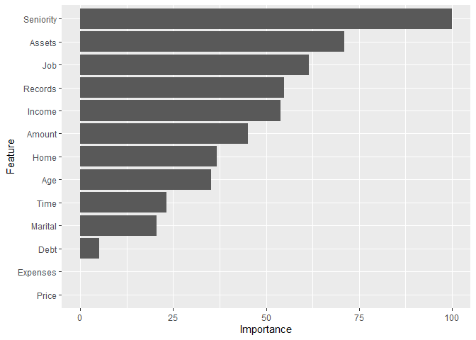

K-Nearest Neighbors
================
Moh. Rosidi
7/23/2020

# Dataset Credit Data

Pada artikel ini, kita akan membuat model prediktif menggunakan dataset
`credit_data` dari paket `modeldata`. Dataset ini berasal dari website
Dr. Lluís A. Belanche Muñoz yang diambil dari github Dr. Gaston Sanchez.
Untuk info lebih lanjut terkait data kunjungi
\<<https://github.com/gastonstat/CreditScoring>,
<http://bit.ly/2kkBFrk>\>

# Persiapan

## Library

Terdapat beberapa paket yang digunakan dalam pembuatan model prediktif
menggunakan *knn*. Paket-paket yang digunakan ditampilkan sebagai berikut:

``` r
# library pembantu
library(doParallel)
library(tidyverse)
library(rsample)
library(recipes)
library(DataExplorer)
library(skimr)
library(DMwR)
library(modeldata)

# library model
library(caret)

# paket penjelasan model
library(vip)
library(pdp)
```

**Paket Pembantu**

1.  `doParallel` : parallel processing di `R`
2.  `tidyverse` : kumpulan paket dalam bidang data science
3.  `rsample` : membantu proses *data splitting*
4.  `recipes`: membantu proses data pra-pemrosesan
5.  `DataExplorer` : EDA
6.  `skimr` : membuat ringkasan data
7.  `DMwR` : paket untuk melakukan sampling “smote”
8.  `modeldata` : kumpulan dataset untuk membuat model *machine
    learning*

**Paket untuk Membangun Model**

1.  `caret` : berisikan sejumlah fungsi yang dapat merampingkan proses
    pembuatan model regresi dan klasifikasi

**Paket Interpretasi Model**

2.  `vip` : visualisasi *variable importance*
3.  `pdp` : visualisasi plot ketergantungan parsial

## Import Dataset

Dataset `credit_data` berada dalam paket `modeldata`. Untuk
mengimportnya, gunakan fungsi `data()`.

``` r
data("credit_data")
```

# Data Splitting

Proses *data splitting* dilakukan setelah data di import ke dalam
sistem. Hal ini dilakukan untuk memastikan tidak adanya kebocoran data
yang mempengaruhi proses pembuatan model. Data dipisah menjadi dua buah
set, yaitu: *training* dan *test*. Data *training* adalah data yang akan
kita gunakan untuk membentuk model. Seluruh proses sebelum uji model
akan menggunakan data *training*. Proses tersebut, antara lain: EDA,
*feature engineering*, dan validasi silang. Data *test* hanya digunakan
saat kita akan menguji performa model dengan data baru yang belum pernah
dilihat sebelumnya.

Terdapat dua buah jenis sampling pada tahapan *data splitting*, yaitu:

1.  *random sampling* : sampling acak tanpa mempertimbangkan adanya
    strata dalam data
2.  *startified random sampling* : sampling dengan memperhatikan strata
    dalam sebuah variabel.

Dalam proses pembentukan model kali ini, kita akan menggunakan metode
kedua dengan tujuan untuk memperoleh distribusi yang seragam dari
variabel target (`Status`).

``` r
set.seed(123)

split  <- initial_split(credit_data, prop = 0.8, strata = "Status")
data_train  <- training(split)
data_test   <- testing(split)
```

Untuk mengecek distribusi dari kedua set data, kita dapat
mevisualisasikan distribusi dari variabel target pada kedua set
tersebut.

``` r
# training set
ggplot(data_train, aes(x = Status)) + 
  geom_bar() 
```

<!-- -->

``` r
# test set
ggplot(data_test, aes(x = Status)) + 
  geom_bar() 
```

<!-- -->

# Analisis Data Eksploratif

Analsiis data eksploratif (EDA) ditujukan untuk mengenali data sebelum
kita menentukan algoritma yang cocok digunakan untuk menganalisa data
lebih lanjut. EDA merupakan sebuah proses iteratif yang secara garis
besar menjawab beberapa pertanyaan umum, seperti:

1.  Bagaimana distribusi data pada masing-masing variabel?
2.  Apakah terdapat asosiasi atau hubungan antar variabel dalam data?

## Ringkasan Data

Terdapat dua buah fungsi yang digunakan dalam membuat ringkasan data,
antara lain:

1.  `glimpse()`: varian dari `str()` untuk mengecek struktur data.
    Fungsi ini menampilkan transpose dari tabel data dengan menambahkan
    informasi, seperti: jenis data dan dimensi tabel.
2.  `skim()` : fungsi dari paket `skimr` untuk membuat ringkasan data
    yang lebih detail dibanding `glimpse()`, seperti: statistika
    deskriptif masing-masing kolom, dan informasi *missing value* dari
    masing-masing kolom.
3.  `plot_missing()` : fungsi untuk memvisualisasikan persentase
    *missing value* pada masing-masing variabel atau kolom data

<!-- end list -->

``` r
glimpse(data_train)
```

    ## Rows: 3,565
    ## Columns: 14
    ## $ Status    <fct> good, bad, good, good, good, good, good, bad, good, good,...
    ## $ Seniority <int> 9, 10, 0, 0, 1, 29, 9, 0, 8, 19, 0, 0, 15, 33, 0, 2, 5, 1...
    ## $ Home      <fct> rent, owner, rent, rent, owner, owner, parents, parents, ...
    ## $ Time      <int> 60, 36, 60, 36, 60, 60, 12, 48, 60, 36, 18, 24, 24, 24, 4...
    ## $ Age       <int> 30, 46, 24, 26, 36, 44, 27, 41, 30, 37, 21, 68, 52, 68, 3...
    ## $ Marital   <fct> married, married, single, single, married, married, singl...
    ## $ Records   <fct> no, yes, no, no, no, no, no, no, no, no, yes, no, no, no,...
    ## $ Job       <fct> freelance, freelance, fixed, fixed, fixed, fixed, fixed, ...
    ## $ Expenses  <int> 73, 90, 63, 46, 75, 75, 35, 90, 75, 75, 35, 75, 35, 65, 4...
    ## $ Income    <int> 129, 200, 182, 107, 214, 125, 80, 80, 199, 170, 50, 131, ...
    ## $ Assets    <int> 0, 3000, 2500, 0, 3500, 10000, 0, 0, 5000, 3500, 0, 4162,...
    ## $ Debt      <int> 0, 0, 0, 0, 0, 0, 0, 0, 2500, 260, 0, 0, 0, 2000, 0, 0, 0...
    ## $ Amount    <int> 800, 2000, 900, 310, 650, 1600, 200, 1200, 1500, 600, 400...
    ## $ Price     <int> 846, 2985, 1325, 910, 1645, 1800, 1093, 1468, 1650, 940, ...

``` r
skim(data_train)
```

|                                                  |             |
| :----------------------------------------------- | :---------- |
| Name                                             | data\_train |
| Number of rows                                   | 3565        |
| Number of columns                                | 14          |
| \_\_\_\_\_\_\_\_\_\_\_\_\_\_\_\_\_\_\_\_\_\_\_   |             |
| Column type frequency:                           |             |
| factor                                           | 5           |
| numeric                                          | 9           |
| \_\_\_\_\_\_\_\_\_\_\_\_\_\_\_\_\_\_\_\_\_\_\_\_ |             |
| Group variables                                  | None        |

Data summary

**Variable type: factor**

| skim\_variable | n\_missing | complete\_rate | ordered | n\_unique | top\_counts                             |
| :------------- | ---------: | -------------: | :------ | --------: | :-------------------------------------- |
| Status         |          0 |              1 | FALSE   |         2 | goo: 2561, bad: 1004                    |
| Home           |          6 |              1 | FALSE   |         6 | own: 1681, ren: 777, par: 622, oth: 263 |
| Marital        |          1 |              1 | FALSE   |         5 | mar: 2573, sin: 804, sep: 103, wid: 56  |
| Records        |          0 |              1 | FALSE   |         2 | no: 2957, yes: 608                      |
| Job            |          2 |              1 | FALSE   |         4 | fix: 2265, fre: 796, par: 367, oth: 135 |

**Variable type: numeric**

| skim\_variable | n\_missing | complete\_rate |    mean |       sd |  p0 |  p25 |  p50 |  p75 |   p100 | hist  |
| :------------- | ---------: | -------------: | ------: | -------: | --: | ---: | ---: | ---: | -----: | :---- |
| Seniority      |          0 |           1.00 |    7.94 |     8.15 |   0 |    2 |    5 |   12 |     48 | ▇▃▁▁▁ |
| Time           |          0 |           1.00 |   46.32 |    14.69 |   6 |   36 |   48 |   60 |     72 | ▁▂▅▃▇ |
| Age            |          0 |           1.00 |   36.97 |    11.07 |  18 |   28 |   35 |   45 |     68 | ▇▇▆▃▁ |
| Expenses       |          0 |           1.00 |   55.33 |    19.53 |  35 |   35 |   48 |   70 |    173 | ▇▂▁▁▁ |
| Income         |        312 |           0.91 |  142.18 |    81.05 |   6 |   90 |  125 |  172 |    959 | ▇▂▁▁▁ |
| Assets         |         37 |           0.99 | 5301.80 | 11166.28 |   0 |    0 | 3000 | 6000 | 300000 | ▇▁▁▁▁ |
| Debt           |         15 |           1.00 |  360.30 |  1324.55 |   0 |    0 |    0 |    0 |  30000 | ▇▁▁▁▁ |
| Amount         |          0 |           1.00 | 1036.59 |   469.54 | 100 |  700 | 1000 | 1300 |   5000 | ▇▆▁▁▁ |
| Price          |          0 |           1.00 | 1461.75 |   595.82 | 105 | 1128 | 1403 | 1690 |   6900 | ▇▆▁▁▁ |

``` r
plot_missing(data_train)
```

<!-- -->

Berdasarkan ringkasan data yang dihasilkan, diketahui dimensi data
sebesar 3565 baris dan 14 kolom. Dengan rincian masing-masing kolom,
yaitu: 5 kolom dengan jenis data factor dan 9 kolom dengan jenis data
numeric. Informasi lain yang diketahui adalah beberapa kolom dalam data
memiliki *missing value*.

## Variasi

Variasi dari tiap variabel dapat divisualisasikan dengan menggunakan
histogram (numerik) dan baplot (kategorikal).

``` r
plot_histogram(data_train, ncol = 2L, nrow = 2L)
```

<!-- --><!-- --><!-- -->

``` r
plot_bar(data_train, ncol = 2L, nrow = 2L)
```

<!-- --><!-- -->

Berdasarkan hasil visualisasi diperoleh bahwa sebagian besar variabel
numerik memiliki distribusi yang tidak simetris. Sedangkan pada variabel
kategorikal diketahui bahwa seluruh variabel memiliki variasi yang tidak
mendekati nol atau nol. Untuk mengetahui variabel dengan variasi
mendekati nol atau nol, dapat menggunakan sintaks berikut:

``` r
nzvar <- nearZeroVar(data_train, saveMetrics = TRUE) %>% 
  rownames_to_column() %>% 
  filter(nzv)
nzvar
```

    ##   rowname freqRatio percentUnique zeroVar  nzv
    ## 1    Debt     58.54      4.684432   FALSE TRUE

## Kovarian

Kovarian dapat dicek melalui visualisasi *heatmap* koefisien korelasi.

``` r
plot_correlation(data_train, 
                 cor_args = list(method = "spearman",
                                 use = "pairwise.complete.obs"))
```

<!-- -->

# Target and Feature Engineering

*Data preprocessing* dan *engineering* mengacu pada proses penambahan,
penghapusan, atau transformasi data. Waktu yang diperlukan untuk
memikirkan identifikasi kebutuhan *data engineering* dapat berlangsung
cukup lama dan proprsinya akan menjadi yang terbesar dibandingkan
analisa lainnya. Hal ini disebabkan karena kita perlu untuk memahami
data apa yang akan kita oleh atau diinputkan ke dalam model.

Untuk menyederhanakan proses *feature engineering*, kita harus
memikirkannya sebagai sebuah *blueprint* dibanding melakukan tiap
tugasnya secara satu persatu. Hal ini membantu kita dalam dua hal:

1.  Berpikir secara berurutan
2.  Mengaplikasikannya secara tepat selama proses *resampling*

## Urutan Langkah-Langkah Feature Engineering

Memikirkan *feature engineering* sebagai sebuah *blueprint* memaksa kita
untuk memikirkan urutan langkah-langkah *preprocessing* data. Meskipun
setiap masalah mengharuskan kita untuk memikirkan efek *preprocessing*
berurutan, ada beberapa saran umum yang harus kita pertimbangkan:

  - Jika menggunakan log atau transformasi Box-Cox, jangan memusatkan
    data terlebih dahulu atau melakukan operasi apa pun yang dapat
    membuat data menjadi tidak positif. Atau, gunakan transformasi
    Yeo-Johnson sehingga kita tidak perlu khawatir tentang hal ini.
  - *One-hot* atau *dummy encoding* biasanya menghasilkan data jarang
    (*sparse*) yang dapat digunakan oleh banyak algoritma secara
    efisien. Jika kita menstandarisasikan data tersebut, kita akan
    membuat data menjadi padat (*dense*) dan kita kehilangan efisiensi
    komputasi. Akibatnya, sering kali lebih disukai untuk standardisasi
    fitur numerik kita dan kemudian *one-hot/dummy endode*.
  - Jika kila mengelompokkan kategori (*lumping*) yang jarang terjadi
    secara bersamaan, lakukan sebelum *one-hot/dummy endode*.
  - Meskipun kita dapat melakukan prosedur pengurangan dimensi pada
    fitur-fitur kategorikal, adalah umum untuk melakukannya terutama
    pada fitur numerik ketika melakukannya untuk tujuan rekayasa fitur.

Sementara kebutuhan proyek kita mungkin beragam, berikut ini adalah
urutan langkah-langkah potensial yang disarankan untuk sebagian besar
masalah:

1.  Filter fitur dengan varians nol (*zero varians*) atau hampir nol
    (*near zero varians*).
2.  Lakukan imputasi jika diperlukan.
3.  Normalisasi untuk menyelesaikan *skewness* fitur numerik.
4.  Standardisasi fitur numerik (*centering* dan *scaling*).
5.  Lakukan reduksi dimensi (mis., PCA) pada fitur numerik.
6.  *one-hot/dummy endode* pada fitur kategorikal.

## Meletakkan Seluruh Proses Secara Bersamaan

Untuk mengilustrasikan bagaimana proses ini bekerja bersama menggunakan
R, mari kita lakukan penilaian ulang sederhana pada set data `ames` yang
kita gunakan dan lihat apakah beberapa *feature engineering* sederhana
meningkatkan kemampuan prediksi model kita. Tapi pertama-tama, kita
berkenalan dengat paket `recipe`.

Paket `recipe` ini memungkinkan kita untuk mengembangkan *bluprint
feature engineering* secara berurutan. Gagasan di balik `recipe` mirip
dengan `caret :: preProcess()` di mana kita ingin membuat *blueprint
preprocessing* tetapi menerapkannya nanti dan dalam setiap resample.

Ada tiga langkah utama dalam membuat dan menerapkan rekayasa fitur
dengan `recipe`:

1.  `recipe()`: tempat kita menentukan langkah-langkah rekayasa fitur
    untuk membuat *blueprint*.
2.  `prep()`: memperkirakan parameter *feature engineering* berdasarkan
    data *training*.
3.  `bake()`: terapkan *blueprint* untuk data baru.

<!-- end list -->

``` r
blueprint <- recipe(Status ~ ., data = data_train) %>%
  step_nzv(all_nominal())  %>%
  
  # 2. imputation to missing value
  # step_medianimpute("<Num_Var_name>") %>% # median imputation
  # step_meanimpute("<Num_var_name>") %>% # mean imputation
  # step_modeimpute("<Cat_var_name>") %>% # mode imputation
  step_bagimpute(all_predictors()) %>% # random forest imputation
  # step_knnimpute("<Var_name>") %>% # knn imputation
  
  # Label encoding for categorical variable with many classes 
  # step_integer("<Cat_var_name>") %>%
  
  # 3. normalize 
  step_normalize(all_numeric()) %>%
  
  # 4. dummy encoding
  step_dummy(all_nominal(), -all_outcomes())

blueprint
```

    ## Data Recipe
    ## 
    ## Inputs:
    ## 
    ##       role #variables
    ##    outcome          1
    ##  predictor         13
    ## 
    ## Operations:
    ## 
    ## Sparse, unbalanced variable filter on all_nominal()
    ## Bagged tree imputation for all_predictors()
    ## Centering and scaling for all_numeric()
    ## Dummy variables from all_nominal(), -all_outcomes()

Selanjutnya, *blueprint* yang telah dibuat dilakukan *training* pada
data *training*. Perlu diperhatikan, kita tidak melakukan proses
*training* pada data *test* untuk mencegah *data leakage*.

``` r
prepare <- prep(blueprint, training = data_train)
prepare
```

    ## Data Recipe
    ## 
    ## Inputs:
    ## 
    ##       role #variables
    ##    outcome          1
    ##  predictor         13
    ## 
    ## Training data contained 3565 data points and 336 incomplete rows. 
    ## 
    ## Operations:
    ## 
    ## Sparse, unbalanced variable filter removed no terms [trained]
    ## Bagged tree imputation for Seniority, Home, Time, Age, Marital, ... [trained]
    ## Centering and scaling for Seniority, Time, Age, Expenses, Income, ... [trained]
    ## Dummy variables from Home, Marital, Records, Job [trained]

Langkah terakhir adalah mengaplikasikan *blueprint* pada data *training*
dan *test* menggunakan fungsi `bake()`.

``` r
baked_train <- bake(prepare, new_data = data_train)
baked_test <- bake(prepare, new_data = data_test)
baked_train
```

    ## # A tibble: 3,565 x 23
    ##    Seniority   Time      Age Expenses Income  Assets    Debt Amount   Price
    ##        <dbl>  <dbl>    <dbl>    <dbl>  <dbl>   <dbl>   <dbl>  <dbl>   <dbl>
    ##  1   0.130    0.931 -0.629      0.905 -0.175 -0.479  -0.272  -0.504 -1.03  
    ##  2   0.253   -0.702  0.816      1.78   0.734 -0.209  -0.272   2.05   2.56  
    ##  3  -0.974    0.931 -1.17       0.393  0.504 -0.254  -0.272  -0.291 -0.230 
    ##  4  -0.974   -0.702 -0.990     -0.478 -0.457 -0.479  -0.272  -1.55  -0.926 
    ##  5  -0.851    0.931 -0.0872     1.01   0.914 -0.164  -0.272  -0.823  0.308 
    ##  6   2.58     0.931  0.635      1.01  -0.227  0.419  -0.272   1.20   0.568 
    ##  7   0.130   -2.34  -0.900     -1.04  -0.803 -0.479  -0.272  -1.78  -0.619 
    ##  8  -0.974    0.114  0.364      1.78  -0.803 -0.479  -0.272   0.348  0.0105
    ##  9   0.00747  0.931 -0.629      1.01   0.721 -0.0298  1.62    0.987  0.316 
    ## 10   1.36    -0.702  0.00307    1.01   0.350 -0.164  -0.0755 -0.930 -0.876 
    ## # ... with 3,555 more rows, and 14 more variables: Status <fct>,
    ## #   Home_other <dbl>, Home_owner <dbl>, Home_parents <dbl>, Home_priv <dbl>,
    ## #   Home_rent <dbl>, Marital_married <dbl>, Marital_separated <dbl>,
    ## #   Marital_single <dbl>, Marital_widow <dbl>, Records_yes <dbl>,
    ## #   Job_freelance <dbl>, Job_others <dbl>, Job_partime <dbl>

# K-Nearest Neighbors

K-nearest Neighbors (KNN) adalah algoritma yang sangat sederhana di mana
setiap pengamatan diprediksi berdasarkan “kesamaan” dengan pengamatan
lainnya. Tidak seperti kebanyakan metode lainnya, KNN adalah algoritma
berbasis memori dan tidak dapat diringkas oleh model bentuk tertutup.
Ini berarti sampel pelatihan diperlukan saat run-time dan prediksi
dibuat langsung dari hubungan sampel. Akibatnya, KNN juga dikenal
sebagai *lazy learners* (Cunningham dan Delany 2007) dan dapat menjadi
tidak efisien secara komputasi. Namun, KNN telah berhasil dalam sejumlah
besar masalah bisnis (Jiang et al. (2012) dan Mccord dan Chuah (2011))
dan berguna untuk tujuan preprocessing juga.

## Validasi Silang dan Parameter Tuning

Langkah pertama yang perlu dilakukan dalam melakukan kegiatan validasi
silang adalah menentukan spesifikasi parameter validasi silang. Fungsi
`trainControl()` merupakan fungsi yang dapat kita gunakan untu menetukan
metode validasi silang yang dilakukan dan spesifikasi terkait metode
validasi silang yang digunakan.

``` r
cl <- makePSOCKcluster(3)
registerDoParallel(cl)

# spesifikasi metode validasi silang
cv <- trainControl(
  # possible value: "boot", "boot632", "optimism_boot", "boot_all", "cv", 
  #                 "repeatedcv", "LOOCV", "LGOCV"
  method = "cv", 
  number = 4, 
  # repeats = 5,
  classProbs = TRUE,
  sampling = "smote",
  savePredictions = TRUE,
  summaryFunction = twoClassSummary,
  allowParallel = TRUE
)
```

Selanjutnya spesifikasikan *hyperparameter* yang akan di *tuning*.

``` r
## Construct grid of hyperparameter values
hyper_grid <- expand.grid(k = seq(2, 30, by = 2))
```

Setelah parameter *tuning* dan validasi silang dispesifikasikan, proses
training dilakukan menggunakan fungsi `train()`.

``` r
system.time(
model_fit_cv <- train(
  blueprint, 
  data = data_train, 
  method = "knn", 
  trControl = cv, 
  tuneGrid = hyper_grid,
  metric = "ROC"
  )
)
```

    ##    user  system elapsed 
    ##   45.73   17.17 2404.59

``` r
stopCluster(cl)

model_fit_cv
```

    ## k-Nearest Neighbors 
    ## 
    ## 3565 samples
    ##   13 predictor
    ##    2 classes: 'bad', 'good' 
    ## 
    ## Recipe steps: nzv, bagimpute, normalize, dummy 
    ## Resampling: Cross-Validated (4 fold) 
    ## Summary of sample sizes: 2673, 2674, 2674, 2674 
    ## Addtional sampling using SMOTE
    ## 
    ## Resampling results across tuning parameters:
    ## 
    ##   k   ROC        Sens       Spec     
    ##    2  0.6608505  0.4750996  0.7692278
    ##    4  0.6830330  0.4252988  0.8235039
    ##    6  0.7085312  0.4302789  0.8438085
    ##    8  0.7236513  0.4601594  0.8383398
    ##   10  0.7277628  0.4252988  0.8516234
    ##   12  0.7307900  0.4093625  0.8613769
    ##   14  0.7443502  0.4243028  0.8703643
    ##   16  0.7407545  0.4382470  0.8645055
    ##   18  0.7496499  0.4392430  0.8727093
    ##   20  0.7482731  0.4392430  0.8613811
    ##   22  0.7517703  0.4322709  0.8680236
    ##   24  0.7498209  0.4153386  0.8789580
    ##   26  0.7445914  0.4312749  0.8613866
    ##   28  0.7509812  0.4183267  0.8641173
    ##   30  0.7502033  0.4223108  0.8738781
    ## 
    ## ROC was used to select the optimal model using the largest value.
    ## The final value used for the model was k = 22.

Proses *training* berlangsung selama 178.379 detik dengan 72 buah model
yang terbentuk. Model terbaik dipilih berdasarkan nilai **ROC**
terbesar. Berdasarkan kriteria tersebut model yang terpilih adalalah
model yang memiliki nilai `k` = 22. Nilai **ROC** rata-rata model
terbaik adalah sebagai berikut:

``` r
roc <- model_fit_cv$results %>%
  arrange(-ROC) %>%
  slice(1) %>%
  select(ROC) %>%
  pull()
roc
```

    ## [1] 0.7517703

Berdasarkan hasil yang diperoleh, luas area dibawah kurva **ROC**
sebesar 0.7517703 Berdasarkan hasil tersebut, model klasifikasi yang
terbentuk lebih baik dibanding menebak secara acak.

Visualisasi hubungan antar parameter dan **ROC** ditampilkan pada gambar
berikut:

``` r
# visualisasi
ggplot(model_fit_cv)
```

<!-- -->

## Model Akhir

Model terbaik dari hasil proses validasi silang selanjutnya diekstrak.
Hal ini berguna untuk mengurangi ukuran model yang tersimpan. Secara
default fungsi `train()` akan mengembalikan model dengan performa
terbaik. Namun, terdapat sejumlah komponen lain dalam objek yang
terbentuk, seperti: hasil prediksi, ringkasan training, dll. yang
membuat ukuran objek menjadi besar. Untuk menguranginya, kita perlu
mengambil objek model final dari objek hasil validasi silang.

``` r
model_fit <- model_fit_cv$finalModel
```

Ringkasan model final *KNN* ditampilkan menggunakan sintaks berikut:

``` r
model_fit
```

    ## 22-nearest neighbor model
    ## Training set outcome distribution:
    ## 
    ##  bad good 
    ## 3012 4016

Model yang dihasilkan selanjutnya dapat kita uji lagi menggunakan data
baru. Berikut adalah perhitungan nilai **Akurasi** model pada data
*test*.

``` r
pred_test <- predict(model_fit, baked_test %>% select(!Status),
                     type = "class")


## RMSE
cm <- confusionMatrix(pred_test, baked_test$Status)
cm
```

    ## Confusion Matrix and Statistics
    ## 
    ##           Reference
    ## Prediction bad good
    ##       bad  119   93
    ##       good 131  546
    ##                                           
    ##                Accuracy : 0.748           
    ##                  95% CI : (0.7181, 0.7763)
    ##     No Information Rate : 0.7188          
    ##     P-Value [Acc > NIR] : 0.02759         
    ##                                           
    ##                   Kappa : 0.3465          
    ##                                           
    ##  Mcnemar's Test P-Value : 0.01343         
    ##                                           
    ##             Sensitivity : 0.4760          
    ##             Specificity : 0.8545          
    ##          Pos Pred Value : 0.5613          
    ##          Neg Pred Value : 0.8065          
    ##              Prevalence : 0.2812          
    ##          Detection Rate : 0.1339          
    ##    Detection Prevalence : 0.2385          
    ##       Balanced Accuracy : 0.6652          
    ##                                           
    ##        'Positive' Class : bad             
    ## 

Berdasarkan hasil evaluasi diperoleh nilai akurasi sebesar 0.7480315

## Interpretasi Fitur

Untuk mengetahui variabel yang paling berpengaruh secara global terhadap
hasil prediksi model, kita dapat menggunakan plot *variable importance*.

``` r
vi <- varImp(model_fit_cv, num_features = 10) %>% ggplot()
vi
```

<!-- -->

Berdasarkan terdapat 4 buah variabel yang berpengaruh besar terhadap
prediksi yang dihasilkan oleh model, antara lain: Seniority,
Job\_partime, Assets, Income. Untuk melihat efek dari masing-masing
variabel terhadap variabel respon, kita dapat menggunakan *partial
dependence plot*.

``` r
pred.fun <- function(object, newdata) {
  Yes <- mean(predict(object, newdata, type = "prob")$Yes)
  as.data.frame(Yes)
}

p1 <- pdp::partial(model_fit_cv, pred.var = vi$data %>% rownames_to_column("ID") %>% .[1,1], pred.fun = pred.fun) %>% 
  autoplot() 

p2 <- pdp::partial(model_fit_cv, pred.var = "Job", pred.fun = pred.fun) %>% 
  autoplot()

p3 <- pdp::partial(model_fit_cv, pred.var = vi$data %>% rownames_to_column("ID") %>% .[3,1], pred.fun = pred.fun) %>% 
  autoplot()
  

p4 <- pdp::partial(model_fit_cv, pred.var = vi$data %>% rownames_to_column("ID") %>% .[4,1], pred.fun = pred.fun) %>% 

  
    autoplot()

grid.arrange(p1, p2, p3, p4, nrow = 2)
```

<!-- -->
