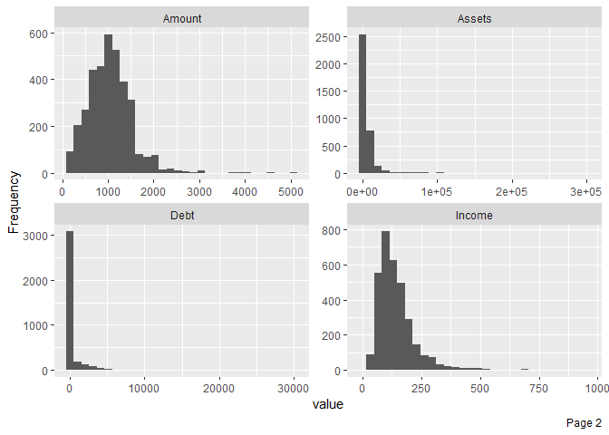
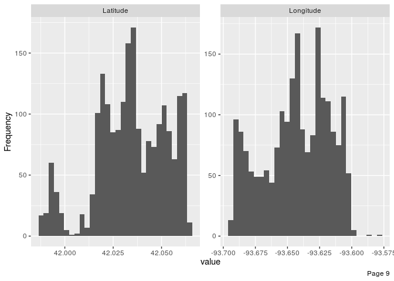
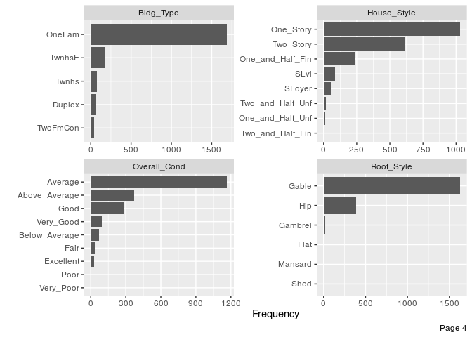
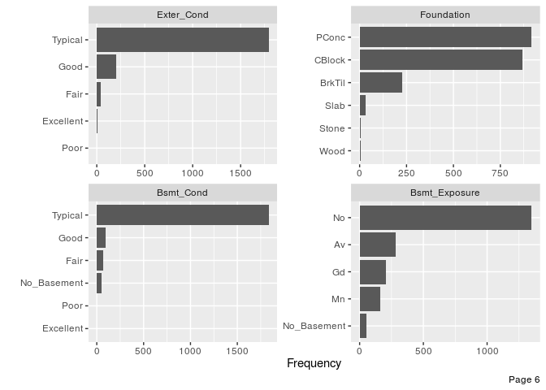
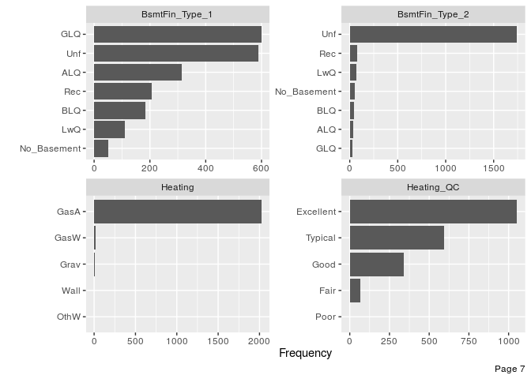
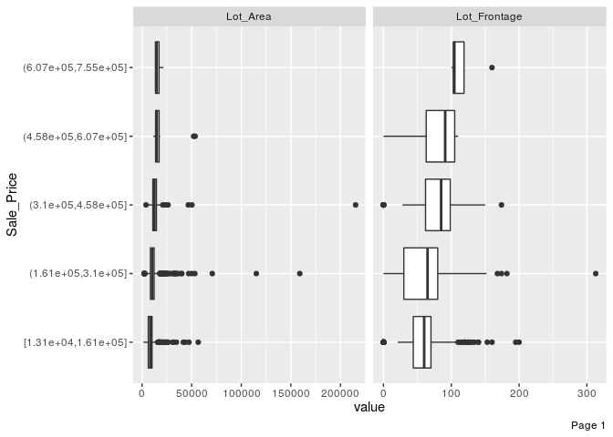
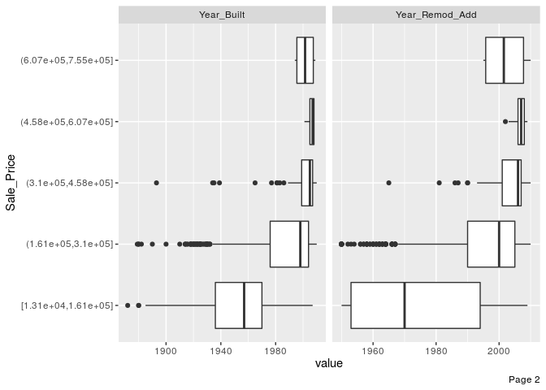
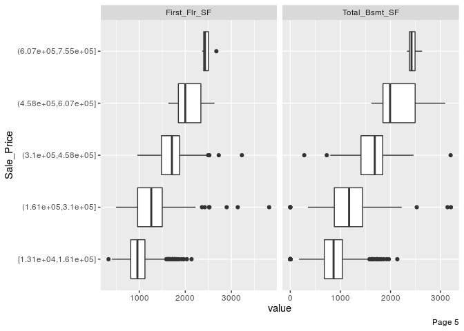
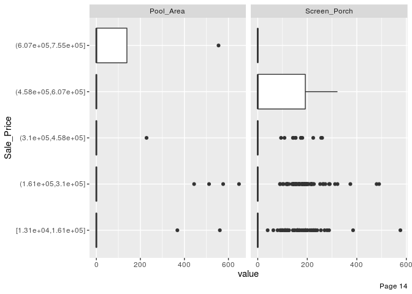

Regularized Regression
================
Moh. Rosidi
7/24/2020

# Dataset Ames

Sebuah dataset terkait data properti yang ada di Ames IA. Dataset ini
memiliki 82 variabel dan 2930 baris. Untuk informasi lebih lanjut
terkait dataset ini, kunjungin tautan berikut:

  - <https://ww2.amstat.org/publications/jse/v19n3/decock/DataDocumentation.txt>
  - <http://ww2.amstat.org/publications/jse/v19n3/decock.pdf>

# Persiapan

## Library

Terdapat beberapa paket yang digunakan dalam pembuatan model prediktif
menggunakan *tree based algorithm*. Paket-paket ditampilkan sebagai
berikut:

``` r
# library pembantu
library(tidyverse)
library(rsample)
library(recipes)
library(DataExplorer)
library(skimr)
library(modeldata)

# library model
library(caret)
library(glmnet)

# paket penjelasan model
library(vip)
library(pdp)
```

**Paket Pembantu**

1.  `tidyverse` : kumpulan paket dalam bidang data science
2.  `rsample` : membantu proses *data splitting*
3.  `recipes`: membantu proses data pra-pemrosesan
4.  `DataExplorer` : EDA
5.  `skimr` : membuat ringkasan data
6.  `modeldata` : kumpulan dataset untuk membuat model *machine
    learning*

**Paket untuk Membangun Model**

1.  `caret` : berisikan sejumlah fungsi yang dapat merampingkan proses
    pembuatan model regresi dan klasifikasi
2.  `earth` : berisikan fungsi untuk membuat model *regularized
    regression*

**Paket Interpretasi Model**

1.  `vip` : visualisasi *variable importance*
2.  `pdp` : visualisasi plot ketergantungan parsial

## Import Dataset

Import dataset dilakukan dengan menggunakan fungsi `data()`. Fungsi ini
digunakan untuk mengambil data yang ada dalam sebuah paket.

``` r
data("ames")
```

# Data Splitting

Proses *data splitting* dilakukan setelah data di import ke dalam
sistem. Hal ini dilakukan untuk memastikan tidak adanya kebocoran data
yang mempengaruhi proses pembuatan model. Data dipisah menjadi dua buah
set, yaitu: *training* dan *test*. Data *training* adalah data yang akan
kita gunakan untuk membentuk model. Seluruh proses sebelum uji model
akan menggunakan data *training*. Proses tersebut, antara lain: EDA,
*feature engineering*, dan validasi silang. Data *test* hanya digunakan
saat kita akan menguji performa model dengan data baru yang belum pernah
dilihat sebelumnya.

Terdapat dua buah jenis sampling pada tahapan *data splitting*, yaitu:

1.  *random sampling* : sampling acak tanpa mempertimbangkan adanya
    strata dalam data
2.  *startified random sampling* : sampling dengan memperhatikan strata
    dalam sebuah variabel.

Dalam proses pembentukan model kali ini, kita akan menggunakan metode
kedua dengan tujuan untuk memperoleh distribusi yang seragam dari
variabel target (`Sale_Price`).

``` r
set.seed(123)

split  <- initial_split(ames, prop = 0.7, strata = "Sale_Price")
ames_train  <- training(split)
ames_test   <- testing(split)
```

Untuk mengecek distribusi dari kedua set data, kita dapat
mevisualisasikan distribusi dari variabel target pada kedua set
tersebut.

``` r
# training set
ggplot(ames_train, aes(x = Sale_Price)) + 
  geom_density() 
```

<!-- -->

``` r
# test set
ggplot(ames_test, aes(x = Sale_Price)) + 
  geom_density() 
```

<!-- -->

# Analisis Data Eksploratif

Analsiis data eksploratif (EDA) ditujukan untuk mengenali data sebelum
kita menentukan algoritma yang cocok digunakan untuk menganalisa data
lebih lanjut. EDA merupakan sebuah proses iteratif yang secara garis
besar menjawab beberapa pertanyaan umum, seperti:

1.  Bagaimana distribusi data pada masing-masing variabel?
2.  Apakah terdapat asosiasi atau hubungan antar variabel dalam data?

## Ringkasan Data

Terdapat dua buah fungsi yang digunakan dalam membuat ringkasan data,
antara lain:

1.  `glimpse()`: varian dari `str()` untuk mengecek struktur data.
    Fungsi ini menampilkan transpose dari tabel data dengan menambahkan
    informasi, seperti: jenis data dan dimensi tabel.
2.  `skim()` : fungsi dari paket `skimr` untuk membuat ringkasan data
    yang lebih detail dibanding `glimpse()`, seperti: statistika
    deskriptif masing-masing kolom, dan informasi *missing value* dari
    masing-masing kolom.
3.  `plot_missing()` : fungsi untuk memvisualisasikan persentase
    *missing value* pada masing-masing variabel atau kolom data

<!-- end list -->

``` r
glimpse(ames_train)
```

    ## Rows: 2,053
    ## Columns: 74
    ## $ MS_SubClass        <fct> One_Story_1946_and_Newer_All_Styles, One_Story_194…
    ## $ MS_Zoning          <fct> Residential_Low_Density, Residential_High_Density,…
    ## $ Lot_Frontage       <dbl> 141, 80, 81, 78, 41, 39, 60, 75, 63, 85, 47, 152, …
    ## $ Lot_Area           <int> 31770, 11622, 14267, 9978, 4920, 5389, 7500, 10000…
    ## $ Street             <fct> Pave, Pave, Pave, Pave, Pave, Pave, Pave, Pave, Pa…
    ## $ Alley              <fct> No_Alley_Access, No_Alley_Access, No_Alley_Access,…
    ## $ Lot_Shape          <fct> Slightly_Irregular, Regular, Slightly_Irregular, S…
    ## $ Land_Contour       <fct> Lvl, Lvl, Lvl, Lvl, Lvl, Lvl, Lvl, Lvl, Lvl, Lvl, …
    ## $ Utilities          <fct> AllPub, AllPub, AllPub, AllPub, AllPub, AllPub, Al…
    ## $ Lot_Config         <fct> Corner, Inside, Corner, Inside, Inside, Inside, In…
    ## $ Land_Slope         <fct> Gtl, Gtl, Gtl, Gtl, Gtl, Gtl, Gtl, Gtl, Gtl, Gtl, …
    ## $ Neighborhood       <fct> North_Ames, North_Ames, North_Ames, Gilbert, Stone…
    ## $ Condition_1        <fct> Norm, Feedr, Norm, Norm, Norm, Norm, Norm, Norm, N…
    ## $ Condition_2        <fct> Norm, Norm, Norm, Norm, Norm, Norm, Norm, Norm, No…
    ## $ Bldg_Type          <fct> OneFam, OneFam, OneFam, OneFam, TwnhsE, TwnhsE, On…
    ## $ House_Style        <fct> One_Story, One_Story, One_Story, Two_Story, One_St…
    ## $ Overall_Cond       <fct> Average, Above_Average, Above_Average, Above_Avera…
    ## $ Year_Built         <int> 1960, 1961, 1958, 1998, 2001, 1995, 1999, 1993, 19…
    ## $ Year_Remod_Add     <int> 1960, 1961, 1958, 1998, 2001, 1996, 1999, 1994, 19…
    ## $ Roof_Style         <fct> Hip, Gable, Hip, Gable, Gable, Gable, Gable, Gable…
    ## $ Roof_Matl          <fct> CompShg, CompShg, CompShg, CompShg, CompShg, CompS…
    ## $ Exterior_1st       <fct> BrkFace, VinylSd, Wd Sdng, VinylSd, CemntBd, Cemnt…
    ## $ Exterior_2nd       <fct> Plywood, VinylSd, Wd Sdng, VinylSd, CmentBd, Cment…
    ## $ Mas_Vnr_Type       <fct> Stone, None, BrkFace, BrkFace, None, None, None, N…
    ## $ Mas_Vnr_Area       <dbl> 112, 0, 108, 20, 0, 0, 0, 0, 0, 0, 603, 0, 350, 0,…
    ## $ Exter_Cond         <fct> Typical, Typical, Typical, Typical, Typical, Typic…
    ## $ Foundation         <fct> CBlock, CBlock, CBlock, PConc, PConc, PConc, PConc…
    ## $ Bsmt_Cond          <fct> Good, Typical, Typical, Typical, Typical, Typical,…
    ## $ Bsmt_Exposure      <fct> Gd, No, No, No, Mn, No, No, No, No, Gd, Gd, Av, Av…
    ## $ BsmtFin_Type_1     <fct> BLQ, Rec, ALQ, GLQ, GLQ, GLQ, Unf, Unf, Unf, GLQ, …
    ## $ BsmtFin_SF_1       <dbl> 2, 6, 1, 3, 3, 3, 7, 7, 7, 3, 1, 3, 3, 4, 1, 2, 3,…
    ## $ BsmtFin_Type_2     <fct> Unf, LwQ, Unf, Unf, Unf, Unf, Unf, Unf, Unf, Unf, …
    ## $ BsmtFin_SF_2       <dbl> 0, 144, 0, 0, 0, 0, 0, 0, 0, 0, 0, 0, 0, 0, 163, 0…
    ## $ Bsmt_Unf_SF        <dbl> 441, 270, 406, 324, 722, 415, 994, 763, 789, 663, …
    ## $ Total_Bsmt_SF      <dbl> 1080, 882, 1329, 926, 1338, 1595, 994, 763, 789, 1…
    ## $ Heating            <fct> GasA, GasA, GasA, GasA, GasA, GasA, GasA, GasA, Ga…
    ## $ Heating_QC         <fct> Fair, Typical, Typical, Excellent, Excellent, Exce…
    ## $ Central_Air        <fct> Y, Y, Y, Y, Y, Y, Y, Y, Y, Y, Y, Y, Y, Y, Y, Y, Y,…
    ## $ Electrical         <fct> SBrkr, SBrkr, SBrkr, SBrkr, SBrkr, SBrkr, SBrkr, S…
    ## $ First_Flr_SF       <int> 1656, 896, 1329, 926, 1338, 1616, 1028, 763, 789, …
    ## $ Second_Flr_SF      <int> 0, 0, 0, 678, 0, 0, 776, 892, 676, 0, 1589, 672, 0…
    ## $ Gr_Liv_Area        <int> 1656, 896, 1329, 1604, 1338, 1616, 1804, 1655, 146…
    ## $ Bsmt_Full_Bath     <dbl> 1, 0, 0, 0, 1, 1, 0, 0, 0, 1, 1, 0, 1, 0, 1, 0, 1,…
    ## $ Bsmt_Half_Bath     <dbl> 0, 0, 0, 0, 0, 0, 0, 0, 0, 0, 0, 0, 0, 0, 0, 0, 0,…
    ## $ Full_Bath          <int> 1, 1, 1, 2, 2, 2, 2, 2, 2, 1, 3, 2, 1, 1, 2, 2, 2,…
    ## $ Half_Bath          <int> 0, 0, 1, 1, 0, 0, 1, 1, 1, 1, 1, 0, 1, 0, 0, 0, 0,…
    ## $ Bedroom_AbvGr      <int> 3, 2, 3, 3, 2, 2, 3, 3, 3, 2, 4, 4, 1, 2, 3, 3, 3,…
    ## $ Kitchen_AbvGr      <int> 1, 1, 1, 1, 1, 1, 1, 1, 1, 1, 1, 1, 1, 1, 1, 1, 1,…
    ## $ TotRms_AbvGrd      <int> 7, 5, 6, 7, 6, 5, 7, 7, 7, 5, 12, 8, 8, 4, 7, 7, 6…
    ## $ Functional         <fct> Typ, Typ, Typ, Typ, Typ, Typ, Typ, Typ, Typ, Typ, …
    ## $ Fireplaces         <int> 2, 0, 0, 1, 0, 1, 1, 1, 1, 1, 1, 0, 1, 0, 2, 1, 2,…
    ## $ Garage_Type        <fct> Attchd, Attchd, Attchd, Attchd, Attchd, Attchd, At…
    ## $ Garage_Finish      <fct> Fin, Unf, Unf, Fin, Fin, RFn, Fin, Fin, Fin, Unf, …
    ## $ Garage_Cars        <dbl> 2, 1, 1, 2, 2, 2, 2, 2, 2, 2, 3, 2, 3, 2, 2, 2, 2,…
    ## $ Garage_Area        <dbl> 528, 730, 312, 470, 582, 608, 442, 440, 393, 506, …
    ## $ Garage_Cond        <fct> Typical, Typical, Typical, Typical, Typical, Typic…
    ## $ Paved_Drive        <fct> Partial_Pavement, Paved, Paved, Paved, Paved, Pave…
    ## $ Wood_Deck_SF       <int> 210, 140, 393, 360, 0, 237, 140, 157, 0, 192, 503,…
    ## $ Open_Porch_SF      <int> 62, 0, 36, 36, 0, 152, 60, 84, 75, 0, 36, 12, 0, 0…
    ## $ Enclosed_Porch     <int> 0, 0, 0, 0, 170, 0, 0, 0, 0, 0, 0, 0, 0, 0, 0, 0, …
    ## $ Three_season_porch <int> 0, 0, 0, 0, 0, 0, 0, 0, 0, 0, 0, 0, 0, 0, 0, 0, 0,…
    ## $ Screen_Porch       <int> 0, 120, 0, 0, 0, 0, 0, 0, 0, 0, 210, 0, 0, 0, 0, 0…
    ## $ Pool_Area          <int> 0, 0, 0, 0, 0, 0, 0, 0, 0, 0, 0, 0, 0, 0, 0, 0, 0,…
    ## $ Pool_QC            <fct> No_Pool, No_Pool, No_Pool, No_Pool, No_Pool, No_Po…
    ## $ Fence              <fct> No_Fence, Minimum_Privacy, No_Fence, No_Fence, No_…
    ## $ Misc_Feature       <fct> None, None, Gar2, None, None, None, None, None, No…
    ## $ Misc_Val           <int> 0, 0, 12500, 0, 0, 0, 0, 0, 0, 0, 0, 0, 0, 0, 0, 0…
    ## $ Mo_Sold            <int> 5, 6, 6, 6, 4, 3, 6, 4, 5, 2, 6, 6, 6, 6, 2, 1, 1,…
    ## $ Year_Sold          <int> 2010, 2010, 2010, 2010, 2010, 2010, 2010, 2010, 20…
    ## $ Sale_Type          <fct> WD , WD , WD , WD , WD , WD , WD , WD , WD , WD , …
    ## $ Sale_Condition     <fct> Normal, Normal, Normal, Normal, Normal, Normal, No…
    ## $ Sale_Price         <int> 215000, 105000, 172000, 195500, 213500, 236500, 18…
    ## $ Longitude          <dbl> -93.61975, -93.61976, -93.61939, -93.63893, -93.63…
    ## $ Latitude           <dbl> 42.05403, 42.05301, 42.05266, 42.06078, 42.06298, …

``` r
skim(ames_train)
```

|                                                  |             |
| :----------------------------------------------- | :---------- |
| Name                                             | ames\_train |
| Number of rows                                   | 2053        |
| Number of columns                                | 74          |
| \_\_\_\_\_\_\_\_\_\_\_\_\_\_\_\_\_\_\_\_\_\_\_   |             |
| Column type frequency:                           |             |
| factor                                           | 40          |
| numeric                                          | 34          |
| \_\_\_\_\_\_\_\_\_\_\_\_\_\_\_\_\_\_\_\_\_\_\_\_ |             |
| Group variables                                  | None        |

Data summary

**Variable type: factor**

| skim\_variable   | n\_missing | complete\_rate | ordered | n\_unique | top\_counts                              |
| :--------------- | ---------: | -------------: | :------ | --------: | :--------------------------------------- |
| MS\_SubClass     |          0 |              1 | FALSE   |        16 | One: 753, Two: 395, One: 211, One: 145   |
| MS\_Zoning       |          0 |              1 | FALSE   |         7 | Res: 1571, Res: 338, Flo: 102, Res: 19   |
| Street           |          0 |              1 | FALSE   |         2 | Pav: 2046, Grv: 7                        |
| Alley            |          0 |              1 | FALSE   |         3 | No\_: 1909, Gra: 93, Pav: 51             |
| Lot\_Shape       |          0 |              1 | FALSE   |         4 | Reg: 1321, Sli: 666, Mod: 54, Irr: 12    |
| Land\_Contour    |          0 |              1 | FALSE   |         4 | Lvl: 1850, HLS: 83, Bnk: 75, Low: 45     |
| Utilities        |          0 |              1 | FALSE   |         3 | All: 2050, NoS: 2, NoS: 1                |
| Lot\_Config      |          0 |              1 | FALSE   |         5 | Ins: 1494, Cor: 361, Cul: 127, FR2: 62   |
| Land\_Slope      |          0 |              1 | FALSE   |         3 | Gtl: 1958, Mod: 86, Sev: 9               |
| Neighborhood     |          0 |              1 | FALSE   |        27 | Nor: 298, Col: 187, Old: 171, Edw: 146   |
| Condition\_1     |          0 |              1 | FALSE   |         9 | Nor: 1768, Fee: 120, Art: 63, RRA: 35    |
| Condition\_2     |          0 |              1 | FALSE   |         7 | Nor: 2031, Fee: 10, Pos: 4, Art: 3       |
| Bldg\_Type       |          0 |              1 | FALSE   |         5 | One: 1692, Twn: 178, Twn: 74, Dup: 66    |
| House\_Style     |          0 |              1 | FALSE   |         8 | One: 1030, Two: 614, One: 233, SLv: 84   |
| Overall\_Cond    |          0 |              1 | FALSE   |         9 | Ave: 1168, Abo: 370, Goo: 280, Ver: 95   |
| Roof\_Style      |          0 |              1 | FALSE   |         6 | Gab: 1627, Hip: 387, Gam: 17, Fla: 14    |
| Roof\_Matl       |          0 |              1 | FALSE   |         5 | Com: 2024, Tar: 16, WdS: 7, WdS: 5       |
| Exterior\_1st    |          0 |              1 | FALSE   |        14 | Vin: 718, Met: 321, Wd : 301, HdB: 295   |
| Exterior\_2nd    |          0 |              1 | FALSE   |        16 | Vin: 710, Met: 321, Wd : 287, HdB: 267   |
| Mas\_Vnr\_Type   |          0 |              1 | FALSE   |         4 | Non: 1231, Brk: 624, Sto: 179, Brk: 19   |
| Exter\_Cond      |          0 |              1 | FALSE   |         5 | Typ: 1792, Goo: 204, Fai: 43, Exc: 11    |
| Foundation       |          0 |              1 | FALSE   |         6 | PCo: 916, CBl: 870, Brk: 226, Sla: 30    |
| Bsmt\_Cond       |          0 |              1 | FALSE   |         6 | Typ: 1834, Goo: 92, Fai: 71, No\_: 52    |
| Bsmt\_Exposure   |          0 |              1 | FALSE   |         5 | No: 1348, Av: 284, Gd: 205, Mn: 163      |
| BsmtFin\_Type\_1 |          0 |              1 | FALSE   |         7 | GLQ: 599, Unf: 588, ALQ: 313, Rec: 207   |
| BsmtFin\_Type\_2 |          0 |              1 | FALSE   |         7 | Unf: 1742, Rec: 81, LwQ: 66, No\_: 53    |
| Heating          |          0 |              1 | FALSE   |         5 | Gas: 2021, Gas: 20, Gra: 7, Wal: 3       |
| Heating\_QC      |          0 |              1 | FALSE   |         5 | Exc: 1052, Typ: 593, Goo: 340, Fai: 66   |
| Central\_Air     |          0 |              1 | FALSE   |         2 | Y: 1916, N: 137                          |
| Electrical       |          0 |              1 | FALSE   |         5 | SBr: 1873, Fus: 140, Fus: 32, Fus: 7     |
| Functional       |          0 |              1 | FALSE   |         7 | Typ: 1909, Min: 50, Min: 47, Mod: 25     |
| Garage\_Type     |          0 |              1 | FALSE   |         7 | Att: 1230, Det: 534, Bui: 124, No\_: 109 |
| Garage\_Finish   |          0 |              1 | FALSE   |         4 | Unf: 863, RFn: 567, Fin: 512, No\_: 111  |
| Garage\_Cond     |          0 |              1 | FALSE   |         6 | Typ: 1870, No\_: 111, Fai: 48, Goo: 12   |
| Paved\_Drive     |          0 |              1 | FALSE   |         3 | Pav: 1862, Dir: 140, Par: 51             |
| Pool\_QC         |          0 |              1 | FALSE   |         5 | No\_: 2045, Exc: 3, Typ: 3, Fai: 1       |
| Fence            |          0 |              1 | FALSE   |         5 | No\_: 1646, Min: 243, Goo: 80, Goo: 75   |
| Misc\_Feature    |          0 |              1 | FALSE   |         4 | Non: 1982, She: 65, Gar: 4, Oth: 2       |
| Sale\_Type       |          0 |              1 | FALSE   |        10 | WD : 1775, New: 159, COD: 65, Con: 22    |
| Sale\_Condition  |          0 |              1 | FALSE   |         6 | Nor: 1692, Par: 164, Abn: 139, Fam: 36   |

**Variable type: numeric**

| skim\_variable       | n\_missing | complete\_rate |      mean |       sd |       p0 |       p25 |       p50 |       p75 |      p100 | hist  |
| :------------------- | ---------: | -------------: | --------: | -------: | -------: | --------: | --------: | --------: | --------: | :---- |
| Lot\_Frontage        |          0 |              1 |     57.00 |    33.69 |     0.00 |     41.00 |     62.00 |     78.00 |    313.00 | ▇▇▁▁▁ |
| Lot\_Area            |          0 |              1 |  10121.14 |  8120.98 |  1300.00 |   7313.00 |   9375.00 |  11512.00 | 215245.00 | ▇▁▁▁▁ |
| Year\_Built          |          0 |              1 |   1971.07 |    30.52 |  1872.00 |   1952.00 |   1973.00 |   2000.00 |   2010.00 | ▁▂▃▆▇ |
| Year\_Remod\_Add     |          0 |              1 |   1984.42 |    20.79 |  1950.00 |   1966.00 |   1993.00 |   2004.00 |   2010.00 | ▅▂▂▃▇ |
| Mas\_Vnr\_Area       |          0 |              1 |    102.59 |   179.08 |     0.00 |      0.00 |      0.00 |    164.00 |   1600.00 | ▇▁▁▁▁ |
| BsmtFin\_SF\_1       |          0 |              1 |      4.16 |     2.24 |     1.00 |      3.00 |      3.00 |      7.00 |      7.00 | ▅▆▁▁▇ |
| BsmtFin\_SF\_2       |          0 |              1 |     52.20 |   172.62 |     0.00 |      0.00 |      0.00 |      0.00 |   1474.00 | ▇▁▁▁▁ |
| Bsmt\_Unf\_SF        |          0 |              1 |    558.79 |   437.52 |     0.00 |    219.00 |    467.00 |    797.00 |   2336.00 | ▇▅▂▁▁ |
| Total\_Bsmt\_SF      |          0 |              1 |   1050.67 |   425.77 |     0.00 |    784.00 |    992.00 |   1298.00 |   3206.00 | ▂▇▃▁▁ |
| First\_Flr\_SF       |          0 |              1 |   1158.36 |   383.60 |   334.00 |    880.00 |   1083.00 |   1384.00 |   3820.00 | ▇▇▁▁▁ |
| Second\_Flr\_SF      |          0 |              1 |    336.30 |   426.47 |     0.00 |      0.00 |      0.00 |    702.00 |   2065.00 | ▇▃▂▁▁ |
| Gr\_Liv\_Area        |          0 |              1 |   1499.56 |   494.55 |   334.00 |   1136.00 |   1441.00 |   1743.00 |   4676.00 | ▅▇▂▁▁ |
| Bsmt\_Full\_Bath     |          0 |              1 |      0.43 |     0.53 |     0.00 |      0.00 |      0.00 |      1.00 |      3.00 | ▇▆▁▁▁ |
| Bsmt\_Half\_Bath     |          0 |              1 |      0.06 |     0.25 |     0.00 |      0.00 |      0.00 |      0.00 |      2.00 | ▇▁▁▁▁ |
| Full\_Bath           |          0 |              1 |      1.57 |     0.56 |     0.00 |      1.00 |      2.00 |      2.00 |      4.00 | ▁▇▇▁▁ |
| Half\_Bath           |          0 |              1 |      0.38 |     0.50 |     0.00 |      0.00 |      0.00 |      1.00 |      2.00 | ▇▁▅▁▁ |
| Bedroom\_AbvGr       |          0 |              1 |      2.84 |     0.83 |     0.00 |      2.00 |      3.00 |      3.00 |      8.00 | ▁▇▂▁▁ |
| Kitchen\_AbvGr       |          0 |              1 |      1.04 |     0.21 |     0.00 |      1.00 |      1.00 |      1.00 |      3.00 | ▁▇▁▁▁ |
| TotRms\_AbvGrd       |          0 |              1 |      6.42 |     1.54 |     2.00 |      5.00 |      6.00 |      7.00 |     14.00 | ▁▇▆▁▁ |
| Fireplaces           |          0 |              1 |      0.61 |     0.65 |     0.00 |      0.00 |      1.00 |      1.00 |      3.00 | ▇▇▁▁▁ |
| Garage\_Cars         |          0 |              1 |      1.77 |     0.77 |     0.00 |      1.00 |      2.00 |      2.00 |      5.00 | ▅▇▂▁▁ |
| Garage\_Area         |          0 |              1 |    474.14 |   215.76 |     0.00 |    325.00 |    480.00 |    576.00 |   1390.00 | ▂▇▃▁▁ |
| Wood\_Deck\_SF       |          0 |              1 |     92.98 |   123.01 |     0.00 |      0.00 |      0.00 |    168.00 |    857.00 | ▇▂▁▁▁ |
| Open\_Porch\_SF      |          0 |              1 |     47.42 |    68.23 |     0.00 |      0.00 |     26.00 |     70.00 |    742.00 | ▇▁▁▁▁ |
| Enclosed\_Porch      |          0 |              1 |     24.02 |    65.83 |     0.00 |      0.00 |      0.00 |      0.00 |   1012.00 | ▇▁▁▁▁ |
| Three\_season\_porch |          0 |              1 |      2.99 |    27.75 |     0.00 |      0.00 |      0.00 |      0.00 |    508.00 | ▇▁▁▁▁ |
| Screen\_Porch        |          0 |              1 |     15.36 |    54.61 |     0.00 |      0.00 |      0.00 |      0.00 |    576.00 | ▇▁▁▁▁ |
| Pool\_Area           |          0 |              1 |      1.90 |    31.33 |     0.00 |      0.00 |      0.00 |      0.00 |    648.00 | ▇▁▁▁▁ |
| Misc\_Val            |          0 |              1 |     44.77 |   509.47 |     0.00 |      0.00 |      0.00 |      0.00 |  15500.00 | ▇▁▁▁▁ |
| Mo\_Sold             |          0 |              1 |      6.20 |     2.71 |     1.00 |      4.00 |      6.00 |      8.00 |     12.00 | ▅▆▇▃▃ |
| Year\_Sold           |          0 |              1 |   2007.79 |     1.31 |  2006.00 |   2007.00 |   2008.00 |   2009.00 |   2010.00 | ▇▇▇▇▃ |
| Sale\_Price          |          0 |              1 | 180996.28 | 80258.90 | 13100.00 | 129500.00 | 160000.00 | 213500.00 | 755000.00 | ▇▇▁▁▁ |
| Longitude            |          0 |              1 |   \-93.64 |     0.03 |  \-93.69 |   \-93.66 |   \-93.64 |   \-93.62 |   \-93.58 | ▅▅▇▆▁ |
| Latitude             |          0 |              1 |     42.03 |     0.02 |    41.99 |     42.02 |     42.03 |     42.05 |     42.06 | ▂▂▇▇▇ |

``` r
plot_missing(ames_train)
```

<!-- -->

Berdasarkan ringkasan data yang dihasilkan, diketahui dimensi data
sebesar 2053 baris dan 74 kolom. Dengan rincian masing-masing kolom,
yaitu: 40 kolom dengan jenis data factor dan 34 kolom dengan jenis data
numeric. Informasi lain yang diketahui adalah seluruh kolom dalam data
tidak memiliki *missing value*.

## Variasi

Variasi dari tiap variabel dapat divisualisasikan dengan menggunakan
histogram (numerik) dan baplot (kategorikal).

``` r
plot_histogram(ames_train, ncol = 2L, nrow = 2L)
```

<!-- --><!-- --><!-- --><!-- --><!-- --><!-- --><!-- --><!-- --><!-- -->

``` r
plot_bar(ames_train, ncol = 2L, nrow = 2L)
```

<!-- --><!-- --><!-- --><!-- --><!-- --><!-- --><!-- --><!-- --><!-- --><!-- -->

Berdasarkan hasil visualisasi diperoleh bahwa sebagian besar variabel
numerik memiliki distribusi yang tidak simetris. Sedangkan pada variabel
kategorikal diketahui bahwa terdapat beberapa variabel yang memiliki
variasi rendah atau mendekati nol. Untuk mengetahui variabel dengan
variabilitas mendekati nol atau nol, dapat menggunakan sintaks berikut:

``` r
nzvar <- nearZeroVar(ames_train, saveMetrics = TRUE) %>% 
  rownames_to_column() %>% 
  filter(nzv)
nzvar
```

    ##               rowname  freqRatio percentUnique zeroVar  nzv
    ## 1              Street  292.28571    0.09741841   FALSE TRUE
    ## 2               Alley   20.52688    0.14612762   FALSE TRUE
    ## 3        Land_Contour   22.28916    0.19483682   FALSE TRUE
    ## 4           Utilities 1025.00000    0.14612762   FALSE TRUE
    ## 5          Land_Slope   22.76744    0.14612762   FALSE TRUE
    ## 6         Condition_2  203.10000    0.34096444   FALSE TRUE
    ## 7           Roof_Matl  126.50000    0.24354603   FALSE TRUE
    ## 8           Bsmt_Cond   19.93478    0.29225524   FALSE TRUE
    ## 9      BsmtFin_Type_2   21.50617    0.34096444   FALSE TRUE
    ## 10            Heating  101.05000    0.24354603   FALSE TRUE
    ## 11      Kitchen_AbvGr   23.68675    0.19483682   FALSE TRUE
    ## 12         Functional   38.18000    0.34096444   FALSE TRUE
    ## 13     Enclosed_Porch  100.94118    7.40379932   FALSE TRUE
    ## 14 Three_season_porch  674.66667    1.16902094   FALSE TRUE
    ## 15       Screen_Porch  234.87500    4.52995616   FALSE TRUE
    ## 16          Pool_Area 2045.00000    0.43838285   FALSE TRUE
    ## 17            Pool_QC  681.66667    0.24354603   FALSE TRUE
    ## 18       Misc_Feature   30.49231    0.19483682   FALSE TRUE
    ## 19           Misc_Val  165.33333    1.41256698   FALSE TRUE

Berikut adalah ringkasan data pada variabel yang tidak memiliki variasi
yang mendekati nol.

``` r
without_nzvar <- select(ames_train, !nzvar$rowname)
skim(without_nzvar)
```

|                                                  |                |
| :----------------------------------------------- | :------------- |
| Name                                             | without\_nzvar |
| Number of rows                                   | 2053           |
| Number of columns                                | 55             |
| \_\_\_\_\_\_\_\_\_\_\_\_\_\_\_\_\_\_\_\_\_\_\_   |                |
| Column type frequency:                           |                |
| factor                                           | 27             |
| numeric                                          | 28             |
| \_\_\_\_\_\_\_\_\_\_\_\_\_\_\_\_\_\_\_\_\_\_\_\_ |                |
| Group variables                                  | None           |

Data summary

**Variable type: factor**

| skim\_variable   | n\_missing | complete\_rate | ordered | n\_unique | top\_counts                              |
| :--------------- | ---------: | -------------: | :------ | --------: | :--------------------------------------- |
| MS\_SubClass     |          0 |              1 | FALSE   |        16 | One: 753, Two: 395, One: 211, One: 145   |
| MS\_Zoning       |          0 |              1 | FALSE   |         7 | Res: 1571, Res: 338, Flo: 102, Res: 19   |
| Lot\_Shape       |          0 |              1 | FALSE   |         4 | Reg: 1321, Sli: 666, Mod: 54, Irr: 12    |
| Lot\_Config      |          0 |              1 | FALSE   |         5 | Ins: 1494, Cor: 361, Cul: 127, FR2: 62   |
| Neighborhood     |          0 |              1 | FALSE   |        27 | Nor: 298, Col: 187, Old: 171, Edw: 146   |
| Condition\_1     |          0 |              1 | FALSE   |         9 | Nor: 1768, Fee: 120, Art: 63, RRA: 35    |
| Bldg\_Type       |          0 |              1 | FALSE   |         5 | One: 1692, Twn: 178, Twn: 74, Dup: 66    |
| House\_Style     |          0 |              1 | FALSE   |         8 | One: 1030, Two: 614, One: 233, SLv: 84   |
| Overall\_Cond    |          0 |              1 | FALSE   |         9 | Ave: 1168, Abo: 370, Goo: 280, Ver: 95   |
| Roof\_Style      |          0 |              1 | FALSE   |         6 | Gab: 1627, Hip: 387, Gam: 17, Fla: 14    |
| Exterior\_1st    |          0 |              1 | FALSE   |        14 | Vin: 718, Met: 321, Wd : 301, HdB: 295   |
| Exterior\_2nd    |          0 |              1 | FALSE   |        16 | Vin: 710, Met: 321, Wd : 287, HdB: 267   |
| Mas\_Vnr\_Type   |          0 |              1 | FALSE   |         4 | Non: 1231, Brk: 624, Sto: 179, Brk: 19   |
| Exter\_Cond      |          0 |              1 | FALSE   |         5 | Typ: 1792, Goo: 204, Fai: 43, Exc: 11    |
| Foundation       |          0 |              1 | FALSE   |         6 | PCo: 916, CBl: 870, Brk: 226, Sla: 30    |
| Bsmt\_Exposure   |          0 |              1 | FALSE   |         5 | No: 1348, Av: 284, Gd: 205, Mn: 163      |
| BsmtFin\_Type\_1 |          0 |              1 | FALSE   |         7 | GLQ: 599, Unf: 588, ALQ: 313, Rec: 207   |
| Heating\_QC      |          0 |              1 | FALSE   |         5 | Exc: 1052, Typ: 593, Goo: 340, Fai: 66   |
| Central\_Air     |          0 |              1 | FALSE   |         2 | Y: 1916, N: 137                          |
| Electrical       |          0 |              1 | FALSE   |         5 | SBr: 1873, Fus: 140, Fus: 32, Fus: 7     |
| Garage\_Type     |          0 |              1 | FALSE   |         7 | Att: 1230, Det: 534, Bui: 124, No\_: 109 |
| Garage\_Finish   |          0 |              1 | FALSE   |         4 | Unf: 863, RFn: 567, Fin: 512, No\_: 111  |
| Garage\_Cond     |          0 |              1 | FALSE   |         6 | Typ: 1870, No\_: 111, Fai: 48, Goo: 12   |
| Paved\_Drive     |          0 |              1 | FALSE   |         3 | Pav: 1862, Dir: 140, Par: 51             |
| Fence            |          0 |              1 | FALSE   |         5 | No\_: 1646, Min: 243, Goo: 80, Goo: 75   |
| Sale\_Type       |          0 |              1 | FALSE   |        10 | WD : 1775, New: 159, COD: 65, Con: 22    |
| Sale\_Condition  |          0 |              1 | FALSE   |         6 | Nor: 1692, Par: 164, Abn: 139, Fam: 36   |

**Variable type: numeric**

| skim\_variable   | n\_missing | complete\_rate |      mean |       sd |       p0 |       p25 |       p50 |       p75 |      p100 | hist  |
| :--------------- | ---------: | -------------: | --------: | -------: | -------: | --------: | --------: | --------: | --------: | :---- |
| Lot\_Frontage    |          0 |              1 |     57.00 |    33.69 |     0.00 |     41.00 |     62.00 |     78.00 |    313.00 | ▇▇▁▁▁ |
| Lot\_Area        |          0 |              1 |  10121.14 |  8120.98 |  1300.00 |   7313.00 |   9375.00 |  11512.00 | 215245.00 | ▇▁▁▁▁ |
| Year\_Built      |          0 |              1 |   1971.07 |    30.52 |  1872.00 |   1952.00 |   1973.00 |   2000.00 |   2010.00 | ▁▂▃▆▇ |
| Year\_Remod\_Add |          0 |              1 |   1984.42 |    20.79 |  1950.00 |   1966.00 |   1993.00 |   2004.00 |   2010.00 | ▅▂▂▃▇ |
| Mas\_Vnr\_Area   |          0 |              1 |    102.59 |   179.08 |     0.00 |      0.00 |      0.00 |    164.00 |   1600.00 | ▇▁▁▁▁ |
| BsmtFin\_SF\_1   |          0 |              1 |      4.16 |     2.24 |     1.00 |      3.00 |      3.00 |      7.00 |      7.00 | ▅▆▁▁▇ |
| BsmtFin\_SF\_2   |          0 |              1 |     52.20 |   172.62 |     0.00 |      0.00 |      0.00 |      0.00 |   1474.00 | ▇▁▁▁▁ |
| Bsmt\_Unf\_SF    |          0 |              1 |    558.79 |   437.52 |     0.00 |    219.00 |    467.00 |    797.00 |   2336.00 | ▇▅▂▁▁ |
| Total\_Bsmt\_SF  |          0 |              1 |   1050.67 |   425.77 |     0.00 |    784.00 |    992.00 |   1298.00 |   3206.00 | ▂▇▃▁▁ |
| First\_Flr\_SF   |          0 |              1 |   1158.36 |   383.60 |   334.00 |    880.00 |   1083.00 |   1384.00 |   3820.00 | ▇▇▁▁▁ |
| Second\_Flr\_SF  |          0 |              1 |    336.30 |   426.47 |     0.00 |      0.00 |      0.00 |    702.00 |   2065.00 | ▇▃▂▁▁ |
| Gr\_Liv\_Area    |          0 |              1 |   1499.56 |   494.55 |   334.00 |   1136.00 |   1441.00 |   1743.00 |   4676.00 | ▅▇▂▁▁ |
| Bsmt\_Full\_Bath |          0 |              1 |      0.43 |     0.53 |     0.00 |      0.00 |      0.00 |      1.00 |      3.00 | ▇▆▁▁▁ |
| Bsmt\_Half\_Bath |          0 |              1 |      0.06 |     0.25 |     0.00 |      0.00 |      0.00 |      0.00 |      2.00 | ▇▁▁▁▁ |
| Full\_Bath       |          0 |              1 |      1.57 |     0.56 |     0.00 |      1.00 |      2.00 |      2.00 |      4.00 | ▁▇▇▁▁ |
| Half\_Bath       |          0 |              1 |      0.38 |     0.50 |     0.00 |      0.00 |      0.00 |      1.00 |      2.00 | ▇▁▅▁▁ |
| Bedroom\_AbvGr   |          0 |              1 |      2.84 |     0.83 |     0.00 |      2.00 |      3.00 |      3.00 |      8.00 | ▁▇▂▁▁ |
| TotRms\_AbvGrd   |          0 |              1 |      6.42 |     1.54 |     2.00 |      5.00 |      6.00 |      7.00 |     14.00 | ▁▇▆▁▁ |
| Fireplaces       |          0 |              1 |      0.61 |     0.65 |     0.00 |      0.00 |      1.00 |      1.00 |      3.00 | ▇▇▁▁▁ |
| Garage\_Cars     |          0 |              1 |      1.77 |     0.77 |     0.00 |      1.00 |      2.00 |      2.00 |      5.00 | ▅▇▂▁▁ |
| Garage\_Area     |          0 |              1 |    474.14 |   215.76 |     0.00 |    325.00 |    480.00 |    576.00 |   1390.00 | ▂▇▃▁▁ |
| Wood\_Deck\_SF   |          0 |              1 |     92.98 |   123.01 |     0.00 |      0.00 |      0.00 |    168.00 |    857.00 | ▇▂▁▁▁ |
| Open\_Porch\_SF  |          0 |              1 |     47.42 |    68.23 |     0.00 |      0.00 |     26.00 |     70.00 |    742.00 | ▇▁▁▁▁ |
| Mo\_Sold         |          0 |              1 |      6.20 |     2.71 |     1.00 |      4.00 |      6.00 |      8.00 |     12.00 | ▅▆▇▃▃ |
| Year\_Sold       |          0 |              1 |   2007.79 |     1.31 |  2006.00 |   2007.00 |   2008.00 |   2009.00 |   2010.00 | ▇▇▇▇▃ |
| Sale\_Price      |          0 |              1 | 180996.28 | 80258.90 | 13100.00 | 129500.00 | 160000.00 | 213500.00 | 755000.00 | ▇▇▁▁▁ |
| Longitude        |          0 |              1 |   \-93.64 |     0.03 |  \-93.69 |   \-93.66 |   \-93.64 |   \-93.62 |   \-93.58 | ▅▅▇▆▁ |
| Latitude         |          0 |              1 |     42.03 |     0.02 |    41.99 |     42.02 |     42.03 |     42.05 |     42.06 | ▂▂▇▇▇ |

Berikut adalah tabulasi observasi pada masing-masing variabel yang
memiliki jumlah kategori \>= 10.

``` r
# MS_SubClass 
count(ames_train, MS_SubClass) %>% arrange(n)
```

    ## # A tibble: 16 x 2
    ##    MS_SubClass                                   n
    ##    <fct>                                     <int>
    ##  1 One_and_Half_Story_PUD_All_Ages               1
    ##  2 One_Story_with_Finished_Attic_All_Ages        5
    ##  3 One_and_Half_Story_Unfinished_All_Ages       11
    ##  4 PUD_Multilevel_Split_Level_Foyer             14
    ##  5 Two_and_Half_Story_All_Ages                  17
    ##  6 Split_Foyer                                  32
    ##  7 Two_Family_conversion_All_Styles_and_Ages    43
    ##  8 Duplex_All_Styles_and_Ages                   66
    ##  9 Split_or_Multilevel                          75
    ## 10 One_Story_1945_and_Older                     91
    ## 11 Two_Story_PUD_1946_and_Newer                 96
    ## 12 Two_Story_1945_and_Older                     98
    ## 13 One_Story_PUD_1946_and_Newer                145
    ## 14 One_and_Half_Story_Finished_All_Ages        211
    ## 15 Two_Story_1946_and_Newer                    395
    ## 16 One_Story_1946_and_Newer_All_Styles         753

``` r
# Neighborhood
count(ames_train, Neighborhood) %>% arrange(n)
```

    ## # A tibble: 27 x 2
    ##    Neighborhood                                n
    ##    <fct>                                   <int>
    ##  1 Green_Hills                                 2
    ##  2 Greens                                      7
    ##  3 Blueste                                     8
    ##  4 Northpark_Villa                            17
    ##  5 Briardale                                  18
    ##  6 Veenker                                    20
    ##  7 Bloomington_Heights                        21
    ##  8 South_and_West_of_Iowa_State_University    27
    ##  9 Meadow_Village                             29
    ## 10 Clear_Creek                                31
    ## # … with 17 more rows

``` r
# Neighborhood
count(ames_train, Exterior_1st) %>% arrange(n)
```

    ## # A tibble: 14 x 2
    ##    Exterior_1st     n
    ##    <fct>        <int>
    ##  1 PreCast          1
    ##  2 Stone            1
    ##  3 CBlock           2
    ##  4 BrkComm          5
    ##  5 Stucco          30
    ##  6 WdShing         31
    ##  7 AsbShng         37
    ##  8 BrkFace         65
    ##  9 CemntBd         92
    ## 10 Plywood        154
    ## 11 HdBoard        295
    ## 12 Wd Sdng        301
    ## 13 MetalSd        321
    ## 14 VinylSd        718

``` r
# Exterior_2nd
count(ames_train, Exterior_2nd) %>% arrange(n)
```

    ## # A tibble: 16 x 2
    ##    Exterior_2nd     n
    ##    <fct>        <int>
    ##  1 AsphShn          1
    ##  2 PreCast          1
    ##  3 CBlock           2
    ##  4 Stone            2
    ##  5 ImStucc         10
    ##  6 Brk Cmn         17
    ##  7 AsbShng         31
    ##  8 Stucco          32
    ##  9 BrkFace         35
    ## 10 Wd Shng         50
    ## 11 CmentBd         92
    ## 12 Plywood        195
    ## 13 HdBoard        267
    ## 14 Wd Sdng        287
    ## 15 MetalSd        321
    ## 16 VinylSd        710

## Kovarian

Kovarian dapat dicek melalui visualisasi *heatmap* koefisien korelasi
(numerik) atau menggunakan *boxplot* (kontinu vs kategorikal)

``` r
plot_correlation(ames_train, type = "continuous", 
                 cor_args = list(method = "spearman"))
```

<!-- -->

``` r
plot_boxplot(ames_train, by = "Sale_Price", ncol = 2, nrow = 1)
```

<!-- --><!-- --><!-- --><!-- --><!-- --><!-- --><!-- --><!-- --><!-- --><!-- --><!-- --><!-- --><!-- --><!-- --><!-- --><!-- --><!-- -->

# Regularized Regression

Tujuan dari regresi kuadrat terkecil (OLS biasa adalah untuk menemukan
bidang yang meminimalkan jumlah kesalahan kuadrat (SSE) antara respons
yang diamati dan yang diprediksi. Pada Gambar 1, ini berarti
mengidentifikasi bidang yang meminimalkan garis abu-abu, yang mengukur
jarak antara yang diamati dan respons yang diprediksi. Secara formal
pernyataan tersebut dapat dituliskan dalam persamaan berikut:

\[
text{minimize} \bigg \{ SSE = \sum^n_{i=1} (y_i - \hat{y}_i)^2 \bigg \} \tag{1}
\]

Fungsi objektif OLS berkinerja cukup baik ketika data kita sejajar
dengan asumsi kunci regresi OLS:

  - Hubungan linear
  - Normalitas multivarian
  - Tidak ada autokorelasi
  - Homoscedastic (varian konstan dalam residu)
  - Ada lebih banyak pengamatan (n) daripada fitur (p) (n \> p)
  - Tidak ada atau sedikit multikolinearitas

Namun, untuk banyak set data kehidupan nyata kita memiliki data yang
sangat luas, artinya kita memiliki sejumlah besar fitur (p) yang kita
yakini informatif dalam memprediksi beberapa hasil. Dengan meningkatnya
p, kita dapat dengan cepat melanggar beberapa asumsi OLS dan kita
membutuhkan pendekatan alternatif untuk memberikan solusi analitik
prediktif. Secara khusus, ketika p bertambah ada tiga masalah utama yang
paling sering kita hadapi:

  - **Multikolinearitas** : Ketika p meningkat, kita lebih cenderung
    menangkap beberapa fitur yang memiliki multikolinieritas. Ketika
    multikolinieritas ada, kita sering melihat variabilitas tinggi dalam
    koefisien kita.
  - **Penyelesaian tidak mencukupi** : Ketika jumlah fitur melebihi
    jumlah pengamatan (p\> n), matriks solusi OLS tidak dapat dibalik.
    Ini menyebabkan masalah signifikan karena artinya: (1) Estimasi
    kuadrat-terkecil tidak unik. Bahkan, ada satu set solusi tak
    terbatas yang tersedia dan sebagian besar solusi ini sesuai dengan
    data. (2) Dalam banyak kasus, hasilnya tidak layak secara komputasi.
  - **Interpretabilitas** : Dengan sejumlah besar fitur, kita sering
    ingin mengidentifikasi subset yang lebih kecil dari fitur-fitur ini
    yang menunjukkan efek terkuat. Intinya, kita terkadang lebih suka
    teknik *feature selection*. Salah satu pendekatan untuk ini disebut
    *hard threshholding feature*, yang dapat dilakukan dengan pendekatan
    pemilihan model linier. Namun, pendekatan pemilihan model dapat
    menjadi tidak efisien secara komputasi, tidak dapat ditingkatkan
    dengan baik, dan mereka hanya menganggap fitur sebagai input atau
    output. Kita mungkin ingin menggunakan *soft threshholding approach*
    yang secara perlahan mendorong efek fitur ke nol. Seperti yang akan
    ditunjukkan, ini dapat memberikan pemahaman tambahan tentang sinyal
    prediksi.

## Validasi Silang dan Parameter Tuning

Langkah pertama yang perlu dilakukan dalam melakukan kegiatan validasi
silang adalah menentukan spesifikasi parameter validasi silang. Fungsi
`trainControl()` merupakan fungsi yang dapat kita gunakan untu menetukan
metode validasi silang yang dilakukan dan spesifikasi terkait metode
validasi silang yang digunakan.

``` r
# spesifikasi metode validasi silang
cv <- trainControl(
  # possible value: "boot", "boot632", "optimism_boot", "boot_all", "cv", 
  #                 "repeatedcv", "LOOCV", "LGOCV"
  method = "cv", 
  number = 10, 
  # repeats = 5,
  savePredictions = TRUE
)
```

Setelah parameter *tuning* dan validasi silang dispesifikasikan, proses
training dilakukan menggunakan fungsi `train()`.

``` r
system.time(
rr_fit_cv <- train(
  Sale_Price~., 
  data = ames_train, 
  method = "glmnet", 
  trControl = cv, 
  tuneLength = 10,
  metric = "RMSE"
  )
)
```

    ##    user  system elapsed 
    ##  16.561   0.088  16.740

``` r
rr_fit_cv
```

    ## glmnet 
    ## 
    ## 2053 samples
    ##   73 predictor
    ## 
    ## No pre-processing
    ## Resampling: Cross-Validated (10 fold) 
    ## Summary of sample sizes: 1848, 1848, 1848, 1847, 1849, 1847, ... 
    ## Resampling results across tuning parameters:
    ## 
    ##   alpha  lambda       RMSE      Rsquared   MAE     
    ##   0.1       26.24231  28320.60  0.8760634  18187.80
    ##   0.1       60.62314  28318.50  0.8760801  18186.24
    ##   0.1      140.04732  28220.40  0.8768518  18123.23
    ##   0.1      323.52749  27968.87  0.8788890  17949.82
    ##   0.1      747.39047  27667.34  0.8813379  17740.53
    ##   0.1     1726.56897  27357.05  0.8838508  17537.70
    ##   0.1     3988.59835  27443.39  0.8832854  17610.52
    ##   0.1     9214.17974  28300.76  0.8774742  18302.11
    ##   0.1    21285.95082  30689.21  0.8617853  19889.11
    ##   0.1    49173.30840  35159.82  0.8402095  22505.31
    ##   0.2       26.24231  28368.27  0.8756498  18218.93
    ##   0.2       60.62314  28291.96  0.8762713  18164.59
    ##   0.2      140.04732  28069.23  0.8780904  18011.91
    ##   0.2      323.52749  27768.77  0.8805481  17806.29
    ##   0.2      747.39047  27419.23  0.8833848  17555.94
    ##   0.2     1726.56897  27346.95  0.8839518  17533.17
    ##   0.2     3988.59835  27900.78  0.8799294  18042.29
    ##   0.2     9214.17974  29722.58  0.8668874  19419.58
    ##   0.2    21285.95082  33163.18  0.8460009  21466.31
    ##   0.2    49173.30840  40183.41  0.8158720  25764.46
    ##   0.3       26.24231  28366.97  0.8756594  18213.55
    ##   0.3       60.62314  28221.07  0.8768541  18113.26
    ##   0.3      140.04732  27955.16  0.8790264  17925.84
    ##   0.3      323.52749  27619.33  0.8817871  17683.89
    ##   0.3      747.39047  27326.70  0.8841239  17490.17
    ##   0.3     1726.56897  27470.90  0.8830228  17653.19
    ##   0.3     3988.59835  28469.85  0.8756719  18545.59
    ##   0.3     9214.17974  30948.49  0.8579049  20289.39
    ##   0.3    21285.95082  35319.00  0.8331360  22764.06
    ##   0.3    49173.30840  44637.38  0.7992515  29085.09
    ##   0.4       26.24231  28326.50  0.8759553  18183.08
    ##   0.4       60.62314  28141.43  0.8774713  18056.03
    ##   0.4      140.04732  27863.32  0.8797748  17860.57
    ##   0.4      323.52749  27513.39  0.8826616  17600.41
    ##   0.4      747.39047  27325.11  0.8841213  17502.35
    ##   0.4     1726.56897  27686.04  0.8813683  17861.49
    ##   0.4     3988.59835  29107.29  0.8707392  19027.33
    ##   0.4     9214.17974  31998.57  0.8505148  20954.94
    ##   0.4    21285.95082  37277.58  0.8224118  23869.35
    ##   0.4    49173.30840  49050.55  0.7815438  32693.41
    ##   0.5       26.24231  28315.63  0.8761014  18175.33
    ##   0.5       60.62314  28098.06  0.8778708  18023.81
    ##   0.5      140.04732  27790.06  0.8803977  17808.16
    ##   0.5      323.52749  27435.44  0.8832884  17546.07
    ##   0.5      747.39047  27359.63  0.8838512  17543.37
    ##   0.5     1726.56897  27916.93  0.8795950  18096.00
    ##   0.5     3988.59835  29667.87  0.8664110  19488.20
    ##   0.5     9214.17974  32939.71  0.8440852  21508.81
    ##   0.5    21285.95082  39170.29  0.8123836  24863.89
    ##   0.5    49173.30840  53374.07  0.7624988  36428.04
    ##   0.6       26.24231  28289.85  0.8763140  18154.89
    ##   0.6       60.62314  28050.17  0.8782628  17985.85
    ##   0.6      140.04732  27727.17  0.8809158  17756.43
    ##   0.6      323.52749  27386.31  0.8836833  17516.13
    ##   0.6      747.39047  27421.63  0.8833543  17603.15
    ##   0.6     1726.56897  28133.90  0.8779681  18296.72
    ##   0.6     3988.59835  30221.03  0.8621036  19923.88
    ##   0.6     9214.17974  33881.88  0.8374493  22054.23
    ##   0.6    21285.95082  41012.67  0.8028798  26053.76
    ##   0.6    49173.30840  57521.93  0.7462174  40092.09
    ##   0.7       26.24231  28259.49  0.8765624  18134.03
    ##   0.7       60.62314  28001.81  0.8786586  17949.74
    ##   0.7      140.04732  27670.87  0.8813789  17709.91
    ##   0.7      323.52749  27356.45  0.8839229  17501.47
    ##   0.7      747.39047  27473.66  0.8829541  17661.30
    ##   0.7     1726.56897  28360.41  0.8762482  18482.64
    ##   0.7     3988.59835  30728.20  0.8582098  20298.35
    ##   0.7     9214.17974  34709.89  0.8321025  22468.58
    ##   0.7    21285.95082  42880.65  0.7927819  27394.70
    ##   0.7    49173.30840  61794.49  0.7223720  43769.28
    ##   0.8       26.24231  28234.49  0.8767718  18115.08
    ##   0.8       60.62314  27959.08  0.8790201  17918.56
    ##   0.8      140.04732  27622.14  0.8817953  17670.75
    ##   0.8      323.52749  27349.59  0.8839644  17510.52
    ##   0.8      747.39047  27531.31  0.8825274  17725.23
    ##   0.8     1726.56897  28593.49  0.8744778  18658.77
    ##   0.8     3988.59835  31235.23  0.8542992  20640.34
    ##   0.8     9214.17974  35533.73  0.8267475  22852.94
    ##   0.8    21285.95082  44806.16  0.7807240  28890.88
    ##   0.8    49173.30840  65904.56  0.6999668  47130.56
    ##   0.9       26.24231  28203.11  0.8770363  18094.31
    ##   0.9       60.62314  27920.95  0.8793432  17890.90
    ##   0.9      140.04732  27572.89  0.8822192  17634.22
    ##   0.9      323.52749  27342.71  0.8840218  17517.33
    ##   0.9      747.39047  27614.58  0.8818871  17803.99
    ##   0.9     1726.56897  28839.30  0.8725720  18855.11
    ##   0.9     3988.59835  31703.21  0.8507086  20931.91
    ##   0.9     9214.17974  36342.05  0.8215964  23201.20
    ##   0.9    21285.95082  46559.08  0.7703859  30325.67
    ##   0.9    49173.30840  70061.46  0.6610192  50435.20
    ##   1.0       26.24231  28183.34  0.8772183  18079.35
    ##   1.0       60.62314  27893.46  0.8795843  17870.62
    ##   1.0      140.04732  27535.65  0.8825367  17608.40
    ##   1.0      323.52749  27341.88  0.8840335  17524.82
    ##   1.0      747.39047  27705.60  0.8811746  17893.02
    ##   1.0     1726.56897  29083.72  0.8706613  19057.92
    ##   1.0     3988.59835  32132.07  0.8475034  21182.35
    ##   1.0     9214.17974  37173.55  0.8160273  23575.49
    ##   1.0    21285.95082  48155.52  0.7625011  31722.46
    ##   1.0    49173.30840  74177.05  0.5971775  53651.34
    ## 
    ## RMSE was used to select the optimal model using the smallest value.
    ## The final values used for the model were alpha = 0.4 and lambda = 747.3905.

``` r
rr_fit_cv$bestTune$lambda
```

    ## [1] 747.3905

Proses *training* berlangsung selama 16.579 detik. Model terbaik dipilih
berdasarkan nilai **RMSE** terbesar. Berdasarkan kriteria tersebut model
yang terpilih adalalah model yang memiliki nilai `alpha` = 0.4 dan
`lambda` = 747.390471. Nilai **RMSE** rata-rata model terbaik adalah
sebagai berikut:

``` r
rr_rmse <- rr_fit_cv$results %>%
  arrange(RMSE) %>%
  slice(1) %>%
  select(RMSE) %>%
  pull()
rr_rmse
```

    ## [1] 27325.11

Berdasarkan hasil yang diperoleh, nilai **RMSE** rata-rata model sebesar
2.732510710^{4}.

Visualisasi hubungan antar parameter dan **RMSE** ditampilkan pada
gambar berikut:

``` r
# visualisasi
ggplot(rr_fit_cv)
```

<!-- -->

## Model Akhir

Model terbaik dari hasil proses validasi silang selanjutnya diekstrak.
Hal ini berguna untuk mengurangi ukuran model yang tersimpan. Secara
default fungsi `train()` akan mengembalikan model dengan performa
terbaik. Namun, terdapat sejumlah komponen lain dalam objek yang
terbentuk, seperti: hasil prediksi, ringkasan training, dll. yang
membuat ukuran objek menjadi besar. Untuk menguranginya, kita perlu
mengambil objek model final dari objek hasil validasi silang.

``` r
rr_fit <- rr_fit_cv$finalModel
```

Untuk melihat performa sebuah model regresi adalah dengan melihat
visualisasi nilai residunya. Berikut adalah sintaks yang digunakan:

``` r
plot(rr_fit)
```

<!-- -->

Model yang dihasilkan selanjutnya dapat kita uji lagi menggunakan data
baru. Berikut adalah perhitungan nilai **RMSE** model pada data *test*.

``` r
pred_test <- predict(rr_fit_cv, ames_test)

## RMSE
rmse <- RMSE(pred_test, ames_test$Sale_Price, na.rm = TRUE)
rmse
```

    ## [1] 37992.39

Berdasarkan hasil evaluasi diperoleh nilai akurasi sebesar
3.799239110^{4}

## Interpretasi Fitur

Untuk mengetahui variabel yang paling berpengaruh secara global terhadap
hasil prediksi model, kita dapat menggunakan plot *variable importance*.

``` r
vi <- vip(rr_fit_cv, num_features = 10)
vi
```

<!-- -->

Berdasarkan terdapat 4 buah variabel yang berpengaruh besar terhadap
prediksi yang dihasilkan oleh model, antara lain: Condition\_2PosN,
NeighborhoodGreen\_Hills, Condition\_2PosA, NeighborhoodStone\_Brook.
