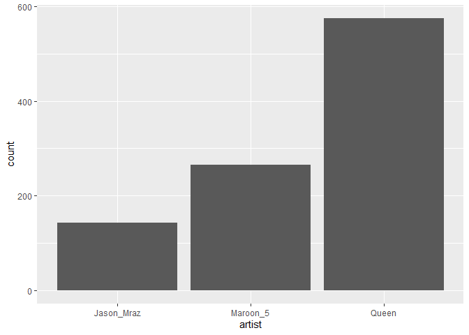

Random Forest
================
Moh. Rosidi
7/22/2020

# Dataset Spotify

Pada artikel ini, kita akan membuat model prediktif pada dataset
`Spotify`. `Spotify` Merupakan dataset yang berisikan daftar lagu dan
fitur audio dari band/penyanyi ternama dunia, antara lain: Queens,
Maroon 5, dan Jason Mraz.

Kolom-kolom pada dataset tersebut, antara lain:

  - `id` : nomor seri lagu
  - `name` : judul lagu
  - `popularity` : tingkat popularitas lagu
  - `album.id` : nomor seri album
  - `album.name` : nama album
  - `album.total_tracks` : total lagu dalam album
  - `track_number` : nomor lagu dalam album
  - `duration_ms` : durasi lagu dalam satuan ms
  - `danceability` : elemen musik termasuk tempo, stabilitas ritme,
    kekuatan beat, dan keteraturan keseluruhan. Nilai 0,0 paling tidak
    bisa digunakan untuk menari dan 1,0 paling bisa digunakan untuk
    menari.
  - `energy` : Energi adalah ukuran dari 0,0 hingga 1,0 dan mewakili
    ukuran persepsi intensitas dan aktivitas. Biasanya, trek yang
    energik terasa cepat, keras, dan berisik. Sebagai contoh, death
    metal memiliki energi tinggi, sedangkan prelude Bach mendapat skor
    rendah pada skala. Fitur perseptual yang berkontribusi pada atribut
    ini meliputi rentang dinamis, persepsi kenyaringan, warna nada,
    onset rate, dan entropi umum.
  - `key` : Kunci dari trek adalah. Integer memetakan ke pitch
    menggunakan notasi Pitch Class standar. Misalnya. 0 = C, 1 = C♯ / D
    ♭, 2 = D, dan seterusnya.
  - `loudness` : Keseluruhan kenyaringan trek dalam desibel (dB). Nilai
    kenyaringan rata-rata di seluruh trek dan berguna untuk
    membandingkan kenyaringan relatif trek. Kenyaringan adalah kualitas
    suara yang merupakan korelasi psikologis utama dari kekuatan fisik
    (amplitudo). Nilai kisaran khas antara -60 dan 0 db.
  - `mode` : Mode menunjukkan modalitas (besar atau kecil) dari suatu
    trek, jenis skala dari mana konten melodinya diturunkan. Mayor
    diwakili oleh 1 dan minor adalah 0.
  - `speechiness` : Speechiness mendeteksi keberadaan kata-kata yang
    diucapkan di trek. Semakin eksklusif pidato-seperti rekaman (mis.
    Acara bincang-bincang, buku audio, puisi), semakin dekat dengan 1.0
    nilai atribut. Nilai di atas 0,66 menggambarkan trek yang mungkin
    seluruhnya terbuat dari kata-kata yang diucapkan. Nilai antara 0,33
    dan 0,66 menggambarkan trek yang mungkin berisi musik dan ucapan,
    baik dalam bagian atau lapisan, termasuk kasus-kasus seperti musik
    rap. Nilai di bawah 0,33 kemungkinan besar mewakili musik dan trek
    non-ucapan lainnya.
  - `acousticness` : Ukuran kepercayaan dari 0,0 hingga 1,0 dari apakah
    trek akustik. 1.0 mewakili kepercayaan tinggi trek adalah akustik.
  - `instrumentalness` : Memprediksi apakah suatu lagu tidak mengandung
    vokal. Suara “Ooh” dan “aah” diperlakukan sebagai instrumen dalam
    konteks ini. Rap atau trek kata yang diucapkan jelas “vokal”.
    Semakin dekat nilai instrumentalness ke 1.0, semakin besar
    kemungkinan trek tidak mengandung konten vokal. Nilai di atas 0,5
    dimaksudkan untuk mewakili trek instrumental, tetapi kepercayaan
    diri lebih tinggi ketika nilai mendekati 1.0.
  - `liveness` : Mendeteksi keberadaan audiens dalam rekaman. Nilai
    liveness yang lebih tinggi mewakili probabilitas yang meningkat
    bahwa trek dilakukan secara langsung. Nilai di atas 0,8 memberikan
    kemungkinan kuat bahwa trek live.
  - `valence` : Ukuran 0,0 hingga 1,0 yang menggambarkan kepositifan
    musik yang disampaikan oleh sebuah trek. Lagu dengan valensi tinggi
    terdengar lebih positif (mis. Bahagia, ceria, gembira), sedangkan
    trek dengan valensi rendah terdengar lebih negatif (mis. Sedih,
    tertekan, marah).
  - `tempo` : Perkiraan tempo trek secara keseluruhan dalam beat per
    menit (BPM). Dalam terminologi musik, tempo adalah kecepatan atau
    kecepatan dari bagian yang diberikan dan diturunkan langsung dari
    durasi beat rata-rata.
  - `time_signature` : An estimated overall time signature of a track.
    The time signature (meter) is a notational convention to specify how
    many beats are in each bar (or measure).

# Persiapan

## Library

Terdapat beberapa paket yang digunakan dalam pembuatan model prediktif
menggunakan *random forest*. Paket-paket yang digunakan ditampilkan
sebagai berikut:

``` r
# library pembantu
library(e1071)
library(rsample)
library(recipes)
library(DataExplorer)
library(skimr)
library(DMwR)
library(MLmetrics)

# library model
library(caret) 
library(ranger)


# paket penjelasan model
library(vip)
library(pdp)

library(tidyverse)
```

**Paket Pembantu**

1.  `e1071` : paket dengan sejumlah fungsi untuk melakukan *latent class
    analysis, short time Fourier transform, fuzzy clustering, support
    vector machines, shortest path computation, bagged clustering, naive
    Bayes classifier*, dll. Paket ini merupakan paket pembantu dalam
    proses *fitting* sejumlah model pohon
2.  `tidyverse` : kumpulan paket dalam bidang data science
3.  `rsample` : membantu proses *data splitting*
4.  `recipes`: membantu proses data pra-pemrosesan
5.  `DataExplorer` : EDA
6.  `skimr` : membuat ringkasan data
7.  `DMwR` : paket untuk melakukan sampling “smote”

**Paket untuk Membangun Model**

1.  `caret` : berisikan sejumlah fungsi yang dapat merampingkan proses
    pembuatan model regresi dan klasifikasi
2.  `ranger` : membentuk model *random forest*

**Paket Interpretasi Model**

1.  `vip` : visualisasi *variable importance*
2.  `pdp` : visualisasi plot ketergantungan parsial

## Import Dataset

Import dataset dilakukan dengan menggunakan fungsi `readr()`. Fungsi ini
digunakan untuk membaca file dengan ekstensi `.csv`.

``` r
spotify <- read_csv("data/spotify.csv")

# data cleaning
key_labs = c('c', 'c#', 'd', 'd#', 'e', 'f', 
             'f#', 'g', 'g#', 'a', 'a#', 'b')
mode_labs = c('minor', 'major')

spotify <- spotify %>%
  select(popularity, duration_ms:artist) %>%
  mutate(time_signature = factor(time_signature),
         key = factor(key, labels = key_labs),
         mode = factor(mode, labels = mode_labs),
         artist = factor(artist, labels = c("Jason_Mraz", "Maroon_5", "Queen" )))
```

# Data Splitting

Proses *data splitting* dilakukan setelah data di import ke dalam
sistem. Hal ini dilakukan untuk memastikan tidak adanya kebocoran data
yang mempengaruhi proses pembuatan model. Data dipisah menjadi dua buah
set, yaitu: *training* dan *test*. Data *training* adalah data yang akan
kita gunakan untuk membentuk model. Seluruh proses sebelum uji model
akan menggunakan data *training*. Proses tersebut, antara lain: EDA,
*feature engineering*, dan validasi silang. Data *test* hanya digunakan
saat kita akan menguji performa model dengan data baru yang belum pernah
dilihat sebelumnya.

Terdapat dua buah jenis sampling pada tahapan *data splitting*, yaitu:

1.  *random sampling* : sampling acak tanpa mempertimbangkan adanya
    strata dalam data
2.  *startified random sampling* : sampling dengan memperhatikan strata
    dalam sebuah variabel.

Dalam proses pembentukan model kali ini, kita akan menggunakan metode
kedua dengan tujuan untuk memperoleh distribusi yang seragam dari
variabel target (`artist`).

``` r
set.seed(123)

split  <- initial_split(spotify, prop = 0.8, strata = "artist")
data_train  <- training(split)
data_test   <- testing(split)
```

Untuk mengecek distribusi dari kedua set data, kita dapat
mevisualisasikan distribusi dari variabel target pada kedua set
tersebut.

``` r
# training set
ggplot(data_train, aes(x = artist)) + 
  geom_bar() 
```

<!-- -->

``` r
# test set
ggplot(data_test, aes(x = artist)) + 
  geom_bar() 
```

<!-- -->

# Analisis Data Eksploratif

Analsiis data eksploratif (EDA) ditujukan untuk mengenali data sebelum
kita menentukan algoritma yang cocok digunakan untuk menganalisa data
lebih lanjut. EDA merupakan sebuah proses iteratif yang secara garis
besar menjawab beberapa pertanyaan umum, seperti:

1.  Bagaimana distribusi data pada masing-masing variabel?
2.  Apakah terdapat asosiasi atau hubungan antar variabel dalam data?

## Ringkasan Data

Terdapat dua buah fungsi yang digunakan dalam membuat ringkasan data,
antara lain:

1.  `glimpse()`: varian dari `str()` untuk mengecek struktur data.
    Fungsi ini menampilkan transpose dari tabel data dengan menambahkan
    informasi, seperti: jenis data dan dimensi tabel.
2.  `skim()` : fungsi dari paket `skimr` untuk membuat ringkasan data
    yang lebih detail dibanding `glimpse()`, seperti: statistika
    deskriptif masing-masing kolom, dan informasi *missing value* dari
    masing-masing kolom.
3.  `plot_missing()` : fungsi untuk memvisualisasikan persentase
    *missing value* pada masing-masing variabel atau kolom data

<!-- end list -->

``` r
glimpse(data_train)
```

    ## Rows: 982
    ## Columns: 15
    ## $ popularity       <dbl> 54, 74, 64, 54, 55, 53, 54, 68, 53, 53, 55, 70, 68...
    ## $ duration_ms      <dbl> 239751, 199849, 190642, 196120, 193603, 183427, 21...
    ## $ danceability     <dbl> 0.526, 0.799, 0.655, 0.759, 0.934, 0.812, 0.604, 0...
    ## $ energy           <dbl> 0.608, 0.597, 0.603, 0.604, 0.564, 0.670, 0.405, 0...
    ## $ key              <fct> a#, f, g#, g#, b, f, a#, c, c, c#, c, g, a, g#, e,...
    ## $ loudness         <dbl> -5.776, -5.131, -5.014, -6.663, -4.806, -4.008, -8...
    ## $ mode             <fct> minor, minor, major, minor, major, major, major, m...
    ## $ speechiness      <dbl> 0.1690, 0.0611, 0.0555, 0.0510, 0.0638, 0.0901, 0....
    ## $ acousticness     <dbl> 0.1270, 0.0788, 0.0959, 0.1410, 0.4610, 0.1720, 0....
    ## $ instrumentalness <dbl> 0.00e+00, 5.66e-06, 0.00e+00, 0.00e+00, 1.84e-05, ...
    ## $ liveness         <dbl> 0.1130, 0.1000, 0.1070, 0.1490, 0.1010, 0.2530, 0....
    ## $ valence          <dbl> 0.3720, 0.4190, 0.4520, 0.4180, 0.5430, 0.6540, 0....
    ## $ tempo            <dbl> 93.311, 110.001, 126.088, 121.096, 115.092, 125.08...
    ## $ time_signature   <fct> 4, 4, 4, 4, 4, 4, 4, 4, 4, 4, 4, 4, 4, 4, 4, 4, 4,...
    ## $ artist           <fct> Maroon_5, Maroon_5, Maroon_5, Maroon_5, Maroon_5, ...

``` r
skim(data_train)
```

|                                                  |             |
| :----------------------------------------------- | :---------- |
| Name                                             | data\_train |
| Number of rows                                   | 982         |
| Number of columns                                | 15          |
| \_\_\_\_\_\_\_\_\_\_\_\_\_\_\_\_\_\_\_\_\_\_\_   |             |
| Column type frequency:                           |             |
| factor                                           | 4           |
| numeric                                          | 11          |
| \_\_\_\_\_\_\_\_\_\_\_\_\_\_\_\_\_\_\_\_\_\_\_\_ |             |
| Group variables                                  | None        |

Data summary

**Variable type: factor**

| skim\_variable  | n\_missing | complete\_rate | ordered | n\_unique | top\_counts                    |
| :-------------- | ---------: | -------------: | :------ | --------: | :----------------------------- |
| key             |          0 |              1 | FALSE   |        12 | d: 169, g: 132, a: 127, e: 119 |
| mode            |          0 |              1 | FALSE   |         2 | maj: 678, min: 304             |
| time\_signature |          0 |              1 | FALSE   |         5 | 4: 866, 3: 93, 5: 17, 0: 3     |
| artist          |          0 |              1 | FALSE   |         3 | Que: 575, Mar: 265, Jas: 142   |

**Variable type: numeric**

| skim\_variable   | n\_missing | complete\_rate |      mean |        sd |      p0 |       p25 |       p50 |       p75 |       p100 | hist  |
| :--------------- | ---------: | -------------: | --------: | --------: | ------: | --------: | --------: | --------: | ---------: | :---- |
| popularity       |          0 |              1 |     29.94 |     13.81 |    0.00 |     20.25 |     27.00 |     36.00 |      82.00 | ▂▇▃▁▁ |
| duration\_ms     |          0 |              1 | 234370.96 | 119727.20 | 4066.00 | 185690.00 | 223633.00 | 270816.50 | 2054800.00 | ▇▁▁▁▁ |
| danceability     |          0 |              1 |      0.50 |      0.19 |    0.00 |      0.34 |      0.50 |      0.65 |       0.95 | ▁▇▇▇▂ |
| energy           |          0 |              1 |      0.65 |      0.24 |    0.01 |      0.48 |      0.70 |      0.84 |       1.00 | ▁▃▅▇▇ |
| loudness         |          0 |              1 |    \-8.63 |      4.26 | \-33.59 |   \-10.81 |    \-7.68 |    \-5.60 |     \-1.87 | ▁▁▁▆▇ |
| speechiness      |          0 |              1 |      0.10 |      0.15 |    0.00 |      0.04 |      0.05 |      0.09 |       0.96 | ▇▁▁▁▁ |
| acousticness     |          0 |              1 |      0.27 |      0.28 |    0.00 |      0.03 |      0.15 |      0.43 |       0.98 | ▇▂▁▂▁ |
| instrumentalness |          0 |              1 |      0.05 |      0.18 |    0.00 |      0.00 |      0.00 |      0.00 |       1.00 | ▇▁▁▁▁ |
| liveness         |          0 |              1 |      0.34 |      0.30 |    0.00 |      0.11 |      0.20 |      0.45 |       1.00 | ▇▃▁▁▂ |
| valence          |          0 |              1 |      0.44 |      0.24 |    0.00 |      0.26 |      0.42 |      0.62 |       0.97 | ▅▇▇▆▃ |
| tempo            |          0 |              1 |    117.65 |     30.19 |    0.00 |     95.00 |    116.05 |    139.96 |     207.55 | ▁▂▇▆▁ |

``` r
plot_missing(data_train)
```

<!-- -->

Berdasarkan ringkasan data yang dihasilkan, diketahui dimensi data
sebesar 982 baris dan 15 kolom. Dengan rincian masing-masing kolom,
yaitu: 4 kolom dengan jenis data factor dan 11 kolom dengan jenis data
numeric. Informasi lain yang diketahui adalah seluruh kolom dalam data
tidak memiliki *missing value*.

## Variasi

Variasi dari tiap variabel dapat divisualisasikan dengan menggunakan
histogram (numerik) dan baplot (kategorikal).

``` r
plot_histogram(data_train, ncol = 2L, nrow = 2L)
```

<!-- --><!-- --><!-- -->

``` r
plot_bar(data_train, ncol = 2L, nrow = 2L)
```

<!-- -->

Berdasarkan hasil visualisasi diperoleh bahwa sebagian besar variabel
numerik memiliki distribusi yang tidak simetris. Sedangkan pada variabel
kategorikal diketahui bahwa seluruh variabel memiliki variasi yang tidak
mendekati nol atau nol. Untuk mengetahui variabel dengan variasi
mendekati nol atau nol, dapat menggunakan sintaks berikut:

``` r
nzvar <- nearZeroVar(data_train, saveMetrics = TRUE) %>% 
  rownames_to_column() %>% 
  filter(nzv)
nzvar
```

    ## [1] rowname       freqRatio     percentUnique zeroVar       nzv          
    ## <0 rows> (or 0-length row.names)

## Kovarian

Kovarian dapat dicek melalui visualisasi *heatmap* koefisien korelasi.

``` r
plot_correlation(data_train, 
                 cor_args = list(method = "spearman"))
```

<!-- -->

# Target and Feature Engineering

*Data preprocessing* dan *engineering* mengacu pada proses penambahan,
penghapusan, atau transformasi data. Waktu yang diperlukan untuk
memikirkan identifikasi kebutuhan *data engineering* dapat berlangsung
cukup lama dan proprsinya akan menjadi yang terbesar dibandingkan
analisa lainnya. Hal ini disebabkan karena kita perlu untuk memahami
data apa yang akan kita oleh atau diinputkan ke dalam model.

Untuk menyederhanakan proses *feature engineerinh*, kita harus
memikirkannya sebagai sebuah *blueprint* dibanding melakukan tiap
tugasnya secara satu persatu. Hal ini membantu kita dalam dua hal:

1.  Berpikir secara berurutan
2.  Mengaplikasikannya secara tepat selama proses *resampling*

## Urutan Langkah-Langkah Feature Engineering

Memikirkan *feature engineering* sebagai sebuah *blueprint* memaksa kita
untuk memikirkan urutan langkah-langkah *preprocessing* data. Meskipun
setiap masalah mengharuskan kita untuk memikirkan efek *preprocessing*
berurutan, ada beberapa saran umum yang harus kita pertimbangkan:

  - Jika menggunakan log atau transformasi Box-Cox, jangan memusatkan
    data terlebih dahulu atau melakukan operasi apa pun yang dapat
    membuat data menjadi tidak positif. Atau, gunakan transformasi
    Yeo-Johnson sehingga kita tidak perlu khawatir tentang hal ini.
  - *One-hot* atau *dummy encoding* biasanya menghasilkan data jarang
    (*sparse*) yang dapat digunakan oleh banyak algoritma secara
    efisien. Jika kita menstandarisasikan data tersebut, kita akan
    membuat data menjadi padat (*dense*) dan kita kehilangan efisiensi
    komputasi. Akibatnya, sering kali lebih disukai untuk standardisasi
    fitur numerik kita dan kemudian *one-hot/dummy endode*.
  - Jika kila mengelompokkan kategori (*lumping*) yang jarang terjadi
    secara bersamaan, lakukan sebelum *one-hot/dummy endode*.
  - Meskipun kita dapat melakukan prosedur pengurangan dimensi pada
    fitur-fitur kategorikal, adalah umum untuk melakukannya terutama
    pada fitur numerik ketika melakukannya untuk tujuan rekayasa fitur.

Sementara kebutuhan proyek kita mungkin beragam, berikut ini adalah
urutan langkah-langkah potensial yang disarankan untuk sebagian besar
masalah:

1.  Filter fitur dengan varians nol (*zero varians*) atau hampir nol
    (*near zero varians*).
2.  Lakukan imputasi jika diperlukan.
3.  Normalisasi untuk menyelesaikan *skewness* fitur numerik.
4.  Standardisasi fitur numerik (*centering* dan *scaling*).
5.  Lakukan reduksi dimensi (mis., PCA) pada fitur numerik.
6.  *one-hot/dummy endode* pada fitur kategorikal.

## Meletakkan Seluruh Proses Secara Bersamaan

Untuk mengilustrasikan bagaimana proses ini bekerja bersama menggunakan
R, mari kita lakukan penilaian ulang sederhana pada set data `ames` yang
kita gunakan dan lihat apakah beberapa *feature engineering* sederhana
meningkatkan kemampuan prediksi model kita. Tapi pertama-tama, kita
berkenalan dengat paket `recipe`.

Paket `recipe` ini memungkinkan kita untuk mengembangkan *bluprint
feature engineering* secara berurutan. Gagasan di balik `recipe` mirip
dengan `caret :: preProcess()` di mana kita ingin membuat *blueprint
preprocessing* tetapi menerapkannya nanti dan dalam setiap resample.

Ada tiga langkah utama dalam membuat dan menerapkan rekayasa fitur
dengan `recipe`:

1.  `recipe()`: tempat kita menentukan langkah-langkah rekayasa fitur
    untuk membuat *blueprint*.
2.  `prep()`: memperkirakan parameter *feature engineering* berdasarkan
    data *training*.
3.  `bake()`: terapkan *blueprint* untuk data baru.

<!-- end list -->

``` r
blueprint <- recipe(artist ~ ., data = data_train) %>%
  step_nzv(all_nominal())  %>%
  
  # 2. imputation to missing value
  # step_medianimpute("<Num_Var_name>") %>% # median imputation
  # step_meanimpute("<Num_var_name>") %>% # mean imputation
  # step_modeimpute("<Cat_var_name>") %>% # mode imputation
  # step_bagimpute("<Var_name>") %>% # random forest imputation
  # step_knnimpute("<Var_name>") %>% # knn imputation
  
  # Label encoding for categorical variable with many classes 
  # step_integer("<Cat_var_name>") %>%
  
  # 3. normalize to resolve numeric feature skewness
  step_center(all_numeric(), -all_outcomes()) %>%
  
  # 4. standardize (center and scale) numeric feature
  step_scale(all_numeric(), -all_outcomes()) 
```

Selanjutnya, *blueprint* yang telah dibuat dilakukan *training* pada
data *training*. Perlu diperhatikan, kita tidak melakukan proses
*training* pada data *test* untuk mencegah *data leakage*.

``` r
prepare <- prep(blueprint, training = data_train)
prepare
```

    ## Data Recipe
    ## 
    ## Inputs:
    ## 
    ##       role #variables
    ##    outcome          1
    ##  predictor         14
    ## 
    ## Training data contained 982 data points and no missing data.
    ## 
    ## Operations:
    ## 
    ## Sparse, unbalanced variable filter removed no terms [trained]
    ## Centering for popularity, duration_ms, danceability, ... [trained]
    ## Scaling for popularity, duration_ms, danceability, ... [trained]

Langkah terakhir adalah mengaplikasikan *blueprint* pada data *training*
dan *test* menggunakan fungsi `bake()`.

``` r
baked_train <- bake(prepare, new_data = data_train)
baked_test <- bake(prepare, new_data = data_test)
baked_train
```

    ## # A tibble: 982 x 15
    ##    popularity duration_ms danceability  energy key   loudness mode  speechiness
    ##         <dbl>       <dbl>        <dbl>   <dbl> <fct>    <dbl> <fct>       <dbl>
    ##  1       1.74      0.0449        0.161 -0.173  a#      0.669  minor      0.471 
    ##  2       3.19     -0.288         1.61  -0.220  f       0.821  minor     -0.234 
    ##  3       2.47     -0.365         0.844 -0.194  g#      0.848  major     -0.270 
    ##  4       1.74     -0.319         1.39  -0.190  g#      0.461  minor     -0.300 
    ##  5       1.82     -0.341         2.32  -0.360  b       0.897  major     -0.216 
    ##  6       1.67     -0.426         1.68   0.0904 f       1.08   major     -0.0444
    ##  7       1.74     -0.200         0.574 -1.03   a#      0.0820 major     -0.243 
    ##  8       2.76     -0.160         0.611 -0.793  c       0.369  major     -0.211 
    ##  9       1.67      3.80          1.34   0.698  c       0.455  minor     -0.173 
    ## 10       1.67     -0.0152        1.51  -0.0880 c#      0.772  major     -0.196 
    ## # ... with 972 more rows, and 7 more variables: acousticness <dbl>,
    ## #   instrumentalness <dbl>, liveness <dbl>, valence <dbl>, tempo <dbl>,
    ## #   time_signature <fct>, artist <fct>

# Random Forest

Bagging (agregasi bootstrap) adalah teknik yang dapat mengubah model
pohon tunggal dengan varian tinggi dan kemampuan prediksi yang buruk
menjadi fungsi prediksi yang cukup akurat. Sayangnya, bagging biasanya
kekurangan, yiatu: adanya korelasi pada tiap pohon yang mengurangi
kinerja keseluruhan model. *Random forest* adalah modifikasi bagging
yang membangun koleksi besar pohon yang tidak berkorelasi dan telah
menjadi algoritma pembelajaran “out-of-the-box” yang sangat populer yang
dengan kinerja prediksi yang baik.

*Random forest* dibangun di atas prinsip-prinsip dasar yang sama seperti
*decision tress* dan bagging. Bagging memperkenalkan komponen acak ke
dalam proses pembangunan pohon yang mengurangi varian prediksi pohon
tunggal dan meningkatkan kinerja prediksi. Namun, pohon-pohon di bagging
tidak sepenuhnya independen satu sama lain karena semua prediktor asli
dianggap di setiap split setiap pohon. Sebaliknya, pohon dari sampel
bootstrap yang berbeda biasanya memiliki struktur yang mirip satu sama
lain (terutama di bagian atas pohon) karena hubungan yang mendasarinya.

Sebagai contoh, jika kita membuat enam pohon keputusan dengan sampel
bootstrap data perumahan Boston yang berbeda, kita melihat bahwa puncak
pohon semua memiliki struktur yang sangat mirip. Meskipun ada 15
variabel prediktor untuk dipecah, keenam pohon memiliki kedua variabel
lstat dan rm yang mendorong beberapa split pertama.

Sebagai contoh, jika kita membuat enam *decision trees* dengan sampel
bootstrap [data perumahan
Boston](http://uc-r.github.io/\(http://lib.stat.cmu.edu/datasets/boston\))
yang berbeda, kita melihat bahwa puncak pohon semua memiliki struktur
yang sangat mirip. Meskipun ada 15 variabel prediktor untuk dipecah,
keenam pohon memiliki kedua variabel `lstat` dan `rm` yang mendorong
beberapa split pertama.


Karakteristik ini dikenal sebagai **korelasi pohon** dan mencegah
bagging dari secara optimal mengurangi varians dari nilai-nilai
prediktif. Untuk mengurangi varian lebih lanjut, kita perlu meminimalkan
jumlah korelasi antar pohon-pohon tersebut. Ini bisa dicapai dengan
menyuntikkan lebih banyak keacakan ke dalam proses penanaman pohon.
*Random Forest* mencapai ini dalam dua cara:

1.  **Bootstrap**: mirip dengan bagging, setiap pohon ditumbuhkan ke set
    data *bootstrap resampled*, yang membuatnya berbeda dan agak
    mendekorelasi antar pohon tersebut.
2.  **Split-variable randomization**: setiap kali pemisahan dilakukan,
    pencarian untuk variabel terbagi terbatas pada subset acak \(m\)
    dari variabel \(p\). Untuk pohon regresi, nilai default tipikal
    adalah \(m = p/3\) tetapi ini harus dianggap sebagai *parameter
    tuning*. Ketika \(m = p\), jumlah pengacakan hanya menggunakan
    langkah 1 dan sama dengan bagging.

Algoritma dasar dari *random forest* adalah sebagai berikut:

    1.  Diberikan set data training
    2.  Pilih jumlah pohon yang akan dibangun (n_trees)
    3.  for i = 1 to n_trees do
    4.  | Hasilkan sampel bootstrap dari data asli
    5.  | Tumbuhkan pohon regresi / klasifikasi ke data yang di-bootstrap
    6.  | for each split do
    7.  | | Pilih variabel m_try secara acak dari semua variabel p
    8.  | | Pilih variabel / titik-split terbaik di antara m_try
    9.  | | Membagi node menjadi dua node anak
    10. | end
    11. | Gunakan kriteria berhenti model pohon biasa untuk menentukan 
        | kapan pohon selesai (tapi jangan pangkas)
    12. end
    13. Output ensemble of trees 

Karena algoritma secara acak memilih sampel bootstrap untuk dilatih dan
prediktor digunakan pada setiap split, korelasi pohon akan berkurang
melebihi bagging.

## OOB Error vs Test Set Error

Mirip dengan bagging, manfaat alami dari proses *bootstrap resampling*
adalah *randomforest* memiliki sampel *out-of-bag* (OOB) yang memberikan
perkiraan kesalahan pengujian yang efisien dan masuk akal. Ini
memberikan satu set validasi bawaan tanpa kerja ekstra , dan kita tidak
perlu mengorbankan data *training* apa pun untuk digunakan untuk
validasi. Ini membuat proses identifikasi jumlah pohon yang diperlukan
untuk menstabilkan tingkat kesalahan selama proses *tuning* menjadi
lebih efisien; Namun, seperti yang diilustrasikan di bawah ini, beberapa
perbedaan antara kesalahan OOB dan kesalahan tes diharapkan.


Selain itu, banyak paket tidak melacak pengamatan mana yang merupakan
bagian dari sampel OOB untuk pohon tertentu dan yang tidak. Jika kita
membandingkan beberapa model dengan yang lain, kita ingin membuat skor
masing-masing pada set validasi yang sama untuk membandingkan kinerja.
Selain itu, meskipun secara teknis dimungkinkan untuk menghitung metrik
tertentu seperti *root mean squared logarithmic error* (RMSLE) pada
sampel OOB, itu tidak dibangun untuk semua paket. Jadi jika kita ingin
membandingkan beberapa model atau menggunakan fungsi *loss* yang sedikit
lebih tradisional, kita mungkin ingin tetap melakukan validasi silang.

## Kelebihan dan Kekurangan

**Kelbihan**

  - Biasanya memiliki kinerja yang sangat bagus
  - “*Out-of-the-box*” yang luar biasa bagus - sangat sedikit
    penyesuaian yang diperlukan
  - Kumpulan validasi bawaan - tidak perlu mengorbankan data untuk
    validasi tambahan
  - Tidak diperlukan pra-pemrosesan
  - Bersifat *robust* dengan adanya *outlier*

**Kekurangan**

  - Dapat menjadi lambat pada set data besar
  - Meskipun akurat, seringkali tidak dapat bersaing dengan algoritma
    *boosting*
  - Kurang mudah untuk ditafsirkan

## Validasi Silang dan Parameter Tuning

Pada fungsi `trainControl()` argumen yang digunakan sama dengan model
bagging.

``` r
# spesifikasi metode validasi silang
cv <- trainControl(
  # possible value: "boot", "boot632", "optimism_boot", "boot_all", "cv", 
  #                 "repeatedcv", "LOOCV", "LGOCV"
  method = "cv", 
  number = 10, 
  # repeats = 5,
  classProbs = TRUE,
  sampling = "smote",
  summaryFunction = multiClassSummary,
  savePredictions = TRUE,
  allowParallel = TRUE
)
```

``` r
n_features <- length(setdiff(names(baked_train), "artist"))
hyper_grid <- expand.grid(
  mtry = floor(n_features * c(.05, .15, .25, .333, .4)),
  min.node.size = c(1, 3, 5, 10),
  splitrule = c("gini", "extratrees", "hellinger")
)
```

Pada proses training, `method` yang digunakan adalah `rf` atau *random
forest*. Metode ini memerlukan sejumlah paket tambahan untuk memastikan
proses parallel dapat berjalan, seperti: `e1071` dan \`randomForest.

``` r
# membuat model
system.time(
model_fit_cv <- train(
  blueprint,
  data = data_train,
  method = "ranger",
  trControl = cv,
  tuneGrid =  hyper_grid,
  importance = "impurity",
  keep.inbag=TRUE,
  metric = "AUC"
  )
)
```

    ##    user  system elapsed 
    ##  862.78   16.00  809.96

``` r
model_fit_cv
```

    ## Random Forest 
    ## 
    ## 982 samples
    ##  14 predictor
    ##   3 classes: 'Jason_Mraz', 'Maroon_5', 'Queen' 
    ## 
    ## Recipe steps: nzv, center, scale 
    ## Resampling: Cross-Validated (10 fold) 
    ## Summary of sample sizes: 884, 883, 884, 884, 882, 884, ... 
    ## Addtional sampling using SMOTE
    ## 
    ## Resampling results across tuning parameters:
    ## 
    ##   mtry  min.node.size  splitrule   logLoss    AUC        prAUC      Accuracy 
    ##   0      1             gini        0.4770279  0.9488170  0.8334897  0.8472308
    ##   0      1             extratrees  0.5517250  0.9417657  0.8301996  0.8115361
    ##   0      1             hellinger         NaN        NaN        NaN        NaN
    ##   0      3             gini        0.4913320  0.9466023  0.8403661  0.8349549
    ##   0      3             extratrees  0.5454563  0.9429183  0.8407120  0.8289962
    ##   0      3             hellinger         NaN        NaN        NaN        NaN
    ##   0      5             gini        0.4974437  0.9428217  0.8251419  0.8349747
    ##   0      5             extratrees  0.5617921  0.9430672  0.8374310  0.8085053
    ##   0      5             hellinger         NaN        NaN        NaN        NaN
    ##   0     10             gini        0.5076787  0.9419528  0.8275073  0.8339449
    ##   0     10             extratrees  0.5873036  0.9368409  0.8271882  0.8045158
    ##   0     10             hellinger         NaN        NaN        NaN        NaN
    ##   2      1             gini        0.5035227  0.9453696  0.8350458  0.8319859
    ##   2      1             extratrees  0.5686654  0.9457105  0.8392672  0.8157100
    ##   2      1             hellinger         NaN        NaN        NaN        NaN
    ##   2      3             gini        0.5100120  0.9435901  0.8276405  0.8268323
    ##   2      3             extratrees  0.5822290  0.9397290  0.8260281  0.8165962
    ##   2      3             hellinger         NaN        NaN        NaN        NaN
    ##   2      5             gini        0.5219006  0.9411073  0.8309265  0.8400360
    ##   2      5             extratrees  0.5887049  0.9402459  0.8309541  0.8044338
    ##   2      5             hellinger         NaN        NaN        NaN        NaN
    ##   2     10             gini        0.5414597  0.9376916  0.8178534  0.8217605
    ##   2     10             extratrees  0.6204139  0.9367068  0.8164022  0.8065262
    ##   2     10             hellinger         NaN        NaN        NaN        NaN
    ##   3      1             gini        0.4861017  0.9464677  0.8295649  0.8288624
    ##   3      1             extratrees  0.5444450  0.9423415  0.8340250  0.8238737
    ##   3      1             hellinger         NaN        NaN        NaN        NaN
    ##   3      3             gini        0.5006817  0.9412654  0.8300202  0.8299554
    ##   3      3             extratrees  0.5546882  0.9423781  0.8409464  0.8186680
    ##   3      3             hellinger         NaN        NaN        NaN        NaN
    ##   3      5             gini        0.5013485  0.9416561  0.8255589  0.8278525
    ##   3      5             extratrees  0.5594778  0.9417855  0.8354149  0.8238325
    ##   3      5             hellinger         NaN        NaN        NaN        NaN
    ##   3     10             gini        0.5058801  0.9415989  0.8229174  0.8279042
    ##   3     10             extratrees  0.5814105  0.9378187  0.8283559  0.8166280
    ##   3     10             hellinger         NaN        NaN        NaN        NaN
    ##   4      1             gini        0.4859893  0.9412415  0.8210770  0.8339648
    ##   4      1             extratrees  0.5326397  0.9422376  0.8346165  0.8197612
    ##   4      1             hellinger         NaN        NaN        NaN        NaN
    ##   4      3             gini        0.4908950  0.9427333  0.8241501  0.8420970
    ##   4      3             extratrees  0.5339207  0.9446936  0.8439797  0.8217816
    ##   4      3             hellinger         NaN        NaN        NaN        NaN
    ##   4      5             gini        0.5001860  0.9386616  0.8179763  0.8298617
    ##   4      5             extratrees  0.5606418  0.9343944  0.8179190  0.8085251
    ##   4      5             hellinger         NaN        NaN        NaN        NaN
    ##   4     10             gini        0.5014167  0.9391919  0.8198493  0.8340269
    ##   4     10             extratrees  0.5588454  0.9429729  0.8346883  0.8268832
    ##   4     10             hellinger         NaN        NaN        NaN        NaN
    ##   5      1             gini        0.4782926  0.9441350  0.8262048  0.8308824
    ##   5      1             extratrees  0.5175326  0.9459477  0.8378583  0.8268529
    ##   5      1             hellinger         NaN        NaN        NaN        NaN
    ##   5      3             gini        0.4858789  0.9398592  0.8268133  0.8360057
    ##   5      3             extratrees  0.5211849  0.9457539  0.8409253  0.8350155
    ##   5      3             hellinger         NaN        NaN        NaN        NaN
    ##   5      5             gini        0.4817057  0.9445763  0.8239032  0.8390458
    ##   5      5             extratrees  0.5294388  0.9430786  0.8340797  0.8268733
    ##   5      5             hellinger         NaN        NaN        NaN        NaN
    ##   5     10             gini        0.4937268  0.9381315  0.8190934  0.8309146
    ##   5     10             extratrees  0.5589120  0.9391930  0.8288092  0.8157303
    ##   5     10             hellinger         NaN        NaN        NaN        NaN
    ##   Kappa      Mean_F1    Mean_Sensitivity  Mean_Specificity  Mean_Pos_Pred_Value
    ##   0.7324953  0.8030459  0.8201396         0.9171411         0.8132460          
    ##   0.6797476  0.7696553  0.8052066         0.9045390         0.7848474          
    ##         NaN        NaN        NaN               NaN               NaN          
    ##   0.7124669  0.7919985  0.8130313         0.9105664         0.8056351          
    ##   0.7059128  0.7851925  0.8148327         0.9121184         0.8002937          
    ##         NaN        NaN        NaN               NaN               NaN          
    ##   0.7125425  0.7865998  0.8080816         0.9127145         0.8030883          
    ##   0.6696009  0.7638270  0.7937807         0.8980846         0.7867180          
    ##         NaN        NaN        NaN               NaN               NaN          
    ##   0.7094793  0.7887766  0.8089007         0.9095191         0.8020856          
    ##   0.6644469  0.7594715  0.7923231         0.8980209         0.7789298          
    ##         NaN        NaN        NaN               NaN               NaN          
    ##   0.7086173  0.7878853  0.8138917         0.9110585         0.7975472          
    ##   0.6854858  0.7722120  0.8047759         0.9067646         0.7898826          
    ##         NaN        NaN        NaN               NaN               NaN          
    ##   0.7018086  0.7861314  0.8143245         0.9091117         0.7957222          
    ##   0.6880571  0.7732110  0.8093663         0.9079252         0.7921568          
    ##         NaN        NaN        NaN               NaN               NaN          
    ##   0.7197592  0.7926346  0.8130043         0.9135261         0.8102153          
    ##   0.6672000  0.7587790  0.7941424         0.9015500         0.7831605          
    ##         NaN        NaN        NaN               NaN               NaN          
    ##   0.6895929  0.7721286  0.7956427         0.9047807         0.7900335          
    ##   0.6688941  0.7604386  0.7931663         0.9002887         0.7847148          
    ##         NaN        NaN        NaN               NaN               NaN          
    ##   0.7030546  0.7847823  0.8091876         0.9090212         0.7935620          
    ##   0.6957280  0.7781623  0.8069742         0.9079802         0.7929678          
    ##         NaN        NaN        NaN               NaN               NaN          
    ##   0.7061100  0.7885441  0.8134476         0.9102281         0.7964954          
    ##   0.6906863  0.7745947  0.8093017         0.9087542         0.7940586          
    ##         NaN        NaN        NaN               NaN               NaN          
    ##   0.7000123  0.7816606  0.8008051         0.9064593         0.7964557          
    ##   0.6953571  0.7758035  0.8035744         0.9085864         0.7911634          
    ##         NaN        NaN        NaN               NaN               NaN          
    ##   0.6991011  0.7811563  0.8022816         0.9062712         0.7956550          
    ##   0.6851010  0.7682870  0.8002240         0.9064707         0.7855183          
    ##         NaN        NaN        NaN               NaN               NaN          
    ##   0.7128037  0.7893751  0.8147178         0.9138617         0.7945430          
    ##   0.6890888  0.7753110  0.8034513         0.9053982         0.7872289          
    ##         NaN        NaN        NaN               NaN               NaN          
    ##   0.7226256  0.7952145  0.8138818         0.9140438         0.8085711          
    ##   0.6929930  0.7762605  0.8070359         0.9076269         0.7915953          
    ##         NaN        NaN        NaN               NaN               NaN          
    ##   0.7056123  0.7854971  0.8097896         0.9104565         0.7978229          
    ##   0.6711489  0.7628803  0.7932558         0.9003109         0.7792961          
    ##         NaN        NaN        NaN               NaN               NaN          
    ##   0.7102713  0.7878382  0.8103684         0.9110345         0.7984177          
    ##   0.7002929  0.7831136  0.8104643         0.9083637         0.7968262          
    ##         NaN        NaN        NaN               NaN               NaN          
    ##   0.7060659  0.7835972  0.8063044         0.9104645         0.7964498          
    ##   0.7020103  0.7853301  0.8138903         0.9099560         0.7946687          
    ##         NaN        NaN        NaN               NaN               NaN          
    ##   0.7131495  0.7888124  0.8063307         0.9116265         0.7963214          
    ##   0.7142454  0.7915407  0.8172389         0.9133027         0.8046101          
    ##         NaN        NaN        NaN               NaN               NaN          
    ##   0.7182548  0.7957621  0.8152121         0.9118627         0.8079603          
    ##   0.7004913  0.7805914  0.8087732         0.9094478         0.7975950          
    ##         NaN        NaN        NaN               NaN               NaN          
    ##   0.7022067  0.7819171  0.7985828         0.9063699         0.7998243          
    ##   0.6837536  0.7709788  0.8027590         0.9047334         0.7841229          
    ##         NaN        NaN        NaN               NaN               NaN          
    ##   Mean_Neg_Pred_Value  Mean_Precision  Mean_Recall  Mean_Detection_Rate
    ##   0.9159494            0.8132460       0.8201396    0.2824103          
    ##   0.8942933            0.7848474       0.8052066    0.2705120          
    ##         NaN                  NaN             NaN          NaN          
    ##   0.9084621            0.8056351       0.8130313    0.2783183          
    ##   0.9047151            0.8002937       0.8148327    0.2763321          
    ##         NaN                  NaN             NaN          NaN          
    ##   0.9097600            0.8030883       0.8080816    0.2783249          
    ##   0.8933370            0.7867180       0.7937807    0.2695018          
    ##         NaN                  NaN             NaN          NaN          
    ##   0.9080455            0.8020856       0.8089007    0.2779816          
    ##   0.8907691            0.7789298       0.7923231    0.2681719          
    ##         NaN                  NaN             NaN          NaN          
    ##   0.9069028            0.7975472       0.8138917    0.2773286          
    ##   0.8967451            0.7898826       0.8047759    0.2719033          
    ##         NaN                  NaN             NaN          NaN          
    ##   0.9021820            0.7957222       0.8143245    0.2756108          
    ##   0.8979848            0.7921568       0.8093663    0.2721987          
    ##         NaN                  NaN             NaN          NaN          
    ##   0.9129646            0.8102153       0.8130043    0.2800120          
    ##   0.8914450            0.7831605       0.7941424    0.2681446          
    ##         NaN                  NaN             NaN          NaN          
    ##   0.9022419            0.7900335       0.7956427    0.2739202          
    ##   0.8930581            0.7847148       0.7931663    0.2688421          
    ##         NaN                  NaN             NaN          NaN          
    ##   0.9044746            0.7935620       0.8091876    0.2762875          
    ##   0.9022288            0.7929678       0.8069742    0.2746246          
    ##         NaN                  NaN             NaN          NaN          
    ##   0.9038563            0.7964954       0.8134476    0.2766518          
    ##   0.8994263            0.7940586       0.8093017    0.2728893          
    ##         NaN                  NaN             NaN          NaN          
    ##   0.9050918            0.7964557       0.8008051    0.2759508          
    ##   0.9031302            0.7911634       0.8035744    0.2746108          
    ##         NaN                  NaN             NaN          NaN          
    ##   0.9051003            0.7956550       0.8022816    0.2759681          
    ##   0.8990152            0.7855183       0.8002240    0.2722093          
    ##         NaN                  NaN             NaN          NaN          
    ##   0.9075081            0.7945430       0.8147178    0.2779883          
    ##   0.8994562            0.7872289       0.8034513    0.2732537          
    ##         NaN                  NaN             NaN          NaN          
    ##   0.9131002            0.8085711       0.8138818    0.2806990          
    ##   0.9009344            0.7915953       0.8070359    0.2739272          
    ##         NaN                  NaN             NaN          NaN          
    ##   0.9055908            0.7978229       0.8097896    0.2766206          
    ##   0.8929673            0.7792961       0.7932558    0.2695084          
    ##         NaN                  NaN             NaN          NaN          
    ##   0.9091282            0.7984177       0.8103684    0.2780090          
    ##   0.9035554            0.7968262       0.8104643    0.2756277          
    ##         NaN                  NaN             NaN          NaN          
    ##   0.9069566            0.7964498       0.8063044    0.2769608          
    ##   0.9021214            0.7946687       0.8138903    0.2756176          
    ##         NaN                  NaN             NaN          NaN          
    ##   0.9090299            0.7963214       0.8063307    0.2786686          
    ##   0.9083470            0.8046101       0.8172389    0.2783385          
    ##         NaN                  NaN             NaN          NaN          
    ##   0.9107575            0.8079603       0.8152121    0.2796819          
    ##   0.9044975            0.7975950       0.8087732    0.2756244          
    ##         NaN                  NaN             NaN          NaN          
    ##   0.9086120            0.7998243       0.7985828    0.2769715          
    ##   0.8973288            0.7841229       0.8027590    0.2719101          
    ##         NaN                  NaN             NaN          NaN          
    ##   Mean_Balanced_Accuracy
    ##   0.8686403             
    ##   0.8548728             
    ##         NaN             
    ##   0.8617988             
    ##   0.8634755             
    ##         NaN             
    ##   0.8603981             
    ##   0.8459327             
    ##         NaN             
    ##   0.8592099             
    ##   0.8451720             
    ##         NaN             
    ##   0.8624751             
    ##   0.8557703             
    ##         NaN             
    ##   0.8617181             
    ##   0.8586457             
    ##         NaN             
    ##   0.8632652             
    ##   0.8478462             
    ##         NaN             
    ##   0.8502117             
    ##   0.8467275             
    ##         NaN             
    ##   0.8591044             
    ##   0.8574772             
    ##         NaN             
    ##   0.8618378             
    ##   0.8590280             
    ##         NaN             
    ##   0.8536322             
    ##   0.8560804             
    ##         NaN             
    ##   0.8542764             
    ##   0.8533473             
    ##         NaN             
    ##   0.8642898             
    ##   0.8544247             
    ##         NaN             
    ##   0.8639628             
    ##   0.8573314             
    ##         NaN             
    ##   0.8601231             
    ##   0.8467834             
    ##         NaN             
    ##   0.8607015             
    ##   0.8594140             
    ##         NaN             
    ##   0.8583844             
    ##   0.8619232             
    ##         NaN             
    ##   0.8589786             
    ##   0.8652708             
    ##         NaN             
    ##   0.8635374             
    ##   0.8591105             
    ##         NaN             
    ##   0.8524764             
    ##   0.8537462             
    ##         NaN             
    ## 
    ## AUC was used to select the optimal model using the largest value.
    ## The final values used for the model were mtry = 0, splitrule = gini
    ##  and min.node.size = 1.

Proses *training* berlangsung selama 370.509 detik dengan 11 model
terbentuk. Dari seluruh model tersebut, model dengan parameter `mtry` =
0, `splitrule` = `model_fit_cv$bestTune[1,2]`, dan `min.node.size` = 1
memiliki rata-rata **AUC** yang paling baik. Untuk dapat mengakses
**AUC** model terbaik, jalankan sintaks berikut:

``` r
roc <- model_fit_cv$results %>%
  arrange(-AUC) %>%
  slice(1) %>%
  select(AUC) %>% pull()

roc
```

    ## [1] 0.948817

Nilai **AUC** model *random forest* yang dihasilkan jauh lebih baik
dibandingkan dua model awal. Reduksi terhadap jumlah pohon yang saling
berkorelasi telah meningkatkan performa model secara signifikan.

Berikut adalah ringkasan performa masing-masing model:

``` r
# visualisasi
ggplot(model_fit_cv)
```

<!-- -->

## Model Akhir

Untuk mengekstrak model final, jalankan sintaks berikut:

``` r
model_fit <- model_fit_cv$finalModel
```

Adapun performa model bagging pada data baru dapat dicek dengan mengukur
nilai **Akurasi** model menggunakan data *test*.

``` r
# prediksi Sale_Price churn_test
pred_test <- predict(model_fit, baked_test)

pred_test <-
  as.data.frame(pred_test$predictions) %>%
  rowid_to_column("row") %>%
  pivot_longer(cols = Jason_Mraz:Queen, names_to = "artist", values_to = "prob") %>%
  group_by(row) %>%
  summarise(prediction = which.max(prob)) %>%
  mutate(prediction = factor(prediction, 
                             labels = c("Jason_Mraz", "Maroon_5", "Queen" ))) %>%
  select(prediction) %>%
  pull()

## RMSE
cm <- confusionMatrix(pred_test, baked_test$artist, mode='everything')
cm
```

    ## Confusion Matrix and Statistics
    ## 
    ##             Reference
    ## Prediction   Jason_Mraz Maroon_5 Queen
    ##   Jason_Mraz         33       18    47
    ##   Maroon_5            2       43     3
    ##   Queen               0        4    93
    ## 
    ## Overall Statistics
    ##                                           
    ##                Accuracy : 0.6955          
    ##                  95% CI : (0.6334, 0.7527)
    ##     No Information Rate : 0.5885          
    ##     P-Value [Acc > NIR] : 0.0003667       
    ##                                           
    ##                   Kappa : 0.5345          
    ##                                           
    ##  Mcnemar's Test P-Value : 6.046e-13       
    ## 
    ## Statistics by Class:
    ## 
    ##                      Class: Jason_Mraz Class: Maroon_5 Class: Queen
    ## Sensitivity                     0.9429          0.6615       0.6503
    ## Specificity                     0.6875          0.9719       0.9600
    ## Pos Pred Value                  0.3367          0.8958       0.9588
    ## Neg Pred Value                  0.9862          0.8872       0.6575
    ## Precision                       0.3367          0.8958       0.9588
    ## Recall                          0.9429          0.6615       0.6503
    ## F1                              0.4962          0.7611       0.7750
    ## Prevalence                      0.1440          0.2675       0.5885
    ## Detection Rate                  0.1358          0.1770       0.3827
    ## Detection Prevalence            0.4033          0.1975       0.3992
    ## Balanced Accuracy               0.8152          0.8167       0.8052

Berdasarkan hasil evaluasi diperoleh nilai akurasi sebesar 0.6954733

## Interpretasi Fitur

Untuk mengetahui variabel apa yang paling berpengaruh terhadap performa
model, kita dapat menggunakan visualisasi *variabel importance plot*.

``` r
vi <- vip(model_fit, num_features = 10)
vi
```

<!-- -->

Berdasarkan hasil plot, terdapat empat buah variabel paling berpengaruh,
yaitu: danceability, instrumentalness, acousticness, duration\_ms. Untuk
melihat efek dari keempat variabel tersebut terhadap prediksi yang
dihasilkan model, kita dapat mengetahuinya melalui *patial plot
dependencies*.

``` r
p1 <- pdp::partial(model_fit_cv, pred.var = vi$data %>% select(Variable) %>% pull() %>%.[1]) %>% 
  autoplot() 

p2 <- pdp::partial(model_fit_cv, pred.var = vi$data %>% select(Variable) %>% pull() %>%.[2]) %>% 
  autoplot()

p3 <- pdp::partial(model_fit_cv, pred.var = vi$data %>% select(Variable) %>% pull() %>%.[3]) %>% 
  autoplot()
  

p4 <- pdp::partial(model_fit_cv, pred.var = vi$data %>% select(Variable) %>% pull() %>%.[4]) %>% 
  autoplot()

grid.arrange(p1, p2, p3, p4, nrow = 2)
```

<!-- -->

Berdasarkan output yang dihasilkan, ketiga variabel memiliki relasi
non-linier terhadap variabel target.
