Random Forest
================
Moh. Rosidi
7/27/2020

# Dataset Ames

Sebuah dataset terkait data properti yang ada di Ames IA. Dataset ini
memiliki 82 variabel dan 2930 baris. Untuk informasi lebih lanjut
terkait dataset ini, kunjungin tautan berikut:

  - <https://ww2.amstat.org/publications/jse/v19n3/decock/DataDocumentation.txt>
  - <http://ww2.amstat.org/publications/jse/v19n3/decock.pdf>

# Persiapan

## Library

Terdapat beberapa paket yang digunakan dalam pembuatan model prediktif
menggunakan *random forest*. Paket-paket yang digunakan ditampilkan
sebagai berikut:

``` r
# library pembantu
library(plyr)
library(e1071)
library(foreach)
library(import)
library(tidyverse)
library(rsample)
library(recipes)
library(DataExplorer)
library(skimr)
library(modeldata)

# library model
library(caret) 
library(randomForest)

# paket penjelasan model
library(rpart.plot)  
library(vip)
library(pdp)
```

**Paket Pembantu**

1.  `plyr` : paket manipulasi data yang digunakan untuk membantu proses
    *fitting* sejumlah model pohon.
2.  `e1071` : paket dengan sejumlah fungsi untuk melakukan *latent class
    analysis, short time Fourier transform, fuzzy clustering, support
    vector machines, shortest path computation, bagged clustering, naive
    Bayes classifier*, dll. Paket ini merupakan paket pembantu dalam
    proses *fitting* sejumlah model pohon
3.  `foreach` : paket untuk melakukan *parallel computing*. Diperlukan
    untuk melakukan *fitting* model *parallel random forest*
4.  `import` : paket yang menangani *dependency* fungsi antar paket
    dalam proses *fitting* model *parallel random forest*
5.  `tidyverse` : kumpulan paket dalam bidang data science
6.  `rsample` : membantu proses *data splitting*
7.  `recipes`: membantu proses data pra-pemrosesan
8.  `DataExplorer` : EDA
9.  `skimr` : membuat ringkasan data
10. `modeldata` : kumpulan dataset untuk membuat model *machine
    learning*

**Paket untuk Membangun Model**

1.  `caret` : berisikan sejumlah fungsi yang dapat merampingkan proses
    pembuatan model regresi dan klasifikasi
2.  `randomForest` : membentuk model *random forest*

**Paket Interpretasi Model**

1.  `rpart.plot` : visualisasi *decision trees*
2.  `vip` : visualisasi *variable importance*
3.  `pdp` : visualisasi plot ketergantungan parsial

## Import Dataset

Import dataset dilakukan dengan menggunakan fungsi `data()`. Fungsi ini
digunakan untuk mengambil data yang ada dalam sebuah paket.

``` r
data("ames")
```

# Data Splitting

Proses *data splitting* dilakukan setelah data di import ke dalam
sistem. Hal ini dilakukan untuk memastikan tidak adanya kebocoran data
yang mempengaruhi proses pembuatan model. Data dipisah menjadi dua buah
set, yaitu: *training* dan *test*. Data *training* adalah data yang akan
kita gunakan untuk membentuk model. Seluruh proses sebelum uji model
akan menggunakan data *training*. Proses tersebut, antara lain: EDA,
*feature engineering*, dan validasi silang. Data *test* hanya digunakan
saat kita akan menguji performa model dengan data baru yang belum pernah
dilihat sebelumnya.

Terdapat dua buah jenis sampling pada tahapan *data splitting*, yaitu:

1.  *random sampling* : sampling acak tanpa mempertimbangkan adanya
    strata dalam data
2.  *startified random sampling* : sampling dengan memperhatikan strata
    dalam sebuah variabel.

Dalam proses pembentukan model kali ini, kita akan menggunakan metode
kedua dengan tujuan untuk memperoleh distribusi yang seragam dari
variabel target (`Sale_Price`).

``` r
set.seed(123)

split  <- initial_split(ames, prop = 0.7, strata = "Sale_Price")
data_train  <- training(split)
data_test   <- testing(split)
```

Untuk mengecek distribusi dari kedua set data, kita dapat
mevisualisasikan distribusi dari variabel target pada kedua set
tersebut.

``` r
# training set
ggplot(data_train, aes(x = Sale_Price)) + 
  geom_density() 
```

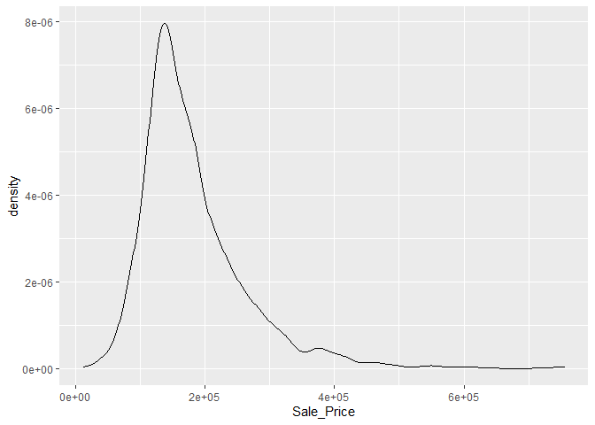<!-- -->

``` r
# test set
ggplot(data_test, aes(x = Sale_Price)) + 
  geom_density() 
```

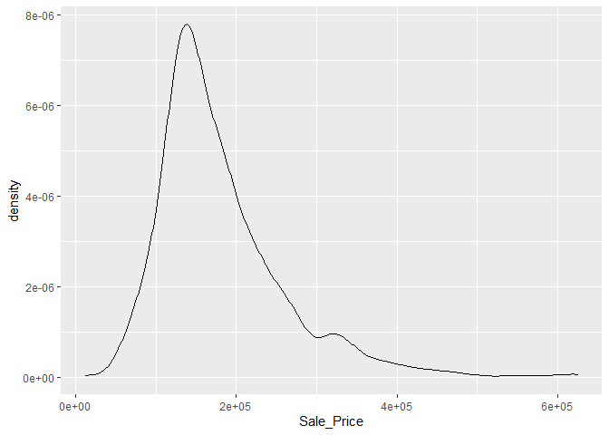<!-- -->

# Analisis Data Eksploratif

Analsiis data eksploratif (EDA) ditujukan untuk mengenali data sebelum
kita menentukan algoritma yang cocok digunakan untuk menganalisa data
lebih lanjut. EDA merupakan sebuah proses iteratif yang secara garis
besar menjawab beberapa pertanyaan umum, seperti:

1.  Bagaimana distribusi data pada masing-masing variabel?
2.  Apakah terdapat asosiasi atau hubungan antar variabel dalam data?

## Ringkasan Data

Terdapat dua buah fungsi yang digunakan dalam membuat ringkasan data,
antara lain:

1.  `glimpse()`: varian dari `str()` untuk mengecek struktur data.
    Fungsi ini menampilkan transpose dari tabel data dengan menambahkan
    informasi, seperti: jenis data dan dimensi tabel.
2.  `skim()` : fungsi dari paket `skimr` untuk membuat ringkasan data
    yang lebih detail dibanding `glimpse()`, seperti: statistika
    deskriptif masing-masing kolom, dan informasi *missing value* dari
    masing-masing kolom.
3.  `plot_missing()` : fungsi untuk memvisualisasikan persentase
    *missing value* pada masing-masing variabel atau kolom data

<!-- end list -->

``` r
glimpse(data_train)
```

    ## Rows: 2,053
    ## Columns: 74
    ## $ MS_SubClass        <fct> One_Story_1946_and_Newer_All_Styles, One_Story_1...
    ## $ MS_Zoning          <fct> Residential_Low_Density, Residential_High_Densit...
    ## $ Lot_Frontage       <dbl> 141, 80, 81, 78, 41, 39, 60, 75, 63, 85, 47, 152...
    ## $ Lot_Area           <int> 31770, 11622, 14267, 9978, 4920, 5389, 7500, 100...
    ## $ Street             <fct> Pave, Pave, Pave, Pave, Pave, Pave, Pave, Pave, ...
    ## $ Alley              <fct> No_Alley_Access, No_Alley_Access, No_Alley_Acces...
    ## $ Lot_Shape          <fct> Slightly_Irregular, Regular, Slightly_Irregular,...
    ## $ Land_Contour       <fct> Lvl, Lvl, Lvl, Lvl, Lvl, Lvl, Lvl, Lvl, Lvl, Lvl...
    ## $ Utilities          <fct> AllPub, AllPub, AllPub, AllPub, AllPub, AllPub, ...
    ## $ Lot_Config         <fct> Corner, Inside, Corner, Inside, Inside, Inside, ...
    ## $ Land_Slope         <fct> Gtl, Gtl, Gtl, Gtl, Gtl, Gtl, Gtl, Gtl, Gtl, Gtl...
    ## $ Neighborhood       <fct> North_Ames, North_Ames, North_Ames, Gilbert, Sto...
    ## $ Condition_1        <fct> Norm, Feedr, Norm, Norm, Norm, Norm, Norm, Norm,...
    ## $ Condition_2        <fct> Norm, Norm, Norm, Norm, Norm, Norm, Norm, Norm, ...
    ## $ Bldg_Type          <fct> OneFam, OneFam, OneFam, OneFam, TwnhsE, TwnhsE, ...
    ## $ House_Style        <fct> One_Story, One_Story, One_Story, Two_Story, One_...
    ## $ Overall_Cond       <fct> Average, Above_Average, Above_Average, Above_Ave...
    ## $ Year_Built         <int> 1960, 1961, 1958, 1998, 2001, 1995, 1999, 1993, ...
    ## $ Year_Remod_Add     <int> 1960, 1961, 1958, 1998, 2001, 1996, 1999, 1994, ...
    ## $ Roof_Style         <fct> Hip, Gable, Hip, Gable, Gable, Gable, Gable, Gab...
    ## $ Roof_Matl          <fct> CompShg, CompShg, CompShg, CompShg, CompShg, Com...
    ## $ Exterior_1st       <fct> BrkFace, VinylSd, Wd Sdng, VinylSd, CemntBd, Cem...
    ## $ Exterior_2nd       <fct> Plywood, VinylSd, Wd Sdng, VinylSd, CmentBd, Cme...
    ## $ Mas_Vnr_Type       <fct> Stone, None, BrkFace, BrkFace, None, None, None,...
    ## $ Mas_Vnr_Area       <dbl> 112, 0, 108, 20, 0, 0, 0, 0, 0, 0, 603, 0, 350, ...
    ## $ Exter_Cond         <fct> Typical, Typical, Typical, Typical, Typical, Typ...
    ## $ Foundation         <fct> CBlock, CBlock, CBlock, PConc, PConc, PConc, PCo...
    ## $ Bsmt_Cond          <fct> Good, Typical, Typical, Typical, Typical, Typica...
    ## $ Bsmt_Exposure      <fct> Gd, No, No, No, Mn, No, No, No, No, Gd, Gd, Av, ...
    ## $ BsmtFin_Type_1     <fct> BLQ, Rec, ALQ, GLQ, GLQ, GLQ, Unf, Unf, Unf, GLQ...
    ## $ BsmtFin_SF_1       <dbl> 2, 6, 1, 3, 3, 3, 7, 7, 7, 3, 1, 3, 3, 4, 1, 2, ...
    ## $ BsmtFin_Type_2     <fct> Unf, LwQ, Unf, Unf, Unf, Unf, Unf, Unf, Unf, Unf...
    ## $ BsmtFin_SF_2       <dbl> 0, 144, 0, 0, 0, 0, 0, 0, 0, 0, 0, 0, 0, 0, 163,...
    ## $ Bsmt_Unf_SF        <dbl> 441, 270, 406, 324, 722, 415, 994, 763, 789, 663...
    ## $ Total_Bsmt_SF      <dbl> 1080, 882, 1329, 926, 1338, 1595, 994, 763, 789,...
    ## $ Heating            <fct> GasA, GasA, GasA, GasA, GasA, GasA, GasA, GasA, ...
    ## $ Heating_QC         <fct> Fair, Typical, Typical, Excellent, Excellent, Ex...
    ## $ Central_Air        <fct> Y, Y, Y, Y, Y, Y, Y, Y, Y, Y, Y, Y, Y, Y, Y, Y, ...
    ## $ Electrical         <fct> SBrkr, SBrkr, SBrkr, SBrkr, SBrkr, SBrkr, SBrkr,...
    ## $ First_Flr_SF       <int> 1656, 896, 1329, 926, 1338, 1616, 1028, 763, 789...
    ## $ Second_Flr_SF      <int> 0, 0, 0, 678, 0, 0, 776, 892, 676, 0, 1589, 672,...
    ## $ Gr_Liv_Area        <int> 1656, 896, 1329, 1604, 1338, 1616, 1804, 1655, 1...
    ## $ Bsmt_Full_Bath     <dbl> 1, 0, 0, 0, 1, 1, 0, 0, 0, 1, 1, 0, 1, 0, 1, 0, ...
    ## $ Bsmt_Half_Bath     <dbl> 0, 0, 0, 0, 0, 0, 0, 0, 0, 0, 0, 0, 0, 0, 0, 0, ...
    ## $ Full_Bath          <int> 1, 1, 1, 2, 2, 2, 2, 2, 2, 1, 3, 2, 1, 1, 2, 2, ...
    ## $ Half_Bath          <int> 0, 0, 1, 1, 0, 0, 1, 1, 1, 1, 1, 0, 1, 0, 0, 0, ...
    ## $ Bedroom_AbvGr      <int> 3, 2, 3, 3, 2, 2, 3, 3, 3, 2, 4, 4, 1, 2, 3, 3, ...
    ## $ Kitchen_AbvGr      <int> 1, 1, 1, 1, 1, 1, 1, 1, 1, 1, 1, 1, 1, 1, 1, 1, ...
    ## $ TotRms_AbvGrd      <int> 7, 5, 6, 7, 6, 5, 7, 7, 7, 5, 12, 8, 8, 4, 7, 7,...
    ## $ Functional         <fct> Typ, Typ, Typ, Typ, Typ, Typ, Typ, Typ, Typ, Typ...
    ## $ Fireplaces         <int> 2, 0, 0, 1, 0, 1, 1, 1, 1, 1, 1, 0, 1, 0, 2, 1, ...
    ## $ Garage_Type        <fct> Attchd, Attchd, Attchd, Attchd, Attchd, Attchd, ...
    ## $ Garage_Finish      <fct> Fin, Unf, Unf, Fin, Fin, RFn, Fin, Fin, Fin, Unf...
    ## $ Garage_Cars        <dbl> 2, 1, 1, 2, 2, 2, 2, 2, 2, 2, 3, 2, 3, 2, 2, 2, ...
    ## $ Garage_Area        <dbl> 528, 730, 312, 470, 582, 608, 442, 440, 393, 506...
    ## $ Garage_Cond        <fct> Typical, Typical, Typical, Typical, Typical, Typ...
    ## $ Paved_Drive        <fct> Partial_Pavement, Paved, Paved, Paved, Paved, Pa...
    ## $ Wood_Deck_SF       <int> 210, 140, 393, 360, 0, 237, 140, 157, 0, 192, 50...
    ## $ Open_Porch_SF      <int> 62, 0, 36, 36, 0, 152, 60, 84, 75, 0, 36, 12, 0,...
    ## $ Enclosed_Porch     <int> 0, 0, 0, 0, 170, 0, 0, 0, 0, 0, 0, 0, 0, 0, 0, 0...
    ## $ Three_season_porch <int> 0, 0, 0, 0, 0, 0, 0, 0, 0, 0, 0, 0, 0, 0, 0, 0, ...
    ## $ Screen_Porch       <int> 0, 120, 0, 0, 0, 0, 0, 0, 0, 0, 210, 0, 0, 0, 0,...
    ## $ Pool_Area          <int> 0, 0, 0, 0, 0, 0, 0, 0, 0, 0, 0, 0, 0, 0, 0, 0, ...
    ## $ Pool_QC            <fct> No_Pool, No_Pool, No_Pool, No_Pool, No_Pool, No_...
    ## $ Fence              <fct> No_Fence, Minimum_Privacy, No_Fence, No_Fence, N...
    ## $ Misc_Feature       <fct> None, None, Gar2, None, None, None, None, None, ...
    ## $ Misc_Val           <int> 0, 0, 12500, 0, 0, 0, 0, 0, 0, 0, 0, 0, 0, 0, 0,...
    ## $ Mo_Sold            <int> 5, 6, 6, 6, 4, 3, 6, 4, 5, 2, 6, 6, 6, 6, 2, 1, ...
    ## $ Year_Sold          <int> 2010, 2010, 2010, 2010, 2010, 2010, 2010, 2010, ...
    ## $ Sale_Type          <fct> WD , WD , WD , WD , WD , WD , WD , WD , WD , WD ...
    ## $ Sale_Condition     <fct> Normal, Normal, Normal, Normal, Normal, Normal, ...
    ## $ Sale_Price         <int> 215000, 105000, 172000, 195500, 213500, 236500, ...
    ## $ Longitude          <dbl> -93.61975, -93.61976, -93.61939, -93.63893, -93....
    ## $ Latitude           <dbl> 42.05403, 42.05301, 42.05266, 42.06078, 42.06298...

``` r
skim(data_train)
```

|                                                  |             |
| :----------------------------------------------- | :---------- |
| Name                                             | data\_train |
| Number of rows                                   | 2053        |
| Number of columns                                | 74          |
| \_\_\_\_\_\_\_\_\_\_\_\_\_\_\_\_\_\_\_\_\_\_\_   |             |
| Column type frequency:                           |             |
| factor                                           | 40          |
| numeric                                          | 34          |
| \_\_\_\_\_\_\_\_\_\_\_\_\_\_\_\_\_\_\_\_\_\_\_\_ |             |
| Group variables                                  | None        |

Data summary

**Variable type: factor**

| skim\_variable   | n\_missing | complete\_rate | ordered | n\_unique | top\_counts                              |
| :--------------- | ---------: | -------------: | :------ | --------: | :--------------------------------------- |
| MS\_SubClass     |          0 |              1 | FALSE   |        16 | One: 753, Two: 395, One: 211, One: 145   |
| MS\_Zoning       |          0 |              1 | FALSE   |         7 | Res: 1571, Res: 338, Flo: 102, Res: 19   |
| Street           |          0 |              1 | FALSE   |         2 | Pav: 2046, Grv: 7                        |
| Alley            |          0 |              1 | FALSE   |         3 | No\_: 1909, Gra: 93, Pav: 51             |
| Lot\_Shape       |          0 |              1 | FALSE   |         4 | Reg: 1321, Sli: 666, Mod: 54, Irr: 12    |
| Land\_Contour    |          0 |              1 | FALSE   |         4 | Lvl: 1850, HLS: 83, Bnk: 75, Low: 45     |
| Utilities        |          0 |              1 | FALSE   |         3 | All: 2050, NoS: 2, NoS: 1                |
| Lot\_Config      |          0 |              1 | FALSE   |         5 | Ins: 1494, Cor: 361, Cul: 127, FR2: 62   |
| Land\_Slope      |          0 |              1 | FALSE   |         3 | Gtl: 1958, Mod: 86, Sev: 9               |
| Neighborhood     |          0 |              1 | FALSE   |        27 | Nor: 298, Col: 187, Old: 171, Edw: 146   |
| Condition\_1     |          0 |              1 | FALSE   |         9 | Nor: 1768, Fee: 120, Art: 63, RRA: 35    |
| Condition\_2     |          0 |              1 | FALSE   |         7 | Nor: 2031, Fee: 10, Pos: 4, Art: 3       |
| Bldg\_Type       |          0 |              1 | FALSE   |         5 | One: 1692, Twn: 178, Twn: 74, Dup: 66    |
| House\_Style     |          0 |              1 | FALSE   |         8 | One: 1030, Two: 614, One: 233, SLv: 84   |
| Overall\_Cond    |          0 |              1 | FALSE   |         9 | Ave: 1168, Abo: 370, Goo: 280, Ver: 95   |
| Roof\_Style      |          0 |              1 | FALSE   |         6 | Gab: 1627, Hip: 387, Gam: 17, Fla: 14    |
| Roof\_Matl       |          0 |              1 | FALSE   |         5 | Com: 2024, Tar: 16, WdS: 7, WdS: 5       |
| Exterior\_1st    |          0 |              1 | FALSE   |        14 | Vin: 718, Met: 321, Wd : 301, HdB: 295   |
| Exterior\_2nd    |          0 |              1 | FALSE   |        16 | Vin: 710, Met: 321, Wd : 287, HdB: 267   |
| Mas\_Vnr\_Type   |          0 |              1 | FALSE   |         4 | Non: 1231, Brk: 624, Sto: 179, Brk: 19   |
| Exter\_Cond      |          0 |              1 | FALSE   |         5 | Typ: 1792, Goo: 204, Fai: 43, Exc: 11    |
| Foundation       |          0 |              1 | FALSE   |         6 | PCo: 916, CBl: 870, Brk: 226, Sla: 30    |
| Bsmt\_Cond       |          0 |              1 | FALSE   |         6 | Typ: 1834, Goo: 92, Fai: 71, No\_: 52    |
| Bsmt\_Exposure   |          0 |              1 | FALSE   |         5 | No: 1348, Av: 284, Gd: 205, Mn: 163      |
| BsmtFin\_Type\_1 |          0 |              1 | FALSE   |         7 | GLQ: 599, Unf: 588, ALQ: 313, Rec: 207   |
| BsmtFin\_Type\_2 |          0 |              1 | FALSE   |         7 | Unf: 1742, Rec: 81, LwQ: 66, No\_: 53    |
| Heating          |          0 |              1 | FALSE   |         5 | Gas: 2021, Gas: 20, Gra: 7, Wal: 3       |
| Heating\_QC      |          0 |              1 | FALSE   |         5 | Exc: 1052, Typ: 593, Goo: 340, Fai: 66   |
| Central\_Air     |          0 |              1 | FALSE   |         2 | Y: 1916, N: 137                          |
| Electrical       |          0 |              1 | FALSE   |         5 | SBr: 1873, Fus: 140, Fus: 32, Fus: 7     |
| Functional       |          0 |              1 | FALSE   |         7 | Typ: 1909, Min: 50, Min: 47, Mod: 25     |
| Garage\_Type     |          0 |              1 | FALSE   |         7 | Att: 1230, Det: 534, Bui: 124, No\_: 109 |
| Garage\_Finish   |          0 |              1 | FALSE   |         4 | Unf: 863, RFn: 567, Fin: 512, No\_: 111  |
| Garage\_Cond     |          0 |              1 | FALSE   |         6 | Typ: 1870, No\_: 111, Fai: 48, Goo: 12   |
| Paved\_Drive     |          0 |              1 | FALSE   |         3 | Pav: 1862, Dir: 140, Par: 51             |
| Pool\_QC         |          0 |              1 | FALSE   |         5 | No\_: 2045, Exc: 3, Typ: 3, Fai: 1       |
| Fence            |          0 |              1 | FALSE   |         5 | No\_: 1646, Min: 243, Goo: 80, Goo: 75   |
| Misc\_Feature    |          0 |              1 | FALSE   |         4 | Non: 1982, She: 65, Gar: 4, Oth: 2       |
| Sale\_Type       |          0 |              1 | FALSE   |        10 | WD : 1775, New: 159, COD: 65, Con: 22    |
| Sale\_Condition  |          0 |              1 | FALSE   |         6 | Nor: 1692, Par: 164, Abn: 139, Fam: 36   |

**Variable type: numeric**

| skim\_variable       | n\_missing | complete\_rate |      mean |       sd |       p0 |       p25 |       p50 |       p75 |      p100 | hist  |
| :------------------- | ---------: | -------------: | --------: | -------: | -------: | --------: | --------: | --------: | --------: | :---- |
| Lot\_Frontage        |          0 |              1 |     57.00 |    33.69 |     0.00 |     41.00 |     62.00 |     78.00 |    313.00 | ▇▇▁▁▁ |
| Lot\_Area            |          0 |              1 |  10121.14 |  8120.98 |  1300.00 |   7313.00 |   9375.00 |  11512.00 | 215245.00 | ▇▁▁▁▁ |
| Year\_Built          |          0 |              1 |   1971.07 |    30.52 |  1872.00 |   1952.00 |   1973.00 |   2000.00 |   2010.00 | ▁▂▃▆▇ |
| Year\_Remod\_Add     |          0 |              1 |   1984.42 |    20.79 |  1950.00 |   1966.00 |   1993.00 |   2004.00 |   2010.00 | ▅▂▂▃▇ |
| Mas\_Vnr\_Area       |          0 |              1 |    102.59 |   179.08 |     0.00 |      0.00 |      0.00 |    164.00 |   1600.00 | ▇▁▁▁▁ |
| BsmtFin\_SF\_1       |          0 |              1 |      4.16 |     2.24 |     1.00 |      3.00 |      3.00 |      7.00 |      7.00 | ▅▆▁▁▇ |
| BsmtFin\_SF\_2       |          0 |              1 |     52.20 |   172.62 |     0.00 |      0.00 |      0.00 |      0.00 |   1474.00 | ▇▁▁▁▁ |
| Bsmt\_Unf\_SF        |          0 |              1 |    558.79 |   437.52 |     0.00 |    219.00 |    467.00 |    797.00 |   2336.00 | ▇▅▂▁▁ |
| Total\_Bsmt\_SF      |          0 |              1 |   1050.67 |   425.77 |     0.00 |    784.00 |    992.00 |   1298.00 |   3206.00 | ▂▇▃▁▁ |
| First\_Flr\_SF       |          0 |              1 |   1158.36 |   383.60 |   334.00 |    880.00 |   1083.00 |   1384.00 |   3820.00 | ▇▇▁▁▁ |
| Second\_Flr\_SF      |          0 |              1 |    336.30 |   426.47 |     0.00 |      0.00 |      0.00 |    702.00 |   2065.00 | ▇▃▂▁▁ |
| Gr\_Liv\_Area        |          0 |              1 |   1499.56 |   494.55 |   334.00 |   1136.00 |   1441.00 |   1743.00 |   4676.00 | ▅▇▂▁▁ |
| Bsmt\_Full\_Bath     |          0 |              1 |      0.43 |     0.53 |     0.00 |      0.00 |      0.00 |      1.00 |      3.00 | ▇▆▁▁▁ |
| Bsmt\_Half\_Bath     |          0 |              1 |      0.06 |     0.25 |     0.00 |      0.00 |      0.00 |      0.00 |      2.00 | ▇▁▁▁▁ |
| Full\_Bath           |          0 |              1 |      1.57 |     0.56 |     0.00 |      1.00 |      2.00 |      2.00 |      4.00 | ▁▇▇▁▁ |
| Half\_Bath           |          0 |              1 |      0.38 |     0.50 |     0.00 |      0.00 |      0.00 |      1.00 |      2.00 | ▇▁▅▁▁ |
| Bedroom\_AbvGr       |          0 |              1 |      2.84 |     0.83 |     0.00 |      2.00 |      3.00 |      3.00 |      8.00 | ▁▇▂▁▁ |
| Kitchen\_AbvGr       |          0 |              1 |      1.04 |     0.21 |     0.00 |      1.00 |      1.00 |      1.00 |      3.00 | ▁▇▁▁▁ |
| TotRms\_AbvGrd       |          0 |              1 |      6.42 |     1.54 |     2.00 |      5.00 |      6.00 |      7.00 |     14.00 | ▁▇▆▁▁ |
| Fireplaces           |          0 |              1 |      0.61 |     0.65 |     0.00 |      0.00 |      1.00 |      1.00 |      3.00 | ▇▇▁▁▁ |
| Garage\_Cars         |          0 |              1 |      1.77 |     0.77 |     0.00 |      1.00 |      2.00 |      2.00 |      5.00 | ▅▇▂▁▁ |
| Garage\_Area         |          0 |              1 |    474.14 |   215.76 |     0.00 |    325.00 |    480.00 |    576.00 |   1390.00 | ▂▇▃▁▁ |
| Wood\_Deck\_SF       |          0 |              1 |     92.98 |   123.01 |     0.00 |      0.00 |      0.00 |    168.00 |    857.00 | ▇▂▁▁▁ |
| Open\_Porch\_SF      |          0 |              1 |     47.42 |    68.23 |     0.00 |      0.00 |     26.00 |     70.00 |    742.00 | ▇▁▁▁▁ |
| Enclosed\_Porch      |          0 |              1 |     24.02 |    65.83 |     0.00 |      0.00 |      0.00 |      0.00 |   1012.00 | ▇▁▁▁▁ |
| Three\_season\_porch |          0 |              1 |      2.99 |    27.75 |     0.00 |      0.00 |      0.00 |      0.00 |    508.00 | ▇▁▁▁▁ |
| Screen\_Porch        |          0 |              1 |     15.36 |    54.61 |     0.00 |      0.00 |      0.00 |      0.00 |    576.00 | ▇▁▁▁▁ |
| Pool\_Area           |          0 |              1 |      1.90 |    31.33 |     0.00 |      0.00 |      0.00 |      0.00 |    648.00 | ▇▁▁▁▁ |
| Misc\_Val            |          0 |              1 |     44.77 |   509.47 |     0.00 |      0.00 |      0.00 |      0.00 |  15500.00 | ▇▁▁▁▁ |
| Mo\_Sold             |          0 |              1 |      6.20 |     2.71 |     1.00 |      4.00 |      6.00 |      8.00 |     12.00 | ▅▆▇▃▃ |
| Year\_Sold           |          0 |              1 |   2007.79 |     1.31 |  2006.00 |   2007.00 |   2008.00 |   2009.00 |   2010.00 | ▇▇▇▇▃ |
| Sale\_Price          |          0 |              1 | 180996.28 | 80258.90 | 13100.00 | 129500.00 | 160000.00 | 213500.00 | 755000.00 | ▇▇▁▁▁ |
| Longitude            |          0 |              1 |   \-93.64 |     0.03 |  \-93.69 |   \-93.66 |   \-93.64 |   \-93.62 |   \-93.58 | ▅▅▇▆▁ |
| Latitude             |          0 |              1 |     42.03 |     0.02 |    41.99 |     42.02 |     42.03 |     42.05 |     42.06 | ▂▂▇▇▇ |

``` r
plot_missing(data_train)
```

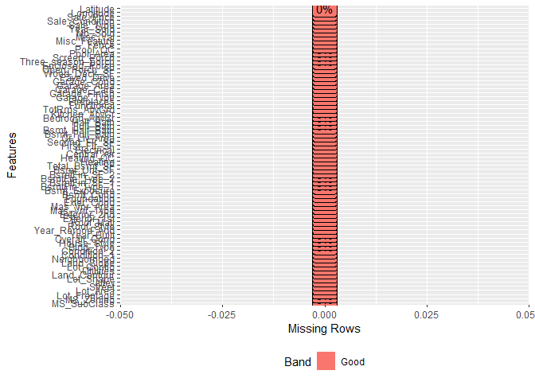<!-- -->

Berdasarkan ringkasan data yang dihasilkan, diketahui dimensi data
sebesar 2053 baris dan 74 kolom. Dengan rincian masing-masing kolom,
yaitu: 40 kolom dengan jenis data factor dan 34 kolom dengan jenis data
numeric. Informasi lain yang diketahui adalah seluruh kolom dalam data
tidak memiliki *missing value*.

## Variasi

Variasi dari tiap variabel dapat divisualisasikan dengan menggunakan
histogram (numerik) dan baplot (kategorikal).

``` r
plot_histogram(data_train, ncol = 2L, nrow = 2L)
```

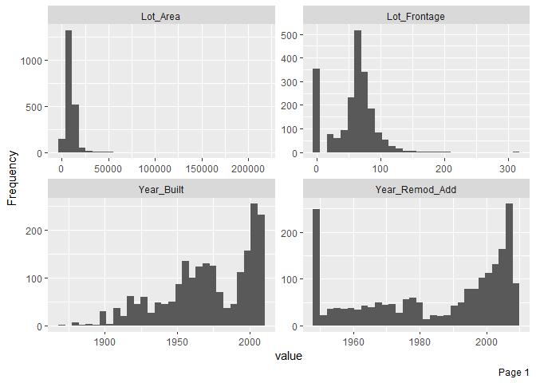<!-- --><!-- --><!-- -->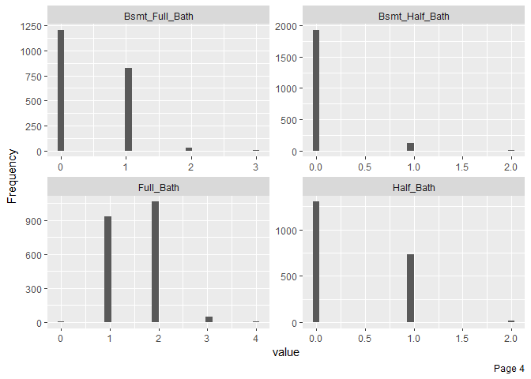<!-- -->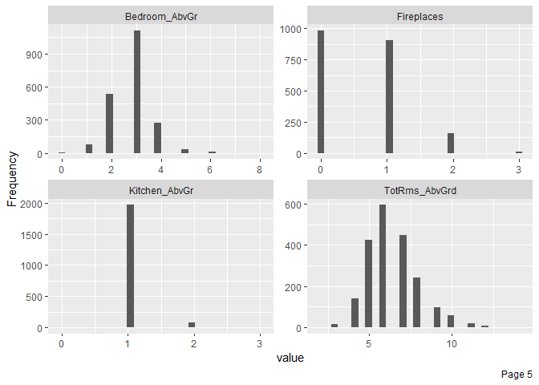<!-- --><!-- -->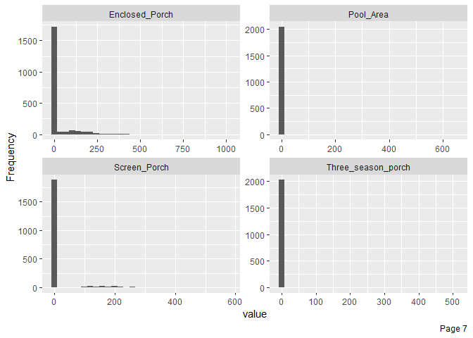<!-- -->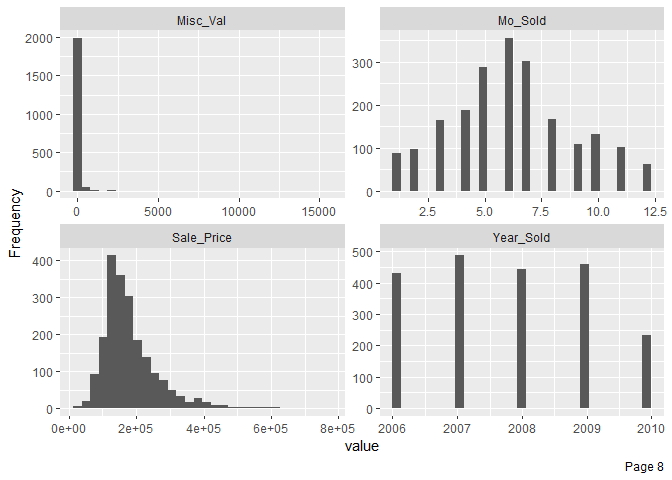<!-- --><!-- -->

``` r
plot_bar(data_train, ncol = 2L, nrow = 2L)
```

<!-- --><!-- --><!-- --><!-- -->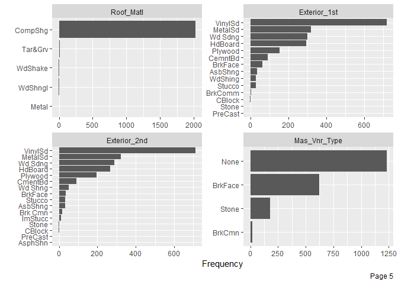<!-- --><!-- --><!-- --><!-- -->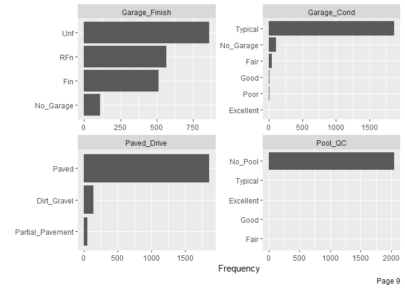<!-- --><!-- -->

Berdasarkan hasil visualisasi diperoleh bahwa sebagian besar variabel
numerik memiliki distribusi yang tidak simetris. Sedangkan pada variabel
kategorikal diketahui bahwa terdapat beberapa variabel yang memiliki
variasi rendah atau mendekati nol. Untuk mengetahui variabel dengan
variabilitas mendekati nol atau nol, dapat menggunakan sintaks berikut:

``` r
nzvar <- nearZeroVar(data_train, saveMetrics = TRUE) %>% 
  rownames_to_column() %>% 
  filter(nzv)
nzvar
```

    ##               rowname  freqRatio percentUnique zeroVar  nzv
    ## 1              Street  292.28571    0.09741841   FALSE TRUE
    ## 2               Alley   20.52688    0.14612762   FALSE TRUE
    ## 3        Land_Contour   22.28916    0.19483682   FALSE TRUE
    ## 4           Utilities 1025.00000    0.14612762   FALSE TRUE
    ## 5          Land_Slope   22.76744    0.14612762   FALSE TRUE
    ## 6         Condition_2  203.10000    0.34096444   FALSE TRUE
    ## 7           Roof_Matl  126.50000    0.24354603   FALSE TRUE
    ## 8           Bsmt_Cond   19.93478    0.29225524   FALSE TRUE
    ## 9      BsmtFin_Type_2   21.50617    0.34096444   FALSE TRUE
    ## 10            Heating  101.05000    0.24354603   FALSE TRUE
    ## 11      Kitchen_AbvGr   23.68675    0.19483682   FALSE TRUE
    ## 12         Functional   38.18000    0.34096444   FALSE TRUE
    ## 13     Enclosed_Porch  100.94118    7.40379932   FALSE TRUE
    ## 14 Three_season_porch  674.66667    1.16902094   FALSE TRUE
    ## 15       Screen_Porch  234.87500    4.52995616   FALSE TRUE
    ## 16          Pool_Area 2045.00000    0.43838285   FALSE TRUE
    ## 17            Pool_QC  681.66667    0.24354603   FALSE TRUE
    ## 18       Misc_Feature   30.49231    0.19483682   FALSE TRUE
    ## 19           Misc_Val  165.33333    1.41256698   FALSE TRUE

Berikut adalah ringkasan data pada variabel yang tidak memiliki variasi
yang mendekati nol.

``` r
without_nzvar <- select(data_train, !nzvar$rowname)
skim(without_nzvar)
```

|                                                  |                |
| :----------------------------------------------- | :------------- |
| Name                                             | without\_nzvar |
| Number of rows                                   | 2053           |
| Number of columns                                | 55             |
| \_\_\_\_\_\_\_\_\_\_\_\_\_\_\_\_\_\_\_\_\_\_\_   |                |
| Column type frequency:                           |                |
| factor                                           | 27             |
| numeric                                          | 28             |
| \_\_\_\_\_\_\_\_\_\_\_\_\_\_\_\_\_\_\_\_\_\_\_\_ |                |
| Group variables                                  | None           |

Data summary

**Variable type: factor**

| skim\_variable   | n\_missing | complete\_rate | ordered | n\_unique | top\_counts                              |
| :--------------- | ---------: | -------------: | :------ | --------: | :--------------------------------------- |
| MS\_SubClass     |          0 |              1 | FALSE   |        16 | One: 753, Two: 395, One: 211, One: 145   |
| MS\_Zoning       |          0 |              1 | FALSE   |         7 | Res: 1571, Res: 338, Flo: 102, Res: 19   |
| Lot\_Shape       |          0 |              1 | FALSE   |         4 | Reg: 1321, Sli: 666, Mod: 54, Irr: 12    |
| Lot\_Config      |          0 |              1 | FALSE   |         5 | Ins: 1494, Cor: 361, Cul: 127, FR2: 62   |
| Neighborhood     |          0 |              1 | FALSE   |        27 | Nor: 298, Col: 187, Old: 171, Edw: 146   |
| Condition\_1     |          0 |              1 | FALSE   |         9 | Nor: 1768, Fee: 120, Art: 63, RRA: 35    |
| Bldg\_Type       |          0 |              1 | FALSE   |         5 | One: 1692, Twn: 178, Twn: 74, Dup: 66    |
| House\_Style     |          0 |              1 | FALSE   |         8 | One: 1030, Two: 614, One: 233, SLv: 84   |
| Overall\_Cond    |          0 |              1 | FALSE   |         9 | Ave: 1168, Abo: 370, Goo: 280, Ver: 95   |
| Roof\_Style      |          0 |              1 | FALSE   |         6 | Gab: 1627, Hip: 387, Gam: 17, Fla: 14    |
| Exterior\_1st    |          0 |              1 | FALSE   |        14 | Vin: 718, Met: 321, Wd : 301, HdB: 295   |
| Exterior\_2nd    |          0 |              1 | FALSE   |        16 | Vin: 710, Met: 321, Wd : 287, HdB: 267   |
| Mas\_Vnr\_Type   |          0 |              1 | FALSE   |         4 | Non: 1231, Brk: 624, Sto: 179, Brk: 19   |
| Exter\_Cond      |          0 |              1 | FALSE   |         5 | Typ: 1792, Goo: 204, Fai: 43, Exc: 11    |
| Foundation       |          0 |              1 | FALSE   |         6 | PCo: 916, CBl: 870, Brk: 226, Sla: 30    |
| Bsmt\_Exposure   |          0 |              1 | FALSE   |         5 | No: 1348, Av: 284, Gd: 205, Mn: 163      |
| BsmtFin\_Type\_1 |          0 |              1 | FALSE   |         7 | GLQ: 599, Unf: 588, ALQ: 313, Rec: 207   |
| Heating\_QC      |          0 |              1 | FALSE   |         5 | Exc: 1052, Typ: 593, Goo: 340, Fai: 66   |
| Central\_Air     |          0 |              1 | FALSE   |         2 | Y: 1916, N: 137                          |
| Electrical       |          0 |              1 | FALSE   |         5 | SBr: 1873, Fus: 140, Fus: 32, Fus: 7     |
| Garage\_Type     |          0 |              1 | FALSE   |         7 | Att: 1230, Det: 534, Bui: 124, No\_: 109 |
| Garage\_Finish   |          0 |              1 | FALSE   |         4 | Unf: 863, RFn: 567, Fin: 512, No\_: 111  |
| Garage\_Cond     |          0 |              1 | FALSE   |         6 | Typ: 1870, No\_: 111, Fai: 48, Goo: 12   |
| Paved\_Drive     |          0 |              1 | FALSE   |         3 | Pav: 1862, Dir: 140, Par: 51             |
| Fence            |          0 |              1 | FALSE   |         5 | No\_: 1646, Min: 243, Goo: 80, Goo: 75   |
| Sale\_Type       |          0 |              1 | FALSE   |        10 | WD : 1775, New: 159, COD: 65, Con: 22    |
| Sale\_Condition  |          0 |              1 | FALSE   |         6 | Nor: 1692, Par: 164, Abn: 139, Fam: 36   |

**Variable type: numeric**

| skim\_variable   | n\_missing | complete\_rate |      mean |       sd |       p0 |       p25 |       p50 |       p75 |      p100 | hist  |
| :--------------- | ---------: | -------------: | --------: | -------: | -------: | --------: | --------: | --------: | --------: | :---- |
| Lot\_Frontage    |          0 |              1 |     57.00 |    33.69 |     0.00 |     41.00 |     62.00 |     78.00 |    313.00 | ▇▇▁▁▁ |
| Lot\_Area        |          0 |              1 |  10121.14 |  8120.98 |  1300.00 |   7313.00 |   9375.00 |  11512.00 | 215245.00 | ▇▁▁▁▁ |
| Year\_Built      |          0 |              1 |   1971.07 |    30.52 |  1872.00 |   1952.00 |   1973.00 |   2000.00 |   2010.00 | ▁▂▃▆▇ |
| Year\_Remod\_Add |          0 |              1 |   1984.42 |    20.79 |  1950.00 |   1966.00 |   1993.00 |   2004.00 |   2010.00 | ▅▂▂▃▇ |
| Mas\_Vnr\_Area   |          0 |              1 |    102.59 |   179.08 |     0.00 |      0.00 |      0.00 |    164.00 |   1600.00 | ▇▁▁▁▁ |
| BsmtFin\_SF\_1   |          0 |              1 |      4.16 |     2.24 |     1.00 |      3.00 |      3.00 |      7.00 |      7.00 | ▅▆▁▁▇ |
| BsmtFin\_SF\_2   |          0 |              1 |     52.20 |   172.62 |     0.00 |      0.00 |      0.00 |      0.00 |   1474.00 | ▇▁▁▁▁ |
| Bsmt\_Unf\_SF    |          0 |              1 |    558.79 |   437.52 |     0.00 |    219.00 |    467.00 |    797.00 |   2336.00 | ▇▅▂▁▁ |
| Total\_Bsmt\_SF  |          0 |              1 |   1050.67 |   425.77 |     0.00 |    784.00 |    992.00 |   1298.00 |   3206.00 | ▂▇▃▁▁ |
| First\_Flr\_SF   |          0 |              1 |   1158.36 |   383.60 |   334.00 |    880.00 |   1083.00 |   1384.00 |   3820.00 | ▇▇▁▁▁ |
| Second\_Flr\_SF  |          0 |              1 |    336.30 |   426.47 |     0.00 |      0.00 |      0.00 |    702.00 |   2065.00 | ▇▃▂▁▁ |
| Gr\_Liv\_Area    |          0 |              1 |   1499.56 |   494.55 |   334.00 |   1136.00 |   1441.00 |   1743.00 |   4676.00 | ▅▇▂▁▁ |
| Bsmt\_Full\_Bath |          0 |              1 |      0.43 |     0.53 |     0.00 |      0.00 |      0.00 |      1.00 |      3.00 | ▇▆▁▁▁ |
| Bsmt\_Half\_Bath |          0 |              1 |      0.06 |     0.25 |     0.00 |      0.00 |      0.00 |      0.00 |      2.00 | ▇▁▁▁▁ |
| Full\_Bath       |          0 |              1 |      1.57 |     0.56 |     0.00 |      1.00 |      2.00 |      2.00 |      4.00 | ▁▇▇▁▁ |
| Half\_Bath       |          0 |              1 |      0.38 |     0.50 |     0.00 |      0.00 |      0.00 |      1.00 |      2.00 | ▇▁▅▁▁ |
| Bedroom\_AbvGr   |          0 |              1 |      2.84 |     0.83 |     0.00 |      2.00 |      3.00 |      3.00 |      8.00 | ▁▇▂▁▁ |
| TotRms\_AbvGrd   |          0 |              1 |      6.42 |     1.54 |     2.00 |      5.00 |      6.00 |      7.00 |     14.00 | ▁▇▆▁▁ |
| Fireplaces       |          0 |              1 |      0.61 |     0.65 |     0.00 |      0.00 |      1.00 |      1.00 |      3.00 | ▇▇▁▁▁ |
| Garage\_Cars     |          0 |              1 |      1.77 |     0.77 |     0.00 |      1.00 |      2.00 |      2.00 |      5.00 | ▅▇▂▁▁ |
| Garage\_Area     |          0 |              1 |    474.14 |   215.76 |     0.00 |    325.00 |    480.00 |    576.00 |   1390.00 | ▂▇▃▁▁ |
| Wood\_Deck\_SF   |          0 |              1 |     92.98 |   123.01 |     0.00 |      0.00 |      0.00 |    168.00 |    857.00 | ▇▂▁▁▁ |
| Open\_Porch\_SF  |          0 |              1 |     47.42 |    68.23 |     0.00 |      0.00 |     26.00 |     70.00 |    742.00 | ▇▁▁▁▁ |
| Mo\_Sold         |          0 |              1 |      6.20 |     2.71 |     1.00 |      4.00 |      6.00 |      8.00 |     12.00 | ▅▆▇▃▃ |
| Year\_Sold       |          0 |              1 |   2007.79 |     1.31 |  2006.00 |   2007.00 |   2008.00 |   2009.00 |   2010.00 | ▇▇▇▇▃ |
| Sale\_Price      |          0 |              1 | 180996.28 | 80258.90 | 13100.00 | 129500.00 | 160000.00 | 213500.00 | 755000.00 | ▇▇▁▁▁ |
| Longitude        |          0 |              1 |   \-93.64 |     0.03 |  \-93.69 |   \-93.66 |   \-93.64 |   \-93.62 |   \-93.58 | ▅▅▇▆▁ |
| Latitude         |          0 |              1 |     42.03 |     0.02 |    41.99 |     42.02 |     42.03 |     42.05 |     42.06 | ▂▂▇▇▇ |

Berikut adalah tabulasi observasi pada masing-masing variabel yang
memiliki jumlah kategori \>= 10.

``` r
# MS_SubClass 
count(data_train, MS_SubClass) %>% arrange(n)
```

    ## # A tibble: 16 x 2
    ##    MS_SubClass                                   n
    ##    <fct>                                     <int>
    ##  1 One_and_Half_Story_PUD_All_Ages               1
    ##  2 One_Story_with_Finished_Attic_All_Ages        5
    ##  3 One_and_Half_Story_Unfinished_All_Ages       11
    ##  4 PUD_Multilevel_Split_Level_Foyer             14
    ##  5 Two_and_Half_Story_All_Ages                  17
    ##  6 Split_Foyer                                  32
    ##  7 Two_Family_conversion_All_Styles_and_Ages    43
    ##  8 Duplex_All_Styles_and_Ages                   66
    ##  9 Split_or_Multilevel                          75
    ## 10 One_Story_1945_and_Older                     91
    ## 11 Two_Story_PUD_1946_and_Newer                 96
    ## 12 Two_Story_1945_and_Older                     98
    ## 13 One_Story_PUD_1946_and_Newer                145
    ## 14 One_and_Half_Story_Finished_All_Ages        211
    ## 15 Two_Story_1946_and_Newer                    395
    ## 16 One_Story_1946_and_Newer_All_Styles         753

``` r
# Neighborhood
count(data_train, Neighborhood) %>% arrange(n)
```

    ## # A tibble: 27 x 2
    ##    Neighborhood                                n
    ##    <fct>                                   <int>
    ##  1 Green_Hills                                 2
    ##  2 Greens                                      7
    ##  3 Blueste                                     8
    ##  4 Northpark_Villa                            17
    ##  5 Briardale                                  18
    ##  6 Veenker                                    20
    ##  7 Bloomington_Heights                        21
    ##  8 South_and_West_of_Iowa_State_University    27
    ##  9 Meadow_Village                             29
    ## 10 Clear_Creek                                31
    ## # ... with 17 more rows

``` r
# Neighborhood
count(data_train, Exterior_1st) %>% arrange(n)
```

    ## # A tibble: 14 x 2
    ##    Exterior_1st     n
    ##    <fct>        <int>
    ##  1 PreCast          1
    ##  2 Stone            1
    ##  3 CBlock           2
    ##  4 BrkComm          5
    ##  5 Stucco          30
    ##  6 WdShing         31
    ##  7 AsbShng         37
    ##  8 BrkFace         65
    ##  9 CemntBd         92
    ## 10 Plywood        154
    ## 11 HdBoard        295
    ## 12 Wd Sdng        301
    ## 13 MetalSd        321
    ## 14 VinylSd        718

``` r
# Exterior_2nd
count(data_train, Exterior_2nd) %>% arrange(n)
```

    ## # A tibble: 16 x 2
    ##    Exterior_2nd     n
    ##    <fct>        <int>
    ##  1 AsphShn          1
    ##  2 PreCast          1
    ##  3 CBlock           2
    ##  4 Stone            2
    ##  5 ImStucc         10
    ##  6 Brk Cmn         17
    ##  7 AsbShng         31
    ##  8 Stucco          32
    ##  9 BrkFace         35
    ## 10 Wd Shng         50
    ## 11 CmentBd         92
    ## 12 Plywood        195
    ## 13 HdBoard        267
    ## 14 Wd Sdng        287
    ## 15 MetalSd        321
    ## 16 VinylSd        710

## Kovarian

Kovarian dapat dicek melalui visualisasi *heatmap* koefisien korelasi
(numerik) atau menggunakan *boxplot* (kontinu vs kategorikal)

``` r
plot_correlation(data_train, type = "continuous", 
                 cor_args = list(method = "spearman"))
```

<!-- -->

``` r
plot_boxplot(data_train, by = "Sale_Price", ncol = 2, nrow = 1)
```

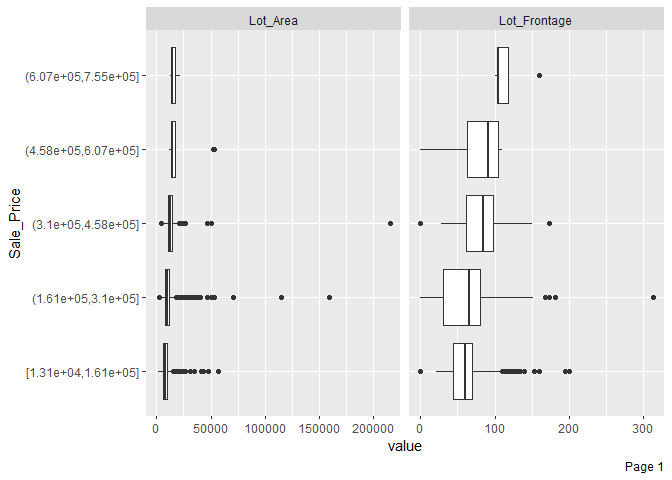<!-- -->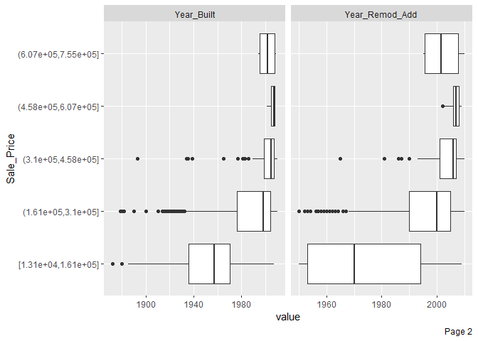<!-- -->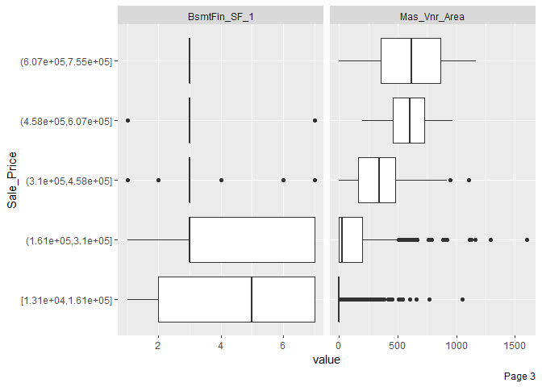<!-- -->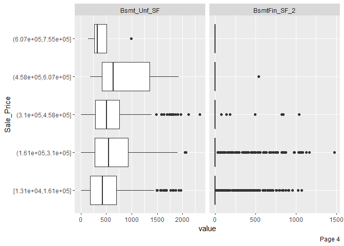<!-- --><!-- -->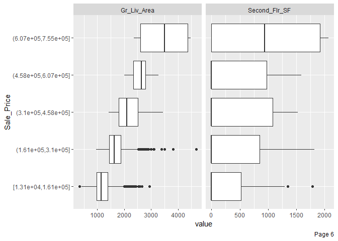<!-- -->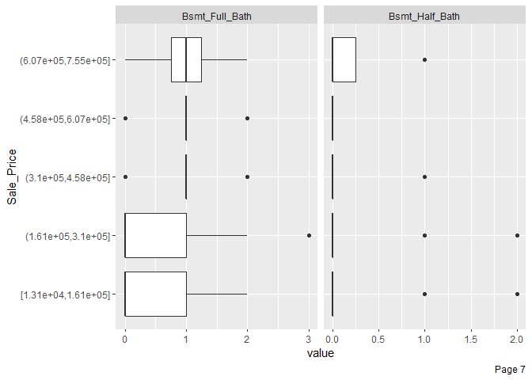<!-- --><!-- --><!-- -->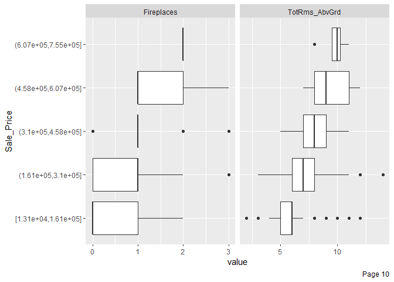<!-- --><!-- -->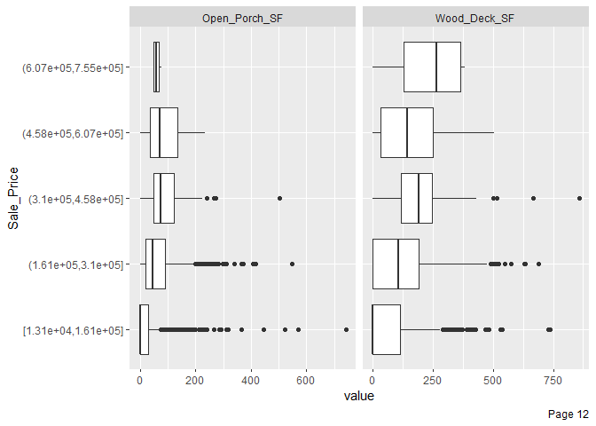<!-- -->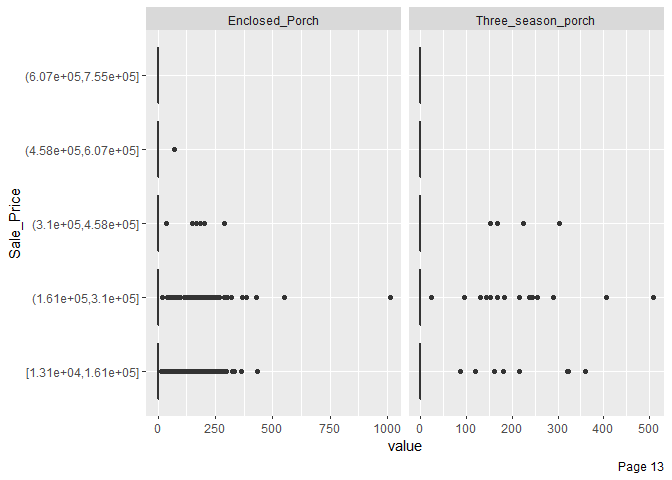<!-- -->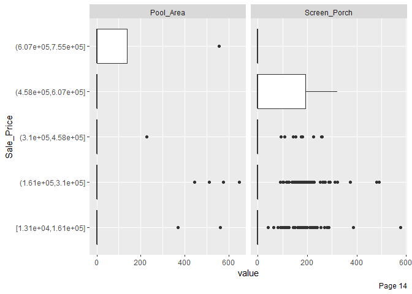<!-- --><!-- -->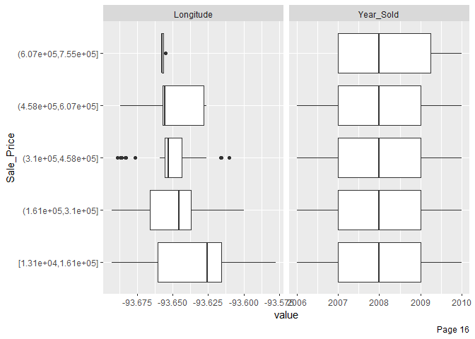<!-- --><!-- -->

# Target and Feature Engineering

*Data preprocessing* dan *engineering* mengacu pada proses penambahan,
penghapusan, atau transformasi data. Waktu yang diperlukan untuk
memikirkan identifikasi kebutuhan *data engineering* dapat berlangsung
cukup lama dan proprsinya akan menjadi yang terbesar dibandingkan
analisa lainnya. Hal ini disebabkan karena kita perlu untuk memahami
data apa yang akan kita oleh atau diinputkan ke dalam model.

Untuk menyederhanakan proses *feature engineerinh*, kita harus
memikirkannya sebagai sebuah *blueprint* dibanding melakukan tiap
tugasnya secara satu persatu. Hal ini membantu kita dalam dua hal:

1.  Berpikir secara berurutan
2.  Mengaplikasikannya secara tepat selama proses *resampling*

## Urutan Langkah-Langkah Feature Engineering

Memikirkan *feature engineering* sebagai sebuah *blueprint* memaksa kita
untuk memikirkan urutan langkah-langkah *preprocessing* data. Meskipun
setiap masalah mengharuskan kita untuk memikirkan efek *preprocessing*
berurutan, ada beberapa saran umum yang harus kita pertimbangkan:

  - Jika menggunakan log atau transformasi Box-Cox, jangan memusatkan
    data terlebih dahulu atau melakukan operasi apa pun yang dapat
    membuat data menjadi tidak positif. Atau, gunakan transformasi
    Yeo-Johnson sehingga kita tidak perlu khawatir tentang hal ini.
  - *One-hot* atau *dummy encoding* biasanya menghasilkan data jarang
    (*sparse*) yang dapat digunakan oleh banyak algoritma secara
    efisien. Jika kita menstandarisasikan data tersebut, kita akan
    membuat data menjadi padat (*dense*) dan kita kehilangan efisiensi
    komputasi. Akibatnya, sering kali lebih disukai untuk standardisasi
    fitur numerik kita dan kemudian *one-hot/dummy endode*.
  - Jika kila mengelompokkan kategori (*lumping*) yang jarang terjadi
    secara bersamaan, lakukan sebelum *one-hot/dummy endode*.
  - Meskipun kita dapat melakukan prosedur pengurangan dimensi pada
    fitur-fitur kategorikal, adalah umum untuk melakukannya terutama
    pada fitur numerik ketika melakukannya untuk tujuan rekayasa fitur.

Sementara kebutuhan proyek kita mungkin beragam, berikut ini adalah
urutan langkah-langkah potensial yang disarankan untuk sebagian besar
masalah:

1.  Filter fitur dengan varians nol (*zero varians*) atau hampir nol
    (*near zero varians*).
2.  Lakukan imputasi jika diperlukan.
3.  Normalisasi untuk menyelesaikan *skewness* fitur numerik.
4.  Standardisasi fitur numerik (*centering* dan *scaling*).
5.  Lakukan reduksi dimensi (mis., PCA) pada fitur numerik.
6.  *one-hot/dummy endode* pada fitur kategorikal.

## Meletakkan Seluruh Proses Secara Bersamaan

Untuk mengilustrasikan bagaimana proses ini bekerja bersama menggunakan
R, mari kita lakukan penilaian ulang sederhana pada set data `ames` yang
kita gunakan dan lihat apakah beberapa *feature engineering* sederhana
meningkatkan kemampuan prediksi model kita. Tapi pertama-tama, kita
berkenalan dengat paket `recipe`.

Paket `recipe` ini memungkinkan kita untuk mengembangkan *bluprint
feature engineering* secara berurutan. Gagasan di balik `recipe` mirip
dengan `caret :: preProcess()` di mana kita ingin membuat *blueprint
preprocessing* tetapi menerapkannya nanti dan dalam setiap resample.

Ada tiga langkah utama dalam membuat dan menerapkan rekayasa fitur
dengan `recipe`:

1.  `recipe()`: tempat kita menentukan langkah-langkah rekayasa fitur
    untuk membuat *blueprint*.
2.  `prep()`: memperkirakan parameter *feature engineering* berdasarkan
    data *training*.
3.  `bake()`: terapkan *blueprint* untuk data baru.

Langkah pertama adalah di mana kita menentukan *blueprint*. Dengan
proses ini, Kita memberikan formula model yang ingin kita buat (variabel
target, fitur, dan data yang menjadi dasarnya) dengan fungsi `recipe()`
dan kemudian kita secara bertahap menambahkan langkah-langkah rekayasa
fitur dengan fungsi `step_xxx()`.

Secara umum *tree based model* tidak memerlukan banyak *data
preprocessing*. Hal ini disebabkan karena model ini merupakan model
non-parameterik dan tidak bergantung pada bentuk distribusi data.
Tahapan *preprocessing* dimasudkan untuk menfilter fitur dengan varians
nol (*zero varians*) atau hampir nol (*near zero varians*) dan
standardisasi variabel untuk mempercepat proses komputasi model. Berikut
adalah implementasi tahapan tersebut:

``` r
blueprint <- recipe(Sale_Price ~., data = data_train) %>%
  # feature filtering
  step_nzv(all_nominal()) %>%
  # lumping
  step_other(all_nominal(), threshold = 0.05) 

blueprint
```

    ## Data Recipe
    ## 
    ## Inputs:
    ## 
    ##       role #variables
    ##    outcome          1
    ##  predictor         73
    ## 
    ## Operations:
    ## 
    ## Sparse, unbalanced variable filter on all_nominal()
    ## Collapsing factor levels for all_nominal()

Selanjutnya, *blueprint* yang telah dibuat dilakukan *training* pada
data *training*. Perlu diperhatikan, kita tidak melakukan proses
*training* pada data *test* untuk mencegah *data leakage*.

``` r
prepare <- prep(blueprint, training = data_train)
prepare
```

    ## Data Recipe
    ## 
    ## Inputs:
    ## 
    ##       role #variables
    ##    outcome          1
    ##  predictor         73
    ## 
    ## Training data contained 2053 data points and no missing data.
    ## 
    ## Operations:
    ## 
    ## Sparse, unbalanced variable filter removed Street, Alley, Land_Contour, ... [trained]
    ## Collapsing factor levels for MS_SubClass, MS_Zoning, Lot_Shape, ... [trained]

Langkah terakhir adalah mengaplikasikan *blueprint* pada data *training*
dan *test* menggunakan fungsi `bake()`.

``` r
baked_train <- bake(prepare, new_data = data_train)
baked_test <- bake(prepare, new_data = data_test)
baked_train
```

    ## # A tibble: 2,053 x 61
    ##    MS_SubClass MS_Zoning Lot_Frontage Lot_Area Lot_Shape Lot_Config Neighborhood
    ##    <fct>       <fct>            <dbl>    <int> <fct>     <fct>      <fct>       
    ##  1 One_Story_~ Resident~          141    31770 Slightly~ Corner     North_Ames  
    ##  2 One_Story_~ other               80    11622 Regular   Inside     North_Ames  
    ##  3 One_Story_~ Resident~           81    14267 Slightly~ Corner     North_Ames  
    ##  4 Two_Story_~ Resident~           78     9978 Slightly~ Inside     Gilbert     
    ##  5 One_Story_~ Resident~           41     4920 Regular   Inside     other       
    ##  6 One_Story_~ Resident~           39     5389 Slightly~ Inside     other       
    ##  7 Two_Story_~ Resident~           60     7500 Regular   Inside     Gilbert     
    ##  8 Two_Story_~ Resident~           75    10000 Slightly~ Corner     Gilbert     
    ##  9 Two_Story_~ Resident~           63     8402 Slightly~ Inside     Gilbert     
    ## 10 One_Story_~ Resident~           85    10176 Regular   Inside     Gilbert     
    ## # ... with 2,043 more rows, and 54 more variables: Condition_1 <fct>,
    ## #   Bldg_Type <fct>, House_Style <fct>, Overall_Cond <fct>, Year_Built <int>,
    ## #   Year_Remod_Add <int>, Roof_Style <fct>, Exterior_1st <fct>,
    ## #   Exterior_2nd <fct>, Mas_Vnr_Type <fct>, Mas_Vnr_Area <dbl>,
    ## #   Exter_Cond <fct>, Foundation <fct>, Bsmt_Exposure <fct>,
    ## #   BsmtFin_Type_1 <fct>, BsmtFin_SF_1 <dbl>, BsmtFin_SF_2 <dbl>,
    ## #   Bsmt_Unf_SF <dbl>, Total_Bsmt_SF <dbl>, Heating_QC <fct>,
    ## #   Central_Air <fct>, Electrical <fct>, First_Flr_SF <int>,
    ## #   Second_Flr_SF <int>, Gr_Liv_Area <int>, Bsmt_Full_Bath <dbl>,
    ## #   Bsmt_Half_Bath <dbl>, Full_Bath <int>, Half_Bath <int>,
    ## #   Bedroom_AbvGr <int>, Kitchen_AbvGr <int>, TotRms_AbvGrd <int>,
    ## #   Fireplaces <int>, Garage_Type <fct>, Garage_Finish <fct>,
    ## #   Garage_Cars <dbl>, Garage_Area <dbl>, Garage_Cond <fct>, Paved_Drive <fct>,
    ## #   Wood_Deck_SF <int>, Open_Porch_SF <int>, Enclosed_Porch <int>,
    ## #   Three_season_porch <int>, Screen_Porch <int>, Pool_Area <int>, Fence <fct>,
    ## #   Misc_Val <int>, Mo_Sold <int>, Year_Sold <int>, Sale_Type <fct>,
    ## #   Sale_Condition <fct>, Longitude <dbl>, Latitude <dbl>, Sale_Price <int>

``` r
skim(baked_train)
```

|                                                  |              |
| :----------------------------------------------- | :----------- |
| Name                                             | baked\_train |
| Number of rows                                   | 2053         |
| Number of columns                                | 61           |
| \_\_\_\_\_\_\_\_\_\_\_\_\_\_\_\_\_\_\_\_\_\_\_   |              |
| Column type frequency:                           |              |
| factor                                           | 27           |
| numeric                                          | 34           |
| \_\_\_\_\_\_\_\_\_\_\_\_\_\_\_\_\_\_\_\_\_\_\_\_ |              |
| Group variables                                  | None         |

Data summary

**Variable type: factor**

| skim\_variable   | n\_missing | complete\_rate | ordered | n\_unique | top\_counts                              |
| :--------------- | ---------: | -------------: | :------ | --------: | :--------------------------------------- |
| MS\_SubClass     |          0 |              1 | FALSE   |         5 | One: 753, oth: 549, Two: 395, One: 211   |
| MS\_Zoning       |          0 |              1 | FALSE   |         3 | Res: 1571, Res: 338, oth: 144            |
| Lot\_Shape       |          0 |              1 | FALSE   |         3 | Reg: 1321, Sli: 666, oth: 66             |
| Lot\_Config      |          0 |              1 | FALSE   |         4 | Ins: 1494, Cor: 361, Cul: 127, oth: 71   |
| Neighborhood     |          0 |              1 | FALSE   |         8 | oth: 892, Nor: 298, Col: 187, Old: 171   |
| Condition\_1     |          0 |              1 | FALSE   |         3 | Nor: 1768, oth: 165, Fee: 120            |
| Bldg\_Type       |          0 |              1 | FALSE   |         3 | One: 1692, oth: 183, Twn: 178            |
| House\_Style     |          0 |              1 | FALSE   |         4 | One: 1030, Two: 614, One: 233, oth: 176  |
| Overall\_Cond    |          0 |              1 | FALSE   |         4 | Ave: 1168, Abo: 370, Goo: 280, oth: 235  |
| Roof\_Style      |          0 |              1 | FALSE   |         3 | Gab: 1627, Hip: 387, oth: 39             |
| Exterior\_1st    |          0 |              1 | FALSE   |         6 | Vin: 718, Met: 321, Wd : 301, HdB: 295   |
| Exterior\_2nd    |          0 |              1 | FALSE   |         6 | Vin: 710, Met: 321, Wd : 287, oth: 273   |
| Mas\_Vnr\_Type   |          0 |              1 | FALSE   |         4 | Non: 1231, Brk: 624, Sto: 179, oth: 19   |
| Exter\_Cond      |          0 |              1 | FALSE   |         3 | Typ: 1792, Goo: 204, oth: 57             |
| Foundation       |          0 |              1 | FALSE   |         4 | PCo: 916, CBl: 870, Brk: 226, oth: 41    |
| Bsmt\_Exposure   |          0 |              1 | FALSE   |         5 | No: 1348, Av: 284, Gd: 205, Mn: 163      |
| BsmtFin\_Type\_1 |          0 |              1 | FALSE   |         7 | GLQ: 599, Unf: 588, ALQ: 313, Rec: 207   |
| Heating\_QC      |          0 |              1 | FALSE   |         4 | Exc: 1052, Typ: 593, Goo: 340, oth: 68   |
| Central\_Air     |          0 |              1 | FALSE   |         2 | Y: 1916, N: 137                          |
| Electrical       |          0 |              1 | FALSE   |         3 | SBr: 1873, Fus: 140, oth: 40             |
| Garage\_Type     |          0 |              1 | FALSE   |         5 | Att: 1230, Det: 534, Bui: 124, No\_: 109 |
| Garage\_Finish   |          0 |              1 | FALSE   |         4 | Unf: 863, RFn: 567, Fin: 512, No\_: 111  |
| Garage\_Cond     |          0 |              1 | FALSE   |         3 | Typ: 1870, No\_: 111, oth: 72            |
| Paved\_Drive     |          0 |              1 | FALSE   |         3 | Pav: 1862, Dir: 140, oth: 51             |
| Fence            |          0 |              1 | FALSE   |         3 | No\_: 1646, Min: 243, oth: 164           |
| Sale\_Type       |          0 |              1 | FALSE   |         3 | WD : 1775, New: 159, oth: 119            |
| Sale\_Condition  |          0 |              1 | FALSE   |         4 | Nor: 1692, Par: 164, Abn: 139, oth: 58   |

**Variable type: numeric**

| skim\_variable       | n\_missing | complete\_rate |      mean |       sd |       p0 |       p25 |       p50 |       p75 |      p100 | hist  |
| :------------------- | ---------: | -------------: | --------: | -------: | -------: | --------: | --------: | --------: | --------: | :---- |
| Lot\_Frontage        |          0 |              1 |     57.00 |    33.69 |     0.00 |     41.00 |     62.00 |     78.00 |    313.00 | ▇▇▁▁▁ |
| Lot\_Area            |          0 |              1 |  10121.14 |  8120.98 |  1300.00 |   7313.00 |   9375.00 |  11512.00 | 215245.00 | ▇▁▁▁▁ |
| Year\_Built          |          0 |              1 |   1971.07 |    30.52 |  1872.00 |   1952.00 |   1973.00 |   2000.00 |   2010.00 | ▁▂▃▆▇ |
| Year\_Remod\_Add     |          0 |              1 |   1984.42 |    20.79 |  1950.00 |   1966.00 |   1993.00 |   2004.00 |   2010.00 | ▅▂▂▃▇ |
| Mas\_Vnr\_Area       |          0 |              1 |    102.59 |   179.08 |     0.00 |      0.00 |      0.00 |    164.00 |   1600.00 | ▇▁▁▁▁ |
| BsmtFin\_SF\_1       |          0 |              1 |      4.16 |     2.24 |     1.00 |      3.00 |      3.00 |      7.00 |      7.00 | ▅▆▁▁▇ |
| BsmtFin\_SF\_2       |          0 |              1 |     52.20 |   172.62 |     0.00 |      0.00 |      0.00 |      0.00 |   1474.00 | ▇▁▁▁▁ |
| Bsmt\_Unf\_SF        |          0 |              1 |    558.79 |   437.52 |     0.00 |    219.00 |    467.00 |    797.00 |   2336.00 | ▇▅▂▁▁ |
| Total\_Bsmt\_SF      |          0 |              1 |   1050.67 |   425.77 |     0.00 |    784.00 |    992.00 |   1298.00 |   3206.00 | ▂▇▃▁▁ |
| First\_Flr\_SF       |          0 |              1 |   1158.36 |   383.60 |   334.00 |    880.00 |   1083.00 |   1384.00 |   3820.00 | ▇▇▁▁▁ |
| Second\_Flr\_SF      |          0 |              1 |    336.30 |   426.47 |     0.00 |      0.00 |      0.00 |    702.00 |   2065.00 | ▇▃▂▁▁ |
| Gr\_Liv\_Area        |          0 |              1 |   1499.56 |   494.55 |   334.00 |   1136.00 |   1441.00 |   1743.00 |   4676.00 | ▅▇▂▁▁ |
| Bsmt\_Full\_Bath     |          0 |              1 |      0.43 |     0.53 |     0.00 |      0.00 |      0.00 |      1.00 |      3.00 | ▇▆▁▁▁ |
| Bsmt\_Half\_Bath     |          0 |              1 |      0.06 |     0.25 |     0.00 |      0.00 |      0.00 |      0.00 |      2.00 | ▇▁▁▁▁ |
| Full\_Bath           |          0 |              1 |      1.57 |     0.56 |     0.00 |      1.00 |      2.00 |      2.00 |      4.00 | ▁▇▇▁▁ |
| Half\_Bath           |          0 |              1 |      0.38 |     0.50 |     0.00 |      0.00 |      0.00 |      1.00 |      2.00 | ▇▁▅▁▁ |
| Bedroom\_AbvGr       |          0 |              1 |      2.84 |     0.83 |     0.00 |      2.00 |      3.00 |      3.00 |      8.00 | ▁▇▂▁▁ |
| Kitchen\_AbvGr       |          0 |              1 |      1.04 |     0.21 |     0.00 |      1.00 |      1.00 |      1.00 |      3.00 | ▁▇▁▁▁ |
| TotRms\_AbvGrd       |          0 |              1 |      6.42 |     1.54 |     2.00 |      5.00 |      6.00 |      7.00 |     14.00 | ▁▇▆▁▁ |
| Fireplaces           |          0 |              1 |      0.61 |     0.65 |     0.00 |      0.00 |      1.00 |      1.00 |      3.00 | ▇▇▁▁▁ |
| Garage\_Cars         |          0 |              1 |      1.77 |     0.77 |     0.00 |      1.00 |      2.00 |      2.00 |      5.00 | ▅▇▂▁▁ |
| Garage\_Area         |          0 |              1 |    474.14 |   215.76 |     0.00 |    325.00 |    480.00 |    576.00 |   1390.00 | ▂▇▃▁▁ |
| Wood\_Deck\_SF       |          0 |              1 |     92.98 |   123.01 |     0.00 |      0.00 |      0.00 |    168.00 |    857.00 | ▇▂▁▁▁ |
| Open\_Porch\_SF      |          0 |              1 |     47.42 |    68.23 |     0.00 |      0.00 |     26.00 |     70.00 |    742.00 | ▇▁▁▁▁ |
| Enclosed\_Porch      |          0 |              1 |     24.02 |    65.83 |     0.00 |      0.00 |      0.00 |      0.00 |   1012.00 | ▇▁▁▁▁ |
| Three\_season\_porch |          0 |              1 |      2.99 |    27.75 |     0.00 |      0.00 |      0.00 |      0.00 |    508.00 | ▇▁▁▁▁ |
| Screen\_Porch        |          0 |              1 |     15.36 |    54.61 |     0.00 |      0.00 |      0.00 |      0.00 |    576.00 | ▇▁▁▁▁ |
| Pool\_Area           |          0 |              1 |      1.90 |    31.33 |     0.00 |      0.00 |      0.00 |      0.00 |    648.00 | ▇▁▁▁▁ |
| Misc\_Val            |          0 |              1 |     44.77 |   509.47 |     0.00 |      0.00 |      0.00 |      0.00 |  15500.00 | ▇▁▁▁▁ |
| Mo\_Sold             |          0 |              1 |      6.20 |     2.71 |     1.00 |      4.00 |      6.00 |      8.00 |     12.00 | ▅▆▇▃▃ |
| Year\_Sold           |          0 |              1 |   2007.79 |     1.31 |  2006.00 |   2007.00 |   2008.00 |   2009.00 |   2010.00 | ▇▇▇▇▃ |
| Longitude            |          0 |              1 |   \-93.64 |     0.03 |  \-93.69 |   \-93.66 |   \-93.64 |   \-93.62 |   \-93.58 | ▅▅▇▆▁ |
| Latitude             |          0 |              1 |     42.03 |     0.02 |    41.99 |     42.02 |     42.03 |     42.05 |     42.06 | ▂▂▇▇▇ |
| Sale\_Price          |          0 |              1 | 180996.28 | 80258.90 | 13100.00 | 129500.00 | 160000.00 | 213500.00 | 755000.00 | ▇▇▁▁▁ |

# Random Forest

Bagging (agregasi bootstrap) adalah teknik yang dapat mengubah model
pohon tunggal dengan varian tinggi dan kemampuan prediksi yang buruk
menjadi fungsi prediksi yang cukup akurat. Sayangnya, bagging biasanya
kekurangan, yiatu: adanya korelasi pada tiap pohon yang mengurangi
kinerja keseluruhan model. *Random forest* adalah modifikasi bagging
yang membangun koleksi besar pohon yang tidak berkorelasi dan telah
menjadi algoritma pembelajaran “out-of-the-box” yang sangat populer yang
dengan kinerja prediksi yang baik.

*Random forest* dibangun di atas prinsip-prinsip dasar yang sama seperti
*decision tress* dan bagging. Bagging memperkenalkan komponen acak ke
dalam proses pembangunan pohon yang mengurangi varian prediksi pohon
tunggal dan meningkatkan kinerja prediksi. Namun, pohon-pohon di bagging
tidak sepenuhnya independen satu sama lain karena semua prediktor asli
dianggap di setiap split setiap pohon. Sebaliknya, pohon dari sampel
bootstrap yang berbeda biasanya memiliki struktur yang mirip satu sama
lain (terutama di bagian atas pohon) karena hubungan yang mendasarinya.

Sebagai contoh, jika kita membuat enam pohon keputusan dengan sampel
bootstrap data perumahan Boston yang berbeda, kita melihat bahwa puncak
pohon semua memiliki struktur yang sangat mirip. Meskipun ada 15
variabel prediktor untuk dipecah, keenam pohon memiliki kedua variabel
lstat dan rm yang mendorong beberapa split pertama.

Sebagai contoh, jika kita membuat enam *decision trees* dengan sampel
bootstrap [data perumahan
Boston](http://uc-r.github.io/\(http://lib.stat.cmu.edu/datasets/boston\))
yang berbeda, kita melihat bahwa puncak pohon semua memiliki struktur
yang sangat mirip. Meskipun ada 15 variabel prediktor untuk dipecah,
keenam pohon memiliki kedua variabel `lstat` dan `rm` yang mendorong
beberapa split pertama.


Karakteristik ini dikenal sebagai **korelasi pohon** dan mencegah
bagging dari secara optimal mengurangi varians dari nilai-nilai
prediktif. Untuk mengurangi varian lebih lanjut, kita perlu meminimalkan
jumlah korelasi antar pohon-pohon tersebut. Ini bisa dicapai dengan
menyuntikkan lebih banyak keacakan ke dalam proses penanaman pohon.
*Random Forest* mencapai ini dalam dua cara:

1.  **Bootstrap**: mirip dengan bagging, setiap pohon ditumbuhkan ke set
    data *bootstrap resampled*, yang membuatnya berbeda dan agak
    mendekorelasi antar pohon tersebut.
2.  **Split-variable randomization**: setiap kali pemisahan dilakukan,
    pencarian untuk variabel terbagi terbatas pada subset acak \(m\)
    dari variabel \(p\). Untuk pohon regresi, nilai default tipikal
    adalah \(m = p/3\) tetapi ini harus dianggap sebagai *parameter
    tuning*. Ketika \(m = p\), jumlah pengacakan hanya menggunakan
    langkah 1 dan sama dengan bagging.

Algoritma dasar dari *random forest* adalah sebagai berikut:

    1.  Diberikan set data training
    2.  Pilih jumlah pohon yang akan dibangun (n_trees)
    3.  for i = 1 to n_trees do
    4.  | Hasilkan sampel bootstrap dari data asli
    5.  | Tumbuhkan pohon regresi / klasifikasi ke data yang di-bootstrap
    6.  | for each split do
    7.  | | Pilih variabel m_try secara acak dari semua variabel p
    8.  | | Pilih variabel / titik-split terbaik di antara m_try
    9.  | | Membagi node menjadi dua node anak
    10. | end
    11. | Gunakan kriteria berhenti model pohon biasa untuk menentukan 
        | kapan pohon selesai (tapi jangan pangkas)
    12. end
    13. Output ensemble of trees 

Karena algoritma secara acak memilih sampel bootstrap untuk dilatih dan
prediktor digunakan pada setiap split, korelasi pohon akan berkurang
melebihi bagging.

## OOB Error vs Test Set Error

Mirip dengan bagging, manfaat alami dari proses *bootstrap resampling*
adalah *randomforest* memiliki sampel *out-of-bag* (OOB) yang memberikan
perkiraan kesalahan pengujian yang efisien dan masuk akal. Ini
memberikan satu set validasi bawaan tanpa kerja ekstra , dan kita tidak
perlu mengorbankan data *training* apa pun untuk digunakan untuk
validasi. Ini membuat proses identifikasi jumlah pohon yang diperlukan
untuk menstabilkan tingkat kesalahan selama proses *tuning* menjadi
lebih efisien; Namun, seperti yang diilustrasikan di bawah ini, beberapa
perbedaan antara kesalahan OOB dan kesalahan tes diharapkan.


Selain itu, banyak paket tidak melacak pengamatan mana yang merupakan
bagian dari sampel OOB untuk pohon tertentu dan yang tidak. Jika kita
membandingkan beberapa model dengan yang lain, kita ingin membuat skor
masing-masing pada set validasi yang sama untuk membandingkan kinerja.
Selain itu, meskipun secara teknis dimungkinkan untuk menghitung metrik
tertentu seperti *root mean squared logarithmic error* (RMSLE) pada
sampel OOB, itu tidak dibangun untuk semua paket. Jadi jika kita ingin
membandingkan beberapa model atau menggunakan fungsi *loss* yang sedikit
lebih tradisional, kita mungkin ingin tetap melakukan validasi silang.

## Kelebihan dan Kekurangan

**Kelbihan**

  - Biasanya memiliki kinerja yang sangat bagus
  - “*Out-of-the-box*” yang luar biasa bagus - sangat sedikit
    penyesuaian yang diperlukan
  - Kumpulan validasi bawaan - tidak perlu mengorbankan data untuk
    validasi tambahan
  - Tidak diperlukan pra-pemrosesan
  - Bersifat *robust* dengan adanya *outlier*

**Kekurangan**

  - Dapat menjadi lambat pada set data besar
  - Meskipun akurat, seringkali tidak dapat bersaing dengan algoritma
    *boosting*
  - Kurang mudah untuk ditafsirkan

## Validasi Silang dan Parameter Tuning

Pada fungsi `trainControl()` argumen yang digunakan sama dengan model
bagging.

``` r
library(doParallel)
cl <- makePSOCKcluster(2)
registerDoParallel(cl)

# spesifikasi metode validasi silang
cv <- trainControl(
  # possible value: "boot", "boot632", "optimism_boot", "boot_all", "cv", 
  #                 "repeatedcv", "LOOCV", "LGOCV"
  method = "cv", 
  number = 10,
  # repeats = 5,
  allowParallel = TRUE
)
```

Pada proses *training*, kita akan melakukan *parameter tuning*
menggunakan metode *grid search*. Parameter yang akan dilakukan tuning
pada model ini adalah `mtry` yang merupakan parameter *split-variable
randomization*.

``` r
hyper_grid <- expand.grid(
  mtry = seq(10, 30, by = 4)
)
```

Pada proses training, `method` yang digunakan adalah `parRF` atau
*parallel random forest*. Metode ini memerlukan sejumlah paket tambahan
untuk memastikan proses parallel dapat berjalan, seperti: `e1071`,
`randomForest`, `plyr`, dan `import`.

``` r
# membuat model
system.time(
model_fit_cv <- train(
  blueprint,
  data = data_train,
  method = "parRF",
  trControl = cv,
  tuneGrid = hyper_grid,
  metric = "RMSE"
  )
)
```

    ##    user  system elapsed 
    ##    2.84    2.78 5354.86

``` r
stopCluster(cl)

model_fit_cv
```

    ## Parallel Random Forest 
    ## 
    ## 2053 samples
    ##   73 predictor
    ## 
    ## Recipe steps: nzv, other 
    ## Resampling: Cross-Validated (10 fold) 
    ## Summary of sample sizes: 1847, 1847, 1847, 1848, 1847, 1849, ... 
    ## Resampling results across tuning parameters:
    ## 
    ##   mtry  RMSE      Rsquared   MAE     
    ##   10    27792.53  0.8895229  17215.47
    ##   14    27796.03  0.8877335  17240.66
    ##   18    27790.20  0.8870552  17213.10
    ##   22    27572.34  0.8880975  17187.21
    ##   26    27702.57  0.8866060  17231.73
    ##   30    27617.94  0.8867431  17225.29
    ## 
    ## RMSE was used to select the optimal model using the smallest value.
    ## The final value used for the model was mtry = 22.

Proses *training* berlangsung selama 1780.221 detik dengan 11 model
terbentuk. Dari seluruh model tersebut, model dengan parameter `mtry
= 28` memiliki rata-rata **RMSE** yang paling baik. Untuk dapat
mengakses **RMSE** model terbaik, jalankan sintaks berikut:

``` r
rmse <- model_fit_cv$results %>%
  arrange(RMSE) %>%
  slice(1) %>%
  select(RMSE) %>% pull()

rmse
```

    ## [1] 27572.34

Nilai **RMSE** model *random forest* yang dihasilkan jauh lebih baik
dibandingkan dua model awal. Reduksi terhadap jumlah pohon yang saling
berkorelasi telah meningkatkan performa model secara signifikan.

Berikut adalah ringkasan performa masing-masing model:

``` r
# visualisasi
ggplot(model_fit_cv)
```

<!-- -->

## Model AKhir

Untuk mengekstrak model final, jalankan sintaks berikut:

``` r
model_fit <- model_fit_cv$finalModel
```

Untuk mengeceke performa model dalam melakukan prediksi, kita dapat
mengecek plot residual model tersebut.

``` r
pred_train <- predict(model_fit, baked_train)
residual <- mutate(baked_train, residual = Sale_Price - pred_train)

# resiual vs actual
sc <- ggplot(residual, aes(x = Sale_Price, y = residual)) +
  geom_point() 
# residual distribution
hs <- ggplot(residual, aes(x = residual)) +
  geom_histogram()

gridExtra::grid.arrange(sc, hs, ncol = 2)
```

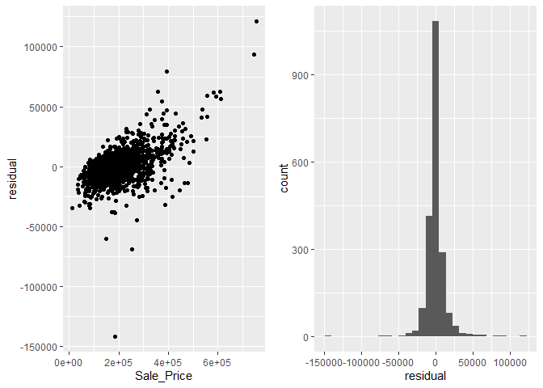<!-- -->

Performa prediksi model mengalami oeningkatan dibanding dua model
sebelumnya yang ditunjukkan adanya reduksi dari pola heterkodestisitas
pada plot yang dihasilkan.

Untuk mengecek performa prediksi model pada dataset baru (data *test*),
jalankan sintaks berikut:

``` r
# prediksi Sale_Price data_test
pred_test <- predict(model_fit, baked_test)

## RMSE
RMSE(pred_test, baked_test$Sale_Price, na.rm = TRUE)
```

    ## [1] 27253.37

## Interpretasi Fitur

Untuk mengetahui variabel apa yang paling berpengaruh terhadap performa
model, kita dapat menggunakan visualisasi *variabel importance plot*.

``` r
vip(model_fit, num_features = 10)
```

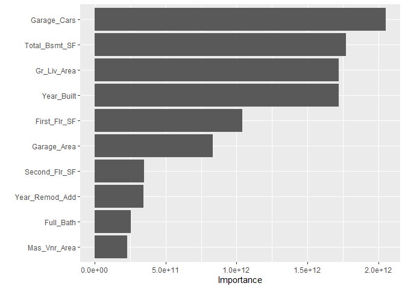<!-- -->

Berdasarkan visualisasi tersebut, terdapat tiga buah variabel yang
memiliki nilai kepentingan yang tinggi, yaitu: `Garage_Cars`,
`Year_Built`, dan `Gr_Liv_Area`. Untuk mengetahui efek dari ketiga
variabel tersebut terhadap kemampuan prediksi model, jalankan sintaks
berikut:

``` r
p1 <- pdp::partial(model_fit_cv, pred.var = "Garage_Cars") %>% autoplot()
p2 <- pdp::partial(model_fit_cv, pred.var = "Year_Built") %>% autoplot()
p3 <- pdp::partial(model_fit_cv, pred.var = "Gr_Liv_Area") %>% autoplot()


gridExtra::grid.arrange(p1, p2, p3, 
                        ncol=2)
```

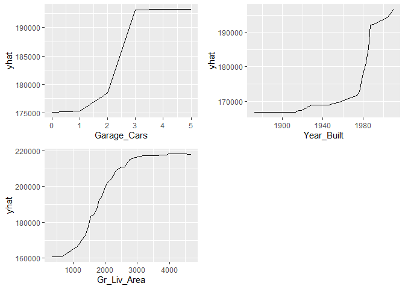<!-- -->

Berdasarkan output yang dihasilkan, ketiga variabel memiliki relasi
non-linier terhadap variabel target.
