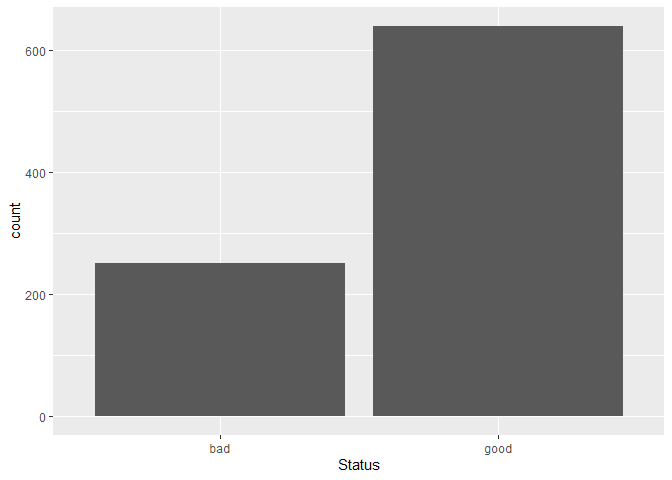
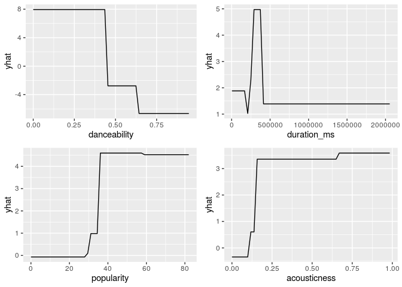

Analisis Prediktif Harga Rumah Menggunakan Tree Based Algorithm
================
Moh. Rosidi
7/22/2020

# Dataset Ames

Sebuah dataset terkait data properti yang ada di Ames IA. Dataset ini
memiliki 82 variabel dan 2930 baris. Untuk informasi lebih lanjut
terkait dataset ini, kunjungin tautan berikut:

  - <https://ww2.amstat.org/publications/jse/v19n3/decock/DataDocumentation.txt>
  - <http://ww2.amstat.org/publications/jse/v19n3/decock.pdf>

# Persiapan

## Library

Terdapat beberapa paket yang digunakan dalam pembuatan model prediktif
menggunakan *tree based algorithm*. Paket-paket ditampilkan sebagai
berikut:

``` r
# library pembantu
library(plyr)
library(e1071)
library(foreach)
library(import)
library(tidyverse)
library(rsample)
library(recipes)
library(DataExplorer)
library(skimr)
library(modeldata)

# library model
library(caret) 
library(rpart)
library(ipred)
library(randomForest)
library(gbm)

# paket penjelasan model
library(rpart.plot)  
library(vip)
library(pdp)
```

**Paket Pembantu**

1.  `plyr` : paket manipulasi data yang digunakan untuk membantu proses
    *fitting* sejumlah model pohon.
2.  `e1071` : paket dengan sejumlah fungsi untuk melakukan *latent class
    analysis, short time Fourier transform, fuzzy clustering, support
    vector machines, shortest path computation, bagged clustering, naive
    Bayes classifier*, dll. Paket ini merupakan paket pembantu dalam
    proses *fitting* sejumlah model pohon
3.  `foreach` : paket untuk melakukan *parallel computing*. Diperlukan
    untuk melakukan *fitting* model *parallel random forest*
4.  `import` : paket yang menangani *dependency* fungsi antar paket
    dalam proses *fitting* model *parallel random forest*
5.  `tidyverse` : kumpulan paket dalam bidang data science
6.  `rsample` : membantu proses *data splitting*
7.  `recipes`: membantu proses data pra-pemrosesan
8.  `DataExplorer` : EDA
9.  `skimr` : membuat ringkasan data
10. `modeldata` : kumpulan dataset untuk membuat model *machine
    learning*

**Paket untuk Membangun Model**

1.  `caret` : berisikan sejumlah fungsi yang dapat merampingkan proses
    pembuatan model regresi dan klasifikasi
2.  `rpart` : membentuk model *decision trees*
3.  `ipred` : membentuk model *bagging*
4.  `randomForest` : membentuk model *random forest*
5.  `gbm` : membentuk model *gradient boost model*

**Paket Interpretasi Model**

1.  `rpart.plot` : visualisasi *decision trees*
2.  `vip` : visualisasi *variable importance*
3.  `pdp` : visualisasi plot ketergantungan parsial

## Import Dataset

Import dataset dilakukan dengan menggunakan fungsi `data()`. Fungsi ini
digunakan untuk mengambil data yang ada dalam sebuah paket.

``` r
data("ames")
```

# Data Splitting

Proses *data splitting* dilakukan setelah data di import ke dalam
sistem. Hal ini dilakukan untuk memastikan tidak adanya kebocoran data
yang mempengaruhi proses pembuatan model. Data dipisah menjadi dua buah
set, yaitu: *training* dan *test*. Data *training* adalah data yang akan
kita gunakan untuk membentuk model. Seluruh proses sebelum uji model
akan menggunakan data *training*. Proses tersebut, antara lain: EDA,
*feature engineering*, dan validasi silang. Data *test* hanya digunakan
saat kita akan menguji performa model dengan data baru yang belum pernah
dilihat sebelumnya.

Terdapat dua buah jenis sampling pada tahapan *data splitting*, yaitu:

1.  *random sampling* : sampling acak tanpa mempertimbangkan adanya
    strata dalam data
2.  *startified random sampling* : sampling dengan memperhatikan strata
    dalam sebuah variabel.

Dalam proses pembentukan model kali ini, kita akan menggunakan metode
kedua dengan tujuan untuk memperoleh distribusi yang seragam dari
variabel target (`Sale_Price`).

``` r
set.seed(123)

split  <- initial_split(ames, prop = 0.7, strata = "Sale_Price")
ames_train  <- training(split)
ames_test   <- testing(split)
```

Untuk mengecek distribusi dari kedua set data, kita dapat
mevisualisasikan distribusi dari variabel target pada kedua set
tersebut.

``` r
# training set
ggplot(ames_train, aes(x = Sale_Price)) + 
  geom_density() 
```

<!-- -->

``` r
# test set
ggplot(ames_test, aes(x = Sale_Price)) + 
  geom_density() 
```

<!-- -->

# Analisis Data Eksploratif

Analsiis data eksploratif (EDA) ditujukan untuk mengenali data sebelum
kita menentukan algoritma yang cocok digunakan untuk menganalisa data
lebih lanjut. EDA merupakan sebuah proses iteratif yang secara garis
besar menjawab beberapa pertanyaan umum, seperti:

1.  Bagaimana distribusi data pada masing-masing variabel?
2.  Apakah terdapat asosiasi atau hubungan antar variabel dalam data?

## Ringkasan Data

Terdapat dua buah fungsi yang digunakan dalam membuat ringkasan data,
antara lain:

1.  `glimpse()`: varian dari `str()` untuk mengecek struktur data.
    Fungsi ini menampilkan transpose dari tabel data dengan menambahkan
    informasi, seperti: jenis data dan dimensi tabel.
2.  `skim()` : fungsi dari paket `skimr` untuk membuat ringkasan data
    yang lebih detail dibanding `glimpse()`, seperti: statistika
    deskriptif masing-masing kolom, dan informasi *missing value* dari
    masing-masing kolom.
3.  `plot_missing()` : fungsi untuk memvisualisasikan persentase
    *missing value* pada masing-masing variabel atau kolom data

<!-- end list -->

``` r
glimpse(ames_train)
```

    ## Rows: 2,053
    ## Columns: 74
    ## $ MS_SubClass        <fct> One_Story_1946_and_Newer_All_Styles, One_Story_194…
    ## $ MS_Zoning          <fct> Residential_Low_Density, Residential_High_Density,…
    ## $ Lot_Frontage       <dbl> 141, 80, 81, 78, 41, 39, 60, 75, 63, 85, 47, 152, …
    ## $ Lot_Area           <int> 31770, 11622, 14267, 9978, 4920, 5389, 7500, 10000…
    ## $ Street             <fct> Pave, Pave, Pave, Pave, Pave, Pave, Pave, Pave, Pa…
    ## $ Alley              <fct> No_Alley_Access, No_Alley_Access, No_Alley_Access,…
    ## $ Lot_Shape          <fct> Slightly_Irregular, Regular, Slightly_Irregular, S…
    ## $ Land_Contour       <fct> Lvl, Lvl, Lvl, Lvl, Lvl, Lvl, Lvl, Lvl, Lvl, Lvl, …
    ## $ Utilities          <fct> AllPub, AllPub, AllPub, AllPub, AllPub, AllPub, Al…
    ## $ Lot_Config         <fct> Corner, Inside, Corner, Inside, Inside, Inside, In…
    ## $ Land_Slope         <fct> Gtl, Gtl, Gtl, Gtl, Gtl, Gtl, Gtl, Gtl, Gtl, Gtl, …
    ## $ Neighborhood       <fct> North_Ames, North_Ames, North_Ames, Gilbert, Stone…
    ## $ Condition_1        <fct> Norm, Feedr, Norm, Norm, Norm, Norm, Norm, Norm, N…
    ## $ Condition_2        <fct> Norm, Norm, Norm, Norm, Norm, Norm, Norm, Norm, No…
    ## $ Bldg_Type          <fct> OneFam, OneFam, OneFam, OneFam, TwnhsE, TwnhsE, On…
    ## $ House_Style        <fct> One_Story, One_Story, One_Story, Two_Story, One_St…
    ## $ Overall_Cond       <fct> Average, Above_Average, Above_Average, Above_Avera…
    ## $ Year_Built         <int> 1960, 1961, 1958, 1998, 2001, 1995, 1999, 1993, 19…
    ## $ Year_Remod_Add     <int> 1960, 1961, 1958, 1998, 2001, 1996, 1999, 1994, 19…
    ## $ Roof_Style         <fct> Hip, Gable, Hip, Gable, Gable, Gable, Gable, Gable…
    ## $ Roof_Matl          <fct> CompShg, CompShg, CompShg, CompShg, CompShg, CompS…
    ## $ Exterior_1st       <fct> BrkFace, VinylSd, Wd Sdng, VinylSd, CemntBd, Cemnt…
    ## $ Exterior_2nd       <fct> Plywood, VinylSd, Wd Sdng, VinylSd, CmentBd, Cment…
    ## $ Mas_Vnr_Type       <fct> Stone, None, BrkFace, BrkFace, None, None, None, N…
    ## $ Mas_Vnr_Area       <dbl> 112, 0, 108, 20, 0, 0, 0, 0, 0, 0, 603, 0, 350, 0,…
    ## $ Exter_Cond         <fct> Typical, Typical, Typical, Typical, Typical, Typic…
    ## $ Foundation         <fct> CBlock, CBlock, CBlock, PConc, PConc, PConc, PConc…
    ## $ Bsmt_Cond          <fct> Good, Typical, Typical, Typical, Typical, Typical,…
    ## $ Bsmt_Exposure      <fct> Gd, No, No, No, Mn, No, No, No, No, Gd, Gd, Av, Av…
    ## $ BsmtFin_Type_1     <fct> BLQ, Rec, ALQ, GLQ, GLQ, GLQ, Unf, Unf, Unf, GLQ, …
    ## $ BsmtFin_SF_1       <dbl> 2, 6, 1, 3, 3, 3, 7, 7, 7, 3, 1, 3, 3, 4, 1, 2, 3,…
    ## $ BsmtFin_Type_2     <fct> Unf, LwQ, Unf, Unf, Unf, Unf, Unf, Unf, Unf, Unf, …
    ## $ BsmtFin_SF_2       <dbl> 0, 144, 0, 0, 0, 0, 0, 0, 0, 0, 0, 0, 0, 0, 163, 0…
    ## $ Bsmt_Unf_SF        <dbl> 441, 270, 406, 324, 722, 415, 994, 763, 789, 663, …
    ## $ Total_Bsmt_SF      <dbl> 1080, 882, 1329, 926, 1338, 1595, 994, 763, 789, 1…
    ## $ Heating            <fct> GasA, GasA, GasA, GasA, GasA, GasA, GasA, GasA, Ga…
    ## $ Heating_QC         <fct> Fair, Typical, Typical, Excellent, Excellent, Exce…
    ## $ Central_Air        <fct> Y, Y, Y, Y, Y, Y, Y, Y, Y, Y, Y, Y, Y, Y, Y, Y, Y,…
    ## $ Electrical         <fct> SBrkr, SBrkr, SBrkr, SBrkr, SBrkr, SBrkr, SBrkr, S…
    ## $ First_Flr_SF       <int> 1656, 896, 1329, 926, 1338, 1616, 1028, 763, 789, …
    ## $ Second_Flr_SF      <int> 0, 0, 0, 678, 0, 0, 776, 892, 676, 0, 1589, 672, 0…
    ## $ Gr_Liv_Area        <int> 1656, 896, 1329, 1604, 1338, 1616, 1804, 1655, 146…
    ## $ Bsmt_Full_Bath     <dbl> 1, 0, 0, 0, 1, 1, 0, 0, 0, 1, 1, 0, 1, 0, 1, 0, 1,…
    ## $ Bsmt_Half_Bath     <dbl> 0, 0, 0, 0, 0, 0, 0, 0, 0, 0, 0, 0, 0, 0, 0, 0, 0,…
    ## $ Full_Bath          <int> 1, 1, 1, 2, 2, 2, 2, 2, 2, 1, 3, 2, 1, 1, 2, 2, 2,…
    ## $ Half_Bath          <int> 0, 0, 1, 1, 0, 0, 1, 1, 1, 1, 1, 0, 1, 0, 0, 0, 0,…
    ## $ Bedroom_AbvGr      <int> 3, 2, 3, 3, 2, 2, 3, 3, 3, 2, 4, 4, 1, 2, 3, 3, 3,…
    ## $ Kitchen_AbvGr      <int> 1, 1, 1, 1, 1, 1, 1, 1, 1, 1, 1, 1, 1, 1, 1, 1, 1,…
    ## $ TotRms_AbvGrd      <int> 7, 5, 6, 7, 6, 5, 7, 7, 7, 5, 12, 8, 8, 4, 7, 7, 6…
    ## $ Functional         <fct> Typ, Typ, Typ, Typ, Typ, Typ, Typ, Typ, Typ, Typ, …
    ## $ Fireplaces         <int> 2, 0, 0, 1, 0, 1, 1, 1, 1, 1, 1, 0, 1, 0, 2, 1, 2,…
    ## $ Garage_Type        <fct> Attchd, Attchd, Attchd, Attchd, Attchd, Attchd, At…
    ## $ Garage_Finish      <fct> Fin, Unf, Unf, Fin, Fin, RFn, Fin, Fin, Fin, Unf, …
    ## $ Garage_Cars        <dbl> 2, 1, 1, 2, 2, 2, 2, 2, 2, 2, 3, 2, 3, 2, 2, 2, 2,…
    ## $ Garage_Area        <dbl> 528, 730, 312, 470, 582, 608, 442, 440, 393, 506, …
    ## $ Garage_Cond        <fct> Typical, Typical, Typical, Typical, Typical, Typic…
    ## $ Paved_Drive        <fct> Partial_Pavement, Paved, Paved, Paved, Paved, Pave…
    ## $ Wood_Deck_SF       <int> 210, 140, 393, 360, 0, 237, 140, 157, 0, 192, 503,…
    ## $ Open_Porch_SF      <int> 62, 0, 36, 36, 0, 152, 60, 84, 75, 0, 36, 12, 0, 0…
    ## $ Enclosed_Porch     <int> 0, 0, 0, 0, 170, 0, 0, 0, 0, 0, 0, 0, 0, 0, 0, 0, …
    ## $ Three_season_porch <int> 0, 0, 0, 0, 0, 0, 0, 0, 0, 0, 0, 0, 0, 0, 0, 0, 0,…
    ## $ Screen_Porch       <int> 0, 120, 0, 0, 0, 0, 0, 0, 0, 0, 210, 0, 0, 0, 0, 0…
    ## $ Pool_Area          <int> 0, 0, 0, 0, 0, 0, 0, 0, 0, 0, 0, 0, 0, 0, 0, 0, 0,…
    ## $ Pool_QC            <fct> No_Pool, No_Pool, No_Pool, No_Pool, No_Pool, No_Po…
    ## $ Fence              <fct> No_Fence, Minimum_Privacy, No_Fence, No_Fence, No_…
    ## $ Misc_Feature       <fct> None, None, Gar2, None, None, None, None, None, No…
    ## $ Misc_Val           <int> 0, 0, 12500, 0, 0, 0, 0, 0, 0, 0, 0, 0, 0, 0, 0, 0…
    ## $ Mo_Sold            <int> 5, 6, 6, 6, 4, 3, 6, 4, 5, 2, 6, 6, 6, 6, 2, 1, 1,…
    ## $ Year_Sold          <int> 2010, 2010, 2010, 2010, 2010, 2010, 2010, 2010, 20…
    ## $ Sale_Type          <fct> WD , WD , WD , WD , WD , WD , WD , WD , WD , WD , …
    ## $ Sale_Condition     <fct> Normal, Normal, Normal, Normal, Normal, Normal, No…
    ## $ Sale_Price         <int> 215000, 105000, 172000, 195500, 213500, 236500, 18…
    ## $ Longitude          <dbl> -93.61975, -93.61976, -93.61939, -93.63893, -93.63…
    ## $ Latitude           <dbl> 42.05403, 42.05301, 42.05266, 42.06078, 42.06298, …

``` r
skim(ames_train)
```

|                                                  |             |
| :----------------------------------------------- | :---------- |
| Name                                             | ames\_train |
| Number of rows                                   | 2053        |
| Number of columns                                | 74          |
| \_\_\_\_\_\_\_\_\_\_\_\_\_\_\_\_\_\_\_\_\_\_\_   |             |
| Column type frequency:                           |             |
| factor                                           | 40          |
| numeric                                          | 34          |
| \_\_\_\_\_\_\_\_\_\_\_\_\_\_\_\_\_\_\_\_\_\_\_\_ |             |
| Group variables                                  | None        |

Data summary

**Variable type: factor**

| skim\_variable   | n\_missing | complete\_rate | ordered | n\_unique | top\_counts                              |
| :--------------- | ---------: | -------------: | :------ | --------: | :--------------------------------------- |
| MS\_SubClass     |          0 |              1 | FALSE   |        16 | One: 753, Two: 395, One: 211, One: 145   |
| MS\_Zoning       |          0 |              1 | FALSE   |         7 | Res: 1571, Res: 338, Flo: 102, Res: 19   |
| Street           |          0 |              1 | FALSE   |         2 | Pav: 2046, Grv: 7                        |
| Alley            |          0 |              1 | FALSE   |         3 | No\_: 1909, Gra: 93, Pav: 51             |
| Lot\_Shape       |          0 |              1 | FALSE   |         4 | Reg: 1321, Sli: 666, Mod: 54, Irr: 12    |
| Land\_Contour    |          0 |              1 | FALSE   |         4 | Lvl: 1850, HLS: 83, Bnk: 75, Low: 45     |
| Utilities        |          0 |              1 | FALSE   |         3 | All: 2050, NoS: 2, NoS: 1                |
| Lot\_Config      |          0 |              1 | FALSE   |         5 | Ins: 1494, Cor: 361, Cul: 127, FR2: 62   |
| Land\_Slope      |          0 |              1 | FALSE   |         3 | Gtl: 1958, Mod: 86, Sev: 9               |
| Neighborhood     |          0 |              1 | FALSE   |        27 | Nor: 298, Col: 187, Old: 171, Edw: 146   |
| Condition\_1     |          0 |              1 | FALSE   |         9 | Nor: 1768, Fee: 120, Art: 63, RRA: 35    |
| Condition\_2     |          0 |              1 | FALSE   |         7 | Nor: 2031, Fee: 10, Pos: 4, Art: 3       |
| Bldg\_Type       |          0 |              1 | FALSE   |         5 | One: 1692, Twn: 178, Twn: 74, Dup: 66    |
| House\_Style     |          0 |              1 | FALSE   |         8 | One: 1030, Two: 614, One: 233, SLv: 84   |
| Overall\_Cond    |          0 |              1 | FALSE   |         9 | Ave: 1168, Abo: 370, Goo: 280, Ver: 95   |
| Roof\_Style      |          0 |              1 | FALSE   |         6 | Gab: 1627, Hip: 387, Gam: 17, Fla: 14    |
| Roof\_Matl       |          0 |              1 | FALSE   |         5 | Com: 2024, Tar: 16, WdS: 7, WdS: 5       |
| Exterior\_1st    |          0 |              1 | FALSE   |        14 | Vin: 718, Met: 321, Wd : 301, HdB: 295   |
| Exterior\_2nd    |          0 |              1 | FALSE   |        16 | Vin: 710, Met: 321, Wd : 287, HdB: 267   |
| Mas\_Vnr\_Type   |          0 |              1 | FALSE   |         4 | Non: 1231, Brk: 624, Sto: 179, Brk: 19   |
| Exter\_Cond      |          0 |              1 | FALSE   |         5 | Typ: 1792, Goo: 204, Fai: 43, Exc: 11    |
| Foundation       |          0 |              1 | FALSE   |         6 | PCo: 916, CBl: 870, Brk: 226, Sla: 30    |
| Bsmt\_Cond       |          0 |              1 | FALSE   |         6 | Typ: 1834, Goo: 92, Fai: 71, No\_: 52    |
| Bsmt\_Exposure   |          0 |              1 | FALSE   |         5 | No: 1348, Av: 284, Gd: 205, Mn: 163      |
| BsmtFin\_Type\_1 |          0 |              1 | FALSE   |         7 | GLQ: 599, Unf: 588, ALQ: 313, Rec: 207   |
| BsmtFin\_Type\_2 |          0 |              1 | FALSE   |         7 | Unf: 1742, Rec: 81, LwQ: 66, No\_: 53    |
| Heating          |          0 |              1 | FALSE   |         5 | Gas: 2021, Gas: 20, Gra: 7, Wal: 3       |
| Heating\_QC      |          0 |              1 | FALSE   |         5 | Exc: 1052, Typ: 593, Goo: 340, Fai: 66   |
| Central\_Air     |          0 |              1 | FALSE   |         2 | Y: 1916, N: 137                          |
| Electrical       |          0 |              1 | FALSE   |         5 | SBr: 1873, Fus: 140, Fus: 32, Fus: 7     |
| Functional       |          0 |              1 | FALSE   |         7 | Typ: 1909, Min: 50, Min: 47, Mod: 25     |
| Garage\_Type     |          0 |              1 | FALSE   |         7 | Att: 1230, Det: 534, Bui: 124, No\_: 109 |
| Garage\_Finish   |          0 |              1 | FALSE   |         4 | Unf: 863, RFn: 567, Fin: 512, No\_: 111  |
| Garage\_Cond     |          0 |              1 | FALSE   |         6 | Typ: 1870, No\_: 111, Fai: 48, Goo: 12   |
| Paved\_Drive     |          0 |              1 | FALSE   |         3 | Pav: 1862, Dir: 140, Par: 51             |
| Pool\_QC         |          0 |              1 | FALSE   |         5 | No\_: 2045, Exc: 3, Typ: 3, Fai: 1       |
| Fence            |          0 |              1 | FALSE   |         5 | No\_: 1646, Min: 243, Goo: 80, Goo: 75   |
| Misc\_Feature    |          0 |              1 | FALSE   |         4 | Non: 1982, She: 65, Gar: 4, Oth: 2       |
| Sale\_Type       |          0 |              1 | FALSE   |        10 | WD : 1775, New: 159, COD: 65, Con: 22    |
| Sale\_Condition  |          0 |              1 | FALSE   |         6 | Nor: 1692, Par: 164, Abn: 139, Fam: 36   |

**Variable type: numeric**

| skim\_variable       | n\_missing | complete\_rate |      mean |       sd |       p0 |       p25 |       p50 |       p75 |      p100 | hist  |
| :------------------- | ---------: | -------------: | --------: | -------: | -------: | --------: | --------: | --------: | --------: | :---- |
| Lot\_Frontage        |          0 |              1 |     57.00 |    33.69 |     0.00 |     41.00 |     62.00 |     78.00 |    313.00 | ▇▇▁▁▁ |
| Lot\_Area            |          0 |              1 |  10121.14 |  8120.98 |  1300.00 |   7313.00 |   9375.00 |  11512.00 | 215245.00 | ▇▁▁▁▁ |
| Year\_Built          |          0 |              1 |   1971.07 |    30.52 |  1872.00 |   1952.00 |   1973.00 |   2000.00 |   2010.00 | ▁▂▃▆▇ |
| Year\_Remod\_Add     |          0 |              1 |   1984.42 |    20.79 |  1950.00 |   1966.00 |   1993.00 |   2004.00 |   2010.00 | ▅▂▂▃▇ |
| Mas\_Vnr\_Area       |          0 |              1 |    102.59 |   179.08 |     0.00 |      0.00 |      0.00 |    164.00 |   1600.00 | ▇▁▁▁▁ |
| BsmtFin\_SF\_1       |          0 |              1 |      4.16 |     2.24 |     1.00 |      3.00 |      3.00 |      7.00 |      7.00 | ▅▆▁▁▇ |
| BsmtFin\_SF\_2       |          0 |              1 |     52.20 |   172.62 |     0.00 |      0.00 |      0.00 |      0.00 |   1474.00 | ▇▁▁▁▁ |
| Bsmt\_Unf\_SF        |          0 |              1 |    558.79 |   437.52 |     0.00 |    219.00 |    467.00 |    797.00 |   2336.00 | ▇▅▂▁▁ |
| Total\_Bsmt\_SF      |          0 |              1 |   1050.67 |   425.77 |     0.00 |    784.00 |    992.00 |   1298.00 |   3206.00 | ▂▇▃▁▁ |
| First\_Flr\_SF       |          0 |              1 |   1158.36 |   383.60 |   334.00 |    880.00 |   1083.00 |   1384.00 |   3820.00 | ▇▇▁▁▁ |
| Second\_Flr\_SF      |          0 |              1 |    336.30 |   426.47 |     0.00 |      0.00 |      0.00 |    702.00 |   2065.00 | ▇▃▂▁▁ |
| Gr\_Liv\_Area        |          0 |              1 |   1499.56 |   494.55 |   334.00 |   1136.00 |   1441.00 |   1743.00 |   4676.00 | ▅▇▂▁▁ |
| Bsmt\_Full\_Bath     |          0 |              1 |      0.43 |     0.53 |     0.00 |      0.00 |      0.00 |      1.00 |      3.00 | ▇▆▁▁▁ |
| Bsmt\_Half\_Bath     |          0 |              1 |      0.06 |     0.25 |     0.00 |      0.00 |      0.00 |      0.00 |      2.00 | ▇▁▁▁▁ |
| Full\_Bath           |          0 |              1 |      1.57 |     0.56 |     0.00 |      1.00 |      2.00 |      2.00 |      4.00 | ▁▇▇▁▁ |
| Half\_Bath           |          0 |              1 |      0.38 |     0.50 |     0.00 |      0.00 |      0.00 |      1.00 |      2.00 | ▇▁▅▁▁ |
| Bedroom\_AbvGr       |          0 |              1 |      2.84 |     0.83 |     0.00 |      2.00 |      3.00 |      3.00 |      8.00 | ▁▇▂▁▁ |
| Kitchen\_AbvGr       |          0 |              1 |      1.04 |     0.21 |     0.00 |      1.00 |      1.00 |      1.00 |      3.00 | ▁▇▁▁▁ |
| TotRms\_AbvGrd       |          0 |              1 |      6.42 |     1.54 |     2.00 |      5.00 |      6.00 |      7.00 |     14.00 | ▁▇▆▁▁ |
| Fireplaces           |          0 |              1 |      0.61 |     0.65 |     0.00 |      0.00 |      1.00 |      1.00 |      3.00 | ▇▇▁▁▁ |
| Garage\_Cars         |          0 |              1 |      1.77 |     0.77 |     0.00 |      1.00 |      2.00 |      2.00 |      5.00 | ▅▇▂▁▁ |
| Garage\_Area         |          0 |              1 |    474.14 |   215.76 |     0.00 |    325.00 |    480.00 |    576.00 |   1390.00 | ▂▇▃▁▁ |
| Wood\_Deck\_SF       |          0 |              1 |     92.98 |   123.01 |     0.00 |      0.00 |      0.00 |    168.00 |    857.00 | ▇▂▁▁▁ |
| Open\_Porch\_SF      |          0 |              1 |     47.42 |    68.23 |     0.00 |      0.00 |     26.00 |     70.00 |    742.00 | ▇▁▁▁▁ |
| Enclosed\_Porch      |          0 |              1 |     24.02 |    65.83 |     0.00 |      0.00 |      0.00 |      0.00 |   1012.00 | ▇▁▁▁▁ |
| Three\_season\_porch |          0 |              1 |      2.99 |    27.75 |     0.00 |      0.00 |      0.00 |      0.00 |    508.00 | ▇▁▁▁▁ |
| Screen\_Porch        |          0 |              1 |     15.36 |    54.61 |     0.00 |      0.00 |      0.00 |      0.00 |    576.00 | ▇▁▁▁▁ |
| Pool\_Area           |          0 |              1 |      1.90 |    31.33 |     0.00 |      0.00 |      0.00 |      0.00 |    648.00 | ▇▁▁▁▁ |
| Misc\_Val            |          0 |              1 |     44.77 |   509.47 |     0.00 |      0.00 |      0.00 |      0.00 |  15500.00 | ▇▁▁▁▁ |
| Mo\_Sold             |          0 |              1 |      6.20 |     2.71 |     1.00 |      4.00 |      6.00 |      8.00 |     12.00 | ▅▆▇▃▃ |
| Year\_Sold           |          0 |              1 |   2007.79 |     1.31 |  2006.00 |   2007.00 |   2008.00 |   2009.00 |   2010.00 | ▇▇▇▇▃ |
| Sale\_Price          |          0 |              1 | 180996.28 | 80258.90 | 13100.00 | 129500.00 | 160000.00 | 213500.00 | 755000.00 | ▇▇▁▁▁ |
| Longitude            |          0 |              1 |   \-93.64 |     0.03 |  \-93.69 |   \-93.66 |   \-93.64 |   \-93.62 |   \-93.58 | ▅▅▇▆▁ |
| Latitude             |          0 |              1 |     42.03 |     0.02 |    41.99 |     42.02 |     42.03 |     42.05 |     42.06 | ▂▂▇▇▇ |

``` r
plot_missing(ames_train)
```

<!-- -->

Berdasarkan ringkasan data yang dihasilkan, diketahui dimensi data
sebesar 2053 baris dan 74 kolom. Dengan rincian masing-masing kolom,
yaitu: 40 kolom dengan jenis data factor dan 34 kolom dengan jenis data
numeric. Informasi lain yang diketahui adalah seluruh kolom dalam data
tidak memiliki *missing value*.

## Variasi

Variasi dari tiap variabel dapat divisualisasikan dengan menggunakan
histogram (numerik) dan baplot (kategorikal).

``` r
plot_histogram(ames_train, ncol = 2L, nrow = 2L)
```

<!-- --><!-- --><!-- --><!-- --><!-- --><!-- --><!-- --><!-- --><!-- -->

``` r
plot_bar(ames_train, ncol = 2L, nrow = 2L)
```

<!-- --><!-- --><!-- --><!-- --><!-- --><!-- --><!-- --><!-- --><!-- --><!-- -->

Berdasarkan hasil visualisasi diperoleh bahwa sebagian besar variabel
numerik memiliki distribusi yang tidak simetris. Sedangkan pada variabel
kategorikal diketahui bahwa terdapat beberapa variabel yang memiliki
variasi rendah atau mendekati nol. Untuk mengetahui variabel dengan
variabilitas mendekati nol atau nol, dapat menggunakan sintaks berikut:

``` r
nzvar <- nearZeroVar(ames_train, saveMetrics = TRUE) %>% 
  rownames_to_column() %>% 
  filter(nzv)
nzvar
```

    ##               rowname  freqRatio percentUnique zeroVar  nzv
    ## 1              Street  292.28571    0.09741841   FALSE TRUE
    ## 2               Alley   20.52688    0.14612762   FALSE TRUE
    ## 3        Land_Contour   22.28916    0.19483682   FALSE TRUE
    ## 4           Utilities 1025.00000    0.14612762   FALSE TRUE
    ## 5          Land_Slope   22.76744    0.14612762   FALSE TRUE
    ## 6         Condition_2  203.10000    0.34096444   FALSE TRUE
    ## 7           Roof_Matl  126.50000    0.24354603   FALSE TRUE
    ## 8           Bsmt_Cond   19.93478    0.29225524   FALSE TRUE
    ## 9      BsmtFin_Type_2   21.50617    0.34096444   FALSE TRUE
    ## 10            Heating  101.05000    0.24354603   FALSE TRUE
    ## 11      Kitchen_AbvGr   23.68675    0.19483682   FALSE TRUE
    ## 12         Functional   38.18000    0.34096444   FALSE TRUE
    ## 13     Enclosed_Porch  100.94118    7.40379932   FALSE TRUE
    ## 14 Three_season_porch  674.66667    1.16902094   FALSE TRUE
    ## 15       Screen_Porch  234.87500    4.52995616   FALSE TRUE
    ## 16          Pool_Area 2045.00000    0.43838285   FALSE TRUE
    ## 17            Pool_QC  681.66667    0.24354603   FALSE TRUE
    ## 18       Misc_Feature   30.49231    0.19483682   FALSE TRUE
    ## 19           Misc_Val  165.33333    1.41256698   FALSE TRUE

Berikut adalah ringkasan data pada variabel yang tidak memiliki variasi
yang mendekati nol.

``` r
without_nzvar <- select(ames_train, !nzvar$rowname)
skim(without_nzvar)
```

|                                                  |                |
| :----------------------------------------------- | :------------- |
| Name                                             | without\_nzvar |
| Number of rows                                   | 2053           |
| Number of columns                                | 55             |
| \_\_\_\_\_\_\_\_\_\_\_\_\_\_\_\_\_\_\_\_\_\_\_   |                |
| Column type frequency:                           |                |
| factor                                           | 27             |
| numeric                                          | 28             |
| \_\_\_\_\_\_\_\_\_\_\_\_\_\_\_\_\_\_\_\_\_\_\_\_ |                |
| Group variables                                  | None           |

Data summary

**Variable type: factor**

| skim\_variable   | n\_missing | complete\_rate | ordered | n\_unique | top\_counts                              |
| :--------------- | ---------: | -------------: | :------ | --------: | :--------------------------------------- |
| MS\_SubClass     |          0 |              1 | FALSE   |        16 | One: 753, Two: 395, One: 211, One: 145   |
| MS\_Zoning       |          0 |              1 | FALSE   |         7 | Res: 1571, Res: 338, Flo: 102, Res: 19   |
| Lot\_Shape       |          0 |              1 | FALSE   |         4 | Reg: 1321, Sli: 666, Mod: 54, Irr: 12    |
| Lot\_Config      |          0 |              1 | FALSE   |         5 | Ins: 1494, Cor: 361, Cul: 127, FR2: 62   |
| Neighborhood     |          0 |              1 | FALSE   |        27 | Nor: 298, Col: 187, Old: 171, Edw: 146   |
| Condition\_1     |          0 |              1 | FALSE   |         9 | Nor: 1768, Fee: 120, Art: 63, RRA: 35    |
| Bldg\_Type       |          0 |              1 | FALSE   |         5 | One: 1692, Twn: 178, Twn: 74, Dup: 66    |
| House\_Style     |          0 |              1 | FALSE   |         8 | One: 1030, Two: 614, One: 233, SLv: 84   |
| Overall\_Cond    |          0 |              1 | FALSE   |         9 | Ave: 1168, Abo: 370, Goo: 280, Ver: 95   |
| Roof\_Style      |          0 |              1 | FALSE   |         6 | Gab: 1627, Hip: 387, Gam: 17, Fla: 14    |
| Exterior\_1st    |          0 |              1 | FALSE   |        14 | Vin: 718, Met: 321, Wd : 301, HdB: 295   |
| Exterior\_2nd    |          0 |              1 | FALSE   |        16 | Vin: 710, Met: 321, Wd : 287, HdB: 267   |
| Mas\_Vnr\_Type   |          0 |              1 | FALSE   |         4 | Non: 1231, Brk: 624, Sto: 179, Brk: 19   |
| Exter\_Cond      |          0 |              1 | FALSE   |         5 | Typ: 1792, Goo: 204, Fai: 43, Exc: 11    |
| Foundation       |          0 |              1 | FALSE   |         6 | PCo: 916, CBl: 870, Brk: 226, Sla: 30    |
| Bsmt\_Exposure   |          0 |              1 | FALSE   |         5 | No: 1348, Av: 284, Gd: 205, Mn: 163      |
| BsmtFin\_Type\_1 |          0 |              1 | FALSE   |         7 | GLQ: 599, Unf: 588, ALQ: 313, Rec: 207   |
| Heating\_QC      |          0 |              1 | FALSE   |         5 | Exc: 1052, Typ: 593, Goo: 340, Fai: 66   |
| Central\_Air     |          0 |              1 | FALSE   |         2 | Y: 1916, N: 137                          |
| Electrical       |          0 |              1 | FALSE   |         5 | SBr: 1873, Fus: 140, Fus: 32, Fus: 7     |
| Garage\_Type     |          0 |              1 | FALSE   |         7 | Att: 1230, Det: 534, Bui: 124, No\_: 109 |
| Garage\_Finish   |          0 |              1 | FALSE   |         4 | Unf: 863, RFn: 567, Fin: 512, No\_: 111  |
| Garage\_Cond     |          0 |              1 | FALSE   |         6 | Typ: 1870, No\_: 111, Fai: 48, Goo: 12   |
| Paved\_Drive     |          0 |              1 | FALSE   |         3 | Pav: 1862, Dir: 140, Par: 51             |
| Fence            |          0 |              1 | FALSE   |         5 | No\_: 1646, Min: 243, Goo: 80, Goo: 75   |
| Sale\_Type       |          0 |              1 | FALSE   |        10 | WD : 1775, New: 159, COD: 65, Con: 22    |
| Sale\_Condition  |          0 |              1 | FALSE   |         6 | Nor: 1692, Par: 164, Abn: 139, Fam: 36   |

**Variable type: numeric**

| skim\_variable   | n\_missing | complete\_rate |      mean |       sd |       p0 |       p25 |       p50 |       p75 |      p100 | hist  |
| :--------------- | ---------: | -------------: | --------: | -------: | -------: | --------: | --------: | --------: | --------: | :---- |
| Lot\_Frontage    |          0 |              1 |     57.00 |    33.69 |     0.00 |     41.00 |     62.00 |     78.00 |    313.00 | ▇▇▁▁▁ |
| Lot\_Area        |          0 |              1 |  10121.14 |  8120.98 |  1300.00 |   7313.00 |   9375.00 |  11512.00 | 215245.00 | ▇▁▁▁▁ |
| Year\_Built      |          0 |              1 |   1971.07 |    30.52 |  1872.00 |   1952.00 |   1973.00 |   2000.00 |   2010.00 | ▁▂▃▆▇ |
| Year\_Remod\_Add |          0 |              1 |   1984.42 |    20.79 |  1950.00 |   1966.00 |   1993.00 |   2004.00 |   2010.00 | ▅▂▂▃▇ |
| Mas\_Vnr\_Area   |          0 |              1 |    102.59 |   179.08 |     0.00 |      0.00 |      0.00 |    164.00 |   1600.00 | ▇▁▁▁▁ |
| BsmtFin\_SF\_1   |          0 |              1 |      4.16 |     2.24 |     1.00 |      3.00 |      3.00 |      7.00 |      7.00 | ▅▆▁▁▇ |
| BsmtFin\_SF\_2   |          0 |              1 |     52.20 |   172.62 |     0.00 |      0.00 |      0.00 |      0.00 |   1474.00 | ▇▁▁▁▁ |
| Bsmt\_Unf\_SF    |          0 |              1 |    558.79 |   437.52 |     0.00 |    219.00 |    467.00 |    797.00 |   2336.00 | ▇▅▂▁▁ |
| Total\_Bsmt\_SF  |          0 |              1 |   1050.67 |   425.77 |     0.00 |    784.00 |    992.00 |   1298.00 |   3206.00 | ▂▇▃▁▁ |
| First\_Flr\_SF   |          0 |              1 |   1158.36 |   383.60 |   334.00 |    880.00 |   1083.00 |   1384.00 |   3820.00 | ▇▇▁▁▁ |
| Second\_Flr\_SF  |          0 |              1 |    336.30 |   426.47 |     0.00 |      0.00 |      0.00 |    702.00 |   2065.00 | ▇▃▂▁▁ |
| Gr\_Liv\_Area    |          0 |              1 |   1499.56 |   494.55 |   334.00 |   1136.00 |   1441.00 |   1743.00 |   4676.00 | ▅▇▂▁▁ |
| Bsmt\_Full\_Bath |          0 |              1 |      0.43 |     0.53 |     0.00 |      0.00 |      0.00 |      1.00 |      3.00 | ▇▆▁▁▁ |
| Bsmt\_Half\_Bath |          0 |              1 |      0.06 |     0.25 |     0.00 |      0.00 |      0.00 |      0.00 |      2.00 | ▇▁▁▁▁ |
| Full\_Bath       |          0 |              1 |      1.57 |     0.56 |     0.00 |      1.00 |      2.00 |      2.00 |      4.00 | ▁▇▇▁▁ |
| Half\_Bath       |          0 |              1 |      0.38 |     0.50 |     0.00 |      0.00 |      0.00 |      1.00 |      2.00 | ▇▁▅▁▁ |
| Bedroom\_AbvGr   |          0 |              1 |      2.84 |     0.83 |     0.00 |      2.00 |      3.00 |      3.00 |      8.00 | ▁▇▂▁▁ |
| TotRms\_AbvGrd   |          0 |              1 |      6.42 |     1.54 |     2.00 |      5.00 |      6.00 |      7.00 |     14.00 | ▁▇▆▁▁ |
| Fireplaces       |          0 |              1 |      0.61 |     0.65 |     0.00 |      0.00 |      1.00 |      1.00 |      3.00 | ▇▇▁▁▁ |
| Garage\_Cars     |          0 |              1 |      1.77 |     0.77 |     0.00 |      1.00 |      2.00 |      2.00 |      5.00 | ▅▇▂▁▁ |
| Garage\_Area     |          0 |              1 |    474.14 |   215.76 |     0.00 |    325.00 |    480.00 |    576.00 |   1390.00 | ▂▇▃▁▁ |
| Wood\_Deck\_SF   |          0 |              1 |     92.98 |   123.01 |     0.00 |      0.00 |      0.00 |    168.00 |    857.00 | ▇▂▁▁▁ |
| Open\_Porch\_SF  |          0 |              1 |     47.42 |    68.23 |     0.00 |      0.00 |     26.00 |     70.00 |    742.00 | ▇▁▁▁▁ |
| Mo\_Sold         |          0 |              1 |      6.20 |     2.71 |     1.00 |      4.00 |      6.00 |      8.00 |     12.00 | ▅▆▇▃▃ |
| Year\_Sold       |          0 |              1 |   2007.79 |     1.31 |  2006.00 |   2007.00 |   2008.00 |   2009.00 |   2010.00 | ▇▇▇▇▃ |
| Sale\_Price      |          0 |              1 | 180996.28 | 80258.90 | 13100.00 | 129500.00 | 160000.00 | 213500.00 | 755000.00 | ▇▇▁▁▁ |
| Longitude        |          0 |              1 |   \-93.64 |     0.03 |  \-93.69 |   \-93.66 |   \-93.64 |   \-93.62 |   \-93.58 | ▅▅▇▆▁ |
| Latitude         |          0 |              1 |     42.03 |     0.02 |    41.99 |     42.02 |     42.03 |     42.05 |     42.06 | ▂▂▇▇▇ |

Berikut adalah tabulasi observasi pada masing-masing variabel yang
memiliki jumlah kategori \>= 10.

``` r
# MS_SubClass 
count(ames_train, MS_SubClass) %>% arrange(n)
```

    ## # A tibble: 16 x 2
    ##    MS_SubClass                                   n
    ##    <fct>                                     <int>
    ##  1 One_and_Half_Story_PUD_All_Ages               1
    ##  2 One_Story_with_Finished_Attic_All_Ages        5
    ##  3 One_and_Half_Story_Unfinished_All_Ages       11
    ##  4 PUD_Multilevel_Split_Level_Foyer             14
    ##  5 Two_and_Half_Story_All_Ages                  17
    ##  6 Split_Foyer                                  32
    ##  7 Two_Family_conversion_All_Styles_and_Ages    43
    ##  8 Duplex_All_Styles_and_Ages                   66
    ##  9 Split_or_Multilevel                          75
    ## 10 One_Story_1945_and_Older                     91
    ## 11 Two_Story_PUD_1946_and_Newer                 96
    ## 12 Two_Story_1945_and_Older                     98
    ## 13 One_Story_PUD_1946_and_Newer                145
    ## 14 One_and_Half_Story_Finished_All_Ages        211
    ## 15 Two_Story_1946_and_Newer                    395
    ## 16 One_Story_1946_and_Newer_All_Styles         753

``` r
# Neighborhood
count(ames_train, Neighborhood) %>% arrange(n)
```

    ## # A tibble: 27 x 2
    ##    Neighborhood                                n
    ##    <fct>                                   <int>
    ##  1 Green_Hills                                 2
    ##  2 Greens                                      7
    ##  3 Blueste                                     8
    ##  4 Northpark_Villa                            17
    ##  5 Briardale                                  18
    ##  6 Veenker                                    20
    ##  7 Bloomington_Heights                        21
    ##  8 South_and_West_of_Iowa_State_University    27
    ##  9 Meadow_Village                             29
    ## 10 Clear_Creek                                31
    ## # … with 17 more rows

``` r
# Neighborhood
count(ames_train, Exterior_1st) %>% arrange(n)
```

    ## # A tibble: 14 x 2
    ##    Exterior_1st     n
    ##    <fct>        <int>
    ##  1 PreCast          1
    ##  2 Stone            1
    ##  3 CBlock           2
    ##  4 BrkComm          5
    ##  5 Stucco          30
    ##  6 WdShing         31
    ##  7 AsbShng         37
    ##  8 BrkFace         65
    ##  9 CemntBd         92
    ## 10 Plywood        154
    ## 11 HdBoard        295
    ## 12 Wd Sdng        301
    ## 13 MetalSd        321
    ## 14 VinylSd        718

``` r
# Exterior_2nd
count(ames_train, Exterior_2nd) %>% arrange(n)
```

    ## # A tibble: 16 x 2
    ##    Exterior_2nd     n
    ##    <fct>        <int>
    ##  1 AsphShn          1
    ##  2 PreCast          1
    ##  3 CBlock           2
    ##  4 Stone            2
    ##  5 ImStucc         10
    ##  6 Brk Cmn         17
    ##  7 AsbShng         31
    ##  8 Stucco          32
    ##  9 BrkFace         35
    ## 10 Wd Shng         50
    ## 11 CmentBd         92
    ## 12 Plywood        195
    ## 13 HdBoard        267
    ## 14 Wd Sdng        287
    ## 15 MetalSd        321
    ## 16 VinylSd        710

## Kovarian

Kovarian dapat dicek melalui visualisasi *heatmap* koefisien korelasi
(numerik) atau menggunakan *boxplot* (kontinu vs kategorikal)

``` r
plot_correlation(ames_train, type = "continuous", 
                 cor_args = list(method = "spearman"))
```

<!-- -->

``` r
plot_boxplot(ames_train, by = "Sale_Price", ncol = 2, nrow = 1)
```

<!-- --><!-- --><!-- --><!-- --><!-- --><!-- --><!-- --><!-- --><!-- --><!-- --><!-- --><!-- --><!-- --><!-- --><!-- --><!-- --><!-- -->

# Target and Feature Engineering

*Data preprocessing* dan *engineering* mengacu pada proses penambahan,
penghapusan, atau transformasi data. Waktu yang diperlukan untuk
memikirkan identifikasi kebutuhan *data engineering* dapat berlangsung
cukup lama dan proprsinya akan menjadi yang terbesar dibandingkan
analisa lainnya. Hal ini disebabkan karena kita perlu untuk memahami
data apa yang akan kita oleh atau diinputkan ke dalam model.

Untuk menyederhanakan proses *feature engineerinh*, kita harus
memikirkannya sebagai sebuah *blueprint* dibanding melakukan tiap
tugasnya secara satu persatu. Hal ini membantu kita dalam dua hal:

1.  Berpikir secara berurutan
2.  Mengaplikasikannya secara tepat selama proses *resampling*

## Urutan Langkah-Langkah Feature Engineering

Memikirkan *feature engineering* sebagai sebuah *blueprint* memaksa kita
untuk memikirkan urutan langkah-langkah *preprocessing* data. Meskipun
setiap masalah mengharuskan kita untuk memikirkan efek *preprocessing*
berurutan, ada beberapa saran umum yang harus kita pertimbangkan:

  - Jika menggunakan log atau transformasi Box-Cox, jangan memusatkan
    data terlebih dahulu atau melakukan operasi apa pun yang dapat
    membuat data menjadi tidak positif. Atau, gunakan transformasi
    Yeo-Johnson sehingga kita tidak perlu khawatir tentang hal ini.
  - *One-hot* atau *dummy encoding* biasanya menghasilkan data jarang
    (*sparse*) yang dapat digunakan oleh banyak algoritma secara
    efisien. Jika kita menstandarisasikan data tersebut, kita akan
    membuat data menjadi padat (*dense*) dan kita kehilangan efisiensi
    komputasi. Akibatnya, sering kali lebih disukai untuk standardisasi
    fitur numerik kita dan kemudian *one-hot/dummy endode*.
  - Jika kila mengelompokkan kategori (*lumping*) yang jarang terjadi
    secara bersamaan, lakukan sebelum *one-hot/dummy endode*.
  - Meskipun kita dapat melakukan prosedur pengurangan dimensi pada
    fitur-fitur kategorikal, adalah umum untuk melakukannya terutama
    pada fitur numerik ketika melakukannya untuk tujuan rekayasa fitur.

Sementara kebutuhan proyek kita mungkin beragam, berikut ini adalah
urutan langkah-langkah potensial yang disarankan untuk sebagian besar
masalah:

1.  Filter fitur dengan varians nol (*zero varians*) atau hampir nol
    (*near zero varians*).
2.  Lakukan imputasi jika diperlukan.
3.  Normalisasi untuk menyelesaikan *skewness* fitur numerik.
4.  Standardisasi fitur numerik (*centering* dan *scaling*).
5.  Lakukan reduksi dimensi (mis., PCA) pada fitur numerik.
6.  *one-hot/dummy endode* pada fitur kategorikal.

## Meletakkan Seluruh Proses Secara Bersamaan

Untuk mengilustrasikan bagaimana proses ini bekerja bersama menggunakan
R, mari kita lakukan penilaian ulang sederhana pada set data `ames` yang
kita gunakan dan lihat apakah beberapa *feature engineering* sederhana
meningkatkan kemampuan prediksi model kita. Tapi pertama-tama, kita
berkenalan dengat paket `recipe`.

Paket `recipe` ini memungkinkan kita untuk mengembangkan *bluprint
feature engineering* secara berurutan. Gagasan di balik `recipe` mirip
dengan `caret :: preProcess()` di mana kita ingin membuat *blueprint
preprocessing* tetapi menerapkannya nanti dan dalam setiap resample.

Ada tiga langkah utama dalam membuat dan menerapkan rekayasa fitur
dengan `recipe`:

1.  `recipe()`: tempat kita menentukan langkah-langkah rekayasa fitur
    untuk membuat *blueprint*.
2.  `prep()`: memperkirakan parameter *feature engineering* berdasarkan
    data *training*.
3.  `bake()`: terapkan *blueprint* untuk data baru.

Langkah pertama adalah di mana kita menentukan *blueprint*. Dengan
proses ini, Kita memberikan formula model yang ingin kita buat (variabel
target, fitur, dan data yang menjadi dasarnya) dengan fungsi `recipe()`
dan kemudian kita secara bertahap menambahkan langkah-langkah rekayasa
fitur dengan fungsi `step_xxx()`.

Secara umum *tree based model* tidak memerlukan banyak *data
preprocessing*. Hal ini disebabkan karena model ini merupakan model
non-parameterik dan tidak bergantung pada bentuk distribusi data.
Tahapan *preprocessing* dimasudkan untuk menfilter fitur dengan varians
nol (*zero varians*) atau hampir nol (*near zero varians*) dan
standardisasi variabel untuk mempercepat proses komputasi model. Berikut
adalah implementasi tahapan tersebut:

``` r
blueprint <- recipe(Sale_Price ~., data = ames_train) %>%
  # feature filtering
  step_nzv(all_nominal()) %>%
  # label encoding
  step_integer(dplyr::matches("Exterior|Neighbor|Sub|Qual|Cond|QC|Qu|Type")) %>%
  # standardization
  step_center(all_numeric(), -all_outcomes()) %>%
  step_scale(all_numeric(), -all_outcomes())
blueprint
```

    ## Data Recipe
    ## 
    ## Inputs:
    ## 
    ##       role #variables
    ##    outcome          1
    ##  predictor         73
    ## 
    ## Operations:
    ## 
    ## Sparse, unbalanced variable filter on all_nominal()
    ## Integer encoding for 1 items
    ## Centering for all_numeric(), -all_outcomes()
    ## Scaling for all_numeric(), -all_outcomes()

Selanjutnya, *blueprint* yang telah dibuat dilakukan *training* pada
data *training*. Perlu diperhatikan, kita tidak melakukan proses
*training* pada data *test* untuk mencegah *data leakage*.

``` r
prepare <- prep(blueprint, training = ames_train)
prepare
```

    ## Data Recipe
    ## 
    ## Inputs:
    ## 
    ##       role #variables
    ##    outcome          1
    ##  predictor         73
    ## 
    ## Training data contained 2053 data points and no missing data.
    ## 
    ## Operations:
    ## 
    ## Sparse, unbalanced variable filter removed Street, Alley, Land_Contour, ... [trained]
    ## Integer encoding for MS_SubClass, Neighborhood, Condition_1, ... [trained]
    ## Centering for MS_SubClass, Lot_Frontage, ... [trained]
    ## Scaling for MS_SubClass, Lot_Frontage, ... [trained]

Langkah terakhir adalah mengaplikasikan *blueprint* pada data *training*
dan *test* menggunakan fungsi `bake()`.

``` r
baked_train <- bake(prepare, new_data = ames_train)
baked_test <- bake(prepare, new_data = ames_test)
baked_train
```

    ## # A tibble: 2,053 x 61
    ##    MS_SubClass MS_Zoning Lot_Frontage Lot_Area Lot_Shape Lot_Config Neighborhood
    ##          <dbl> <fct>            <dbl>    <dbl> <fct>     <fct>             <dbl>
    ##  1      -0.988 Resident…       2.49    2.67    Slightly… Corner           -1.12 
    ##  2      -0.988 Resident…       0.683   0.185   Regular   Inside           -1.12 
    ##  3      -0.988 Resident…       0.712   0.511   Slightly… Corner           -1.12 
    ##  4       0.151 Resident…       0.623  -0.0176  Slightly… Inside           -0.133
    ##  5       1.52  Resident…      -0.475  -0.640   Regular   Inside            1.50 
    ##  6       1.52  Resident…      -0.534  -0.583   Slightly… Inside            1.50 
    ##  7       0.151 Resident…       0.0892 -0.323   Regular   Inside           -0.133
    ##  8       0.151 Resident…       0.534  -0.0149  Slightly… Corner           -0.133
    ##  9       0.151 Resident…       0.178  -0.212   Slightly… Inside           -0.133
    ## 10      -0.988 Resident…       0.831   0.00676 Regular   Inside           -0.133
    ## # … with 2,043 more rows, and 54 more variables: Condition_1 <dbl>,
    ## #   Bldg_Type <dbl>, House_Style <fct>, Overall_Cond <dbl>, Year_Built <dbl>,
    ## #   Year_Remod_Add <dbl>, Roof_Style <fct>, Exterior_1st <dbl>,
    ## #   Exterior_2nd <dbl>, Mas_Vnr_Type <dbl>, Mas_Vnr_Area <dbl>,
    ## #   Exter_Cond <dbl>, Foundation <fct>, Bsmt_Exposure <fct>,
    ## #   BsmtFin_Type_1 <dbl>, BsmtFin_SF_1 <dbl>, BsmtFin_SF_2 <dbl>,
    ## #   Bsmt_Unf_SF <dbl>, Total_Bsmt_SF <dbl>, Heating_QC <dbl>,
    ## #   Central_Air <fct>, Electrical <fct>, First_Flr_SF <dbl>,
    ## #   Second_Flr_SF <dbl>, Gr_Liv_Area <dbl>, Bsmt_Full_Bath <dbl>,
    ## #   Bsmt_Half_Bath <dbl>, Full_Bath <dbl>, Half_Bath <dbl>,
    ## #   Bedroom_AbvGr <dbl>, Kitchen_AbvGr <dbl>, TotRms_AbvGrd <dbl>,
    ## #   Fireplaces <dbl>, Garage_Type <dbl>, Garage_Finish <fct>,
    ## #   Garage_Cars <dbl>, Garage_Area <dbl>, Garage_Cond <dbl>, Paved_Drive <fct>,
    ## #   Wood_Deck_SF <dbl>, Open_Porch_SF <dbl>, Enclosed_Porch <dbl>,
    ## #   Three_season_porch <dbl>, Screen_Porch <dbl>, Pool_Area <dbl>, Fence <fct>,
    ## #   Misc_Val <dbl>, Mo_Sold <dbl>, Year_Sold <dbl>, Sale_Type <dbl>,
    ## #   Sale_Condition <dbl>, Longitude <dbl>, Latitude <dbl>, Sale_Price <int>

``` r
skim(baked_train)
```

|                                                  |              |
| :----------------------------------------------- | :----------- |
| Name                                             | baked\_train |
| Number of rows                                   | 2053         |
| Number of columns                                | 61           |
| \_\_\_\_\_\_\_\_\_\_\_\_\_\_\_\_\_\_\_\_\_\_\_   |              |
| Column type frequency:                           |              |
| factor                                           | 12           |
| numeric                                          | 49           |
| \_\_\_\_\_\_\_\_\_\_\_\_\_\_\_\_\_\_\_\_\_\_\_\_ |              |
| Group variables                                  | None         |

Data summary

**Variable type: factor**

| skim\_variable | n\_missing | complete\_rate | ordered | n\_unique | top\_counts                             |
| :------------- | ---------: | -------------: | :------ | --------: | :-------------------------------------- |
| MS\_Zoning     |          0 |              1 | FALSE   |         7 | Res: 1571, Res: 338, Flo: 102, Res: 19  |
| Lot\_Shape     |          0 |              1 | FALSE   |         4 | Reg: 1321, Sli: 666, Mod: 54, Irr: 12   |
| Lot\_Config    |          0 |              1 | FALSE   |         5 | Ins: 1494, Cor: 361, Cul: 127, FR2: 62  |
| House\_Style   |          0 |              1 | FALSE   |         8 | One: 1030, Two: 614, One: 233, SLv: 84  |
| Roof\_Style    |          0 |              1 | FALSE   |         6 | Gab: 1627, Hip: 387, Gam: 17, Fla: 14   |
| Foundation     |          0 |              1 | FALSE   |         6 | PCo: 916, CBl: 870, Brk: 226, Sla: 30   |
| Bsmt\_Exposure |          0 |              1 | FALSE   |         5 | No: 1348, Av: 284, Gd: 205, Mn: 163     |
| Central\_Air   |          0 |              1 | FALSE   |         2 | Y: 1916, N: 137                         |
| Electrical     |          0 |              1 | FALSE   |         5 | SBr: 1873, Fus: 140, Fus: 32, Fus: 7    |
| Garage\_Finish |          0 |              1 | FALSE   |         4 | Unf: 863, RFn: 567, Fin: 512, No\_: 111 |
| Paved\_Drive   |          0 |              1 | FALSE   |         3 | Pav: 1862, Dir: 140, Par: 51            |
| Fence          |          0 |              1 | FALSE   |         5 | No\_: 1646, Min: 243, Goo: 80, Goo: 75  |

**Variable type: numeric**

| skim\_variable       | n\_missing | complete\_rate |     mean |      sd |       p0 |       p25 |       p50 |       p75 |      p100 | hist  |
| :------------------- | ---------: | -------------: | -------: | ------: | -------: | --------: | --------: | --------: | --------: | :---- |
| MS\_SubClass         |          0 |              1 |      0.0 |     1.0 |   \-0.99 |    \-0.99 | \-8.0e-02 |      0.38 |      2.43 | ▇▆▂▂▂ |
| Lot\_Frontage        |          0 |              1 |      0.0 |     1.0 |   \-1.69 |    \-0.47 |   1.5e-01 |      0.62 |      7.60 | ▇▇▁▁▁ |
| Lot\_Area            |          0 |              1 |      0.0 |     1.0 |   \-1.09 |    \-0.35 | \-9.0e-02 |      0.17 |     25.26 | ▇▁▁▁▁ |
| Neighborhood         |          0 |              1 |      0.0 |     1.0 |   \-1.12 |    \-0.79 | \-3.0e-01 |      0.69 |      3.14 | ▇▃▂▁▁ |
| Condition\_1         |          0 |              1 |      0.0 |     1.0 |   \-2.35 |    \-0.04 | \-4.0e-02 |    \-0.04 |      6.88 | ▁▇▁▁▁ |
| Bldg\_Type           |          0 |              1 |      0.0 |     1.0 |   \-0.43 |    \-0.43 | \-4.3e-01 |    \-0.43 |      2.76 | ▇▁▁▁▁ |
| Overall\_Cond        |          0 |              1 |      0.0 |     1.0 |   \-4.17 |    \-0.52 | \-5.2e-01 |      0.40 |      3.14 | ▁▁▇▅▁ |
| Year\_Built          |          0 |              1 |      0.0 |     1.0 |   \-3.25 |    \-0.62 |   6.0e-02 |      0.95 |      1.28 | ▁▂▃▆▇ |
| Year\_Remod\_Add     |          0 |              1 |      0.0 |     1.0 |   \-1.66 |    \-0.89 |   4.1e-01 |      0.94 |      1.23 | ▅▂▂▃▇ |
| Exterior\_1st        |          0 |              1 |      0.0 |     1.0 |   \-2.75 |    \-0.58 |   7.8e-01 |      0.78 |      1.32 | ▁▁▅▁▇ |
| Exterior\_2nd        |          0 |              1 |      0.0 |     1.0 |   \-2.70 |    \-0.71 |   7.8e-01 |      0.78 |      1.28 | ▁▃▂▂▇ |
| Mas\_Vnr\_Type       |          0 |              1 |      0.0 |     1.0 |   \-2.35 |    \-1.39 |   5.3e-01 |      0.53 |      1.49 | ▁▅▁▇▁ |
| Mas\_Vnr\_Area       |          0 |              1 |      0.0 |     1.0 |   \-0.57 |    \-0.57 | \-5.7e-01 |      0.34 |      8.36 | ▇▁▁▁▁ |
| Exter\_Cond          |          0 |              1 |      0.0 |     1.0 |   \-4.83 |      0.37 |   3.7e-01 |      0.37 |      0.37 | ▁▁▁▁▇ |
| BsmtFin\_Type\_1     |          0 |              1 |      0.0 |     1.0 |   \-1.41 |    \-0.52 | \-5.2e-01 |      1.27 |      1.27 | ▅▆▁▁▇ |
| BsmtFin\_SF\_1       |          0 |              1 |      0.0 |     1.0 |   \-1.41 |    \-0.52 | \-5.2e-01 |      1.27 |      1.27 | ▅▆▁▁▇ |
| BsmtFin\_SF\_2       |          0 |              1 |      0.0 |     1.0 |   \-0.30 |    \-0.30 | \-3.0e-01 |    \-0.30 |      8.24 | ▇▁▁▁▁ |
| Bsmt\_Unf\_SF        |          0 |              1 |      0.0 |     1.0 |   \-1.28 |    \-0.78 | \-2.1e-01 |      0.54 |      4.06 | ▇▅▂▁▁ |
| Total\_Bsmt\_SF      |          0 |              1 |      0.0 |     1.0 |   \-2.47 |    \-0.63 | \-1.4e-01 |      0.58 |      5.06 | ▂▇▃▁▁ |
| Heating\_QC          |          0 |              1 |      0.0 |     1.0 |   \-0.88 |    \-0.88 | \-8.8e-01 |      1.43 |      1.43 | ▇▁▂▁▅ |
| First\_Flr\_SF       |          0 |              1 |      0.0 |     1.0 |   \-2.15 |    \-0.73 | \-2.0e-01 |      0.59 |      6.94 | ▇▇▁▁▁ |
| Second\_Flr\_SF      |          0 |              1 |      0.0 |     1.0 |   \-0.71 |    \-0.71 | \-7.1e-01 |      0.68 |      2.74 | ▇▂▂▁▁ |
| Gr\_Liv\_Area        |          0 |              1 |      0.0 |     1.0 |   \-2.36 |    \-0.74 | \-1.2e-01 |      0.49 |      6.42 | ▅▇▂▁▁ |
| Bsmt\_Full\_Bath     |          0 |              1 |      0.0 |     1.0 |   \-0.82 |    \-0.82 | \-8.2e-01 |      1.09 |      4.89 | ▇▆▁▁▁ |
| Bsmt\_Half\_Bath     |          0 |              1 |      0.0 |     1.0 |   \-0.25 |    \-0.25 | \-2.5e-01 |    \-0.25 |      7.73 | ▇▁▁▁▁ |
| Full\_Bath           |          0 |              1 |      0.0 |     1.0 |   \-2.81 |    \-1.01 |   7.8e-01 |      0.78 |      4.36 | ▁▇▇▁▁ |
| Half\_Bath           |          0 |              1 |      0.0 |     1.0 |   \-0.75 |    \-0.75 | \-7.5e-01 |      1.24 |      3.23 | ▇▁▅▁▁ |
| Bedroom\_AbvGr       |          0 |              1 |      0.0 |     1.0 |   \-3.44 |    \-1.02 |   1.9e-01 |      0.19 |      6.24 | ▁▇▂▁▁ |
| Kitchen\_AbvGr       |          0 |              1 |      0.0 |     1.0 |   \-5.06 |    \-0.19 | \-1.9e-01 |    \-0.19 |      9.53 | ▁▇▁▁▁ |
| TotRms\_AbvGrd       |          0 |              1 |      0.0 |     1.0 |   \-2.86 |    \-0.92 | \-2.7e-01 |      0.38 |      4.91 | ▁▇▆▁▁ |
| Fireplaces           |          0 |              1 |      0.0 |     1.0 |   \-0.94 |    \-0.94 |   6.1e-01 |      0.61 |      3.71 | ▇▇▁▁▁ |
| Garage\_Type         |          0 |              1 |      0.0 |     1.0 |   \-0.76 |    \-0.76 | \-7.6e-01 |      1.19 |      2.16 | ▇▁▁▃▁ |
| Garage\_Cars         |          0 |              1 |      0.0 |     1.0 |   \-2.31 |    \-1.01 |   3.0e-01 |      0.30 |      4.22 | ▁▃▇▂▁ |
| Garage\_Area         |          0 |              1 |      0.0 |     1.0 |   \-2.20 |    \-0.69 |   3.0e-02 |      0.47 |      4.24 | ▂▇▃▁▁ |
| Garage\_Cond         |          0 |              1 |      0.0 |     1.0 |   \-6.11 |      0.29 |   2.9e-01 |      0.29 |      0.29 | ▁▁▁▁▇ |
| Wood\_Deck\_SF       |          0 |              1 |      0.0 |     1.0 |   \-0.76 |    \-0.76 | \-7.6e-01 |      0.61 |      6.21 | ▇▂▁▁▁ |
| Open\_Porch\_SF      |          0 |              1 |      0.0 |     1.0 |   \-0.70 |    \-0.70 | \-3.1e-01 |      0.33 |     10.18 | ▇▁▁▁▁ |
| Enclosed\_Porch      |          0 |              1 |      0.0 |     1.0 |   \-0.36 |    \-0.36 | \-3.6e-01 |    \-0.36 |     15.01 | ▇▁▁▁▁ |
| Three\_season\_porch |          0 |              1 |      0.0 |     1.0 |   \-0.11 |    \-0.11 | \-1.1e-01 |    \-0.11 |     18.20 | ▇▁▁▁▁ |
| Screen\_Porch        |          0 |              1 |      0.0 |     1.0 |   \-0.28 |    \-0.28 | \-2.8e-01 |    \-0.28 |     10.27 | ▇▁▁▁▁ |
| Pool\_Area           |          0 |              1 |      0.0 |     1.0 |   \-0.06 |    \-0.06 | \-6.0e-02 |    \-0.06 |     20.62 | ▇▁▁▁▁ |
| Misc\_Val            |          0 |              1 |      0.0 |     1.0 |   \-0.09 |    \-0.09 | \-9.0e-02 |    \-0.09 |     30.34 | ▇▁▁▁▁ |
| Mo\_Sold             |          0 |              1 |      0.0 |     1.0 |   \-1.92 |    \-0.81 | \-7.0e-02 |      0.67 |      2.14 | ▅▆▇▃▃ |
| Year\_Sold           |          0 |              1 |      0.0 |     1.0 |   \-1.37 |    \-0.61 |   1.6e-01 |      0.92 |      1.69 | ▇▇▇▇▃ |
| Sale\_Type           |          0 |              1 |      0.0 |     1.0 |   \-4.30 |      0.34 |   3.4e-01 |      0.34 |      0.34 | ▁▁▁▁▇ |
| Sale\_Condition      |          0 |              1 |      0.0 |     1.0 |   \-3.45 |      0.21 |   2.1e-01 |      0.21 |      1.13 | ▁▁▁▁▇ |
| Longitude            |          0 |              1 |      0.0 |     1.0 |   \-1.96 |    \-0.68 |   4.0e-02 |      0.80 |      2.57 | ▅▅▇▆▁ |
| Latitude             |          0 |              1 |      0.0 |     1.0 |   \-2.61 |    \-0.67 |   1.0e-02 |      0.83 |      1.58 | ▂▂▇▇▇ |
| Sale\_Price          |          0 |              1 | 180996.3 | 80258.9 | 13100.00 | 129500.00 |   1.6e+05 | 213500.00 | 755000.00 | ▇▇▁▁▁ |


# Decision Tree Model

*Tree-based models* adalah kelas algoritma nonparametrik yang bekerja
dengan mempartisi ruang fitur ke sejumlah daerah yang lebih kecil (tidak
tumpang tindih) dengan nilai respons yang sama menggunakan seperangkat
*aturan pemisahan*. Prediksi diperoleh dengan memasang model yang lebih
sederhana (misal: Konstanta seperti nilai respons rata-rata) di setiap
wilayah. Metode membagi dan menaklukkan seperti itu dapat menghasilkan
aturan sederhana yang mudah ditafsirkan dan divisualisasikan dengan
diagram pohon.

Ada banyak metode yang dapat digunakan membangun pohon regresi, tetapi
salah satu yang tertua dikenal sebagai pendekatan pohon klasifikasi dan
regresi (CART) yang dikembangkan oleh [Breiman et
al. (1984)](https://www.amazon.com/Classification-Regression-Wadsworth-Statistics-Probability/dp/0412048418).
Tutorial ini berfokus pada bagian regresi CART. Pohon regresi dasar
mempartisi data yang ditetapkan ke dalam subkelompok yang lebih kecil
dan kemudian melakukan fitting konstanta sederhana untuk setiap
pengamatan dalam subkelompok. Partisi dicapai dengan partisi biner
berturut-turut (alias partisi rekursif) berdasarkan pada berbagai
prediktor. Konstanta untuk memprediksi didasarkan pada nilai respons
rata-rata untuk semua pengamatan yang termasuk dalam subkelompok
tersebut.

Sebagai contoh, misalkan kita ingin memprediksi mil per galon mobil
rata-rata berdasarkan ukuran silinder (`cyl`) dan tenaga kuda (`hp`).
Semua pengamatan melalui pohon ini, dinilai pada simpul tertentu, dan
lanjutkan ke kiri jika jawabannya “ya” atau lanjutkan ke kanan jika
jawabannya “tidak”. Jadi, pertama, semua pengamatan yang memiliki 6 atau
8 silinder pergi ke cabang kiri, semua pengamatan lainnya dilanjutkan ke
cabang kanan. Selanjutnya, cabang kiri selanjutnya dipartisi oleh tenaga
kuda. Pengamatan 6 atau 8 silinder dengan tenaga kuda yang sama atau
lebih besar dari 192 dilanjutkan ke cabang kiri; mereka yang kurang dari
192 hp melanjutkan ke kanan. Cabang-cabang ini mengarah ke *terminal
node* atau *leaf nodes* yang berisi nilai respons prediksi kita. Pada
dasarnya, semua pengamatan (mobil dalam contoh ini) yang tidak memiliki
6 atau 8 silinder (cabang paling kanan) rata-rata 27 mpg. Semua
pengamatan yang memiliki 6 atau 8 silinder dan memiliki lebih dari 192
hp (cabang paling kiri) rata-rata 13 mpg.


Contoh sederhana tersebut dapat kita generalisasikan. Variabel respon
kontinu \(Y\) dan dua buah variabel input \(X_1\) dan \(X_2\). Partisi
rekursif menghasilkan tiga buah area (*nodes*), yaitu: \(R_1\), \(R_2\),
dan \(R_3\) dimana model memprediksi \(Y\) dengan sebuah konstanta
\(c_m\) pada area \(R_m\):

\[
\hat{f}\left(X\right) = \sum_{m=1}^{3} c_{m} I\left(X_1,X_2\right) \in R_m
\]

## Menentukan Split pada Decision Tree

Pertama, penting untuk mewujudkan partisi variabel yang dilakukan secara
*top-down*. Ini hanya berarti bahwa partisi yang dilakukan sebelumnya
pada pohon yang terbentuk tidak akan berubah oleh partisi selanjutnya.
Tetapi bagaimana partisi ini dibuat? Model dimulai dengan seluruh
data,\(S\), dan mencari setiap nilai berbeda dari setiap variabel input
untuk menemukan prediktor dan nilai *split* yang membagi data menjadi
dua area (\(R_1\) dan \(R_2\)) sedemikian rupa sehingga jumlah kesalahan
kuadrat keseluruhan diminimalkan:

\[
minimize \left{SSE = \sum_{i \in R_1}^{ } \left(y_i-c_1\right)^2 +  \sum_{i \in R_2}^{ } \left(y_i-c_2\right)^2\right}
\]

Setelah menemukan *split* terbaik, kita mempartisi data menjadi dua area
yang dihasilkan dan mengulangi proses *split* pada masing-masing dua
area Proses ini berlanjut sampai kriteria penghentian tercapai. Pohon
yang dihasilkan biasanya sangat dalam, kompleks yang dapat menghasilkan
prediksi yang baik pada data *training*, tetapi kemungkinan besar model
yang dibuat *overfiting* dan akan menghasilkan hasil prediksi yang buruk
pada data *test*.

## Cost complexity criterion

Seringkali ada keseimbangan yang harus dicapai dalam kedalaman dan
kompleksitas pohon untuk mengoptimalkan kinerja prediksi pada beberapa
data yang tidak terlihat. Untuk menemukan keseimbangan ini, kita
biasanya menumbuhkan pohon yang sangat besar seperti yang didefinisikan
pada bagian sebelumnya dan kemudian memangkasnya kembali untuk menemukan
sub-pohon yang optimal. Kita menemukan sub-pohon optimal dengan
menggunakan parameter kompleksitas biaya (\(\alpha\)) yang memberikan
penalti pada fungsi objektif pada persamaan penentuan *split* untuk
setiap *terminal nodes* pada tiap pohon (\(T\)).

\[
minimize\left{SSE+\alpha\left|T\right|\right}
\]

Untuk nilai \(alpha\) yang diberikan, kita dapat menemukan pohon
pemangkasan terkecil yang memiliki kesalahan penalti terendah. Jika kita
terbiasa dengan regresi dengan penalti, kita akan menyadari hubungan
dekat dengan penalti norma lasso \(L_1\). Seperti dengan metode
regularisasi ini, penalti yang lebih kecil cenderung menghasilkan model
yang lebih kompleks dan menghasilkan pohon yang lebih besar. Sedangkan
penalti yang lebih besar menghasilkan pohon yang jauh lebih kecil.
Akibatnya, ketika pohon tumbuh lebih besar, pengurangan SSE harus lebih
besar daripada penalti kompleksitas biaya. Biasanya, kita mengevaluasi
beberapa model melintasi spektrum \(\alpha\) dan menggunakan teknik
validasi silang untuk mengidentifikasi \(\alpha\) optimal dan sub-pohon
optimal.

## Kelebihan dan Kekurangan

Terdapat sejumlah kelebihan penggunaan *decision trees*, antara lain:

* Mudah ditafsirkan.
* Dapat membuat prediksi cepat (tidak ada perhitungan rumit, hanya mencari konstanta di pohon).
* Sangat mudah untuk memahami variabel apa yang penting dalam membuat prediksi. Node internal (splits) adalah variabel-variabel yang sebagian besar mereduksi SSE.
* Jika ada beberapa data yang hilang, kita mungkin tidak bisa pergi jauh-jauh ke bawah pohon menuju daun, tetapi kita masih bisa membuat prediksi dengan merata-rata semua daun di sub-pohon yang kita jangkau.
* Model ini memberikan respons “bergerigi” non-linier, sehingga dapat bekerja saat permukaan regresi yang sebenarnya tidak mulus. Jika halus, permukaan konstan-piecewise dapat memperkirakannya secara dekat (dengan cukup daun).
* Ada algoritma yang cepat dan andal untuk mempelajari pohon-pohon ini.

Selain kelebihan, terdapat kekurangan dalam penggunaan *decision trees*, antara lain:

* Pohon regresi tunggal memiliki varian yang tinggi, menghasilkan prediksi yang tidak stabil (subsampel alternatif dari data *training* dapat secara signifikan mengubah node terminal).
* Karena varians tinggi pohon regresi tunggal memiliki akurasi prediksi yang buruk.

## Validasi Silang dan Parameter Tuning

Langkah pertama yang perlu dilakukan dalam melakukan kegiatan validasi
silang adalah menentukan spesifikasi parameter validasi silang. Fungsi
`trainControl()` merupakan fungsi yang dapat kita gunakan untu menetukan
metode validasi silang yang dilakukan dan spesifikasi terkait metode
validasi silang yang dugunakan.

Pada sintaks berikut dispesifikasikan `method` yang digunakan adalah
`"cv"` dengan jumlah partisi sebanyak 10 buah. Parameter lain yang ikut
ditambahkan dalam fungsi `trainControl()` adalah `search` yang
menspesifikasikan metode *parameter tuning* yang dispesifikasikan dengan
nilai `"random"`.

``` r
# spesifikasi metode validasi silang
cv <- trainControl(
  # possible value: "boot", "boot632", "optimism_boot", "boot_all", "cv", 
  #                 "repeatedcv", "LOOCV", "LGOCV"
  method = "cv", 
  number = 10,
  search = "random",
  # repeats = 5,
  allowParallel = TRUE
)
```

Selanjutnya, hasil pengaturan parameter training diinputkan ke dalam
fungsi `train()`. Dalam fungsi ini dispesifikasikan sejumlah argumen
seperti: formula yang digunakan, data training yang akan digunakan,
`method` atau `engine` yang akan digunakan untuk membentuk model. Proses
*parameter tuning* diatur melalui argumen `tuneLength` yang merupakan
kombinasi antar parameter yang akan di-*tuning* secara acak. Dalam hal
ini dipsesifkasikan nilai `tuneLength` sebesar 10 yang menunjukkan 10
kombinasi *parameter-tuning* yang digunakan.

``` r
system.time(
dt_fit_cv <- train(
  blueprint,
  data = ames_train,
  method = "rpart",
  trControl = cv,
  tuneLength = 10,
  metric = "RMSE"
  )
)
```

    ##    user  system elapsed 
    ##   6.602   0.025   6.810

``` r
dt_fit_cv
```

    ## CART 
    ## 
    ## 2053 samples
    ##   73 predictor
    ## 
    ## Recipe steps: nzv, integer, center, scale 
    ## Resampling: Cross-Validated (10 fold) 
    ## Summary of sample sizes: 1848, 1846, 1848, 1846, 1848, 1849, ... 
    ## Resampling results across tuning parameters:
    ## 
    ##   cp            RMSE      Rsquared   MAE     
    ##   0.0001701410  37594.20  0.7845896  23987.22
    ##   0.0002288765  37596.43  0.7844014  24058.12
    ##   0.0002333903  37590.61  0.7844845  24058.97
    ##   0.0005645723  37971.34  0.7797125  24626.06
    ##   0.0014594708  38820.57  0.7695831  25668.07
    ##   0.0043718775  40833.92  0.7424529  27769.88
    ##   0.0057835534  41358.43  0.7331365  28738.05
    ##   0.1269142256  61837.63  0.3977892  44695.08
    ## 
    ## RMSE was used to select the optimal model using the smallest value.
    ## The final value used for the model was cp = 0.0002333903.

Proses *training* berlangsung selama 53,94 detik dengan 8 buah model
yang terbentuk. Model terbaik dipilih berdasarkan nilai **RMSE**
terkecil. Berdasarkan kriteria tersebut model yang terpilih adalalah
model yang memiliki nilai `cp = 0.0002333903` (cp : parameter
kompleksitas atau penalti). Nilai **RMSE** rata-rata model terbaik
adalah sebagai berikut:

``` r
dt_rmse <- dt_fit_cv$results %>%
  arrange(RMSE) %>%
  slice(1) %>%
  select(RMSE) %>% pull()

dt_rmse
```

    ## [1] 37590.61

Visualisasi hubungan antara parameter kompleksitas dan **RMSE**
ditampilkan pada gambar berikut:

``` r
# visualisasi
ggplot(dt_fit_cv)
```

<!-- -->

## Model Akhir

Model terbaik dari hasil proses validasi silang selanjutnya diekstrak.
Hal ini berguna untuk mengurangi ukuran model yang tersimpan. Secara
default fungsi `train()` akan mengembalikan model dengan performa
terbaik. Namun, terdapat sejumlah komponen lain dalam objek yang
terbentuk, seperti: hasil prediksi, ringkasan training, dll. yang
membuat ukuran objek menjadi besar. Untuk menguranginya, kita perlu
mengambil objek model final dari objek hasil validasi silang.

``` r
dt_fit <- dt_fit_cv$finalModel
```

Visualisasi model final *decision tree*, dilakukan menggunakan fungsi
`rpart.plot()`.

``` r
# visualisasi
rpart.plot(dt_fit)
```

<!-- -->

Besarnya dimensi (jumlah variabel) pada data menyebabkan hasil
visualisasi model *decision tree* menjadi terlalu padat dan sulit
menampilkan informasi pada tiap *node*-nya.

Cara lain untuk melihat performa sebuah model regresi adalah dengan
melihat visualisasi nilai residunya. Berikut adalah sintaks yang
digunakan:

``` r
pred_train <- predict(dt_fit, baked_train)
residual <- mutate(baked_train, residual = Sale_Price - pred_train)

# resiual vs actual
sp <- ggplot(residual, aes(x = Sale_Price, y = residual)) +
  geom_point()
# residual distribution
hs <- ggplot(residual, aes(x = residual)) +
  geom_histogram()

gridExtra::grid.arrange(sp, hs, ncol = 2)
```

<!-- -->

Berdasarkan hasil visualisasi dapat terlihat pola heteroskedastisitas
pada *scatterplot* residu vs nilai aktual `Sale_Price`. Pola yang
dihasilkan menunjukkan bahwa model dapat memprediksi dengan cukup baik
pada rentang `Sale_Price` \< 400.000. Sedangkan pada nilai diatasnya
residu menghasilkan variasi yang cenderung terus melebar yang menandakan
pada area ini model tidak menghasilkan prediksi yang cukup baik.

Model yang dihasilkan selanjutnya dapat kita uji lagi menggunakan data
baru. Berikut adalah perhitungan nilai **RMSE** model pada data *test*.

``` r
# prediksi Sale_Price ames_test
pred_test <- predict(dt_fit, baked_test)

## RMSE
RMSE(pred_test, baked_test$Sale_Price, na.rm = TRUE)
```

    ## [1] 36975.99

## Interpretasi Fitur

Untuk mengetahui variabel yang paling berpengaruh secara global terhadap
hasil prediksi model *decision tree*, kita dapat menggunakan plot
*variable importance*.

``` r
vip(dt_fit_cv, num_features = 10)
```

<!-- -->

Berdasarkan terdapat 2 buah variabel yang berpengaruh besar terhadap
prediksi yang dihasilkan oleh model, antara lain: `Gr_Liv_Area`dan
`Year_Remod_Add`. Untuk melihat efek dari masing-masing variabel
terhadap variabel respon, kita dapat menggunakan *partial dependence
plot*.

``` r
p1 <- partial(dt_fit_cv, pred.var = "Gr_Liv_Area") %>% autoplot()
p2 <- partial(dt_fit_cv, pred.var = "Year_Remod_Add") %>% autoplot()
p3 <- partial(dt_fit_cv, pred.var = c("Gr_Liv_Area", "Year_Remod_Add")) %>% 
  plotPartial(levelplot = FALSE, zlab = "yhat", drape = TRUE, 
              colorkey = TRUE, screen = list(z = -20, x = -60))


gridExtra::grid.arrange(p1, p2, p3, 
                        ncol=2)
```

<!-- -->

Berdasarkan hasil visualisasi, terdapat relasi non-linear pada variabel
variabel terhadap variabel target. Sebagai contoh variabel `Gr_liv_Area`
memiliki relasi nonlinear terhadap `Sale_Price` yang ditunjukkan pada
peningkatan nilai `Sale_Price` pada kisaran nilai `Gr_liv_Area` 500-2400
dan kurva melandai dan cenderung konstan pada nilai `Gr_liv_Area` di
atas 2400. Hal yang sama terjadi pula terhadap variabel
`Year_Remod_Add`, dimana terjadi kenaikan tinggin pada tahun 1978-1979
dan melandai pada tahun-tahun setelahnya. Pada kurva interaksi, terlihat
bahwa *decision trees* memiliki kurva prediksi rigid yang tidak halus.
Hal ini sesuai dengan statemen yang telah dijelaskan di awal bahwa
*decision trees* membagi data ke dalam sejumlah area dengan meminimisasi
*impuritas* dalam pembagiannya. Pada kurva relasi juga dapat dilihat
bahwa kenaikan nilai kedua fitur tersebut mempengaruhi kenaikan nilai
variabel `Sale_Price`.

# Bagging

Seperti disebutkan sebelumnya, model pohon tunggal memiliki kekurangan,
yaitu: varian yang tinggi. Hal ini berarti algoritma *decision tress*
memodelkan *noise* dalam data *training*-nya. Meskipun pemangkasan pohon
yang terbentuk membantu mengurangi varians ini, ada metode alternatif
yang sebenarnya mengeksploitasi variabilitas pohon tunggal dengan cara
yang secara signifikan dapat meningkatkan kinerja lebih dan di atas
pohon tunggal. Agregat bootstrap (bagging) adalah salah satu pendekatan
yang dapat digunakan (awalnya diusulkan oleh
[Breiman, 1996](https://link.springer.com/article/10.1023%2FA%3A1018054314350)).

Bagging menggabungkan dan merata-rata beberapa model. Rata-rata di
beberapa pohon mengurangi variabilitas dari satu pohon dan mengurangi
overfitting dan meningkatkan kinerja prediksi. Bagging mengikuti tiga
langkah sederhana:

1.  Buat sampel [bootstrap](http://uc-r.github.io/bootstrapping) \(m\)
    dari data *training*. Sampel bootstrap memungkinkan kita untuk
    membuat banyak set data yang sedikit berbeda tetapi dengan
    distribusi yang sama dengan set data *training* secara keseluruhan.
2.  Untuk setiap sampel bootstrap, latih satu pohon regresi tanpa
    melakukan pemangkasan (*unpruned*)
3.  Lakukan prediksi data *test* pada tiap pohon yang terbentuk dari
    setiap pohon. Hasil prediksi masing-masing pohon selanjutnya
    dirata-rata.


Proses ini sebenarnya dapat diterapkan pada model regresi atau
klasifikasi apa pun; Namun, metode ini memberikan peningkatan terbesar
pada model yang memiliki varian tinggi. Sebagai contoh, model parametrik
yang lebih stabil seperti regresi linier dan splines regresi
multi-adaptif cenderung kurang mengalami peningkatan dalam kinerja
prediksi.

Salah satu manfaat bagging adalah rata-rata, sampel bootstrap akan
berisi 63% (2/3) bagian dari data *training*. Ini menyisakan sekitar 33%
(1/3) data dari sampel yang di-bootstrap. Kita dapat menyebutnya sebagai
sampel *out-of-bag* (OOB). Kita dapat menggunakan pengamatan OOB untuk
memperkirakan akurasi model, menciptakan proses validasi silang alami.

## Validasi Silang

Spesifikasi validasi silang yang digunakan untuk membuat model bagging
sama dengan spesifikasi validasi silang model *decission tree*.
Perbedaannya adalah pada argumen `trainControl()` tidak ditambahkan
argumen `sample`. Hal ini disebabkan pada model bagging yang dibuat ini
tidak dilakukan *parameter tuning*.

``` r
# spesifikasi metode validasi silang
cv <- trainControl(
  # possible value: "boot", "boot632", "optimism_boot", "boot_all", "cv", 
  #                 "repeatedcv", "LOOCV", "LGOCV"
  method = "cv", 
  number = 10,
  # repeats = 5,
  allowParallel = TRUE
)
```

Agumen `method` yang digunakan dalam model ini adalah `"treebag"` yang
merupakan `method` yang digunakan jika model bagging yang akan dibuat
menggunakan paket `ipred`.

``` r
system.time(
bag_fit_cv <- train(
  blueprint,
  data = ames_train,
  method = "treebag",
  trControl = cv,
  importance = TRUE
  )
)
```

    ##    user  system elapsed 
    ##  13.707   0.117  14.017

``` r
bag_fit_cv
```

    ## Bagged CART 
    ## 
    ## 2053 samples
    ##   73 predictor
    ## 
    ## Recipe steps: nzv, integer, center, scale 
    ## Resampling: Cross-Validated (10 fold) 
    ## Summary of sample sizes: 1848, 1846, 1848, 1846, 1848, 1849, ... 
    ## Resampling results:
    ## 
    ##   RMSE      Rsquared   MAE     
    ##   36081.25  0.8055651  24678.24

Proses *training* model berlangsung selama 14.053 detik dengan rata-rata
**RMSE** yang diperoleh sebesar 36388.33. Nilai ini merupakan
peningkatan dari model *decision trees* yang telah dibuat sebelumnya.

``` r
bag_rmse <- bag_fit_cv$results %>%
  arrange(RMSE) %>%
  slice(1) %>%
  select(RMSE) %>% pull()

bag_rmse
```

    ## [1] 36081.25

## Model AKhir

Pada tahapan ini, model yang telah di-*training*, diekstrak model
akhirnya.

``` r
bag_fit <- bag_fit_cv$finalModel
```

Untuk melihat performa sebuah model regresi dalam melakukan prediksi,
kita dapat melihat plot residu dari model. Untuk melakukannya, jalankan
sintaks berikut:

``` r
pred_train <- predict(bag_fit, baked_train)
residual <- mutate(baked_train, residual = Sale_Price - pred_train)

# resiual vs actual
sc <- ggplot(residual, aes(x = Sale_Price, y = residual)) +
  geom_point()
# residual distribution
hs <- ggplot(residual, aes(x = residual)) +
  geom_histogram()

gridExtra::grid.arrange(sc, hs, ncol = 2)
```

<!-- -->

Pola residu yang terbentuk pada model bagging sama dengan model
*decision trees* yang menunjukkan model kesulitan untuk memprediksi
nilai `Sale_Price` di atas 400.000.

Adapun performa model bagging pada data baru dapat dicek dengan mengukur
nilai **RMSE** model menggunakan data *test*.

``` r
# prediksi Sale_Price ames_test
pred_test <- predict(bag_fit, baked_test)

## RMSE
RMSE(pred_test, baked_test$Sale_Price, na.rm = TRUE)
```

    ## [1] 36131.18

## Interpretasi Fitur

Untuk melakukan interpretasi terhadap fitur paling berpengaruh dalam
model bagging, kita dapat emngetahuinya melalui *varibale importance
plot*.

``` r
vip(bag_fit_cv, num_features = 10)
```

<!-- -->

Berdasarkan hasil plot, terdapat dua buah variabel paling berpengaruh,
yaitu: `Gr_Liv_Area` dan `Total_Bsmt_SF`. Untuk melihat efek dari kedua
variabel tersebut terhadap prediksi yang dihasilkan model, kita dapat
mengetahuinya melalui *patial plot dependencies*.

``` r
p1 <- pdp::partial(bag_fit_cv, pred.var = "Gr_Liv_Area") %>% autoplot()
p2 <- pdp::partial(bag_fit_cv, pred.var = "Total_Bsmt_SF") %>% autoplot()
p3 <- pdp::partial(bag_fit_cv, pred.var = c("Gr_Liv_Area", "Total_Bsmt_SF")) %>% 
  pdp::plotPartial(levelplot = FALSE, zlab = "yhat", drape = TRUE, 
              colorkey = TRUE, screen = list(z = -20, x = -60))


gridExtra::grid.arrange(p1, p2, p3, 
                        ncol=2)
```

<!-- -->

Berdasarkan output yang dihasilkan, kedua variabel tersebut memiliki
relasi non-linier dengan variabel `Sale_Price`. Pola unik yang terbentuk
pada plot model bagging yang juga terjadi pada *decision tree* adalah
kurva yang terbentuk landai pada awal dan naik secara cepat pada rentang
nilai yang pendek dan melandai pada akhir dari rentang nilai variabel.

# Random Forest

Bagging (agregasi bootstrap) adalah teknik yang dapat mengubah model
pohon tunggal dengan varian tinggi dan kemampuan prediksi yang buruk
menjadi fungsi prediksi yang cukup akurat. Sayangnya, bagging biasanya
kekurangan, yiatu: adanya korelasi pada tiap pohon yang mengurangi
kinerja keseluruhan model. *Random forest* adalah modifikasi bagging
yang membangun koleksi besar pohon yang tidak berkorelasi dan telah
menjadi algoritma pembelajaran “out-of-the-box” yang sangat populer yang
dengan kinerja prediksi yang baik.

*Random forest* dibangun di atas prinsip-prinsip dasar yang sama seperti
*decision tress* dan bagging. Bagging memperkenalkan komponen acak ke
dalam proses pembangunan pohon yang mengurangi varian prediksi pohon
tunggal dan meningkatkan kinerja prediksi. Namun, pohon-pohon di bagging
tidak sepenuhnya independen satu sama lain karena semua prediktor asli
dianggap di setiap split setiap pohon. Sebaliknya, pohon dari sampel
bootstrap yang berbeda biasanya memiliki struktur yang mirip satu sama
lain (terutama di bagian atas pohon) karena hubungan yang mendasarinya.

Sebagai contoh, jika kita membuat enam pohon keputusan dengan sampel
bootstrap data perumahan Boston yang berbeda, kita melihat bahwa puncak
pohon semua memiliki struktur yang sangat mirip. Meskipun ada 15
variabel prediktor untuk dipecah, keenam pohon memiliki kedua variabel
lstat dan rm yang mendorong beberapa split pertama.

Sebagai contoh, jika kita membuat enam *decision trees* dengan sampel
bootstrap [data perumahan
Boston](http://uc-r.github.io/\(http://lib.stat.cmu.edu/datasets/boston\))
yang berbeda, kita melihat bahwa puncak pohon semua memiliki struktur
yang sangat mirip. Meskipun ada 15 variabel prediktor untuk dipecah,
keenam pohon memiliki kedua variabel `lstat` dan `rm` yang mendorong
beberapa split pertama.


Karakteristik ini dikenal sebagai **korelasi pohon** dan mencegah
bagging dari secara optimal mengurangi varians dari nilai-nilai
prediktif. Untuk mengurangi varian lebih lanjut, kita perlu meminimalkan
jumlah korelasi antar pohon-pohon tersebut. Ini bisa dicapai dengan
menyuntikkan lebih banyak keacakan ke dalam proses penanaman pohon.
*Random Forest* mencapai ini dalam dua cara:

1.  **Bootstrap**: mirip dengan bagging, setiap pohon ditumbuhkan ke set
    data *bootstrap resampled*, yang membuatnya berbeda dan agak
    mendekorelasi antar pohon tersebut.
2.  **Split-variable randomization**: setiap kali pemisahan dilakukan,
    pencarian untuk variabel terbagi terbatas pada subset acak \(m\)
    dari variabel \(p\). Untuk pohon regresi, nilai default tipikal
    adalah \(m = p/3\) tetapi ini harus dianggap sebagai *parameter
    tuning*. Ketika \(m = p\), jumlah pengacakan hanya menggunakan
    langkah 1 dan sama dengan bagging.

Algoritma dasar dari *random forest* adalah sebagai berikut:

    1.  Diberikan set data training
    2.  Pilih jumlah pohon yang akan dibangun (n_trees)
    3.  for i = 1 to n_trees do
    4.  | Hasilkan sampel bootstrap dari data asli
    5.  | Tumbuhkan pohon regresi / klasifikasi ke data yang di-bootstrap
    6.  | for each split do
    7.  | | Pilih variabel m_try secara acak dari semua variabel p
    8.  | | Pilih variabel / titik-split terbaik di antara m_try
    9.  | | Membagi node menjadi dua node anak
    10. | end
    11. | Gunakan kriteria berhenti model pohon biasa untuk menentukan 
        | kapan pohon selesai (tapi jangan pangkas)
    12. end
    13. Output ensemble of trees 

Karena algoritma secara acak memilih sampel bootstrap untuk dilatih dan
prediktor digunakan pada setiap split, korelasi pohon akan berkurang
melebihi bagging.

## OOB Error vs Test Set Error

Mirip dengan bagging, manfaat alami dari proses *bootstrap resampling*
adalah *randomforest* memiliki sampel *out-of-bag* (OOB) yang memberikan
perkiraan kesalahan pengujian yang efisien dan masuk akal. Ini
memberikan satu set validasi bawaan tanpa kerja ekstra , dan kita tidak
perlu mengorbankan data *training* apa pun untuk digunakan untuk
validasi. Ini membuat proses identifikasi jumlah pohon yang diperlukan
untuk menstabilkan tingkat kesalahan selama proses *tuning* menjadi
lebih efisien; Namun, seperti yang diilustrasikan di bawah ini, beberapa
perbedaan antara kesalahan OOB dan kesalahan tes diharapkan.


Selain itu, banyak paket tidak melacak pengamatan mana yang merupakan
bagian dari sampel OOB untuk pohon tertentu dan yang tidak. Jika kita
membandingkan beberapa model dengan yang lain, kita ingin membuat skor
masing-masing pada set validasi yang sama untuk membandingkan kinerja.
Selain itu, meskipun secara teknis dimungkinkan untuk menghitung metrik
tertentu seperti *root mean squared logarithmic error* (RMSLE) pada
sampel OOB, itu tidak dibangun untuk semua paket. Jadi jika kita ingin
membandingkan beberapa model atau menggunakan fungsi *loss* yang sedikit
lebih tradisional, kita mungkin ingin tetap melakukan validasi silang.

## Kelebihan dan Kekurangan

**Kelbihan**

  - Biasanya memiliki kinerja yang sangat bagus
  - “*Out-of-the-box*” yang luar biasa bagus - sangat sedikit
    penyesuaian yang diperlukan
  - Kumpulan validasi bawaan - tidak perlu mengorbankan data untuk
    validasi tambahan
  - Tidak diperlukan pra-pemrosesan
  - Bersifat *robust* dengan adanya *outlier*

**Kekurangan**

  - Dapat menjadi lambat pada set data besar
  - Meskipun akurat, seringkali tidak dapat bersaing dengan algoritma
    *boosting*
  - Kurang mudah untuk ditafsirkan

## Validasi Silang dan Parameter Tuning

Pada fungsi `trainControl()` argumen yang digunakan sama dengan model
bagging.

``` r
# spesifikasi metode validasi silang
cv <- trainControl(
  # possible value: "boot", "boot632", "optimism_boot", "boot_all", "cv", 
  #                 "repeatedcv", "LOOCV", "LGOCV"
  method = "cv", 
  number = 10,
  # repeats = 5,
  allowParallel = TRUE
)
```

Pada proses *training*, kita akan melakukan *parameter tuning*
menggunakan metode *grid search*. Parameter yang akan dilakukan tuning
pada model ini adalah `mtry` yang merupakan parameter *split-variable
randomization*.

``` r
hyper_grid <- expand.grid(
  mtry = seq(10, 30, by = 2)
)
```

Pada proses training, `method` yang digunakan adalah `parRF` atau
*parallel random forest*. Metode ini memerlukan sejumlah paket tambahan
untuk memastikan proses parallel dapat berjalan, seperti: `e1071`,
`randomForest`, `plyr`, dan `import`.

``` r
# membuat model
system.time(
rf_fit_cv <- train(
  blueprint,
  data = ames_train,
  method = "parRF",
  trControl = cv,
  tuneGrid = hyper_grid,
  metric = "RMSE"
  )
)
```

    ##     user   system  elapsed 
    ## 1783.950    0.935 1790.637

``` r
rf_fit_cv
```

    ## Parallel Random Forest 
    ## 
    ## 2053 samples
    ##   73 predictor
    ## 
    ## Recipe steps: nzv, integer, center, scale 
    ## Resampling: Cross-Validated (10 fold) 
    ## Summary of sample sizes: 1848, 1846, 1848, 1846, 1848, 1849, ... 
    ## Resampling results across tuning parameters:
    ## 
    ##   mtry  RMSE      Rsquared   MAE     
    ##   10    28147.88  0.8872531  17346.14
    ##   12    28111.04  0.8862635  17364.69
    ##   14    27993.13  0.8869738  17274.77
    ##   16    27905.15  0.8870663  17287.31
    ##   18    27932.21  0.8867300  17336.35
    ##   20    27829.97  0.8874123  17296.52
    ##   22    27797.05  0.8874234  17240.22
    ##   24    27864.68  0.8867582  17300.03
    ##   26    27879.09  0.8862225  17303.66
    ##   28    27727.74  0.8874670  17215.61
    ##   30    27742.02  0.8871588  17249.18
    ## 
    ## RMSE was used to select the optimal model using the smallest value.
    ## The final value used for the model was mtry = 28.

Proses *training* berlangsung selama 1780.221 detik dengan 11 model
terbentuk. Dari seluruh model tersebut, model dengan parameter `mtry
= 28` memiliki rata-rata **RMSE** yang paling baik. Untuk dapat
mengakses **RMSE** model terbaik, jalankan sintaks berikut:

``` r
rf_rmse <- rf_fit_cv$results %>%
  arrange(RMSE) %>%
  slice(1) %>%
  select(RMSE) %>% pull()

rf_rmse
```

    ## [1] 27727.74

Nilai **RMSE** model *random forest* yang dihasilkan jauh lebih baik
dibandingkan dua model awal. Reduksi terhadap jumlah pohon yang saling
berkorelasi telah meningkatkan performa model secara signifikan.

Berikut adalah ringkasan performa masing-masing model:

``` r
# visualisasi
ggplot(rf_fit_cv)
```

<!-- -->

## Model AKhir

Untuk mengekstrak model final, jalankan sintaks berikut:

``` r
rf_fit <- rf_fit_cv$finalModel
```

Untuk mengeceke performa model dalam melakukan prediksi, kita dapat
mengecek plot residual model tersebut.

``` r
pred_train <- predict(rf_fit, baked_train)
residual <- mutate(baked_train, residual = Sale_Price - pred_train)

# resiual vs actual
sc <- ggplot(residual, aes(x = Sale_Price, y = residual)) +
  geom_point() 
# residual distribution
hs <- ggplot(residual, aes(x = residual)) +
  geom_histogram()

gridExtra::grid.arrange(sc, hs, ncol = 2)
```

<!-- -->

Performa prediksi model mengalami oeningkatan dibanding dua model
sebelumnya yang ditunjukkan adanya reduksi dari pola heterkodestisitas
pada plot yang dihasilkan.

Untuk mengecek performa prediksi model pada dataset baru (data *test*),
jalankan sintaks berikut:

``` r
# prediksi Sale_Price ames_test
pred_test <- predict(rf_fit, baked_test)

## RMSE
RMSE(pred_test, baked_test$Sale_Price, na.rm = TRUE)
```

    ## [1] 27374.22

## Interpretasi Fitur

Untuk mengetahui variabel apa yang paling berpengaruh terhadap performa
model, kita dapat menggunakan visualisasi *variabel importance plot*.

``` r
vip(rf_fit, num_features = 10)
```

<!-- -->

Berdasarkan visualisasi tersebut, terdapat tiga buah variabel yang
memiliki nilai kepentingan yang tinggi, yaitu: `Garage_Cars`,
`Year_Built`, dan `Gr_Liv_Area`. Untuk mengetahui efek dari ketiga
variabel tersebut terhadap kemampuan prediksi model, jalankan sintaks
berikut:

``` r
p1 <- pdp::partial(rf_fit_cv, pred.var = "Garage_Cars") %>% autoplot()
p2 <- pdp::partial(rf_fit_cv, pred.var = "Year_Built") %>% autoplot()
p3 <- pdp::partial(rf_fit_cv, pred.var = "Gr_Liv_Area") %>% autoplot()


gridExtra::grid.arrange(p1, p2, p3, 
                        ncol=2)
```

<!-- -->

Berdasarkan output yang dihasilkan, ketiga variabel memiliki relasi
non-linier terhadap variabel target.

# Boosting

*Gradient boosted machines* (GBMs) adalah algoritma *machine learning*
yang sangat populer yang telah terbukti berhasil di banyak domain dan
merupakan salah satu metode utama untuk memenangkan kompetisi Kaggle.
Sementara *random forest* membangun ansambel pohon independen yang
dalam, GBM membangun ansambel pohon berturut-turut yang dangkal dan
lemah dengan setiap pohon belajar dan meningkatkan pada sebelumnya.
Ketika digabungkan, banyak pohon berturut-turut yang lemah ini
menghasilkan “komite” yang kuat yang seringkali sulit dikalahkan dengan
algoritma lain.

Beberapa model *supervised machine learning* tersusun atas model
prediksi tunggal (yaitu [regresi
linier](http://uc-r.github.io/linear_regression), [penalized
model](http://uc-r.github.io/regularized_regression), [naive
bayes](http://uc-r.github.io/naive_bayes), [support vector
machines](http://uc-r.github.io/svm)). Atau, pendekatan lain seperti
[bagging](http://uc-r.github.io/regression_trees) dan [random
forest](http://uc-r.github.io/random_forests) dibangun di atas gagasan
membangun ansambel model di mana masing-masing model memprediksi hasil
dan kemudian hasil prediksi dirata-rata (regresi) atau menggunakan
sistem voting terbanyak (klasifikasi). Keluarga metode *boosting*
didasarkan pada strategi konstruktif yang berbeda dari pembentukan
ansambel.

Gagasan utama *boosting* adalah menambahkan model-model baru ke ansambel
secara berurutan. Pada setiap iterasi tertentu, model pembelajaran
dasar-lemah yang baru dilatih sehubungan dengan kesalahan seluruh
rangkaian yang dipelajari sejauh ini.


Mari kita bahas masing-masing komponen kalimat sebelumnya dengan lebih
detail karena mereka penting untuk diketahui.

**Base-learning models**: *Boosting* adalah kerangka kerja yang secara
iteratif meningkatkan model pembelajaran yang lemah. Banyak aplikasi
*gradient boosting* memungkinkan kita untuk “memasukkan” berbagai kelas
*weak learner* sesuai keinginan kita Namun dalam praktiknya, algoritma
yang ditingkatkan hampir selalu menggunakan *decision trees* sebagai
*base learner*-nya. Konsekuensinya, tutorial ini akan membahas
*boosting* dalam konteks pohon regresi atau klasifikasi.

**Training weak models**: *Weak model* adalah model yang tingkat
kesalahannya hanya sedikit lebih baik daripada menebak secara acak.
Gagasan di balik *boosting* adalah bahwa setiap model berurutan
membangun model lemah sederhana untuk sedikit memperbaiki kesalahan yang
tersisa. Sehubungan dengan *decision trees*, pohon dangkal mewakili
*weak learner*. Umumnya, pohon dengan hanya 1-6 pohon digunakan.
Menggabungkan banyak *weak model* (versus yang kuat) memiliki beberapa
manfaat:

  - *Speed*: Membangun model lemah adalah murah secara proses komputasi
  - *Accuracy improvement*: *Weak model* memungkinkan algoritma untuk
    belajar secara lambat; melakukan penyesuaian kecil di area baru yang
    kinerjanya tidak baik. Secara umum, pendekatan statistik *weak
    learner* cenderung berkinerja baik.
  - *Avoids overfitting*: Karena hanya membuat perbaikan bertahap kecil
    dengan masing-masing model dalam ansambel, ini memungkinkan kita
    untuk menghentikan proses pembelajaran segera setelah overfitting
    telah terdeteksi (biasanya dengan menggunakan validasi silang).

**Sequential training with respect to errors**: *Boosted trees*
ditumbuhkan secara berurutan; setiap pohon ditumbuhkan menggunakan
informasi dari pohon yang sebelumnya ditumbuhkan. Algoritma dasar untuk
*boosted model* dapat digeneralisasi ke yang berikut ini di mana \(x\)
mewakili fitur data dan variabel \(y\) mewakili respons:

1.  Buat *decision trees* pada data: \(F_1\left(x\right)=y\)
2.  Buat *decision trees* selanjutnya menggunakan data residual dari
    *decision trees* sebelumnya:
    \(h_1\left(x\right)=y-F_1\left(x\right)\).
3.  Tambahkan pohon baru tersebut ke dalam algoritma:
    \(F_2\left(x\right)= F_1\left(x\right)+h_1\left(x\right)\)
4.  Buat *decision trees* baru pada residu \(F_2\):
    \(h_2\left(x\right)=y - F_2\left(x\right)\)
5.  Tambahkan *decision trees* tersebut ke dalam algoritma:
    \(F_3\left(x\right)=F_2\left(x\right)+h_2\left(x\right)\)
6.  Lanjutkan proses tersebut hingga sebuah mekanisme (biasanya hasil
    validasi silang) menyatakan proses tersebut harus berhenti.

## Gradient Descent

Banyak algoritma, termasuk pohon keputusan, fokus pada meminimalkan
residu dan oleh karena itu, menekankan fungsi *loss* MSE. Algoritma yang
dibahas pada bagian sebelumnya menguraikan pendekatan *sequantial
decision trees fitting* untuk meminimalkan kesalahan. Pendekatan khusus
ini adalah bagaimana meningkatkan gradien meminimalkan fungsi *loss*
*mean squared error* (MSE). Namun, seringkali kita ingin fokus pada
fungsi *loss* lainnya seperti *mean absolute error* (MAE) atau untuk
dapat menerapkan metode ini ke masalah klasifikasi dengan fungsi *loss*
seperti *deviance*. *Gradient boosting machine* berasal dari fakta bahwa
prosedur ini dapat digeneralisasi ke fungsi *loss* selain MSE.

*Gradient Boosting* dianggap sebagai algoritma *gradient descent*.
*Gradient descent* adalah algoritma optimasi yang sangat umum yang mampu
menemukan solusi optimal untuk berbagai masalah. Gagasan umum *gradient
descent* adalah mengubah parameter secara iteratif untuk meminimalkan
fungsi *cost*. Misalkan kita adalah pemain ski menuruni bukit dan
berpacu dengan teman kita. Strategi yang baik untuk mengalahkan teman
kita ke bawah adalah mengambil jalan setapak dengan kemiringan paling
curam. Inilah yang dilakukan oleh *gradient descent* - ini mengukur
gradient lokal dari fungsi *loss* (*cost*) untuk sekumpulan parameter
(\(\Theta\)) dan mengambil langkah-langkah ke arah gradien yang menurun.
Setelah gradien nol, kita telah mencapai minimum.


Gradient descent dapat dilakukan pada setiap fungsi *loss* yang dapat
diturunkan (*differentiable*). Akibatnya, ini memungkinkan GBM untuk
mengoptimalkan berbagai fungsi *loss* seperti yang diinginkan. Parameter
penting dalam *gradient descent* adalah *step size* yang ditentukan oleh
*learning rate*. Jika *learning rate* terlalu kecil, maka algoritma akan
mengambil banyak iterasi untuk menemukan minimum. Di sisi lain, jika
tingkat pembelajaran terlalu tinggi, kita mungkin melewati batas minimum
dan berakhir lebih jauh daripada saat kita mulai.


Selain itu, tidak semua fungsi *cost* bersifat *covex* (berbentuk
mangkuk). Mungkin ada *local minimas*, *plateaus*, dan medan tidak
teratur lainnya dari fungsi *loss* yang membuat sulit menemukan minimum
global. *Stochastic gradient descent* dapat membantu kita mengatasi
masalah ini dengan mengambil sampel sebagian kecil dari pengamatan
pelatihan (biasanya tanpa penggantian) dan menumbuhkan pohon berikutnya
menggunakan subsampel itu. Ini membuat algoritma lebih cepat tetapi
sifat stokastik dari random sampling juga menambahkan beberapa sifat
acak dalam menuruni gradien fungsi *loss*. Meskipun keacakan ini tidak
memungkinkan algoritma untuk menemukan minimum global absolut, itu
sebenarnya dapat membantu algoritma melompat keluar dari minimum lokal
dan mematikan *plateus* dan mendekati minimum global.


## Kelebihan dan Kekurangan

**Kelebihan**

  - Seringkali memberikan akurasi prediksi yang tidak dapat dikalahkan.
  - Banyak fleksibilitas - dapat mengoptimalkan berbagai fungsi *loss*
    dan menyediakan beberapa opsi *hyperparameter tuning* yang membuat
    fungsi ini sangat fleksibel.
  - Tidak diperlukan pra-pemrosesan data - seringkali berfungsi dengan
    baik dengan nilai kategorikal dan numerik sebagaimana adanya.
  - Menangani data yang hilang - tidak diperlukan imputasi.

**Kekurangan**

  - GBM akan terus ditingkatkan untuk meminimalkan semua kesalahan. Ini
    bisa terlalu menekankan outlier dan menyebabkan overfitting. Harus
    menggunakan validasi silang untuk menetralisir.
  - Mahal secara komputasi - GBM sering membutuhkan banyak pohon (\>
    1000) yang bisa menghabiskan banyak waktu dan memori.
  - Fleksibilitas yang tinggi menghasilkan banyak parameter yang
    berinteraksi dan sangat memengaruhi perilaku pendekatan (jumlah
    iterasi, kedalaman pohon, parameter regularisasi, dll.). Ini
    membutuhkan pencarian kotak besar selama penyetelan.
  - Kurang dapat diartikan meskipun hal ini mudah diatasi dengan
    berbagai alat (variable importance, partial dependence plots, LIME,
    dll.).

## Validasi Silang dan Parameter Tuning

Lngkah pertama yang perlu dilakukan untuk *training* GBM adalah menyetel
parameter validasi silang dan *hyperparameter tuning*. Pengaturan kedua
hal tersebut ditampilkan pada sintaks berikut:

``` r
# spesifikasi metode validasi silang
cv <- trainControl(
  # possible value: "boot", "boot632", "optimism_boot", "boot_all", "cv", 
  #                 "repeatedcv", "LOOCV", "LGOCV"
  method = "cv", 
  number = 10, 
  # repeats = 5,
  allowParallel = TRUE
)
```

``` r
hyper_grid <- expand.grid(
  n.trees = 6000,
  shrinkage = 0.01,
  interaction.depth = c(3, 5, 7),
  n.minobsinnode = c(5, 10, 15)
)
```

Proses training dilakukan dengen menyetel argumen `method` sebagai `gbm`
yang mendandakan kita akan melakukan *training* GBM.

``` r
system.time(
gb_fit_cv <- train(
  blueprint,
  data = ames_train,
  method = "gbm",
  trControl = cv,
  tuneGrid = hyper_grid,
  verbose = FALSE,
  metric = "RMSE"
  )
)
```

    ##     user   system  elapsed 
    ## 3303.733    0.355 3319.811

``` r
gb_fit_cv
```

    ## Stochastic Gradient Boosting 
    ## 
    ## 2053 samples
    ##   73 predictor
    ## 
    ## Recipe steps: nzv, integer, center, scale 
    ## Resampling: Cross-Validated (10 fold) 
    ## Summary of sample sizes: 1848, 1846, 1848, 1846, 1848, 1849, ... 
    ## Resampling results across tuning parameters:
    ## 
    ##   interaction.depth  n.minobsinnode  RMSE      Rsquared   MAE     
    ##   3                   5              27376.16  0.8987693  18078.85
    ##   3                  10              27270.01  0.8966861  17850.91
    ##   3                  15              27282.00  0.8945011  17639.32
    ##   5                   5              27379.88  0.8997630  18154.27
    ##   5                  10              27426.36  0.8993735  18150.26
    ##   5                  15              27257.70  0.8964997  17812.77
    ##   7                   5              27693.72  0.8988262  18542.38
    ##   7                  10              27520.17  0.8993946  18256.58
    ##   7                  15              27226.15  0.8963932  17850.18
    ## 
    ## Tuning parameter 'n.trees' was held constant at a value of 6000
    ## 
    ## Tuning parameter 'shrinkage' was held constant at a value of 0.01
    ## RMSE was used to select the optimal model using the smallest value.
    ## The final values used for the model were n.trees = 6000, interaction.depth =
    ##  7, shrinkage = 0.01 and n.minobsinnode = 15.

Proses *training* berlangsung selama 3333.327 detik. Terdapat 9 buah
model yang dibentuk, dimana model dengan **RMSE** terkecil memiliki
nilai *hyperparameter* `shrinkage = 0,01`, `n.trees = 6000`,
`interaction.depth = 7` dan `n.minobsinnode = 15`. Nilai **RMSE** model
tersebut adalah sebagai berikut:

``` r
boost_rmse <- gb_fit_cv$results %>%
  arrange(RMSE) %>%
  slice(1) %>%
  select(RMSE) %>% pull()

boost_rmse
```

    ## [1] 27226.15

Nilai **RMSE** rata-rata yang diperoleh sedikit lebih baik dibandingkan
model *random forest*.

Visualisasi nilai *hyperparameter* terhadap **RMSE** model ditampilkan
sebagai berikut:

``` r
ggplot(gb_fit_cv)
```

<!-- -->

## Model Akhir

Model terbaik dapat diekstrak dengan sintaks berikut:

``` r
gb_fit <- gb_fit_cv$finalModel
```

Performa prediksi model dapat dilihat berdasarkan visualisasi residual.

``` r
pred_train <- predict(gb_fit, n.trees = gb_fit$n.trees,
                      baked_train)
residual <- mutate(baked_train, residual = Sale_Price - pred_train)

# resiual vs actual
sc <- ggplot(residual, aes(x = Sale_Price, y = residual)) +
  geom_point() 
# residual distribution
hs <- ggplot(residual, aes(x = residual)) +
  geom_histogram()

gridExtra::grid.arrange(sc, hs, ncol = 2)
```

<!-- -->

Performa model dalam memprediksi data baru dapat dilihat berdasarkan
\*\*RMSE\* pada data *test*.

``` r
# prediksi Sale_Price ames_test
pred_test <- predict(gb_fit, n.trees = gb_fit$n.trees,
                     baked_test)

## RMSE
RMSE(pred_test, baked_test$Sale_Price, na.rm = TRUE)
```

    ## [1] 27580.31

## Interpretasi Fitur

Untuk melihat fitur yang paling berpengaruh dalam model, kita dapat
menggunakan *variable importance plot*.

``` r
vip(gb_fit_cv, num_features = 10)
```

<!-- -->

``` r
p1 <- pdp::partial(gb_fit_cv, pred.var = "Gr_Liv_Area") %>% autoplot()
p2 <- pdp::partial(gb_fit_cv, pred.var = "Total_Bsmt_SF") %>% autoplot()
p3 <- pdp::partial(gb_fit_cv, pred.var = "Garage_Cars") %>% autoplot()


gridExtra::grid.arrange(p1, p2, p3, 
                        ncol=2)
```

<!-- -->

Berdasarkan ouput yang dihasilkan, terdapat efek linier ketiga variabel
tersebut terhadap variabel target.

# Ringkasan Model

Berdasarkan kagiatan validasi silang, diketahui model dengan kemampuan prediksi terbaik adalah model *gradient boosting*. Berikut adalah ringkasan **RMSE** masing-masing model:

| Model     | RMSE     |
|:----------|:---------|
| Decision Trees | 37590.61 |
| Baggig | 36081.25 |
| Random Forest | 27727.74 |
| Boosting | 27226.15 |

